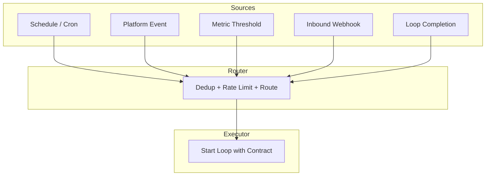

# Chapter 14: Triggers and Automations — The Heartbeat

> **Reading note.** The opening case and its numerical outcomes are illustrative, not a documented production incident. Code and LoopKit names are illustrative API sketches or pseudocode, not a tested published SDK. Inherited source pointers are identified separately from checked evidence; numerical examples are assumptions, not current provider quotations.

> A feedback loop may start by hand. Automation begins when initiation no longer depends on somebody remembering.

## The Missed Deployment

Priya Anand's team at a mid-market fintech company ran a security review loop that, by every technical measure, worked beautifully. A Claude-backed agent would read a pull request diff, check it against their internal vulnerability catalogue, and post findings as inline review comments. When it ran, it caught real issues: an unvalidated redirect in their OAuth flow, a timing-side-channel in their password comparison, a missing rate limit on their forgot-password endpoint. The agent found each one before a human reviewer did.

The problem was that it ran only when Priya remembered to invoke it. She would open her terminal, type the command, feed it the PR number, and wait. On most days she remembered. On the Friday before a long weekend, she did not. The team merged four pull requests that afternoon, one of which contained a Server-Side Request Forgery vulnerability in their webhook-forwarding service. An attacker exploited it eleven days later to exfiltrate internal API keys from the metadata endpoint.

In the post-incident review, the timeline was painful. The vulnerable code sat in an open PR for six hours before merge. The review agent, successful on earlier illustrative cases, was never called; that does not establish whether it would have detected this particular defect. The root cause was not a failure of AI, not a failure of detection, not a failure of remediation. It was a failure of initiation. The human was the heartbeat, and the heartbeat stopped.

Priya's mistake is universal. Teams build capable loops, prove they work, and then leave them on a shelf labelled "run when convenient." The loop runs when someone remembers, which means it does not run when they forget, are busy, are on holiday, or are focused on something else. Their attention remains the bottleneck — it has merely migrated from reviewer to initiator. This chapter eliminates that dependency by treating the trigger as a first-class engineering concern, not an afterthought wired up with cron and hope.

## The Automation Rule

A loop that requires human initiation is not fully automated. The trigger — the mechanism that starts the loop — is as important as the loop body itself. Without automation, you have a powerful tool. With automation, you have a system. The distinction matters because tools scale with the attention you give them, while systems scale with the infrastructure that supports them. A tool helps when you remember to reach for it. A system helps when you are asleep.

Separate two decisions: how a run starts, and whether its execution uses feedback. A manually initiated system can still iterate, evaluate, and replan. Automatic initiation improves coverage only when the trigger is reliable, authorised, and matched to the workload; it is not a defining property of feedback itself.

The six building blocks defined in Chapter 3 (*Anatomy of a Loop*) name automations as the first block — the heartbeat that keeps the loop alive without human attention. This chapter makes that concrete. We will define the trigger types, build the `loopkit/triggers.py` module, address idempotency and re-entrancy in depth, and walk through a complete trigger design from requirements to running code.

The consequence of treating triggers as infrastructure rather than afterthought is that trigger reliability becomes a first-class operational concern. A broken loop produces an error. A broken trigger produces silence. The system does not fail visibly — it simply stops doing the thing it was built to do, and nobody notices until the absence manifests as an incident. This asymmetry makes trigger monitoring more important, not less, than loop monitoring. You will notice a loop failure in your error dashboard. You will notice a trigger failure only if you are looking for the absence of expected activity.

## Trigger Taxonomy

Five categories of triggers cover the space of production automations. Each suits different operational patterns, and most production systems combine several.



**Schedule triggers** fire at fixed intervals — a cron expression, a calendar rule, a countdown timer. They are the simplest to reason about because their firing is deterministic and observable: you can look at the clock and know whether the trigger should have fired. A daily dependency audit at 02:23 UTC, a weekly cost report every Monday at 09:00 local, an hourly PR scan at seven minutes past the hour. The offset from the round hour is deliberate: every system in an organisation that fires at :00 creates a thundering-herd effect where APIs, databases, and CI systems all spike simultaneously. Offsetting by a random number of minutes (Priya's team used the last two digits of the team's Slack channel ID) distributes load across the hour.

Schedule triggers are the right default when work accumulates over time and periodic processing is acceptable. They are wrong when latency matters — a security review that runs on a daily schedule means a vulnerability can sit unreviewed for up to twenty-four hours. But they have an operational advantage that event triggers lack: if the trigger system restarts, the next scheduled firing happens automatically. Restart behaviour depends on the scheduler and transport: durable subscriptions may survive, while a scheduler may skip missed ticks. Define catch-up, timezone, daylight-saving, and restart policies explicitly.

**Event triggers** fire when something happens in an external system — a pull request opens, a deployment completes, a Linear ticket moves to "Ready for Dev," a Slack message mentions the bot. Event triggers couple the loop to the workflow it serves, eliminating the latency between event and response. When a PR opens, the security review loop starts within seconds rather than waiting for the next scheduled scan.

The cost of event triggers is that they fire at the pace of the external system, which may be faster than your budget allows. A repository with fifty PRs per day fires fifty review loops per day. If each review costs one dollar in API calls [ILLUSTRATIVE ASSUMPTION — not a measured result], that is fifty dollars per day — roughly \$1,100 per month from a single trigger. You must decide whether that cost is acceptable before wiring the event, not after the first monthly bill arrives.

**Threshold triggers** fire when a metric crosses a boundary — error rate exceeds one percent, daily token spend passes fifty dollars, p99 latency crosses 500ms. They serve anomaly detection and cost control. Unlike event triggers, which respond to discrete occurrences, threshold triggers respond to continuous signals that accumulate. They require a cooldown mechanism because metrics often remain above a threshold for an extended period: if your error rate stays at 2% for ten minutes, you want one diagnostic loop to run, not six hundred (one per second for ten minutes).

The cooldown timer is the defining design decision for threshold triggers. Too short (30 seconds) and you will fire multiple loops during a single incident, each consuming budget and potentially conflicting with each other. Too long (4 hours) and you will miss a second incident that occurs after the first one resolves. The right cooldown is typically the expected duration of the loop's run plus a buffer — if the loop takes five minutes, a fifteen-minute cooldown ensures it completes before the next invocation is considered.

**Webhook triggers** are the generic ingress point. An external system sends an HTTP POST to your automation endpoint with a payload describing the event. Webhooks are the universal integration mechanism because every modern platform supports outbound webhooks — GitHub, GitLab, Azure DevOps, Slack, Stripe, Datadog, PagerDuty. An automation system can expose a `/hooks/trigger` endpoint and route authenticated payloads using a documented source schema. A payload claiming a trusted source is not authentication.

Treat webhooks as possibly duplicated, delayed, reordered, or missing. Retry windows and redelivery behaviour are provider- and configuration-specific; a retry policy is not a guarantee that the receiver eventually processes an event. Build deduplication and reconciliation rather than depending on an undocumented delivery promise.

**Chained triggers** fire when another loop completes. The output of a code-review loop feeds into a merge-eligibility loop, whose success feeds into a deployment loop. Chained triggers build pipelines — directed acyclic graphs of dependent loops where each stage gates the next. The critical design decision is what happens on failure: does the chain halt (safe but blocks the pipeline), skip the failed stage (dangerous if downstream stages depend on the failed stage's output), or retry with a different strategy (sophisticated but complex to implement)?

## The `loopkit/triggers.py` Module

The trigger boundary should admit work durably before acknowledging delivery. An in-memory set plus `asyncio.create_task` cannot do this: the process may acknowledge an event, crash, and lose both its deduplication history and its queued work. Marking an event as seen before checking cooldown also loses deferred events permanently.

Use a durable inbox with a uniqueness constraint. Separate the transport delivery ID from the business operation key: multiple deliveries can describe one review of one repository, PR, and commit. A new commit is different work even when the PR number is unchanged. Include tenant and repository identity so unrelated repositories cannot collide.

```text
Illustrative admission protocol, not runnable LoopKit code:
  authenticate sender; enforce payload size and schema limits
  derive delivery_id and business_key from documented source fields
  transaction:
    insert delivery receipt if new
    insert inbox item keyed by business_key if absent
      state = pending; payload_hash = hash(canonical payload)
  acknowledge only after durable commit

worker:
  atomically claim eligible pending item with lease + generation
  reserve bounded execution budget
  execute under per-resource concurrency policy
  record result and unresolved effects before releasing claim
  mark completed only when required acceptance is satisfied
```

The inbox must distinguish `pending`, `leased`, `completed`, `failed`, and `reconciliation_required`. Duplicate delivery of a pending item does not mean its work succeeded. A changed payload for an existing business key is a conflict to investigate, not a reason to silently overwrite history. Canonical serialisation is important when hashes are used, but a payload hash alone cannot distinguish two legitimate occurrences with identical values.

For `replace`, cancelling a coroutine is merely a request. The old worker may still be inside a remote operation. Fence its publication rights with an increasing generation token and wait for owned execution to stop before starting incompatible local work. A storage or publication adapter must reject writes from old generations; a prompt telling the old worker to stop is not enforcement.

## Idempotency: Why Running Twice Must Not Hurt

Triggers fire more than once. Network retries, duplicate webhook deliveries, overlapping cron ticks, event-bus at-least-once semantics — all produce repeat invocations. A loop started by a trigger must be idempotent: executing it twice with the same input produces the same outcome without harmful side effects.

Idempotency is not optional, and its absence manifests in embarrassing ways. A duplicate webhook creates a duplicate review comment on the PR (the author sees two identical bot comments and loses trust). A duplicate deployment trigger starts two deployments racing against each other (one succeeds, one fails with a conflict error, the system ends up in an inconsistent state). A duplicate Slack notification sends the same message twice (the channel learns to ignore the bot's messages because they appear noisy and unreliable).

Three patterns achieve idempotency in practice. The first is **check-before-act**: before the loop begins work, it verifies whether the work has already been done. A security-review loop queries the PR for existing review comments from its bot user. If a comment already exists for this commit SHA, the loop exits immediately without doing any work. This pattern is useful but races if two workers both observe absence; it needs an atomic claim or receiver-side idempotency in addition to a durable record of completed work — either in the external system (GitHub comments, Jira labels) or in a local database.

The second pattern is the **deduplication key** shown in the module above. Each trigger event carries a deterministic key derived from its content. The trigger system maintains a set of processed keys and rejects duplicates at the gate, before the loop ever starts. This is cheaper than check-before-act because it avoids even constructing the loop context. The trade-off is that the key set must be durable across restarts; an in-memory set loses its history when the process restarts, and a restart during a webhook-retry window will re-process events. For production systems, the dedup set should be backed by a persistent store — Redis with a TTL, a database table, or a file on durable storage.

The third pattern is **last-write-wins** for loops that produce artifacts. A documentation-generation loop that replaces `docs/api.md` avoids duplicate appends, but is not automatically idempotent: generation may differ and an old run may overwrite a newer document. Publish against an expected source revision with compare-and-swap or a fenced owner. Similarly, a review loop that edits a single bot comment (update rather than create) is idempotent regardless of how many times it fires. This pattern works only when the loop's output is a single replaceable artifact, not a sequence of side effects. It does not work for loops that send emails, create tickets, or make irreversible API calls.

## Re-Entrancy: The Overlap Problem

What happens when trigger N+1 fires while the loop started by trigger N is still running? This is the overlap problem, and it has no single correct answer — the right policy depends on the loop's semantics.

The **skip** policy discards the new trigger entirely. This is appropriate when the running loop will naturally cover the new event as part of its work. A PR-scan loop that reads all open PRs on each run does not need to restart when a new PR opens mid-scan; the new PR either gets included in the current scan (if it opened before the query) or will be caught on the next scheduled run. Skip is the simplest policy and produces the lowest cost, but it assumes that missed events are acceptable — that a delay until the next trigger is better than concurrent execution.

The **queue** policy buffers the new trigger and processes it after the current run completes. A single serial worker can preserve the chosen queue order, but queueing alone does not provide exactly-once effects. Crashes and lease expiry still require deduplication and reconciliation. The cost is latency: if the current run takes five minutes, the queued event waits five minutes before processing begins. If ten events arrive during a single run, the queue grows, and the tenth event waits for nine preceding runs to complete — potentially an hour of latency for a ten-minute loop. Queuing is the safest default for loops with side effects that must not interleave, but it requires monitoring for queue depth to detect situations where events arrive faster than the loop can process them.

The **replace** policy cancels the current run and starts fresh with the new trigger. This is appropriate when a new event invalidates the current run's work. Consider a code-review loop: if the developer pushes new commits while the review is in progress, the in-progress review is evaluating stale code. Its findings may no longer apply. Replacing it with a fresh run against the new HEAD produces a correct review faster than letting the old review finish and then starting another. The cost is wasted tokens: the cancelled run consumed resources without producing value. Replace should be used only when the invalidation probability is high and the cost of running to completion on stale input exceeds the cost of restarting.

The choice of overlap policy belongs in the Loop Contract alongside the trigger definition. It is a design decision, not an implementation detail, because it affects correctness, latency, and cost in ways that the loop author must explicitly consider.

## A Worked Trigger Design

Suppose you are building an automated security-review loop for a GitHub repository. The requirements are: review every PR within five minutes of opening, review again if new commits are pushed, never review the same commit twice, and limit cost to a maximum of fifteen dollars per day.

Start with the trigger type. The initiating event is "PR opened" and "synchronize" (GitHub's event for new commits pushed to an open PR) — these are platform events delivered via webhook. You need an event trigger.

The business dedup key is the combination of tenant, repository ID, PR number, review-policy version, and HEAD commit SHA. Two deliveries of the same "PR opened" webhook produce the same key and the second is discarded. A synchronize event produces a new key because the SHA changes, correctly triggering a new review. But a webhook retry of the same synchronize event (same SHA) produces the same key and is correctly deduplicated.

The overlap policy is replace: if the loop is reviewing commit `abc123` and the developer pushes commit `def456`, cancel the `abc123` review and start a fresh review of `def456`. Completing the `abc123` review is wasted work — its findings apply to code that is no longer the PR's HEAD.

The cooldown is zero for individual triggers (you want immediate response), but the daily cost ceiling acts as a global rate limit. At roughly one dollar per review [ILLUSTRATIVE ASSUMPTION — not a measured result], fifteen dollars per day allows approximately fifteen reviews. If the repository produces more than fifteen PR events per day, the system must defer excess events with an explicit missed-latency status or alert an operator. A five-minute service target and a hard daily ceiling cannot both be guaranteed when arrivals exceed admitted capacity.

```python

from loopkit.triggers import Trigger, TriggerEvent, OverlapPolicy

async def run_security_review(event: TriggerEvent) -> None:
    """Start a security review loop for the given PR event."""
    from loopkit.contract import LoopContract, Goal, Budget
    contract = LoopContract(
        goal=Goal(
            statement="Identify security vulnerabilities in PR diff",
            acceptance=("findings_posted_as_review", "no_false_positives_vs_test_set"),
        ),
        oracle=...,  # Chapter 20
        budget=Budget(max_iterations=3, max_tokens=200_000, max_usd=1.50, max_wall_clock_s=300),
        stop=...,    # Chapter 18
        escalation=...,
    )
    # ... execute the loop against this contract

security_trigger = Trigger(
    name="pr_security_review",
    loop_factory=run_security_review,
    overlap_policy=OverlapPolicy.REPLACE,
    cooldown_s=0.0,
)
```

## Liveness Monitoring: Detecting the Silent Failure

The most dangerous trigger failure is silence. A webhook endpoint returning 500 or becoming unreachable may cause bounded retries, depending on the source. Delivery can still be abandoned. A stopped scheduler or expired subscription may produce no local error because no request reaches the loop. The loop simply stops running, and nobody notices until the absence manifests as an incident.

Liveness monitoring is the solution: a separate system that verifies triggers are firing at their expected cadence. For schedule triggers, this is straightforward — if the daily 02:23 audit has not produced a result by 02:45, something is wrong. For event triggers, it requires a baseline: if the webhook endpoint normally receives ten to twenty events per day and has received zero in the last six hours, an alert should fire. The alert does not mean the trigger is broken — it might mean no relevant events occurred — but it surfaces the absence for human verification rather than allowing it to pass unnoticed.

The liveness monitor is meta-monitoring: monitoring the monitor. It adds operational complexity and introduces its own failure modes (the liveness monitor itself can fail, creating an infinite regress of "who monitors the monitor of the monitor"). But without it, a team can go days — sometimes weeks — without noticing that their automation has silently stopped. Size the monitor to the consequence of missing work, and give its alerts an owner; monitoring is useful only when somebody can act on the signal. Priya's team learned this the expensive way: their vulnerability scanner was the most effective automated check they had, and its silent absence cost them a security incident that no amount of post-hoc monitoring could reverse.

The implementation is typically a cron job that queries the trigger log: "show me all trigger firings in the last N hours for trigger X." If the result set is empty and the expected interval has elapsed, raise an alert. For event triggers where the expected frequency is uncertain, a heartbeat approach works: inject a synthetic event at a known interval (every hour, a non-mutating test webhook with a unique scheduled-instance ID) and alert if the synthetic event is not processed within the expected latency. The synthetic event validates the entire pipeline from ingress to processing, catching failures at any point in the chain.

## What Breaks

Trigger systems introduce a new class of failures that the loop itself never sees. The most common is the **trigger storm**: a burst of events that fires the loop dozens or hundreds of times in rapid succession. A repository with a batch-import script that opens forty PRs in ten seconds fires forty review loops simultaneously, each consuming tokens and compute. Cooldown timers mitigate this for threshold triggers, but event triggers with no cooldown will process every event. An after-the-fact spend counter is only an alarm. A hard ceiling needs atomic reservations before concurrent workers make billable calls, with bounded output and tool charges accounted for. The defensive design is to combine per-event dedup, per-trigger cooldown, and per-day budget ceiling as layered defences, so that a storm must overwhelm all three before causing damage.

A subtler failure is **trigger rot**: the slow drift between what the trigger watches and what the team needs. The security-review trigger watches for "PR opened" events, but the team starts using draft PRs but the review policy handles only ready-for-review work and omits the readiness transition and nobody updates the trigger. Or the team moves to a monorepo where a single PR touches multiple services, and the trigger fires once but the loop only reviews one service's code. Trigger rot is a maintenance burden that grows with the number of triggers in the system, and it is detectable only through periodic audit of trigger configuration against actual team workflow.

## Implementation Guidance: Prove Admission Before Autonomy

Start with one transport and one business operation. Document which response tells the sender that the event is durably stored, which worker owns the inbox item, and which external effect marks useful completion. These are different moments. A successful HTTP acknowledgement says nothing about whether the review was completed; a completed review says nothing about whether its comment was posted to the intended commit.

Make backlog age visible alongside queue length. Ten pending items can be normal after a burst or a serious incident if the oldest item is a day old. Partition concurrency by the resource whose updates must not overlap, such as repository and PR, rather than globally serialising unrelated work. Preserve the newest relevant revision when coalescing events, and record which older revisions were intentionally superseded. Never label those older events reviewed merely because a later revision was processed.

The recovery test is more informative than a happy-path demo. In a disposable fixture, deliver one event twice, kill the receiver immediately after its durable commit, and restart it. Then kill a worker after the mocked external service accepts a comment but before the local completion write. Acceptance means one durable work item, no lost deferred event, and no duplicated externally visible comment. The last condition requires an operation key accepted by the mock receiver or a queryable receipt; the local inbox cannot supply it alone.

For a threshold trigger, add a recovery boundary below the firing threshold, not just a timer. This hysteresis distinguishes one continuing incident from a genuinely new crossing. Test metric noise around both boundaries, an incident lasting longer than cooldown, and an outage in the monitoring source. Missing telemetry must become `unknown`, not zero errors.

### Exercise Acceptance Checks

For the dedup exercise, replay two distinct transitions with identical destination status and verify both remain represented, while a redelivery of either transition adds no new work. For the cost exercise, run concurrent claims against a nearly exhausted budget and verify the sum of accepted reservations never exceeds the remaining allowance. For the storm exercise, state worker duration and concurrency assumptions before calculating throughput; forty events do not imply forty completed reviews. A valid solution explicitly reports a service-target breach when the requested deadline is infeasible rather than dropping events to make the dashboard green.

## Key Takeaways

- A loop that requires human initiation is not automated — the human's attention remains the bottleneck, just at a different stage.
- Five trigger types — schedule, event, threshold, webhook, and chained — cover production automation patterns.
- Idempotency is mandatory: duplicate triggers must produce the same outcome without harmful side effects. Check-before-act needs atomicity, dedup keys need durable lifecycle semantics, and replacement needs protection against stale writers.
- Three overlap policies — skip, queue, replace — handle new triggers that arrive while the loop is running. The choice is a design decision with correctness implications.
- The trigger design separates durable admission, business-operation identity, cooldown, overlap, and fenced publication.
- Liveness monitoring detects silent trigger failures — the absence of expected activity that no error log records.
- Admission limits, durable deferred work, atomic budget reservations, and per-resource fencing contain trigger storms; cooldown alone can drop necessary work.
- Trigger rot — drift between trigger configuration and team workflow — requires periodic audit.

## The Loop Contract, So Far

This chapter fills no new field of the Loop Contract directly — triggers sit outside the contract, in the infrastructure that invokes it. But they enforce a precondition: without a trigger, no contract is ever evaluated. The trigger is the bridge between the world's events and the contract's execution. A trigger with no contract downstream is noise; a contract with no trigger upstream is potential energy never converted to work.

## Exercises

1. **Dedup key design.** Your loop processes Jira ticket transitions. Design a dedup key that correctly distinguishes "ticket moved to In Progress" from "ticket moved back to In Progress after being moved to Done." What fields must the key include? What happens if you use only the ticket ID?

2. **Overlap policy selection.** A documentation-generation loop rebuilds API docs from source code. It takes approximately three minutes per run. New commits arrive every ten minutes on average, but sometimes in bursts of five commits within one minute. Choose and justify an overlap policy. Calculate the cost implications of each alternative under the burst scenario.

3. **Liveness monitor.** Write a Python function that, given a list of trigger-fire timestamps and an expected interval, returns whether the trigger is healthy, degraded (fired late but still active), or dead (missed two or more expected firings). Handle the edge case where the trigger has never fired.

4. **Cost ceiling enforcement.** Implement the admission pseudocode with a `daily_budget_usd` reservation ledger. The trigger must refuse to fire when accepted reservations plus recorded spend would exceed the budget. Define where estimates and actual cost information come from, how the daily counter resets, and what happens to events that arrive after the budget is exhausted (queued for tomorrow? discarded? escalated?).

5. **Trigger storm simulation.** A batch script opens 40 PRs in 10 seconds. Assume one global worker, every run lasts at least ten seconds, and all events arrive while the first is active. With overlap_policy=SKIP and cooldown_s=0, how many review loops start? Now change cooldown_s to 180 (3 minutes). How many run? Design a configuration that processes all 40 PRs within one hour at minimum cost.

## Sources and Evidence Limits

- [AWS Builders’ Library, Making retries safe with idempotent APIs](https://aws.amazon.com/builders-library/making-retries-safe-with-idempotent-APIs/) — operation identity, late arrivals, and mismatched intent; service-specific retention.
- [AWS Prescriptive Guidance, Transactional outbox pattern](https://docs.aws.amazon.com/prescriptive-guidance/latest/cloud-design-patterns/transactional-outbox.html) — durable local state plus outbox; duplicate relay delivery still requires consumer handling.

Primary-source passages were reviewed in the shared editorial source packet dated 2026-10-07; the citations support only the bounded distinctions stated above. Opening cases, thresholds, cost examples, and code sketches are teaching material, not independently verified production measurements. The inherited “New in Claude Managed Agents” pointer could not be confirmed during source review and is not used as evidence.

------------------------------------------------------------------------

*Next: Chapter 15 tackles Goal Specification — turning human intent into machine-checkable acceptance criteria, the single highest-leverage skill in loop engineering.*

[Previous: Chapter 13](chapter-13.md) · [Next: Chapter 15](chapter-15.md)
