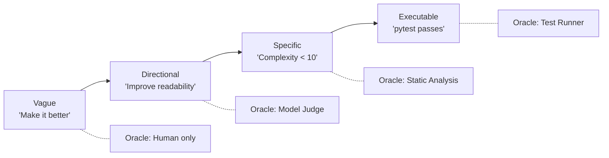
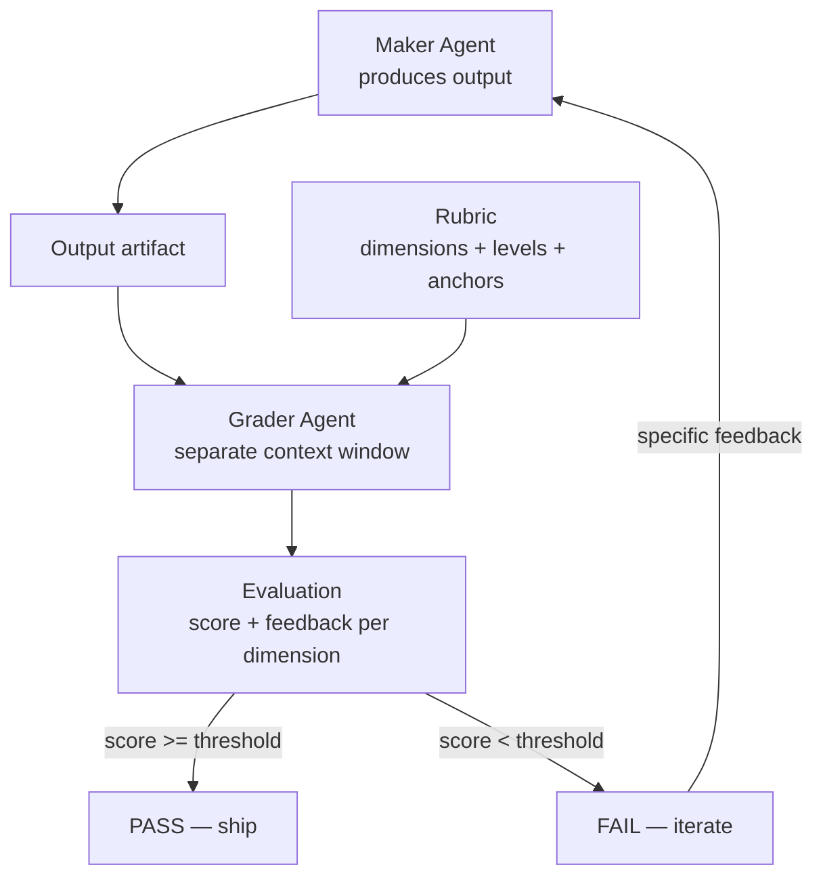

# Chapter 15: Goal Specification

> **Reading note.** The opening case and its numerical outcomes are illustrative, not a documented production incident. Code and LoopKit names are illustrative API sketches or pseudocode, not a tested published SDK. Inherited source pointers are identified separately from checked evidence; numerical examples are assumptions, not current provider quotations.

> A loop without a machine-checkable goal is a random walk through solution space with a credit card attached.

## The Rubric That Flatters

Marcus Chen led the documentation team at a developer-tools company with sixty engineers and an API surface of four hundred endpoints. Tired of docs falling behind code, he built an agent loop: on every merge to main, the loop would read the changed source files, identify new or modified public functions, and generate or update the corresponding documentation page. The loop used a rubric to evaluate its own output before publishing. Within a week the loop had produced documentation for ninety endpoints that previously had none.

The celebration ended when a senior engineer on the platform team filed an internal bug: "The new autogenerated docs for the billing API are dangerously wrong. The `charge_customer` endpoint docs describe parameters that don't exist and omit the required `idempotency_key` field. A customer following these docs would get a 400 error on every call." Marcus checked the loop's evaluation records. Every single run had scored itself 4.2 out of 5.0 or higher. The rubric had never flagged a problem.

The root cause was not the model's writing ability — it could write clear, well-structured prose. The root cause was the rubric. Marcus's rubric evaluated documentation on five dimensions: clarity, completeness, formatting consistency, grammar, and "technical accuracy." The last dimension was defined as: "The documentation describes the endpoint's purpose and parameters accurately." This sounds reasonable until you realise that the same model that wrote the documentation was also judging its accuracy, and it judged against its own understanding of the code — not against the actual API specification or a running test.

The documentation was clear, complete, well-formatted, and grammatically perfect. It was also wrong about what the endpoint actually did. The rubric could not discriminate correct from incorrect because it tested for surface quality rather than factual correspondence with a ground truth. Marcus needed a rubric that tested whether the documented parameters actually existed in the OpenAPI spec, whether the documented request bodies actually validated against the schema, whether the documented response codes actually appeared in the handler. He needed acceptance criteria that were executable artifacts, not prose descriptions of quality.

This is the chapter's core lesson: a goal that a human understands is not automatically a goal that an oracle can evaluate. The gap between intent and checkability is where loops fail, and closing that gap is the single highest-leverage skill in agentic engineering.

## Why Goal Specification Is the Highest-Leverage Skill

Everything downstream in a loop depends on the goal's precision. The oracle evaluates against the goal — a vague goal forces a vague oracle, which produces unreliable verdicts, which makes the loop's iteration signal noisy, which increases attempts-to-pass, which multiplies cost. The stop condition checks progress toward the goal — a vague goal makes progress unmeasurable, which means stop conditions must rely on iteration counts rather than convergence detection. The budget is sized relative to the goal's expected difficulty — a vague goal prevents right-sizing because you cannot estimate iterations without understanding the acceptance bar.

Consider two versions of the same task. Version A: "Fix the login bug." Version B: "The test `test_login_expired_session` at `tests/test_auth.py:47` passes, all other tests in `tests/` continue to pass, the public API of the `auth` module (as reported by `python -c 'import auth; print(dir(auth))'`) does not change, and all modifications are confined to files within `src/auth/`." Version A requires a human to evaluate whether the output is acceptable. Version B can be checked by a shell script in under ten seconds. A loop running version B can report whether those checks passed in a recorded environment. It cannot infer complete behavioural correctness from a name listing or a finite test suite. A loop running version A iterates blind, ships uncertain output, and puts the human back in the verification seat — which defeats the purpose of building the loop in the first place.

The precision of the goal determines the autonomy of the loop. This is not a stylistic preference — it is a structural constraint. You cannot build a reliable autonomous system on top of a goal that requires human judgment to evaluate, for the same reason you cannot build a reliable compiler on top of a language specification written in ambiguous natural language. The evaluable part of the goal should be explicit. Residual judgment belongs in a named review decision rather than being hidden inside a numerical score.

This does not mean every goal must be a pytest command. Some goals genuinely require rubric evaluation by a model judge — creative tasks, complex reasoning, quality assessment. But even these goals must be specified precisely enough that two independent judges, given the same rubric and the same output, produce similar scores. If they do not, the goal specification is the problem.

## The Spectrum from Vague to Executable

Goals exist on a precision spectrum, and each position implies a different oracle type, a different iteration cost, and a different confidence in the final result.

At the vague end: "Make it better." No oracle can evaluate this because "better" is undefined. The loop has no target, generates output that may or may not satisfy the human, and terminates only when budget runs out or the human intervenes. This is not a loop — it is a generation system with a retry budget.

At the directional end: "Improve readability and reduce complexity." A model judge can attempt to evaluate this against a rubric, but the evaluation is subjective and unreliable. Two judges may disagree. The same judge may score inconsistently across runs. The loop converges slowly because the feedback signal is noisy, and "convergence" itself is ambiguous — when is readability "improved enough"?

At the specific end: "Cyclomatic complexity below 10 for every function, no function exceeds 30 lines, all names follow the project's naming convention as defined in `.style/names.yaml`." A static-analysis tool can check all three conditions in milliseconds. The loop gets a binary pass/fail signal with precise error localization (which function, which metric, by how much) and can target the exact violations. Convergence is fast because the feedback is actionable.

At the executable end: "The test suite at `tests/test_auth.py` passes with exit code 0." The goal is literally a program. The oracle is literally running that program. There is no ambiguity, no subjectivity, no judge disagreement. The loop either achieves this state or it does not, and the test output tells it exactly why.



The further right you move on this spectrum, the more reliable your loop becomes. The investment is upfront: writing precise goals takes more thought than writing vague ones. It requires you to articulate exactly what you mean by "better" — which forces you to confront your own assumptions, surface implicit expectations, and resolve ambiguities before the loop runs rather than after it produces something you dislike. This upfront investment pays for itself many times over in reduced iteration count, eliminated human review, and higher confidence in shipped output.

## Acceptance Criteria as Executable Artifacts

Executable criteria make the measurable part of a goal concrete, while the intended outcome and residual limits still need description. The acceptance criterion is not a sentence — it is a program. The loop's job is to make that program exit with code zero.

A test is the canonical example. When you write `test_expired_token_returns_401`, you have encoded the goal in executable form: the endpoint must return 401 when presented with an expired token, the response body must conform to RFC 7807, and the error detail must mention expiry. The loop does not need to interpret these requirements — it needs to make the test pass. The test is simultaneously the goal, the oracle, and the specification. This reduces translation error between stated checks and their execution, but a test can still encode the wrong requirement or omit an important condition. This unity eliminates an entire class of bugs where a goal says one thing and the oracle checks something subtly different.

Property-based tests extend this pattern to entire classes of input. A `@given(st.text())` decorator from Hypothesis asks the framework to generate examples from a configured string strategy. A bounded test run samples that strategy; it does not enumerate all strings, guarantee megabyte-sized inputs, or prove a universal property. Explicitly configure important size and character boundaries. Property-based goals are more demanding than example-based goals and produce more robust output because they test the invariant rather than the instance. They also reveal edge cases that no human would write by hand.

Schemas serve a related function for structured data. A JSON Schema that requires `title` (string, 10-100 chars), `body` (string, min 500 chars), and `published_at` (datetime validated with the chosen format checker) is an executable goal: validate the output against the schema, and the result is pass or fail. No interpretation, no judgment, no model required. The schema also serves as documentation for downstream consumers, so the investment in writing it produces value beyond the loop's immediate use. Schema validation runs in microseconds, costs nothing, and catches entire categories of output defects (missing fields, wrong types, constraint violations) before an expensive model judge is ever invoked.

The pattern generalises: any automated check that produces a binary pass/fail signal can serve as an executable goal. Linter configurations define code style goals. Type-checker settings define interface-correctness goals. Performance benchmarks with thresholds define efficiency goals. Coverage gates define test-thoroughness goals. Every one of these tools was designed to be an oracle — you simply need to recognise them as such and wire them into your loop's verification step.

## Rubrics as Specifications

Not everything reduces to a binary check. Creative tasks (write marketing copy), reasoning tasks (analyse this incident's root cause), and quality assessments (is this code review helpful?) involve dimensions that no static tool can evaluate. For these, rubrics bridge the gap between human intent and machine evaluation.

A rubric is a structured scoring guide that defines dimensions, levels within each dimension, and — critically — what distinguishes each level from the adjacent ones. The distinction between levels is what makes a rubric discriminating rather than flattering. Marcus's rubric failed because its "technical accuracy" dimension did not specify what distinguished a 5 from a 3. A discriminating rubric does: a 5 means "every parameter in the documentation exists in the OpenAPI spec and every required parameter in the spec appears in the documentation, with no exceptions." A 3 means "most parameters are documented but at least one required parameter is missing or one non-existent parameter is described." The evaluator can now apply the rubric mechanically rather than relying on gestalt judgment.

A maker-checker pattern formalises the rubric workflow for iterative loops. You write a rubric describing what success looks like. The agent works toward it. A separate grader evaluates the output against the criteria in its own context window, so it is not influenced by the agent's reasoning or the agent's understanding of its own intent. The grader pinpoints what must change — dimension by dimension, level by level — and the agent takes another pass with specific feedback rather than a vague "try again."

The inherited draft attributed numerical improvements to a vendor announcement without preserving a checked methodology. Those figures are not used as evidence here. The actionable design is narrower: give the evaluator authoritative source material and ask for located failures against explicit criteria; then measure whether this improves independently assessed outcomes for the target workload.



Separating maker and grader contexts reduces one source of anchoring; it does not itself establish evaluator accuracy or honesty. A model that wrote output will be generous when judging that same output — it already "knows" what the output was supposed to mean, so it fills in gaps with its own intent rather than evaluating what is actually on the page. A separate grader sees only the output and the rubric, without access to the maker's reasoning chain. It evaluates what is, not what was intended.

A production rubric should satisfy three properties. First, **discrimination**: bad outputs tend to score lower than good outputs at the operating threshold, with the false-pass and false-reject rates measured separately. If both good and bad outputs score between 3.5 and 4.5, the rubric cannot distinguish them and is operationally useless. Begin with known-good and known-bad examples, then expand to representative held-out cases. Ten examples can reveal gross defects but cannot establish a reliable operating error rate. Second, **stability**: the same output evaluated twice by the same rubric produces similar scores (within 0.5 points on a 5-point scale). Test this by double-scoring a set of outputs and measuring variance. Third, **actionability**: a low score on a dimension must tell the maker what to fix. A rubric that says "Score 2: the output is not good enough" provides no signal for improvement. A rubric that says "Score 2: missing parameters X and Y, contradicts source claim Z" provides a repair plan.

## Underspecification: The Root Cause of Loop Failures

Underspecified goals are one important class of loop failure, alongside tool errors, missing evidence, runtime defects, and capability limits. The loop does something technically correct but unacceptable because the human's full intent was never encoded in the acceptance criteria. Disciplined specification reduces this failure mode, but cannot eliminate every implicit expectation or execution defect.

A developer asks the loop to "fix the login bug." The loop makes the failing test pass by adding a broad `try/except Exception` that swallows the authentication error and returns a generic success response. Tests pass. The oracle says pass. The human says: "That is not a fix, that is hiding the error." The goal said "make the test pass," and the loop did exactly that — in the cheapest way possible, which is not the same as the correct way. Both the specification and the executor safeguards need correction: it specified the condition for success without constraining the method.

Underspecification takes four forms, each producing a characteristic failure pattern.

**Missing constraints** specify what must change but not what must remain unchanged. The fix modifies the public API. It breaks backward compatibility. It introduces a dependency the team does not want. It changes test files (making the test easier to pass rather than fixing the code). The remedy is explicit boundary constraints: "changes confined to `src/auth/`," "public API unchanged," "no new dependencies."

**Missing quality dimensions** specify correctness but not performance, security, or maintainability. The fix is correct but introduces an O(n²) algorithm that will timeout on production data. The fix is correct but creates an SQL injection vector. The fix is correct but duplicates logic that already exists in a utility module. The remedy is composite goals that include non-functional requirements: "no function exceeds O(n) complexity," "ruff and bandit report zero findings," "no code duplication above 5 lines."

**Proxy metrics** specify a measurable proxy for the actual intent. "Increase test coverage to 95%" when the intent is "ensure correctness" produces trivial assertions that game the metric without testing meaningful behaviour. "Reduce cyclomatic complexity below 10" when the intent is "improve readability" produces extracted functions with meaningless names that introduce indirection without clarity. The remedy is paired constraints: "coverage above 95% AND every test file asserts at least one business-logic property verified by running the actual endpoint."

**Implicit expectations** exist only in the human's mind. The stated goal is "add rate limiting to the /search endpoint." The unstated expectations include: "the rate limit should be per-user not global," "it should return 429 with a Retry-After header," "it should not affect health-check endpoints," "the configuration should be in environment variables not hardcoded," "there should be a test." The loop may miss unstated expectations, and apparent common sense is not a dependable acceptance mechanism. The remedy is a pre-flight checklist: before defining the goal, enumerate all dimensions of acceptability, especially the ones that feel "obvious."

The compounding danger of underspecification is that it erodes trust in the loop. A loop that repeatedly produces technically-correct but unsatisfying output teaches its users to distrust it. They start reviewing every output manually "just in case," which defeats the purpose of the loop. Or they stop using the loop entirely, which wastes the investment in building it. Underspecification is not just a quality problem — it is a trust problem that determines whether the loop provides lasting value or is quietly abandoned after its first disappointing outputs.

## Goal Structures

Goals organise into four structural patterns, each suited to different task shapes.

**Binary goals** are pass/fail with no gradient. Either all tests pass or they do not. Either the type-checker reports zero errors or it reports some. Binary goals can provide useful localised feedback when failures are diagnostic: the loop knows exactly which test failed, which type error occurred, which lint rule was violated. It can target the specific failure without guessing. Use binary goals whenever the acceptance criteria admit deterministic checks.

**Threshold goals** require a score above a minimum on a continuous scale. "Rubric score above 3.5/5.0," "documentation coverage exceeds 90%," "benchmark throughput within 10% of baseline." Threshold goals introduce a gradient: the loop can measure its distance from the target and track whether successive iterations are converging. They are appropriate when quality exists on a continuum — not everything is binary, and forcing binary evaluation on a continuous dimension loses information that would accelerate convergence.

**Convergent goals** define done as stability rather than a fixed target. "No new security findings in two consecutive scans," "no new lint warnings after two passes," "diff between successive outputs is below 50 characters." Convergent goals suit discovery tasks where the full scope of work is unknown at the start. You track stability as a stopping signal, but stable output can still be incomplete. Require a coverage condition or an explicit incomplete disposition; two identical scans can share the same blind spot. The risk is that convergence may take many iterations for tasks with deep defect density, so convergent goals should always be paired with iteration budgets.

**Composite goals** combine multiple criteria that must all be satisfied simultaneously. The login-fix example above is a composite goal: six independent checks, all required. Composite goals prevent the loop from optimising one dimension at the expense of others — a common failure mode when goals have only a single criterion. They are the most common goal structure in production because real tasks always have multiple acceptance dimensions that the loop must satisfy together.

```python

from loopkit.contract import Goal

login_fix_goal = Goal(
    statement="Fix the expired-session login failure",
    acceptance=(
        "pytest tests/test_auth.py::test_login_expired_session exits 0",
        "pytest tests/ exits 0 (no regressions)",
        "git diff --stat shows changes only in src/auth/",
        "python -c 'import auth; print(dir(auth))' matches baseline.txt",
        "ruff check src/auth/ exits 0",
        "no new bare except clauses catching Exception or BaseException",
    ),
)
```

## The Goal-to-Oracle Pipeline

The goal specification feeds directly into oracle design, and this connection should be explicit in your mind as you write goals. Each acceptance criterion implies an oracle that can check it. A binary criterion ("pytest exits 0") maps to a Level 1 deterministic oracle: run the command, check the exit code. A threshold criterion ("rubric score above 3.5") maps to a Level 3 rubric-scoring oracle or a Level 4 model judge: present the output to a grader with the rubric, collect the score. A convergent criterion ("no new findings in two passes") maps to a comparison oracle that diffs successive scan outputs and verifies the diff is empty.

The implication is powerful: writing a goal specification simultaneously designs the verification strategy. If you cannot answer "what program or procedure would check this criterion?" then the criterion is not yet precise enough for a loop to target. This is a useful self-test during goal specification: for each acceptance criterion, write one sentence describing how it would be checked. If that sentence requires human judgment, name the reviewer, evidence packet, deadline, and safe pending state rather than pretending the decision is automated.

The pipeline from goal to oracle to loop follows a consistent pattern:

Human intent → goal specification (this chapter) → acceptance criteria (executable or rubric-based) → oracle selection (Chapter 20) → evaluation at each iteration → iteration signal (pass/fail + feedback) → convergence or escalation.

Every stage in this pipeline is cheaper to fix upstream. A vague goal propagates into an expensive oracle, which propagates into noisy feedback, which propagates into slow convergence, which propagates into high cost per verified outcome. A precise goal propagates into a cheap oracle, crisp feedback, fast convergence, and low cost. The economics are multiplicative: if you run the loop fifty times per day, every iteration saved by better goal specification saves money fifty times per day, every day the loop operates. Estimate the benefit using observed rerun frequency and review effort; there is no general financial return independent of workload.

The full oracle hierarchy is developed in Chapter 20 (*The Hierarchy of Oracles*). For this chapter, the key insight is the inverse relationship between goal precision and oracle cost: precise goals enable cheap oracles, and every dollar invested upfront in goal specification saves many dollars downstream in verification cost over the loop's lifetime.

## A Worked Example: From Vague to Executable

Consider the goal "make the search endpoint faster." It mixes an outcome, an unstated workload, and an unstated correctness constraint. Start by defining the workload: query set, data snapshot, concurrency, cache state, warm-up, request count, hardware, and timeout treatment. Then define a latency target and the functional results that must remain unchanged.

A useful refinement is: "On fixture search-v3, under the documented load profile, p95 latency is below 200 ms; expected results and access-control decisions match the reviewed baseline; no query failure is excluded from the report; and changes remain within the agreed implementation scope." This is still not a universal performance guarantee. It is a reproducible experiment bound to a workload.

```python
# Illustrative measurement core; fixture setup and load generation omitted.
import math

def nearest_rank_p95(latencies_seconds):
    if not latencies_seconds:
        raise ValueError("no measured requests")
    ordered = sorted(latencies_seconds)
    return ordered[math.ceil(0.95 * len(ordered)) - 1]

# Run correctness assertions separately for each expected query result.
# Collect repeated requests under the declared load profile.
# Report timeouts and failed requests; do not silently remove them.
# Apply the selected quantile convention consistently to both versions.
```

A single request timed below 200 ms is not a measurement of p95. Neither is one timing per query a sound estimate of tail latency under concurrency. Record sample count and variability across repeated runs. A passing result means the measured candidate met the defined test, while production load, data growth, and untested query families remain residual risks.

The oracle receipt should identify the candidate hash and benchmark configuration. Changing the dataset, timeout policy, or baseline after seeing a failure changes the question. It requires a reviewed specification revision, not an invisible adjustment that preserves the word "pass."

## Anti-Patterns in Goal Specification

Four anti-patterns recur in production systems, each producing a characteristic and preventable failure.

**The moving goal** changes as the loop works. The human observes intermediate output and adds requirements — "also handle this case," "also refactor that function," "also update the docs." Each addition resets the loop's progress, and if additions arrive faster than the loop converges, the loop never terminates. This is not a technology failure; it is a requirements-management failure expressed through a technology interface. The fix is scope-locking: define the complete goal before the loop starts. If new requirements emerge mid-run, stop the loop, update the goal, reset the budget, and restart with a fresh contract. Apply explicit versioned amendments at a safe boundary. Reuse evidence whose inputs and requirements remain unchanged; invalidate affected checks, retain the original result history, and renew permissions only where required.

**The proxy goal** optimises a measurable proxy rather than the actual intent. Test coverage, complexity scores, and documentation word counts are all proxies. They correlate with quality but are not quality. A loop optimising a proxy will find the cheapest way to satisfy the proxy — which is usually not the way a human would prefer. The fix is to pair every proxy metric with a semantic constraint that prevents gaming: "coverage above 95% AND every test exercises a meaningful code path determined by examining the function's branching logic."

**The unfalsifiable goal** uses terms that no oracle can evaluate. "Elegant code." "Clear documentation." "Robust architecture." These words mean something to humans, but they cannot be operationalised into a check. The fix is aggressive operationalisation: define "elegant" as a conjunction of measurable properties (short functions, descriptive names, shallow nesting). The operationalisation is always an approximation — elegance is richer than any finite set of metrics — but an approximation that a machine can check is infinitely more useful for a loop than a definition that is philosophically complete but mechanistically opaque.

**The implicit goal** exists only in the human's mind. The stated goal is "write a migration script," but the unstated expectations include "run in under 30 seconds on production data," "produce a rollback script," "log progress to stdout," and "not require downtime." Every implicit expectation is a dimension on which the loop will fail silently — producing technically correct output that the human rejects without understanding why. The fix is to ask yourself, before writing the goal: "If the loop produced output that satisfied every stated criterion but violated one unstated expectation, which expectations would make me reject the output?" Those are the implicit goals. Write them down.

## What Breaks

Goal specification has a ceiling, and honesty about that ceiling is important. Some tasks genuinely resist machine-checkable criteria because their quality dimensions are entangled with human judgment in ways that no rubric fully captures. Creative writing quality, product-strategy decisions, API design aesthetics, visual design coherence — these involve trade-offs that reasonable experts evaluate differently. A rubric can approximate but never fully replace expert judgment for these tasks.

The practical consequence is that some loops cannot run fully autonomously. They require a human-in-the-loop at the verification step — not because the technology is insufficient, but because the goal itself is irreducibly subjective. Recognising this boundary early saves you from building elaborate rubrics that produce high scores on bad output. When you catch yourself writing a rubric dimension defined as "overall quality: the output is good," you have found the boundary. At that point, honest practice is to include human review as the terminal oracle rather than pretending a model judge can replace a domain expert.

A second failure mode is over-specification: goals so precisely defined that they exclude valid solutions the loop would otherwise discover. A goal that specifies "use optimistic locking with a retry count of 3" has embedded an implementation decision into the acceptance criteria. If a better solution exists (database-level constraints, event sourcing, a different concurrency model), the loop cannot discover it because the goal has foreclosed the search space. The balance is: specify the observable outcome precisely (what must be true when done), but leave the implementation path open (how to make it true) unless you have strong reasons to constrain it. Constrain the what, not the how, unless the how has non-negotiable requirements.

A third failure: the cost of specification itself. Writing a precise composite goal with six acceptance criteria takes more time than writing "fix the bug." For a one-shot task that the human will review anyway, the specification overhead may not be justified. The investment pays off when the loop will run many times on similar tasks (the specification is reused), when human review is expensive or slow (the specification eliminates it), or when the loop's output has consequences that make unverified shipping unacceptable (the specification is a safety measure). Not every task deserves a detailed goal specification. But every task that runs autonomously does.

## Goal Specification as a Skill Practice

Like any engineering skill, goal specification improves with deliberate practice. The exercise is deceptively simple: take any task you would normally give to a loop or to an assistant, write it as you naturally would, then rewrite it through the specification lens.

Before: "Update the README." After: "README.md includes: project description (50-200 words covering purpose and primary use case), installation instructions that produce a working development environment when followed literally in a fresh clone (verified by running them in CI), API documentation listing every function exported from `src/index.ts` with parameter types and return types (verified by comparing against `grep -r 'export function'`), and zero broken links (verified by `npx linkchecker README.md`)."

The second version takes five minutes longer to write. It can automate the stated mechanical checks, but function-export discovery, installation behaviour, and link reachability each need appropriate tooling and recorded coverage limits. The first version requires human review on every single run because no automated check can determine whether the README is "updated" in the sense the human intended. Over the loop's lifetime — which might be hundreds of runs triggered by every merge to main — those five extra minutes of specification save hundreds of hours of human review time.

The specification skill also transfers to human communication. Engineers who practice goal specification find that they write better tickets, better design documents, and better delegation instructions. The discipline of asking "what is true when this is done, and how would I check it?" produces clarity that benefits any context where one party defines work and another party executes it — which is to say, every context in professional software engineering.

## The Goal Specification Checklist

Before finalising a goal for any loop that will run autonomously:

Can every acceptance criterion be checked by a program or a structured rubric without calling a human? If not, either refine the criterion or acknowledge that human review is required at that point. Does the goal include constraints on what must not change (scope, API surface, existing behaviour)? Does the goal include non-functional requirements (performance, security, style) alongside functional ones? Would the loop's cheapest possible solution to this goal be acceptable — or could it game the criteria in ways you would reject? If the latter, add constraints that prevent gaming. Have you stated everything you would reject the output for, not just what you hope the output will achieve?

## Implementation Guidance: A Requirement-to-Evidence Ledger

Give each requirement a stable identifier and separate four fields: the intended outcome, the check procedure, the check's dependencies, and the decision authority. For example, AUTH-EXPIRY states that an expired credential cannot authenticate; its procedure sends a fixed expired token through the production handler in an isolated fixture; its dependencies include the clock, token issuer, middleware, and test data; its authority is the release policy. A passing unit test of a helper is not automatically evidence about that end-to-end requirement.

Include negative controls. A test designed to reject expired credentials should fail against a deliberately broken fixture that accepts them. This does not prove the test is complete, but it demonstrates sensitivity to the specific defect it is meant to prevent. Capture test discovery counts too: a command that exits zero while collecting no relevant tests must not satisfy AUTH-EXPIRY.

Separate requirements from preferred implementations. If the real requirement is safe retry, demanding a specific cache library can unnecessarily foreclose alternatives. Conversely, an approved cryptographic primitive, contractual data residency, or a non-negotiable permission boundary may legitimately constrain implementation. Make those constraints explicit so the executor knows which are preferences and which cannot be traded away for a higher aggregate score.

In the documentation case, compare structured parameter sets before asking a judge about prose. For each endpoint, bind required fields, optional fields, response schemas, and error conditions to a versioned specification. Then run at least one documented request against a disposable environment. If the specification and implementation disagree, preserve the discrepancy and return an unresolved requirement; do not let the model choose whichever source makes its draft pass.

### Exercise Acceptance Checks

A goal-decomposition answer is acceptable when every original requirement maps to at least one sub-goal and the final integration check covers their interaction. Independently passing REST and GraphQL handlers does not establish migration completeness if clients still call the retired endpoint. For rubric calibration, retain both false-pass and false-reject examples, repeat scoring on unchanged artifacts, and label the small sample exploratory. For the webhook tests, include malformed encodings, replay or timestamp policy where specified, and exact raw-body handling; never claim signature validation authenticates the business intent of a payload.

## Key Takeaways

- Goal specification is a high-leverage skill in loop engineering — everything downstream depends on its precision.
- Goals range from vague to executable. Precision helps only when the checks faithfully represent the intended behaviour and preserve important constraints.
- Acceptance criteria should be executable artifacts wherever possible: tests, schemas, linter configs, type-checker settings, or any automated check that returns pass/fail.
- Rubrics serve tasks that resist binary checks but must be discriminating (bad output scores low), stable (same output scores similarly twice), and actionable (low scores tell the maker what to fix).
- Separate grader context, source-backed rubrics, and specific feedback are design options to evaluate locally, not a guaranteed numerical improvement.
- Underspecification (missing constraints, missing quality dimensions, proxy metrics, implicit expectations) is an important avoidable cause of loop failures. Composite goals prevent optimising one dimension at the expense of others.
- Four anti-patterns: moving goals, proxy goals, unfalsifiable goals, and implicit goals. Each has a specific structural remedy.
- Honest admission: some tasks resist full mechanisation of evaluation. Recognise the boundary and include human review rather than building flattering rubrics.

## The Loop Contract, So Far

This chapter fills the **goal** field of the Loop Contract. A well-specified goal provides machine-checkable acceptance criteria that the oracle can evaluate, the stop condition can track progress against, and the budget can be right-sized to. Without a precise goal, the remaining four fields — oracle, budget, stop condition, escalation path — have no anchor. The goal is the foundation on which the entire contract stands.

## Exercises

1. **Operationalise a vague goal.** Take the goal "improve the error handling in our API." Write a composite goal with at least five acceptance criteria, each independently checkable by an automated tool. For each criterion, name the specific tool or command that checks it.

2. **Rubric calibration.** Write a rubric for evaluating code-review comments (dimensions: correctness of finding, specificity of location, actionability of suggestion, severity accuracy). Then generate three sample review comments of varying quality and score them against your rubric. Verify discrimination: does the best comment score at least 1.5 points higher than the worst on a 5-point scale?

3. **Goal decomposition.** The high-level goal is "migrate the user service from REST to GraphQL." This cannot be checked by a single command. Decompose it into a sequence of checkable sub-goals, each achievable in one loop run, such that completing all sub-goals implies the high-level goal is met. Identify the dependencies between sub-goals.

4. **Identify implicit goals.** A teammate asks the loop to "add rate limiting to the /search endpoint." List at least five acceptance criteria that the teammate probably expects but has not stated. For each, describe the specific failure that occurs if the loop satisfies the stated goal without satisfying the implicit one.

5. **Build an executable goal.** Write a pytest test file (4-6 tests) that exercises the documented behaviour of a `validate_webhook_signature(payload: bytes, signature: str, secret: str) -> bool` function. The tests serve as both specification and oracle. Include: happy path, wrong secret, malformed signature (non-hex), empty payload, and use of an appropriate constant-time comparison primitive. A handful of wall-clock unit tests cannot prove absence of timing leakage; include implementation review and state the threat-model limits.

## Sources and Evidence Limits

- [Anthropic Engineering, Demystifying evals for AI agents](https://www.anthropic.com/engineering/demystifying-evals-for-ai-agents) — deterministic grading where appropriate, expert calibration, and unknown outcomes when evidence is insufficient.

Primary-source passages were reviewed in the shared editorial source packet dated 2026-10-07; the citations support only the bounded distinctions stated above. Opening cases, thresholds, cost examples, and code sketches are teaching material, not independently verified production measurements. The inherited “New in Claude Managed Agents” pointer could not be confirmed during source review and is not used as evidence.

------------------------------------------------------------------------

*Next: Chapter 16 addresses Planning and Replanning — the durable artifact that guides execution across iterations and survives context compaction.*

[Previous: Chapter 14](chapter-14.md) · [Next: Chapter 16](chapter-16.md)
