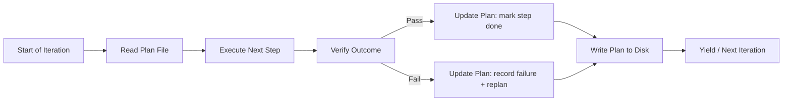

# Chapter 16: Planning and Replanning

> **Reading note.** The opening case and its numerical outcomes are illustrative, not a documented production incident. Code and LoopKit names are illustrative API sketches or pseudocode, not a tested published SDK. Inherited source pointers are identified separately from checked evidence; numerical examples are assumptions, not current provider quotations.

> A plan is not a prediction. It is an artifact that records what to try, what was tried, and what to try next.

## The Loop That Forgot

Tomás Rivera's infrastructure team at a logistics SaaS company built an automated migration loop. The task was straightforward in concept: upgrade their PostgreSQL schema from v3 to v4, which involved adding columns, backfilling data from a denormalised table, and dropping the now-redundant table. The loop would generate migration files, run them against a test database, verify the schema matched the target, and iterate until all checks passed.

On the first run, the loop discovered that the backfill query took forty seconds on the small test dataset, with extrapolation indicating risk to the five-minute production migration window. It correctly identified that an index was needed, added one, and re-ran. The backfill dropped to three seconds. The loop moved to the next step: dropping the redundant table. The drop failed because a foreign-key constraint from a third table, `shipment_tracking`, referenced the column being removed. The loop needed to alter that table first.

Here the failure occurred. The loop had been running for eight iterations on a test dataset smaller than production. Context compaction triggered. The compaction summary noted "working on schema migration" and "backfill performance resolved." It did not preserve the specific decision about which index to add, the discovery about the foreign-key constraint from `shipment_tracking`, or the fact that the first index attempt (on `created_at`) had been rejected in favour of a composite index on `(user_id, created_at)`. On the next iteration, the loop re-discovered the slow backfill. It tried a single-column index on `created_at` — the approach already proven inferior. Two iterations later it re-discovered the foreign-key issue. After fifteen iterations total, burning 1.2 million tokens [ILLUSTRATIVE ASSUMPTION — not a measured result], it produced a migration functionally identical to what it had achieved by iteration four.

The problem was not intelligence, not capability, not even context length. The problem was that the plan existed only in the model's working memory, and when context compacted, the plan vanished. Every compaction event reset the loop to a state indistinguishable from starting fresh. Eleven iterations were pure waste — re-walking paths the loop had already walked, re-discovering facts it had already discovered, re-rejecting approaches it had already rejected.

## Plans as Durable Artifacts

A plan in context is fragile. A plan in a file is persistent. This is not a stylistic recommendation — it is an architectural requirement for any loop that runs long enough to experience compaction, any loop that may be handed off to a different agent instance, and any loop where a human needs visibility into progress without interrupting execution.

The plan file serves three roles simultaneously. First, it is a **memory device** that records what was tried and what was learned, preventing the re-exploration of dead-end approaches that Tomás's loop suffered. When the loop reads its plan file at the start of each iteration, it finds not just the current step but the full history of decisions and failures. A compacted context that says "working on migration" becomes "working on migration, currently on step 4, steps 1-3 complete, composite index chosen over single-column index because X, foreign key from shipment_tracking must be removed before drop" when the plan file is loaded.

Second, the plan is a **coordination artifact**. When context compacts and a new summarized context takes over, or when a different agent instance is assigned to continue the work (after a timeout, crash, or handoff), the plan file provides continuity. The incoming agent reads the plan and knows: where the work stands, what has been tried, what failed, what the current approach is, and what remains. Without this file, every handoff is a cold start.

Third, the plan is an **observability surface**. A human can read the plan file at any point during loop execution and understand the loop's progress, strategy, and history without interrupting it, without reading conversation logs, and without understanding the loop's internal context. This matters for production loops that run unattended: the plan file is the first thing an on-call engineer reads when investigating a stuck loop.

A minimal plan file contains four sections: the goal (for orientation), a numbered step list with status markers, a decisions section recording choices and their rationale, and a failed-approaches section listing strategies that were tried and explicitly abandoned. This last section is the most operationally important because its absence is exactly what caused Tomás's loop to waste eleven iterations.

## The Plan Update Protocol

The plan is not a static document created once and then followed. It evolves as the loop discovers new information, encounters failures, and adjusts its approach. The protocol for updating the plan is itself an engineering decision, and it must be systematic rather than ad hoc.

Every plan update records four elements. First: what happened — the outcome of the most recent step or attempt. "Step 3: composite index migration ran successfully; backfill now completes in 2.8 seconds." Second: what was learned — the implication for the remaining work that was not known before. "The shipment_tracking table has a foreign key to user_data.legacy_id, which must be dropped before user_data itself can be dropped." Third: the revised steps — the remaining plan updated to incorporate the new information. Fourth: any abandoned approach moved to the failed-approaches section with its failure reason, together with the conditions under which retry could become justified. A failed approach is not permanently invalid if its prerequisite changes.

This protocol is not bureaucracy. It is the mechanism by which the loop preserves useful information across the iteration boundary. Each iteration's discoveries and decisions are written to the plan before the next iteration begins. If compaction occurs between iterations, the plan file holds the recorded state. If the loop crashes and restarts, the plan file holds the recorded state. The protocol's cost is one file write per iteration — negligible relative to the API calls that constitute the loop's actual work.

Record intent before a consequential action and record outcome after verification. A final plan update before yielding is useful, but it cannot close the crash window between an external effect and the outcome write. This ordering reduces premature completion claims; receipts and reconciliation are still needed when execution or the plan write fails. A plan updated before verification might record "step 4 complete" when verification subsequently fails, leaving the plan in an inconsistent state with the workspace.



## Decomposition Depth

How finely should a plan decompose the work? The answer depends on uncertainty, and getting it wrong in either direction has measurable cost.

Too-shallow decomposition produces steps that are themselves multi-day projects: "Step 3: Implement the entire authentication system." A step this large provides no guidance to the executing agent — it is a restatement of the problem, not a decomposition of it. Progress within the step is unmeasurable, which means the stop controller cannot detect stalling. If the step fails, the failure is unlocalisable — you cannot tell which sub-task within "implement the entire authentication system" went wrong. And the plan provides no handle for checkpointing: you cannot save a meaningful intermediate state within a single enormous step.

Too-deep decomposition produces micro-instructions that consume context without adding value: "Step 3a: Open auth.py. Step 3b: Navigate to line 42. Step 3c: Insert the null check. Step 3d: Save the file." This level of detail costs tokens to read on every iteration — tokens subtracted from the budget that could be spent on actual reasoning. It encodes implementation decisions that should belong to the executor (what if line 42 has shifted?). It becomes stale the moment any file changes. And it patronises the model: a language model that can write production code does not need keystroke-level instructions.

A useful starting granularity is a small step with a clear, verifiable outcome. One to three model calls is only an illustrative sizing heuristic, not an acceptance rule. "Add token-expiry validation in `auth.py` that returns 401 with an RFC 7807 body for expired tokens." The executor knows what to do. The outcome can be verified independently (does the test for this behaviour pass?). The plan provides structure without micromanagement.

A practical heuristic: if you cannot write a single sentence describing when the step is done, the step is too coarse and needs decomposition. If the step description is longer than the code it will produce, the step is too fine and should be collapsed. If a step requires more than five model calls to complete, it is probably too coarse. If a step can be completed in a single tool call without reasoning, it is probably too fine.

## Planning Depth and Uncertainty

Not every task deserves the same planning horizon. The appropriate depth is inversely proportional to uncertainty about the path forward.

For a well-understood bug fix — you know which file contains the bug, you know what test is failing, you know what the fix looks like — plan the entire sequence upfront. Edit the file, run the failing test, if it passes run the full suite, check for regressions. Each step is clear because the path is clear, and the plan can be written before the first iteration begins.

For an investigation task — something is slow but you do not know why, or a test is failing but the error message is opaque — plan only the next two or three steps. Profile the endpoint. Identify the top bottleneck. Then stop and replan based on what profiling reveals. Planning step ten before you have the results of step two is fiction: you are guessing about the topology of a space you have not yet explored, and the guess will be wrong. Worse, the loop may follow the fictional plan rather than responding to what it actually discovers.

The planning depth rule: plan only as far as you can see clearly. Mark remaining steps explicitly as `[REPLAN after step N — approach depends on findings]` to communicate that the plan is intentionally incomplete. This signals to both the executing agent (after a compaction) and any human observer that the absence of further steps is not a mistake — it is an acknowledgment that more information is needed before the remaining steps can be specified. The replan marker is a commitment to revisit rather than a gap to be filled with guesses.

## Replanning: Progress versus Thrash

Replanning — revising the plan based on new information — is a healthy and necessary part of loop execution. Discovery reveals facts that change the optimal path. A test failure reveals the root cause is in a different module than expected. A performance profile shows the bottleneck is I/O, not CPU. A library's API has changed since the documentation the loop read. The plan must evolve to incorporate these discoveries. A plan that never changes in the face of new information is dogma, not engineering.

But replanning can also be thrashing: the loop changes its approach without making progress toward the goal. Each replan looks like activity — new steps, new strategies, new directions — but the loop is no closer to the goal than it was three iterations ago. It is exploring outward rather than converging inward. Thrashing burns budget without producing value and is often invisible to the loop itself because each individual replan feels locally justified: "the last approach failed, so I need a new approach." The pattern is clear only from the outside, looking at the sequence of replans.

The distinction between progress and thrash has a testable signal. Healthy replanning exhibits three observable properties: each new plan version incorporates what was learned from the previous attempt (it builds on failures rather than ignoring them), the count of completed steps advances across plan versions (the loop moves forward even as it adjusts), and the scope of remaining work decreases or stays constant (the problem is getting smaller, not larger). Thrashing violates at least one of these: the new plan ignores previous learnings (repeating failed approaches), the completed-step count resets or stagnates (no forward motion), or the remaining scope expands (the loop adds work without finishing existing work).

A concrete detection heuristic: track the plan-completion percentage (completed steps divided by total steps) across the last three plan versions. If the percentage has not increased across three versions, investigate whether the loop is stuck; changing task decomposition can change the denominator without changing delivered value. The number three is not magical — it represents the minimum window needed to distinguish "one legitimate replan" (which resets progress by adding new steps) from "chronic inability to advance" (where every version stalls at the same point). Another unchanged attempt may not help; identify whether progress requires a fundamentally different approach, external information, or human insight about which direction to go.

```python

"""loopkit/runner.py — extension: thrash detection for replanning."""
from __future__ import annotations

from dataclasses import dataclass

@dataclass
class PlanSnapshot:
    version: int
    total_steps: int
    completed_steps: int
    approach_key: str  # short identifier for current strategy

    @property
    def completion_pct(self) -> float:
        if self.total_steps == 0:
            return 0.0
        return self.completed_steps / self.total_steps

def detect_thrash(history: list[PlanSnapshot], window: int = 3) -> bool:
    """Return True if the last `window` plan versions show no forward progress."""
    if len(history) < window:
        return False
    recent = history[-window:]
    # No progress: completion percentage did not advance
    if max(s.completion_pct for s in recent) - min(s.completion_pct for s in recent) < 0.05:
        return True
    # Oscillation: returned to a previously-abandoned approach
    if (recent[-1].approach_key == recent[0].approach_key
            and recent[1].approach_key != recent[0].approach_key):
        return True
    return False
```

When thrash is detected, the loop should stop iterating and escalate. The escalation report should include: the approaches tried (from the plan's failed-approaches section), why each failed, the loop's best hypothesis about what kind of intervention is needed, and the best partial result achieved across all versions. This gives the human — or a higher-level orchestrator in a fleet — enough context to decide whether to provide a hint, change the goal, assign additional resources, or accept the partial result as sufficient.

## Todo State as Lightweight Plan

A lightweight alternative to a full plan file is a structured todo list that the loop updates as it works. Each item has an ID, a description, and a status (pending, in-progress, done, blocked). The todo approach provides the same core benefits as a plan file — durability, progress visibility, prevention of re-work — without the overhead of maintaining narrative prose about decisions and rationale.

The todo approach works particularly well for tasks composed of many independent sub-items: "review all twenty endpoints for missing rate limits," "update all deprecated API calls in the repository," "add type hints to all functions in module X." Each sub-item is its own todo. The loop marks items done as it completes them. If context compacts, the todo file survives and the loop reads it to discover what has been done and what remains. There is no complex decision history to preserve because each item is independent — the only state is done or not-done.

The key engineering decision is where to store the todo state. Storing it in context (as part of the conversation) means it is subject to compaction and may be summarized away. Storing it as a file (in the workspace or a known path like `.loop/plan.md`) means it persists across compaction, across sessions, and across agent instances. For any loop expected to run more than a few iterations — which is most production loops — file storage is the correct choice. The file's path should be deterministic and documented in the Loop Contract so that any agent assigned to the loop knows where to find the plan.

## Planning in Fleet Loops

In a fleet (Chapter 24, *From Loop to Fleet*), multiple agents work in parallel toward a shared goal. Planning in this context adds a coordination dimension: who works on what, what are the dependencies between workstreams, and how do partial results combine.

Two patterns dominate fleet planning. **Centralised planning** places the lead agent (orchestrator) in full charge of the plan. The lead decomposes the goal into tasks, assigns each task to a specialist, receives results, updates the plan, and assigns the next batch. Specialists have no visibility into the full plan — they receive a single step, execute it, and report back. This is simple, but workers may still act on old assignments unless revisions and ownership are checked at dispatch and publication. It can also create a sequential bottleneck at the lead. Every inter-step transition requires a round trip through the lead, and specialists idle while waiting for their next assignment.

**Decentralised planning** gives each specialist its own sub-plan for its domain. The lead defines milestones, dependency edges, and interface contracts — but does not prescribe how each specialist achieves its milestone. Specialists plan and execute independently within their domains, reporting back only at milestone boundaries. This maximises parallelism because specialists can work without waiting for the lead between steps, but it requires clear interface contracts so that independently-produced artifacts compose correctly when merged.

The choice depends on coupling. Tightly coupled work (multiple agents editing overlapping files, or producing output that must be consistent with each other) requires centralised planning to prevent conflicts. Loosely coupled work (agents working on different modules that interact only through defined APIs) benefits from decentralised planning because the coordination overhead of centralisation exceeds the conflict risk of independence.

In practice, most fleet-scale tasks use a hybrid: the lead produces a coarse plan with milestone definitions and dependency edges, then delegates each milestone to a specialist that produces its own fine-grained sub-plan. The lead monitors milestone completion and handles inter-milestone coordination (passing outputs from one specialist as inputs to the next), while each specialist manages its internal step sequence independently. This mirrors the structure of human engineering teams: a tech lead defines the project plan at the feature level, while individual engineers plan their implementation approach within their assigned features.

## When Not to Plan

Not every task warrants the overhead of a durable plan file. Single-step tasks (format this file, run this command, answer this question) derive no value from planning because there is nothing to decompose, no multi-step sequence to track, and no decisions to record. Tasks completable in one or two model calls — a focused bug fix where the error message points directly to the line, a configuration change where the correct value is known — are faster without planning because the plan creation itself costs an iteration that could have been spent executing.

The planning threshold: create a durable plan when handoff, interruption, meaningful uncertainty, or coordination makes it useful; do not require a separate document merely because a small task has three commands. If the task is achievable in fewer than three steps and the path is clear, skip the plan and execute directly. The cost of planning is not zero — it consumes tokens, adds an iteration, and introduces a file that must be maintained. That cost is only justified when the plan provides durable value across multiple iterations.

## What Breaks

Plans create a subtle failure mode: the plan becomes the goal. A loop that has invested several iterations building and refining a plan can become committed to executing that plan even when new information suggests the plan is wrong. This is sunk-cost bias expressed in token expenditure: "I spent three iterations developing this approach, so I should follow through" even when iteration four reveals the approach is fundamentally flawed. The corrective is to make replanning cheap — if updating the plan costs a single file write and thirty seconds of reasoning, the loop has no incentive to cling to a failing strategy. Design the plan format to support partial revision (mark completed steps as complete, rewrite only the remaining ones) rather than requiring full regeneration on every update.

A second failure: over-planning before action. Some loops spend their entire budget reasoning about what to do, producing elaborate multi-page plans with detailed step descriptions and contingency branches, and never executing a single step. This is plan paralysis, and it occurs when the planning phase has no budget limit separate from the overall loop budget. The fix is to cap planning at a fraction of the budget — no more than two of ten iterations should be pure planning without execution [ILLUSTRATIVE ASSUMPTION — not a measured result]. After the planning cap is reached, execute a safe, authorised evidence-gathering step or report a blocker. A planning deadline must never force an unsafe mutation merely to show activity.

A third, related failure: planning as avoidance. The loop replans not because new information demands it, but because execution is risky and planning is safe. Revising the plan feels productive — new steps are written, the structure looks better — but no actual progress toward the goal occurs because the plan is never executed. Detection is simple: if the plan version number increases without the completed-step count increasing, the loop is planning without acting.

## Implementation Guidance: Versioned Plans and Evidence Reuse

A plan should tell the next worker what is known, not merely what the previous worker believed. Attach each completed step to the artifact revision, verification command or review decision, result location, and environment that supported it. A checkbox without those links is a progress claim. It is not evidence that the current workspace satisfies the requirement.

Use stable obligation IDs across replans. Splitting one step into five must not manufacture a sudden gain in completion, and combining five steps into one must not erase their evidence. Track which original obligations have valid acceptance evidence, which remain unresolved, and which are superseded by an authorised amendment. Count new information separately: identifying the foreign-key dependency in the migration case is useful progress even before another migration step passes.

A compact plan record can carry `revision`, `goal_revision`, `owner`, `input_hashes`, `next_action`, `evidence_refs`, and `blocked_on`. Update it atomically using the expected prior revision. If two writers propose revision 8 from revision 7, only one should commit; the other reloads and reconciles. Plain Markdown is fine for a single writer, but it does not create a compare-and-swap protocol by itself. File permissions, a transactional store, or an orchestration service must enforce any claimed concurrency guarantees.

### Recovery Case: An Apparently Completed Migration Step

Suppose the plan says the backfill completed, but the process died before recording the database transaction receipt. The new worker must not simply rerun the backfill or trust the checkbox. It queries the migration ledger and validates row counts and key constraints against the intended batch. If the transaction committed, it records reconciled completion. If it did not, it retries with the same operation identity. If the database cannot establish either state, the plan records an unresolved effect and blocks destructive follow-up steps such as dropping the legacy table.

This is where planning meets Chapter 17's execution model. A changed plan is not renewed permission to apply a migration. An operator's cancellation remains cancellation until an authorised resumption occurs. A stale checkpoint does not justify clearing consumed budget, deleting useful artifacts, or repeating remote actions.

### Exercise Acceptance Checks

Test plan survival by starting a fresh worker with only the goal, plan path, and referenced evidence. It should identify the chosen index and rejected alternative without reconstructing the whole conversation. Modify a dependency afterward and verify that the worker invalidates affected checks while preserving unrelated evidence. Feed the thrash detector a legitimate investigation with flat scores but three distinct eliminated hypotheses; it should request judgment rather than call the task failed. Feed it an unchanged command against an unchanged failed prerequisite three times; it should report the repeated blocker and stop proposing the same retry.

For fleet planning, a dependent receives the accepted producer artifact hash, not merely a message saying "schema done." A producer revision invalidates affected downstream work explicitly. Acceptance means stale publications are rejected and completed independent tasks remain usable when another task is blocked.

## Key Takeaways

- Plans must be durable artifacts — files in the workspace, not state in context — that survive compaction, handoff, and restart.
- The plan update protocol (what happened, what was learned, what changed, what was abandoned) preserves information across iterations and prevents re-exploration of failed approaches.
- An illustrative decomposition heuristic is: each step should be achievable in one to three model calls with a verifiable outcome.
- Plan only as far as uncertainty allows; mark remaining steps as `[REPLAN]` to communicate intentional incompleteness.
- Treat flat completion percentage as a diagnostic hint. Stable requirement evidence, changed prerequisites, and action repetition distinguish investigation from thrash.
- Todo lists provide lightweight plan-like persistence for tasks composed of many independent sub-items.
- In fleets, centralised planning prevents conflicts in coupled work; decentralised planning maximises parallelism in loosely-coupled work.
- Plans can become a failure mode themselves: sunk-cost commitment, plan paralysis, and planning-as-avoidance all waste budget without advancing toward the goal.

## The Loop Contract, So Far

This chapter extends the **goal** field by showing how plans decompose a goal into achievable steps that the loop can target one at a time. It informs the **stop condition** field by providing a thrash-detection heuristic that triggers termination when replanning is unproductive. The plan is the bridge between a static goal specification (what must be true when done) and dynamic execution (what to do next): it turns a destination into a route.

## Exercises

1. **Plan format design.** Design a plan file format (markdown or structured YAML) for an agent tasked with migrating a REST API to GraphQL. The plan must support: step status tracking, decision recording, failed-approach logging, and `[REPLAN]` markers. Write an example plan at the appropriate decomposition depth for the first phase (schema mapping for 5 endpoints).

2. **Thrash detection tuning.** The `detect_thrash` function uses a 5% completion threshold and a window of 3. Under what conditions would these parameters produce false positives (flagging legitimate replanning as thrash)? Propose alternative thresholds for (a) a high-uncertainty research task and (b) a low-uncertainty bug-fix task, and justify each.

3. **Plan survival test.** A 5-step plan exists; the agent has completed steps 1-3 and made a key discovery in step 3 (the database does not support multi-row transactions). Context is about to compact. Write the minimal "handoff note" — the information that must be preserved in the post-compaction context summary for the loop to continue correctly without re-discovering anything.

4. **Fleet coordination plan.** Three agents work on a codebase: data-layer, API-layer, and frontend. The API agent depends on the data agent's schema, and the frontend depends on the API agent's response format. Design a plan structure with explicit dependency markers that prevents the API agent from working against stale schema assumptions. Include a mechanism for notifying dependents when an upstream milestone completes.

## Sources and Evidence Limits

- [AWS Prescriptive Guidance, Transactional outbox pattern](https://docs.aws.amazon.com/prescriptive-guidance/latest/cloud-design-patterns/transactional-outbox.html) — why a local plan update is not a cross-service transaction.

Primary-source passages were reviewed in the shared editorial source packet dated 2026-10-07; the citations support only the bounded distinctions stated above. Opening cases, thresholds, cost examples, and code sketches are teaching material, not independently verified production measurements. The inherited “New in Claude Managed Agents” pointer could not be confirmed during source review and is not used as evidence.

------------------------------------------------------------------------

*Next: Chapter 17 covers Execution and State — the mechanics of worktrees, sandboxes, and checkpoints that let a loop work safely and resume gracefully after failure.*

[Previous: Chapter 15](chapter-15.md) · [Next: Chapter 17](chapter-17.md)
