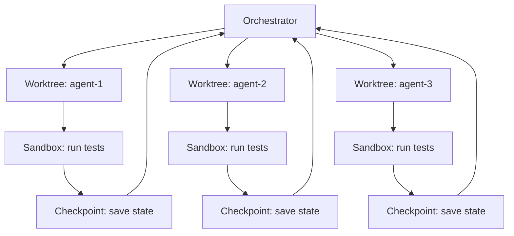

# Chapter 17: Execution and State — Worktrees, Sandboxes, Checkpoints

> **Reading note.** The opening case and its numerical outcomes are illustrative, not a documented production incident. Code and LoopKit names are illustrative API sketches or pseudocode, not a tested published SDK. Inherited source pointers are identified separately from checked evidence; numerical examples are assumptions, not current provider quotations.

> State is where loops live. Corrupt the state, and the loop is indistinguishable from one that never ran.

## The Corrupted Workspace

Deepa Krishnamurthy's platform team at an e-commerce company ran a fleet of three agents in parallel to accelerate their quarterly dependency upgrade. Each agent handled a different subsystem: payments, inventory, and notifications. All three operated in the same repository checkout because "they edit different directories — they won't collide." This assumption held for the first twelve minutes.

Agent A, handling payments, needed to update a shared utility in `lib/http_client.py` to support the new version of their HTTP library. Agent B, handling inventory, needed the same utility updated but with a different configuration — a longer timeout for their warehouse API's slower responses. Agent A wrote its version first. Agent B, two seconds later, wrote its version. Agent B's write overwrote Agent A's changes completely without knowing they existed. Agent A's subsequent test run failed because the HTTP client no longer had the connection-pooling configuration it had just added. Agent A "fixed" this by re-writing the file with its configuration. Agent B's tests then failed because the timeout was gone. The cycle repeated four times before the budget ceiling terminated both agents.

The aftermath: three hours of wall-clock time, 2.8 million tokens consumed [ILLUSTRATIVE ASSUMPTION — not a measured result], and a workspace in a state that could not be committed. Half the files reflected Agent A's assumptions and half reflected Agent B's. The `lib/http_client.py` file contained Agent B's last write, which was incompatible with Agent A's completed work in `src/payments/`. Deepa spent forty minutes manually resolving the mess, ultimately reverting everything and starting over with sequential execution — which completed successfully in twenty-two minutes with no conflicts.

The lesson is not that parallel execution is wrong. Parallel execution, done correctly, is a legitimate and powerful strategy for independent workstreams (Chapter 24, *From Loop to Fleet* and Chapter 25, *Topologies, Shared State, and Coordination*). The lesson is that parallel execution without isolation is a concurrency bug waiting for the right moment to manifest. It is the distributed-systems equivalent of writing to a shared variable from two threads without a lock. The outcome can be timing-dependent and expensive to diagnose; collisions are possible, not guaranteed on every run.

Isolation mechanisms — worktrees, sandboxes, checkpoints — are not optional conveniences for sophisticated teams. They are the infrastructure that makes execution safe (mistakes are contained), resumable (progress survives interruption), and composable (parallel workstreams combine correctly). This chapter provides the concrete mechanics.

## Worktrees: Isolation for Code Loops

A Git worktree provides a separate working directory and usually a separate branch while sharing repository objects. It prevents accidental overwrites of ordinary files when each worker stays inside its assigned directory. It is not a sandbox: workers may still access other paths, shared Git metadata, credentials, databases, ports, caches, and external services.

The lifecycle is create, work, verify, and integrate or retain for diagnosis. Resolve the base commit before creation. Assign an exclusive worktree path and branch, restrict writes where possible, and record the starting commit in the task receipt. A worker should not switch the user's primary checkout to another branch as part of an automatic merge.

```text
Illustrative worktree lifecycle:
  verify repository identity and existing owner changes
  allocate unique owned branch and worktree from pinned base commit
  execute scoped work in a restricted environment
  record changed-file manifest and tests bound to candidate commit
  integration owner reviews candidate in a dedicated integration worktree
  run relevant combined-state checks before accepting the merge
  retain failed candidate until diagnostics and useful work are preserved
  remove only the owned worktree after workers stop and cleanup is authorised
```

Discarding a worktree deletes local uncommitted work; it does not undo an API request made from it. Force removal and branch deletion can destroy evidence or the user's changes. Verify ownership, active processes, and retention policy before cleanup. Disk and setup cost depend on repository size, filesystem, sparse-checkout configuration, generated artifacts, and dependencies; measure them instead of assuming sub-second rollback.

Worktrees are useful for parallel writers and risky experiments, but unnecessary for every small edit. A single worker with exclusive ownership can work in place with a scoped backup and a reviewed diff. Do not use broad reset or stash operations on a shared or dirty workspace as an automatic recovery mechanism.

## Sandboxes: Containment for Execution

Worktrees isolate file-system state between agents. Sandboxes solve a different problem: they contain the damage that executing generated code can do. A loop that writes code and then runs it (to check whether tests pass, to execute a build, to run a data pipeline) must reckon with the possibility that the generated code misbehaves. It might consume unbounded CPU in an infinite loop. It might allocate memory until the system runs out. It might delete files it should not touch. It might make network calls to production systems. It might modify system configuration.

A sandbox constrains four resource axes: filesystem access (what paths can be read and written), network access (what endpoints can be reached), compute resources (CPU time limits, memory caps, process count limits), and system privileges (what syscalls are permitted, what devices are accessible). The appropriate level of constraint depends on the trust level of the code being executed and the consequences of misbehaviour.

For a loop running pytest on code the loop itself generated within a trusted repository: filesystem access should be limited to the repository and its dependencies, network access can be disabled or restricted to localhost, memory should be capped to prevent runaway allocations (512MB-2GB is typical for test suites), and a wall-clock timeout should kill the process if tests hang. These constraints catch accidental misbehaviour — an infinite recursion, a test that inadvertently hits a real API endpoint — without impeding legitimate test execution.

For a loop running user-submitted or internet-sourced code: the sandbox must be maximally restrictive. Read-only filesystem access (the code cannot write persistent state), no network access whatsoever, tight memory limits (256MB), a short CPU timeout (30 seconds), and process isolation that prevents the code from inspecting the host system. Containers and microVMs provide different isolation boundaries; ordinary containers share the host kernel, whereas microVMs add a virtual-machine boundary. Neither is unconditionally the strongest option, and startup cost depends on the implementation.

The engineering trade-off is containment strength versus startup latency and operational complexity. Resource limits alone are not a security sandbox. OS-specific filesystem restrictions, syscall policies, namespaces, and virtualisation address different threats, and availability varies by platform. Container-based sandboxes provide strong isolation but require a container runtime, pre-built images, and add measurable latency to every loop iteration. The choice depends on the threat model: evaluate the executed dependencies, retrieved inputs, available secrets, and impact of escape. A trusted prompt does not make generated code trustworthy. Choose and test the boundary against the threat model, not the author of the prompt.

A practical middle ground for most loop systems: use a per-iteration timeout (wall-clock limit on the subprocess running tests or builds), a memory limit (set via cgroup or ulimit), and filesystem restriction to the working directory. These three constraints catch the vast majority of accidental misbehaviour from agent-generated code without requiring full container infrastructure. Reserve container isolation for loops that execute code from external sources or that run in multi-tenant environments where one user's loop must not affect another's.



## Checkpoints: Resumability After Failure

A loop that crashes at iteration seven of ten should not restart from iteration one. The first six iterations produced verified progress — discoveries made, steps completed, files modified into a known-good state, budget consumed toward a successful outcome. Discarding that progress and re-running from scratch wastes budget on work already done and verified. In Tomás's migration loop from Chapter 16, this waste was caused by compaction destroying the plan. In the general case, any interruption — process crash, timeout, infrastructure failure, manual kill — destroys in-progress state unless that state is explicitly persisted outside the process.

Checkpointing is the mechanism: save the loop's state to durable storage at regular intervals so that a crashed, timed-out, or interrupted loop can resume from the last good state. The cost of checkpointing (a file write and a few hash computations per iteration) is negligible compared to the cost of re-running verified iterations after a failure.

A checkpoint captures five elements of loop state at a specific point in time:

```python

"""loopkit/runner.py — extension: checkpoint save/restore."""
from __future__ import annotations

import hashlib
import json
import time
from dataclasses import dataclass, asdict
from pathlib import Path

@dataclass
class Checkpoint:
    iteration: int
    plan_version: int
    completed_steps: list[str]
    modified_files: dict[str, str]  # scoped relative path -> full SHA-256
    tokens_spent: int
    usd_spent: float
    wall_clock_spent_s: float
    last_score: float | None
    timestamp: float

    def save(self, path: Path) -> None:
        tmp = path.with_suffix(".tmp")
        tmp.write_text(json.dumps(asdict(self), indent=2))
        tmp.replace(path)  # atomic visibility on the same filesystem; not crash durability

    @classmethod
    def load(cls, path: Path) -> "Checkpoint":
        return cls(**json.loads(path.read_text()))

    def is_valid(self, workspace: Path) -> bool:
        """Verify workspace state matches this checkpoint."""
        for rel_path, expected_hash in self.modified_files.items():
            full_path = workspace / rel_path
            if not full_path.exists():
                return False
            actual = hashlib.sha256(full_path.read_bytes()).hexdigest()
            if actual != expected_hash:
                return False
        return True
```

The checkpoint is saved with an atomic write (write to temp, then rename) to prevent corruption if the process is killed mid-write. A partially-written checkpoint file is worse than no checkpoint file because it may contain inconsistent state that causes the resumed loop to make incorrect assumptions about the workspace. Same-filesystem replacement gives readers old-or-new visibility. Power-loss durability additionally needs appropriate file and directory flushing, and the checkpoint must refer to a consistent artifact snapshot. The sketch omits these production details and path-containment validation.

When to checkpoint: after every iteration that advances the plan (a step marked complete, a score improvement, a new discovery that changes the approach). Checkpointing after every iteration regardless of progress is wasteful if iterations are cheap, but it ensures maximum resumability. Checkpointing only at major milestones saves I/O but risks losing more work on interruption. The recommended default is: checkpoint whenever the loop has done work it would not want to redo. Persist failures that changed knowledge, spent budget, or may have caused effects. A timeout may leave the remote result unknown; omitting it from a checkpoint can make an unsafe retry look like fresh work.

The resume sequence is: look for a checkpoint file at the expected path. If one exists, validate the scoped artifacts, plan, environment, authority, and effect ledger before restoring state: set the iteration counter, load the plan version, mark completed steps, and subtract spent budget from the ceiling. If hashes differ, preserve both states and reconcile the changed inputs. Invalidate only affected evidence and block unresolved effects; do not reset budgets or replay actions simply because a file changed. Attempting to resume from a stale checkpoint produces worse outcomes than restarting because the loop's assumptions about file state no longer hold.

## The Shared-Filesystem Coordination Model

A shared-filesystem design can let specialists publish artifacts and persistent events for a lead. The design requires explicit ownership and does not itself guarantee complete traces or safe concurrent writes. This model is powerful but requires coordination discipline to prevent the collision scenario from this chapter's opening.

The coordination model has three layers. First, **workspace partitioning**: assign each specialist a set of paths it owns. Agent A owns `src/payments/`. Agent B owns `src/inventory/`. The shared file `lib/http_client.py` is owned by neither, or designated to a specific agent with others submitting change requests. Enforcement can be soft (prompt instruction: "only modify files in your assigned directory") or hard (filesystem permissions that make other directories read-only for the agent's process).

Second, **shared-file protocol**: for files that genuinely need modification by multiple agents (configuration files, shared libraries, lock files), designate one agent as the owner and have others communicate needs through the event log rather than writing directly. Agent B needs a longer timeout in the HTTP client? It posts an event: "Request: http_client timeout for warehouse API should be 30s." Agent A (the owner) incorporates the request when it next touches the file, resolving any conflict with its own connection-pooling needs.

Third, **merge-time verification**: when parallel workstreams combine (worktrees merging to main, or sequential integration of partition results), run the full oracle suite against the merged state. Tests that pass in isolation may fail when combined — Agent A's code calls `http_client.pool_size` which Agent B's version removed. Integration failures are detectable only at merge time, so merge-time verification is non-optional for parallel work.

## Rollback Strategies

Begin recovery by classifying state. Local source changes, database mutations, delivered messages, and payment operations have different reversal semantics. A file restore changes local bytes. It cannot recall information already read by a recipient or undo an operation already accepted by another service.

For an owned isolated worktree, retain the candidate diff and failure receipt before cleanup. For an in-place edit, restore only the files and revisions the run owns, preserving pre-existing user changes. A broad `git reset --hard` is not a safe general rollback recipe in a shared workspace.

For external effects, use operation-specific compensation. A table creation may be reversible before consumers write data, but dropping it afterward may destroy valid records. Redeploying an old application version may fail against a new schema. Some messaging APIs support deletion, but that cannot undo delivery, screenshots, or follow-on actions. Refunds are new financial operations with their own authority and records, not erasure of the original charge.

Verify prerequisites before an effect, then record and verify the actual outcome afterward. A pre-action oracle cannot guarantee that the external service performs the requested mutation. Treat partial success and unknown completion as first-class states. Compensation requires its own authorisation, bounded retries, and reconciliation; it is not a generic exception handler allowed to perform arbitrary inverse actions.

## State Management: The Transactional Pattern

A write-ahead record is useful only with a defined recovery protocol. Recording a path and a content hash does not save the old content needed for restoration. Likewise, writing five files in sequence and then renaming a checkpoint does not make the five-file update atomic.

For local artifacts, one approach is immutable snapshots plus an atomic pointer to the accepted snapshot. Readers must use that pointer rather than reading half-updated working files. A worktree keeps provisional changes away from the integration checkout, but the worktree itself can contain partial state after a crash, and a Git merge does not provide a transaction across external services.

For a remote mutation, persist an intent with a stable operation ID before sending it. Store the receiver's receipt and the observed outcome afterward. If the request times out, query by that ID before retrying. Where the receiver lacks idempotency or queryable status, exactly-once effects cannot be manufactured by local logging. Escalate ambiguous outcomes or redesign the operation boundary.

## Making Runs Resumable

A production loop should be designed so that any run can be interrupted at any point and resumed from the last checkpoint without loss of verified progress. This is the resume-first design pattern: the loop's startup sequence always checks for existing state before beginning fresh work.

The startup sequence is: (1) check for a checkpoint file at the known path; (2) if found, validate it against the current workspace state; (3) if valid, restore loop state from checkpoint and continue; (4) if invalid or missing, inspect the operation ledger and current artifacts before deciding whether a new run is safe; missing local state is not proof that no work occurred. This sequence adds negligible latency (one file read, a few hash computations) and makes the loop robust to the interruptions that production systems routinely experience: process OOM kills, infrastructure rolling restarts, network timeouts that cause the orchestrator to consider the agent dead, and manual cancellations when a human decides the loop is heading in the wrong direction.

The resume-first pattern also enables a useful operational pattern: intentional interruption for course correction. A human observing a loop that is heading toward a poor solution can kill it, modify the plan file (adding a constraint or removing a failed approach), and restart it. The controller verifies an authorised plan amendment and resumption, invalidates affected checks, and then resumes with the change recorded. Killing a run does not grant permission for it to restart itself. This is a lightweight human-in-the-loop intervention that does not require the human to wait for the loop to finish or to restart it from scratch.

Resume-first design also composes well with the trigger system (Chapter 14, *Triggers and Automations*). A scheduled trigger that fires daily can resume a long-running multi-day task from its checkpoint rather than restarting each day. The loop works for its budget allocation (say, 30 minutes per day), checkpoints its state, and is re-triggered the next day to continue. This pattern enables loops that work on large-scale tasks (repository-wide refactoring, comprehensive documentation generation, multi-hundred-file migrations) without requiring a single uninterrupted session long enough to complete the entire task.

## What Breaks

The shared-filesystem coordination model breaks down at its enforcement boundary. A prompt instruction saying "only modify files in `src/payments/`" is advisory, not enforceable. If the agent's task requires modifying a shared utility to proceed, and the agent's goal says "make the tests pass," the agent will modify the shared utility because that is what makes the tests pass. The prompt boundary is softer than a filesystem permission boundary, and sophisticated tasks routinely require crossing boundaries that seemed clean at design time.

Filesystem-permission enforcement is harder but reduces capability: a read-only filesystem prevents the agent from making necessary modifications to shared code, even when those modifications are legitimate and correct. The fundamental tension is between isolation (safe, predictable, enables parallel work) and flexibility (capable, adapts to reality, solves cross-cutting problems). No single configuration resolves this tension universally; the right balance depends on how tightly coupled the agents' work actually is, which you may not know until they collide.

Checkpoints introduce their own failure mode: the space between the workspace state and the checkpoint state. If the loop modifies three files and then crashes before checkpointing, those modifications exist in the workspace but not in any checkpoint. On restart, the loop sees no checkpoint (or an older checkpoint) and may redo work, producing a second version of the already-modified files — potentially different from the first version, creating subtle inconsistencies. Reduce the gap with staged snapshots and a defined write-ahead/recovery protocol; a checkpoint after each modification still leaves a crash window and does not provide multi-file atomicity. The worktree pattern keeps partial edits out of the integration checkout, but recovery still has to reconcile the partial state inside that worktree and any external effects.

## Implementation Guidance: Two Ledgers, One Recovery Decision

Keep an artifact ledger and an effect ledger. The artifact ledger identifies source revisions, generated outputs, test inputs, and evidence freshness. The effect ledger identifies intent, operation key, attempt, receiver, receipt, and disposition. Neither replaces the other. A restored source tree may still have an unconfirmed deployment in flight; a confirmed deployment may have been built from a source revision whose local files have since changed.

An effect state machine can use `prepared`, `submitted`, `confirmed`, `failed`, and `unknown`. Only a receiver observation moves an ambiguous submission to confirmed or failed. Local process death cannot make that decision. Associate each attempt with the current owner generation so a resumed old worker cannot publish a late success as the result of a new run.

### Recovery Case: The Lost Deployment Response

A worker prepares release R, records operation D, and sends a deployment request. The deployment service accepts D, but the network drops its response. The worker crashes. On restart, the artifact hashes match, yet replaying the request with a new operation ID could launch another deployment. The recovery controller first asks the service for D. If it is running, observe it; if successful, verify the deployed revision and store the receipt; if definitively absent, retry according to the service's idempotency contract. If the service cannot answer, retain `unknown` and block contradictory actions. A neat local checkpoint is not grounds for inventing certainty.

Track budgets cumulatively across attempts, including failed verification and reconciliation calls. A restart is not a new financial allowance. Wall-clock policy should distinguish a run deadline from accumulated active execution time, and store both where a multi-day task intentionally pauses.

### Exercise Acceptance Checks

Inject crashes before intent persistence, after persistence but before send, after remote acceptance, and after receipt storage. The recovery implementation must explain each outcome without duplicating the mocked effect. Add changed, added, and deleted files, symlink escape attempts, altered test configuration, and a stale owner generation to checkpoint validation. A valid implementation rejects unsafe paths and reports which evidence became stale instead of blindly returning a single trustworthy/untrustworthy bit. No real deployment, payment, or destructive mutation is necessary for these tests.

## Key Takeaways

- Worktrees provide write isolation for parallel agents: each gets its own branch and directory with trivial rollback via deletion and safe merge after verification.
- Sandboxes contain execution risk across four axes: filesystem, network, compute, and privilege. Constraint level matches the trust level of the executed code.
- Checkpoints capture loop state (iteration, plan, file hashes, budget, score) for resumability. Atomic writes prevent checkpoint corruption.
- The shared-filesystem coordination model partitions ownership and uses event logs for cross-partition communication. Merge-time verification catches integration failures.
- Resume-first design: every loop starts by checking for a valid checkpoint. This makes loops robust to interruption and enables intentional course correction.
- Recovery is state-specific: preserve and restore owned files, reconcile external effects, and authorise compensation separately. Neither a worktree nor a checkpoint is an external rollback guarantee.

## The Loop Contract, So Far

This chapter extends the **budget** field by showing how checkpoints make budget consumption cumulative across restarts rather than resetting on each restart attempt. It also informs the **stop condition**: a corrupted workspace or invalid checkpoint is itself a termination signal that should trigger escalation rather than silent retry, because the loop's assumptions about state no longer hold.

## Exercises

1. **Worktree lifecycle script.** Write a Bash script that: creates an owned worktree from a pinned commit, runs an allowlisted test command, and records the candidate and exit status without automatically merging or destroying failed work. Include an interrupt handler that stops owned workers and preserves diagnostics; cleanup must verify exclusive ownership and explicit retention policy. Test it with `pytest tests/` as the command.

2. **Checkpoint validation.** Extend the `Checkpoint.is_valid()` method to detect not just modified files but also files that were added to or deleted from the workspace since the checkpoint. The current implementation detects deletion of a recorded file but misses unexpected additions and deletions of files omitted from its manifest.

3. **Partition conflict detection.** Write a function `detect_conflicts(agent_files: dict[str, list[str]]) -> list[tuple[str, str, str]]` that takes a mapping of agent_id to list of modified file paths and returns a list of (file_path, agent_a, agent_b) tuples for every file modified by more than one agent. This is the merge-time check that would have caught Deepa's collision.

4. **Resume cost analysis.** A loop runs for 10 iterations at 100K tokens each (total: 1M tokens if uninterrupted). It checkpoints every 2 iterations. It crashes once per run on average, uniformly at any iteration. Calculate: (a) expected token cost without checkpointing (must restart from zero), (b) expected token cost with checkpointing (resumes from last checkpoint), (c) the crash frequency at which checkpointing breaks even versus not checkpointing (considering checkpoint I/O is negligible). [ILLUSTRATIVE ASSUMPTION — not a measured result]

## Sources and Evidence Limits

- [AWS Builders’ Library, Making retries safe with idempotent APIs](https://aws.amazon.com/builders-library/making-retries-safe-with-idempotent-APIs/) — stable request identity, late arrivals, and parameter mismatch.
- [Stripe API, Idempotent requests](https://docs.stripe.com/api/idempotent_requests) — Stripe-specific response retention and key reuse limits; not a universal exactly-once guarantee.
- [AWS Prescriptive Guidance, Transactional outbox pattern](https://docs.aws.amazon.com/prescriptive-guidance/latest/cloud-design-patterns/transactional-outbox.html) — local atomic commit and duplicate delivery boundary.

Primary-source passages were reviewed in the shared editorial source packet dated 2026-10-07; the citations support only the bounded distinctions stated above. Opening cases, thresholds, cost examples, and code sketches are teaching material, not independently verified production measurements. The inherited “New in Claude Managed Agents” pointer could not be confirmed during source review and is not used as evidence.

------------------------------------------------------------------------

*Next: Chapter 18 addresses the Stop Problem — the most under-taught topic in loop engineering, covering termination conditions, budget ceilings, oscillation detection, and the graceful hand-off to a human.*

[Previous: Chapter 16](chapter-16.md) · [Next: Chapter 18](chapter-18.md)
