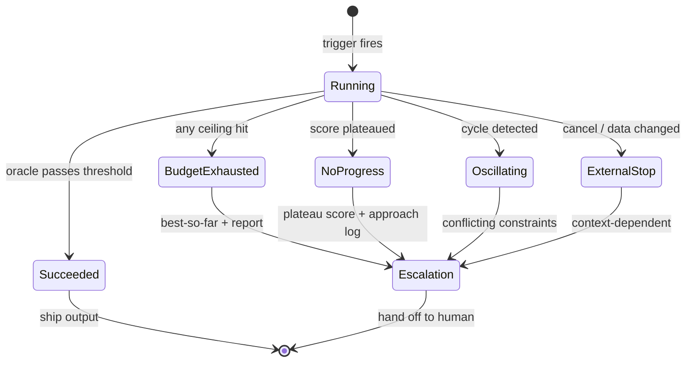
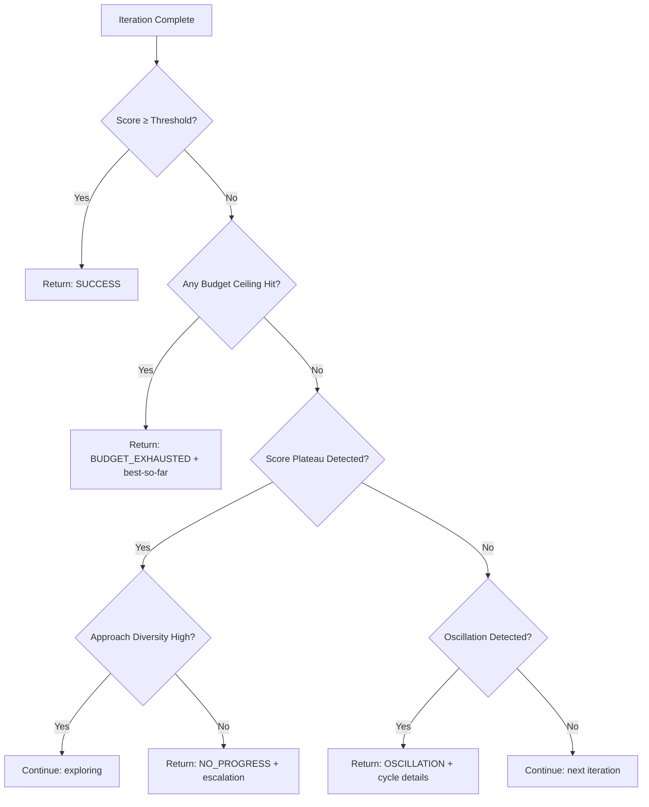

# Chapter 18: The Stop Problem

> **Reading note.** The opening case and its numerical outcomes are illustrative, not a documented production incident. Code and LoopKit names are illustrative API sketches or pseudocode, not a tested published SDK. Inherited source pointers are identified separately from checked evidence; numerical examples are assumptions, not current provider quotations.

> An unbounded loop is not an agent. It is a billing anomaly.

## The \$54 Tuesday

Javier Morales woke at 6:22am to a PagerDuty alert he had never seen before: "Monthly Anthropic API budget exceeded." It was Tuesday. The third Tuesday of the month. The budget was meant to last until the thirty-first. He opened the usage dashboard and found the cause: a single loop run, started at 11:42pm the previous night by a scheduled trigger, had consumed \$54 in API costs over six hours and forty minutes. The loop was still running when the budget alert fired.

The task was routine: a nightly code-quality sweep that reviewed the day's merged pull requests, identified style violations and potential bugs, and opened issues for each finding. On a normal night the loop processed four to eight PRs, cost three to six dollars, and completed in twelve minutes. It had been running reliably for six weeks.

But the previous day the team had landed a large-scale refactoring — twenty-three PRs merged as part of a coordinated migration from their legacy ORM to a new data layer. The loop processed the first three PRs successfully. On the fourth, it found a style violation (inconsistent import ordering) that appeared in every file touched by the migration. The violation appeared 340 times across the refactoring's twenty-three PRs. The loop attempted to enumerate every instance in its finding. Its context filled. Compaction triggered. The compacted context noted "analysing style violations across migration PRs" but lost the specific enumeration. The loop re-discovered the pattern. Re-enumerated. Compacted again. Lost the enumeration again.

For six hours it cycled: discover the pattern, enumerate instances, fill context, compact, lose the enumeration, re-discover the pattern. Each cycle consumed approximately 200K tokens in discovery and enumeration [ILLUSTRATIVE ASSUMPTION — not a measured result]. Over forty cycles, suppose the entire run accumulated to eight million input tokens and two million output tokens, including its useful early work. At illustrative rates of $3 and $15 per million respectively, the total cost is $24 + $30 = $54. These are scenario assumptions, not a current provider quotation.

The loop had no iteration limit because "it should process however many PRs there are — we can't predict the number in advance." It had no dollar ceiling because "API costs are a business expense controlled at the billing level, not a technical constraint at the loop level." It had no oscillation detection because oscillation had never been observed in six weeks of normal operation. It had no progress metric because the work was expected to complete in a single pass without retries. Every one of these omissions was a design decision that seemed reasonable in normal operation and became a compound failure mode the moment the input distribution changed.

Javier cancelled the loop, examined the output, and found exactly one useful result: the first three PR reviews, costing four dollars. The remaining \$50 produced nothing a human or downstream system could use. The loop had not failed in any way it could detect — it was doing exactly what it was designed to do, just repeatedly and without convergence. The absence of a stop condition transformed a four-dollar success into a \$54 incident.

## Why Stopping Is Harder Than Starting

Every loop engineering tutorial teaches you how to start a loop. How to connect the trigger, how to wire the tools, how to construct the prompt. Starting is straightforward because it requires only configuration. Stopping is hard because it requires judgment about future utility: "Will the next iteration produce enough value to justify its cost?" This question has no deterministic answer because it depends on the shape of the solution space, which the loop discovers only by exploring.

The stop problem has five dimensions, each corresponding to a reason a loop should terminate. Understanding all five — and implementing detection for each — is what distinguishes a production loop from a prototype.

## The Five Termination Conditions

**Success** is the happy path. The oracle confirms that the output satisfies the goal's acceptance criteria. The loop has produced verified work. Post-termination action: deliver the result within existing authority, record metrics (iterations used, cost, time), and mark the trigger event as processed. Usable partial artifacts may also survive cancellation or a blocked dependency. Whether an artifact is usable and whether the entire contract succeeded are separate questions; neither automatically authorises publication.

**Budget exhaustion** means the loop consumed its allocated resources without achieving the goal. The loop tried, spent its allowance, and fell short. Budget exhaustion does not mean the problem is unsolvable — it means the problem is harder than the budget allows for. Perhaps the budget was set too tight (calibrated for typical difficulty when this task is atypical). Perhaps the approach was inefficient (consuming tokens on unproductive exploration). Perhaps the task genuinely exceeds the loop's capability. Post-termination action: escalate with the best result achieved and a diagnosis of where budget was spent, so a human can decide whether to extend the budget, change the approach, or accept the partial result.

**No progress** means the loop is running but not improving. The oracle scores have plateaued — the last N iterations produced output at essentially the same quality level. The loop may have reached a local plateau below the goal threshold. Repeated unchanged attempts may have low expected value, but a short plateau is not proof that no breakthrough is possible. Treat it as a decision signal with an explicit exploration allowance. Post-termination action: escalate with the plateau score, the approach used, and a recommendation that a different strategy is needed.

**Oscillation** means the loop is actively undoing and redoing its own work. It makes a change, that change breaks something, it reverts the change, the reversion breaks the original thing, and it re-applies the change. Each iteration looks like activity — edits happen, tests run, output is produced — but the net effect across iterations is zero or negative. Oscillation is the most insidious termination condition because it masquerades as productive work. The loop appears busy. It is not stuck. It is cycling. Post-termination action: stop immediately and report the conflicting constraints that the loop cannot resolve simultaneously.

**External signal** means something outside the loop mandates termination. A human pressed cancel. An authentication or tool error prevents required work. The underlying data changed (the PR was merged by someone else, the ticket was closed, the branch was deleted). An infrastructure event occurred (API outage, rate limit, network partition). Post-termination action depends on signal type: human cancellation produces a cancelled outcome without automatic resumption; data changes invalidate affected evidence; transient infrastructure failures may receive bounded retries. Authentication denial is not a transient rate limit and must retain its original diagnostic.

The following state machine shows how a loop transitions between its possible states, with termination conditions as the edges into terminal states:



## Budget Ceilings Across Four Dimensions

A budget is not one number. It is a composite ceiling across four dimensions, and the first ceiling hit terminates the loop regardless of status on the other three. This composite design prevents the specific failure Javier experienced: his loop had no ceiling at all, and a single dimension of unbounded resource consumption produced a catastrophic bill.

**Iteration ceiling** bounds computational depth. A loop may execute at most N complete cycles of Discover-Plan-Execute-Verify. This ceiling bounds completed cycles; a hanging tool or internal retry still requires separately enforced deadlines and call limits. Setting it requires estimating the typical number of iterations a task needs: simple bug fixes usually converge in 1-3 iterations, feature implementations in 3-7, complex investigations in 5-10 [ILLUSTRATIVE ASSUMPTION — not a measured result]. Set the ceiling at the 90th percentile of expected iterations plus a small buffer — tight enough to catch runaway loops, loose enough to accommodate legitimate difficulty.

**Token ceiling** bounds cumulative cost more precisely than iteration count because iterations vary enormously in size. A discovery-heavy iteration that reads twenty files consumes far more tokens than a focused edit iteration that modifies three lines. Token ceilings should be set at 1.5-2× the expected total consumption for the task type, providing headroom for retries without enabling unlimited spending. For a loop type that typically consumes 200K tokens to completion, a ceiling of 400K provides one full retry's worth of headroom.

**Dollar ceiling** is the ultimate financial backstop. It translates directly into business impact and catches scenarios the other ceilings miss: model pricing changes, unexpectedly long context that inflates input costs, tool calls that themselves incur charges (database queries, external APIs with per-call pricing). Choose dollar ceilings from the task value, observed distribution, model rate card, cache policy, and billable tools. Do not transfer an old model-tier multiplier into a new deployment without checking the actual pricing and token mix.

**Wall-clock ceiling** bounds elapsed real-world time independent of computational cost. It catches scenarios where the loop is waiting rather than working: hanging on an unresponsive tool, deadlocked on a resource lock, spinning in a retry loop that does not increment the iteration counter. A wall-clock ceiling of 10-15 minutes suits most single-task loops. Complex tasks with external dependencies (waiting for CI, waiting for deployment, waiting for human approval in a hybrid loop) may need 30-60 minutes. Javier's loop had no wall-clock ceiling; a functioning 30-minute deadline would have bounded duration, though cost at that deadline depends on when billable work occurred.

```python

"""loopkit/runner.py — extension: composite budget with four ceilings."""
from __future__ import annotations

import time
from dataclasses import dataclass

@dataclass
class Budget:
    max_iterations: int
    max_tokens: int
    max_usd: float
    max_wall_clock_s: float

    def check(self, iterations: int, tokens: int, usd: float, start_time: float) -> str | None:
        """Return the name of the first ceiling hit, or None."""
        if iterations >= self.max_iterations:
            return "max_iterations"
        if tokens >= self.max_tokens:
            return "max_tokens"
        if usd >= self.max_usd:
            return "max_usd"
        if time.monotonic() - start_time >= self.max_wall_clock_s:
            return "max_wall_clock"
        return None
```

## Oscillation Detection: The Silent Budget Killer

Oscillation is the failure mode that most often reaches production undetected because it defeats naive monitoring. A dashboard showing "loop running, iteration count increasing, tool calls happening" looks healthy. The loop is doing things. But it is doing the same things repeatedly, with each iteration's work undone by the next.

The canonical example is the flip-flop: the loop adds a null check to fix `test_null_input`. This breaks `test_valid_input` because the null check rejects a value that the valid-input test sends (a legitimate empty string that is not null). The loop removes the null check to fix `test_valid_input`. Now `test_null_input` fails again because actual null values reach the handler unchecked. The loop adds the null check. Repeat. The loop cannot satisfy both tests simultaneously with its current approach (a simple null check), but it does not recognise this — it sees two alternating test failures and tries to fix each one, creating the other.

Detection requires tracking state across iterations and recognising repetition within a sliding window. The simplest approach hashes the loop's workspace state (or a subset — the modified files, the test results, the action log) after each iteration and checks whether a recent state has been seen before. If the state at iteration N matches the state at iteration N-2 (a cycle of length 2) or N-3 (a cycle of length 3), the loop is oscillating.

```python

"""loopkit/runner.py — extension: oscillation detection."""
from __future__ import annotations

from dataclasses import dataclass, field
from difflib import SequenceMatcher

@dataclass
class OscillationDetector:
    window: int = 6
    similarity_threshold: float = 0.85
    _state_history: list[str] = field(default_factory=list)

    def record(self, state_snapshot: str) -> None:
        """Record state after each iteration (file contents, action log, test output)."""
        self._state_history.append(state_snapshot)
        if len(self._state_history) > self.window * 2:
            self._state_history = self._state_history[-self.window * 2:]

    def is_oscillating(self) -> bool:
        """Detect cycles of length 2 or 3 within the sliding window."""
        if len(self._state_history) < 4:
            return False
        current = self._state_history[-1]
        for lookback in (2, 3):
            if len(self._state_history) > lookback:
                past = self._state_history[-(lookback + 1)]
                if SequenceMatcher(None, current, past).ratio() > self.similarity_threshold:
                    return True
        return False

    def cycle_length(self) -> int | None:
        """If oscillating, return the detected cycle length."""
        if len(self._state_history) < 4:
            return None
        current = self._state_history[-1]
        for lookback in (2, 3, 4):
            if len(self._state_history) > lookback:
                past = self._state_history[-(lookback + 1)]
                if SequenceMatcher(None, current, past).ratio() > self.similarity_threshold:
                    return lookback
        return None
```

The illustrative similarity threshold of 0.85 requires calibration, not trust. Exact state repetition (1.0) is too strict: the loop may oscillate between states that differ in timestamps, log lines, or irrelevant metadata while being functionally identical. SequenceMatcher similarity is a string-matching score, not a percentage of semantically repeated state. Large unchanged boilerplate can make two genuinely different attempts appear similar. Compare normalised decision-relevant state and repeated actions as well as text. Too low a threshold (below 0.7) produces false positives where legitimately different states are flagged as repetition because they share common boilerplate. The threshold may need per-loop tuning: loops that produce verbose output need higher thresholds; loops that produce terse output can use lower ones.

A more sophisticated detector operates on semantic actions rather than raw state. If the loop's last four actions are \[add_line("src/auth.py", 42, "if x is None: return"), remove_line("src/auth.py", 42), add_line("src/auth.py", 42, "if x is None: return"), remove_line("src/auth.py", 42)\], that is action-level oscillation detectable within four iterations regardless of what the rest of the file looks like. Action-level detection is faster (catches oscillation sooner) and more precise (fewer false positives from incidental state similarity) but requires the loop to emit structured action logs rather than just file snapshots.

## No-Progress Detection

No-progress is distinct from oscillation in mechanism. In oscillation, the loop cycles between states — it moves but returns to where it started. In no-progress, the loop is stuck — each iteration produces different output, but the oracle score does not improve. The loop is trying new things, but none of them are better than what it already has.

Detection is straightforward: maintain a sliding window of oracle scores and check whether the range (maximum minus minimum) within the window falls below a threshold. If the last three scores are \[0.62, 0.64, 0.63\], the range is 0.02 — effectively flat. The loop has plateaued.

```python

def detect_plateau(scores: list[float], window: int = 3, epsilon: float = 0.05) -> bool:
    """Return True if the last `window` scores show no meaningful improvement."""
    if len(scores) < window:
        return False
    recent = scores[-window:]
    return (max(recent) - min(recent)) < epsilon
```

The window size balances sensitivity against patience. A window of 3 detects plateaus quickly (after three flat iterations) but may false-positive on legitimate exploration pauses — sometimes the loop needs two low-scoring iterations to discover an approach that produces a breakthrough on the third. A window of 5 is more patient but allows the loop to burn two additional iterations after the plateau is established. For production loops where iterations are expensive (Opus-level model, complex tool calls), a window of 3 is appropriate — you want early detection. For cheap loops (Haiku-level, simple tasks), a window of 5 avoids premature termination.

The appropriate response to a detected plateau depends on the gap between the best achieved score and the goal threshold. If the loop is scoring 0.72 against a threshold of 0.80 — close but not there — the plateau may indicate that the current approach gets most of the way but cannot close the last gap. The escalation should say: "Scoring 0.72 consistently. Current approach handles cases A and B but fails on case C. A different technique may be needed for case C." If the loop is scoring 0.35 against a threshold of 0.80, the approach is fundamentally insufficient and the escalation should be more direct: "Approach X cannot solve this problem. Maximum score 0.35 with no improvement trajectory after 5 iterations."

## The Unbounded-Agent Lesson

Early demonstrations of open-ended agents made the risk of repeated planning and tool use visible, but project names and anecdotes do not establish the behaviour of every version or configuration. The inherited draft made broad historical claims about AutoGPT without preserving versioned evidence. The engineering lesson does not depend on those claims.

A controller that has no enforced resource limit can continue spending while it receives no useful improvement signal. It might terminate by chance, provider failure, or operator intervention; unbounded spending is a risk, not a mathematical certainty that every run becomes arbitrarily bad. Similarly, a good oracle can still make errors, and the absence of an oracle does not prove every output is wrong.

Test the structural failure directly. Give a disposable loop an unsatisfiable task and a mocked tool that returns the same error each time. Confirm that the controller bounds calls, preserves the original error, and returns a truthful incomplete result. Then introduce new evidence and verify that a permitted retry is possible without erasing previous attempts. The distinction is between an unchanged failed prerequisite and a changed situation, not between "agents are good" and "agents always loop forever."

## Graceful Degradation and the Best-So-Far Pattern

Not every termination produces a complete result, but not every incomplete result is worthless. A loop that terminates due to budget exhaustion after achieving a score of 0.7 against a threshold of 0.8 has produced value. A rubric score of 0.7 is not "70% correct." A draft may be useful for review, but must not bypass a failed safety or acceptance condition merely because its average score is high. Perhaps it reduces a human's remaining work from four hours to thirty minutes. Perhaps it serves as a starting point for a second loop run with a different strategy.

The best-so-far pattern tracks the highest-scoring output across all iterations and returns it on any non-success termination:

```python

"""loopkit/runner.py — extension: graceful degradation."""
from __future__ import annotations

from dataclasses import dataclass, field

@dataclass
class LoopResult:
    status: str  # "success" | "budget_exhausted" | "no_progress" | "oscillation" | "external"
    output: str | None
    best_score: float
    iterations_used: int
    tokens_used: int
    usd_spent: float
    termination_reason: str
    attempts_log: list[str] = field(default_factory=list)

    @property
    def escalation_report(self) -> str:
        lines = [
            f"## Loop Result: {self.status}",
            f"Best score: {self.best_score:.2f}",
            f"Iterations: {self.iterations_used} | Tokens: {self.tokens_used:,} | Cost: ${self.usd_spent:.2f}",
            f"Termination: {self.termination_reason}",
            "", "## Attempts",
        ]
        for attempt in self.attempts_log:
            lines.append(f"- {attempt}")
        return "\n".join(lines)
```

The escalation report is the hand-off document. When a human (or a higher-level orchestrator) picks up where the loop left off, the report tells them: what was tried, how far the loop got, what the remaining gap is, and what the loop recommends. A good escalation report saves the human from re-discovering what the loop already learned. A bad report ("Task failed") forces the human to start from scratch, wasting all the information the loop generated during its run.

The best-so-far pattern also enables a useful production workflow: scheduled partial delivery. Some systems are configured to ship the best result as a draft if the score exceeds a "draft threshold" (lower than the full-pass threshold), marking it as "auto-generated, not fully verified" and routing it through a lighter human review. A draft below the acceptance threshold may reduce human effort, but the score does not identify a known-correct fraction. The recipient needs the failed criteria and uncertain claims, and may need to review more than the visibly missing sections. This is especially valuable for time-sensitive tasks where a partial automated result delivered in ten minutes is more useful than a perfect human result delivered in four hours.

The quality of the escalation report deserves specific attention because it is the primary interface between the loop and its human backstop. The report must answer four questions: What was the task? (context for a human who may not remember assigning it). What was achieved? (the best output plus its score, so the human can evaluate whether it is usable as-is). What was tried and why did it fail? (so the human does not re-attempt failed strategies). What does the loop recommend as a next step? (so the human has a starting point rather than a blank slate). Reports answering all four questions can reduce orientation time; measure the benefit rather than assuming a fixed saving. Reports that answer only the first ("Task: fix the login bug. Status: failed.") provide essentially no value over having never run the loop at all.

## Tuning Stop Parameters in Production

Stop-condition parameters should not be guessed at design time and left permanently. They should be calibrated against actual run data and adjusted periodically. The calibration process for a new loop type is:

Run a bounded pilot on representative tasks with explicit safe ceilings; a deliberately generous allowance must still be affordable and enforced. Record the iteration at which each run either succeeds or definitively stalls. Plot the distribution. Set the iteration ceiling at the 90th percentile of successes plus one iteration of headroom. Set the no-progress window at the median number of iterations between the last score improvement and eventual stagnation. Set the oscillation threshold based on observed false-positive rates: if the similarity threshold of 0.85 flags legitimate non-oscillating runs, raise it; if it misses actual oscillation, lower it.

Re-calibrate after model updates, significant prompt changes, or shifts in the input distribution. A model upgrade that improves per-iteration quality may reduce the typical iteration count (allowing you to tighten the ceiling). A new task type entering the loop's queue may have different convergence characteristics (requiring different parameters). Stop conditions are not "set and forget" — they are tunable parameters of the production system with observable performance impact.

## Budget Calculation: A Worked Example

Consider a production code-review loop. The loop receives a pull request, generates review comments, the developer responds, and the loop re-reviews. You want to set budget ceilings that terminate the loop before it becomes expensive while giving it enough headroom to converge on genuinely complex PRs.

Start with observed data from twenty historical runs. The median run converges in 3 iterations; the 90th percentile converges in 5; the maximum observed is 7 (a complex refactoring PR with many files). Each iteration consumes approximately 12,000 tokens of input (the PR diff plus conversation history) and 3,000 tokens of output (the review comments). Total per iteration: 15,000 tokens [ILLUSTRATIVE ASSUMPTION — not a measured result]. At illustrative rates of \$3 per million input tokens and \$15 per million output tokens, each iteration costs approximately \$0.036 input + \$0.045 output = \$0.081 [ILLUSTRATIVE ASSUMPTION — not a measured result]. Wall-clock time per iteration averages 12 seconds including API latency.

Setting the ceilings: max_iterations = 7 (90th percentile plus headroom of 2). max_tokens = 120,000 (7 iterations × 15,000 tokens, with rounding). max_usd = 0.60 (7 × \$0.081, rounded up generously to accommodate variance in PR size). max_wall_clock = 120 seconds (7 × 12s = 84s, plus generous headroom for network variance and retries).

Now check which ceiling is binding. Under normal conditions (median case of 3 iterations): tokens consumed = 45,000 of 120,000 (37%). Cost = \$0.24 of \$0.60 (40%). Wall-clock = 36s of 120s (30%). Iterations = 3 of 7 (43%). No ceiling is close to binding on median runs, which is correct — ceilings should only bind on pathological runs, not normal ones. Under worst observed conditions (7 iterations): all ceilings are near 100% utilisation simultaneously, which means they are balanced. One ceiling may intentionally bind first. Other ceilings protect different abnormal modes, such as a slow tool or unexpectedly long output, and are not pointless merely because they rarely bind.

The following diagram shows the decision flow that the stop controller executes on every iteration:



This diagram illustrates post-iteration quality heuristics only; pre-action permission, cancellation, and budget admission are mandatory in the complete controller below. Note the refinement at step G: plateau detection alone does not trigger termination if the loop is trying genuinely diverse approaches. Only when flat scores combine with repetitive actions does the controller conclude the loop is stuck rather than searching.

## The Complete Stop Controller

A stop controller needs two decision points: admission before the next action and disposition after observing the result. The examples above are individual detection components, not a complete safety boundary. A post-iteration counter can observe a budget overshoot only after the money is spent. An iteration timeout cannot stop an unrelated child process unless the execution adapter propagates and enforces cancellation.

```text
Illustrative controller pseudocode:
  before action:
    if cancellation requested: stop admitting work; request owned work to stop
    if permission expired or required prerequisite failed: do not dispatch
    reserve bounded tokens, cost, concurrency, and time for the action
    if reservation denied: record budget stop; preserve current artifacts

  after observation:
    reconcile reservation with actual usage
    persist artifact evidence, tool errors, and unknown effects separately
    if required execution/check errored: record failed or blocked obligation
    else if all required acceptance evidence is current: quality = complete
    else: quality = partial or no_usable_result
    if repetition/plateau signal and no changed prerequisite:
      stop or escalate under the task-specific exploration policy
    return quality + execution_status + original_reason + evidence + next_step
```

Do not collapse these fields into a single status that loses useful information. A report may be complete while its optional attachment export failed. Conversely, a test may pass while an unauthorised side effect occurred; its pass does not turn execution into success. Record both facts. A completed artifact can be returned after a budget stop, while any resource violation remains visible.

Cancellation outranks dispatch and publication. It is not converted to "success" merely because the latest score is high. Already submitted remote actions may remain uncertain after local cancellation, so the final report must distinguish stopped local execution from reconciled remote completion. Any resumption requires the applicable authority and current prerequisites; a saved checkpoint is not permission.

## Score Trend Analysis: Stopping Before Plateau

A refinement beyond simple plateau detection: track not just whether scores are flat, but whether the score trajectory is declining or decelerating. If scores across iterations are \[0.5, 0.55, 0.57, 0.575, 0.576\], the rate of improvement is decreasing rapidly. The loop is approaching an asymptote below the goal threshold. At this rate, another ten iterations will produce a score of perhaps 0.58 — still below the 0.80 threshold, at a cost of ten more iterations' worth of tokens. Early termination with an escalation report ("approach asymptotes at approximately 0.58, far below the 0.80 threshold") is more efficient than letting the loop exhaust its budget proving what the trend already shows.

Trend analysis uses a simple heuristic: fit a line to the last five scores. If the slope is positive but below a minimum improvement rate (the cost of one iteration divided by the budget remaining — essentially "will this approach converge before budget runs out?"), terminate early. This is an extrapolation heuristic, not a proof. Scores may jump after a new observation, and their scale may be ordinal rather than linear. State the assumed trend, compare marginal expected value with remaining budget, and permit a bounded exploration exception when new evidence justifies it.

The complement of score trend analysis is approach-diversity tracking. If the loop tries genuinely different strategies across iterations (detected by low similarity between action logs of successive iterations), flat scores are acceptable: the loop is searching. If the loop tries similar strategies (high similarity between action logs), flat scores indicate stuckness. Combining these signals — flat scores plus repetitive actions equals stop; flat scores plus diverse actions equals continue — produces fewer false positives than either signal alone.

## Deadlock in Fleet Loops

Multi-agent systems introduce a termination condition unique to fleets: deadlock. Agent A cannot proceed because it needs output from Agent B. Agent B cannot proceed because it needs output from Agent A. Neither makes progress, and without detection, both will sit idle consuming wall-clock time (and potentially keep-alive tokens) until their individual wall-clock ceilings terminate them.

Deadlock detection in fleet loops monitors agent activity. If two or more agents have not advanced their state within a timeout period (typically 2-5× their normal iteration time), and a dependency analysis reveals circular waiting, deadlock has been identified. The orchestrator resolves it by breaking the cycle: providing a default or approximate value for one dependency to unblock one agent, reordering the work graph to eliminate the circular dependency, or having the first agent to timeout produce a best-effort output (marked as provisional) that the blocked agent can work with.

Prevention is better than detection. The simplest prevention mechanism is a directed acyclic constraint on the dependency graph: if the orchestrator ensures that all task dependencies flow in one direction (A feeds B feeds C, never C feeds A), dependency-cycle deadlock is excluded in that declared graph, though runtime locks, missing resources, and undeclared waits can still deadlock. When circular dependencies exist in the problem domain (A needs B's schema to write tests, B needs A's tests to validate the schema), the orchestrator must break the cycle at design time by providing an initial assumption for one side.

## What Breaks

Stop conditions have false positives, and false positives have real costs. A no-progress detector with a window of 3 and epsilon of 0.05 will terminate a loop that is legitimately exploring: trying different approaches before one succeeds, with each approach producing a similar (low) score. The scores during exploration are flat because the loop has not yet found the right approach — each failed approach scores similarly. But exploration is productive work that may lead to a breakthrough on the very next iteration after the one where the detector would terminate it.

You cannot reliably distinguish "productive exploration" from "stuck and wasting money" by looking at scores alone. Both produce flat score trajectories. The difference is in the diversity of approaches being tried: exploration covers genuinely new ground (different strategies, different code structures, different algorithms) while stuckness retries variations of the same failed strategy. A theoretically perfect stop controller would measure approach diversity and continue only if each new attempt is meaningfully different from previous ones. In practice, "meaningfully different" is task-specific and difficult to operationalise without domain knowledge baked into the stop logic.

The pragmatic resolution: design stop conditions per task type rather than globally. Exploration tasks (research, investigation, novel feature implementation) get generous budgets and wide no-progress windows. Convergent tasks (bug fixes, style corrections, known-procedure execution) get tight budgets and narrow windows. One size does not fit all tasks, and the right stop parameters are as much a part of the Loop Contract as the goal and oracle.

A second class of failure: stop conditions that interact in unexpected ways. A budget with max_iterations=10, max_tokens=500K, max_wall_clock=300s, and typical iteration cost of 60K tokens and 40s means: a post-action token check crosses 500K during iteration 9 (540K consumed), while a reservation-based controller may refuse to start that iteration after 480K, the wall-clock ceiling hits at iteration 7.5 (300s elapsed), and the iteration ceiling is unreachable. The wall-clock ceiling silently dominates. The operator believes they have a 10-iteration budget; they actually have a 7-iteration budget. These interactions surface only under specific conditions (slow network, cold model cache) and produce termination behaviour that differs from expectations. The fix: after setting all four ceilings, calculate which one is the binding constraint under normal conditions and verify it matches your intent.

A third failure mode deserves mention because it is the most politically dangerous: stop conditions that are too aggressive for the team's expectations. A budget of three iterations for a task that typically needs five means the loop almost always terminates at budget exhaustion — producing a steady stream of escalations that the team learns to expect and eventually stops trusting. "The bot always gives up" becomes the team's mental model, and they stop assigning work to it. The loop has been effectively decommissioned not by a technical failure but by a parameter choice that made it appear unreliable. The fix is to set budgets based on observed convergence data (the 90th percentile of historical success times) rather than on intuition about what "should" be enough. A percentile from historical successes does not predict overall success probability on future traffic. Include failed cases and distribution changes when calibrating the budget.

The relationship between stop conditions and the escalation path (Chapter 26, *Human In / On / Out of the Loop*) is also critical. A stop condition without a well-designed escalation path means the loop terminates and nothing happens — the work is silently dropped. Every non-success termination reason must map to a specific escalation action: budget exhaustion creates a ticket with the loop's attempts log, oscillation notifies the team lead with the conflicting constraints identified, no-progress updates the task status and includes the plateau score. The stop condition says "when to stop." The escalation path says "what to do instead." Both must be designed together; designing only the stop without the escalation produces a system that quits work without telling anyone.

## Implementation Guidance: Stop Without Hiding Failure

Design the final response before designing the retry loop. It should identify the requested outcome, what was actually achieved, the failed or unresolved obligations, the cause of termination, and any action that could change the situation. "Execution failed" is insufficient when a useful answer was completed and only an optional export failed. "Completed" is misleading when a required test could not authenticate. Preserve the successful part without laundering the failure.

Use separate examples in acceptance tests. In the first, a read-only analysis completes and a supplementary metrics call times out. The correct result delivers the analysis, states the supplementary gap, and does not restart the whole task. In the second, a required repository fetch returns an authentication error. The correct result retains that error, explains the unavailable evidence, and stops; relabelling it "verification pending" hides the actual cause. In the third, the user cancels during a mutation. The correct result records cancellation and an unknown remote outcome until reconciliation, with no automatic retry.

A stopping policy also needs a resume policy. A blocked run resumes when the missing input, authority, resource, or evidence changes, not when the controller has printed its status one more time. Polling is justified for a real pending job with an expected completion signal and bounded deadline. Re-reading the same missing report repeatedly is not investigation. Store the last observed dependency revision and avoid treating unchanged feedback as progress.

### Exercise Acceptance Checks

For oscillation, include a genuine cycle, a stable accepted artifact, and distinct small edits inside a large unchanged file. Only the cycle should trigger the intended detector. For budgets, test admission at the exact boundary, concurrent reservations, provider-reported usage above estimates, and a tool that hangs without completing an iteration. For the escalation report, verify that all failed required checks remain named even when the best artifact is useful. For fleet deadlock, distinguish a cycle in declared dependencies from a resource-lock deadlock; demonstrate detection or timeouts for both rather than claiming a DAG prevents every wait.

## Key Takeaways

- Stopping is both a safety and value decision. Enforced limits bound exposure; no-progress signals need task-specific calibration and do not prove impossibility.
- Five useful termination categories organise common stop reasons: success, budget exhaustion, no progress, oscillation, and external signal.
- Budget ceilings span four dimensions — iterations, tokens, dollars, wall-clock time — and the first ceiling hit terminates the loop.
- Oscillation detection tracks state similarity across iterations using a sliding window, catching cycles of length 2 or 3 before they consume the full budget.
- No-progress detection monitors score variance within a window and terminates when the trajectory has plateaued.
- Graceful degradation: always return the best result achieved, even on non-success termination. Partial results have value.
- The escalation report is the hand-off document. Its quality determines whether the next handler starts from scratch or continues productively.
- Test unbounded-agent failure modes with controlled fixtures rather than relying on unversioned product anecdotes.
- Stop conditions must be designed per task type — exploration tasks need generous parameters, convergent tasks need tight ones.

## The Loop Contract, So Far

This chapter fills the **stop condition** field of the Loop Contract and directly informs the **budget** field by defining the four dimensions of budget ceilings and their interaction semantics. Together with Chapter 15's goal specification, the contract now has a target (goal), a resource boundary (budget), and a termination criterion (stop condition). The remaining fields — oracle and escalation path — are addressed in Part IV (beginning with Chapter 20, *The Hierarchy of Oracles*).

## Exercises

1. **Budget sizing.** A loop type processes code-review tasks. Historical data shows: 80% succeed within 3 iterations and 150K tokens, 15% succeed within 5 iterations and 300K tokens, and 5% never converge regardless of budget. Design a four-dimensional budget (iterations, tokens, dollars, wall-clock) that succeeds on the 95th-percentile achievable task without enabling unbounded spending on the 5% that will never converge. Justify each ceiling value.

2. **Oscillation reproduction.** Write a minimal Python program that deliberately oscillates: it maintains a state variable, and on each iteration either adds or removes a line from a string based on a condition, creating a cycle-2 pattern. Then write a detector (using the `OscillationDetector` class) that correctly identifies the oscillation within 6 iterations. Verify that it does not false-positive on a non-oscillating sequence.

3. **Ceiling interaction analysis.** Given: max_iterations=10, max_tokens=500K, max_wall_clock=300s. Typical iteration: 45K tokens, 35s. Which ceiling hits first under normal conditions? Under what abnormal conditions (name at least two) would a different ceiling become the binding constraint? Calculate the effective budget in each scenario.

4. **Escalation report comparison.** Write two escalation reports for the same failed loop: a dependency-upgrade task that plateaued at score 0.6 after 5 iterations against a threshold of 0.8. One report should be useful to a human taking over (actionable: what was tried, what failed, what to try next). One should be useless (vague: "task failed, please investigate"). Identify the specific information elements that make the first one actionable.

5. **Fleet deadlock prevention.** Design a three-agent system (data-layer, API-layer, frontend-layer) where dependency-cycle deadlock is excluded in that declared graph, though runtime locks, missing resources, and undeclared waits can still deadlock. What property of the task dependency graph must hold? How does the orchestrator enforce this property at assignment time? What happens if a new requirement introduces a circular dependency after the agents have started?

## Sources and Evidence Limits

- [Anthropic Engineering, Demystifying evals for AI agents](https://www.anthropic.com/engineering/demystifying-evals-for-ai-agents) — inspect transcripts, preserve insufficient-evidence outcomes, and distinguish grader/harness defects.
- [AWS Builders’ Library, Making retries safe with idempotent APIs](https://aws.amazon.com/builders-library/making-retries-safe-with-idempotent-APIs/) — retries require stable intent and operation identity.

Primary-source passages were reviewed in the shared editorial source packet dated 2026-10-07; the citations support only the bounded distinctions stated above. Opening cases, thresholds, cost examples, and code sketches are teaching material, not independently verified production measurements. The inherited “New in Claude Managed Agents” pointer could not be confirmed during source review and is not used as evidence.

------------------------------------------------------------------------

*Next: Chapter 19 distinguishes closed loops from open loops — bounded reliability versus exploratory power, and the concrete criteria for when a loop has earned the right to be widened.*

[Previous: Chapter 17](chapter-17.md) · [Next: Chapter 19](chapter-19.md)
