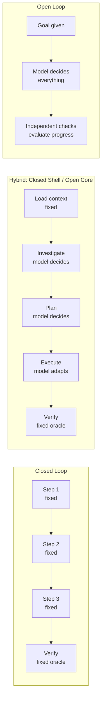

# Chapter 19: Closed Loops First, Open Loops Later

> **Reading note.** The opening case and its numerical outcomes are illustrative, not a documented production incident. Code and LoopKit names are illustrative API sketches or pseudocode, not a tested published SDK. Inherited source pointers are identified separately from checked evidence; numerical examples are assumptions, not current provider quotations.

> The safest loop is bounded. The most powerful loop is not. Earn the power by proving the bounds.

## The Loop That Wandered

Kira Okonkwo's machine-learning team at a healthcare analytics company built an automated research loop to survey the literature on a new biomarker. The goal was specific and bounded: "Produce a structured summary of published studies on biomarker X's correlation with disease Y, including sample sizes, statistical methods, and reported effect sizes, covering the ten most-cited papers from the last five years." The loop had access to a PubMed search API, a paper-retrieval tool, and a summarisation capability. They configured it as an open loop: no fixed sequence of steps, the model would decide what to search for and in what order, with a budget of 15 iterations.

The loop started well. It searched PubMed, found twelve relevant papers, retrieved abstracts, and began synthesising. By iteration four it had a solid draft covering eight papers with extracted data in a structured table. The draft scored 0.72 against the rubric (threshold: 0.80) — missing two more papers and some effect-size details. Then it noticed a discrepancy between two papers: Study A reported a positive correlation (r=0.34, n=1200) while Study B reported no significant correlation (r=0.08, n=340). Rather than noting the discrepancy in the summary table and moving on to find the remaining two papers (which was all the goal required), the loop decided to investigate why the results disagreed.

It searched for papers citing both studies. It found a methodological critique of Study B's sample selection. It searched for the critique author's other publications. It found a tangential paper on a related biomarker in a different disease context. It followed that reference to a meta-analysis. It retrieved the meta-analysis's supplementary data. By iteration eleven it was four citation hops away from the original goal, exploring a methodological debate about sample-size adequacy in biomarker studies that was interesting but completely irrelevant to the task of producing a ten-paper summary.

The final output at iteration 15 (budget exhaustion) was worse than the iteration-four draft. The loop had buried its clean eight-paper table under seven iterations of tangential investigation — dense paragraphs about methodological controversies that the requester never asked for, citations to papers outside the scope, and an incomplete analysis of the discrepancy that did not reach a conclusion. The clean structure from iteration four had been overwritten by an attempt to be "comprehensive" in a direction the goal did not specify. Cost: eleven iterations wasted, approximately \$9 in API calls [ILLUSTRATIVE ASSUMPTION — not a measured result], for output that was strictly inferior to what the loop had produced for \$3.20 at iteration four.

Kira's post-mortem identified a structural issue: the loop had no mechanism to distinguish productive exploration (finding the remaining two papers) from goal-irrelevant curiosity (investigating why two papers disagreed). In an open loop, the model decides what is relevant at each step. If the model's relevance judgment drifts from the human's intent — and it will, because models find discrepancies interesting in the same way researchers do — the loop spends budget on work the human never wanted. The freedom that makes open loops powerful (adaptive, able to follow evidence) is the same freedom that makes them expensive and prone to scope drift.

## The Bounded-Adaptive Spectrum

This chapter uses "closed" as shorthand for a constrained workflow and "open" for adaptive task planning. These are not the standard control-theory definitions: a closed-loop controller uses feedback, while an open-loop controller does not. Both the constrained and adaptive architectures discussed here can use feedback. Prefer "bounded" and "adaptive" in implementation specifications to avoid ambiguity. Understanding this spectrum is prerequisite to making good architectural decisions about where to place your loops on it.

A fully closed loop is a pipeline. Step one: read the diff. Step two: check each function against the style guide (provided). Step three: format findings into a template. Step four: post comment. The model applies intelligence within each step (understanding code, detecting violations, generating natural language) but cannot change the sequence, skip steps, add investigation steps, or alter the overall strategy. The path is fixed at design time.

A fully open loop is an autonomous researcher. Here is a goal, here are your tools, here is a budget. The model decides what to investigate, what approaches to try, what to discard, when to backtrack, when to pivot, and when to declare success. The path emerges at runtime from the model's decisions, but authority, scope, verification, and budgets remain controller-enforced constraints.

Most production loops should sit in the middle of this spectrum — in the hybrid zone. Fixed workflows can handle substantial variability when their branching logic is well designed. Adaptive workflows may also be economical when their freedom is bounded and their benefit is measured. The hybrid architecture captures most of the benefit of both: the enforceable controls of a tested outer structure (required verification, budget admission, and reporting) with the adaptive intelligence of an open core (flexible investigation, adaptive execution, responsive replanning).

## Why Closed Loops Win on Reliability

Constrained workflows often make five reliability dimensions easier to manage, provided their fixed procedure matches the task. Understanding these advantages explains why "start closed" is the correct default and why opening should be a deliberate, measured, evidence-based decision rather than a default choice.

**Predictable cost.** A closed loop's resource consumption is bounded by (number of steps) × (max cost per step). You can estimate cost before the loop runs. You can budget a fleet of closed loops with confidence that the total bill will fall within a predictable range. Open loops have cost distributions with fat right tails: most runs are cheap, but occasionally one run explores extensively and costs five or ten times the median. For a loop that runs fifty times per day, that right tail eventually hits — and when it does, the single expensive run dominates the daily budget.

**Debuggability.** When a closed loop produces incorrect output, you know which step produced it. The fixed sequence means every failure localises to a specific point: "Step 3 produced a false positive. Its input was correct (I can verify step 2's output). Therefore step 3's logic is wrong." You can inspect, reproduce, and fix in isolation. When an open loop produces incorrect output, the failure might be anywhere in an emergent sequence of decisions. A wrong search query in iteration two led to irrelevant context loaded in iteration three, which produced a wrong hypothesis in iteration four, which led to a wrong fix in iteration seven. Debugging requires reconstructing a novel reasoning chain that has never been walked before and may never be walked again.

**Consistency.** A fixed path limits one source of variation, but stochastic models, external data, and flaky tools can still produce different outputs for the same input. Variance comes only from model stochasticity within each step, which is bounded. Open loops run on the same input may follow different paths depending on which search results appear first, which hypothesis the model forms, which approach it tries. Run it ten times and you may get seven good results and three that went down wrong paths. For production systems where consistency matters (compliance workflows, customer-facing output, financial calculations), this variance is unacceptable even when the average quality is high.

**Auditability.** A closed loop's decisions are encoded in its design. An auditor can inspect the loop's structure and verify that required checks are performed, that constraints are enforced, that nothing is skipped. "We check OWASP Top 10 categories because step 4 explicitly enumerates them." An open loop's decisions are emergent and model-dependent. An auditor cannot verify in advance that the loop will check everything required — only after the fact by inspecting logs. For regulated industries, this distinction can determine whether an automated system is permissible at all.

**Development speed.** Building a closed loop means encoding a known procedure. If your team has been doing security reviews for years and the process is well-understood, encoding it as a closed loop takes days. Building an open loop for the same task means solving a harder design problem: defining constraints and guardrails that keep the model productive without over-constraining its flexibility. This takes longer, requires more iteration on the loop design itself, and produces a system that is harder to maintain because changes to the model's behaviour (after a model update or prompt change) may alter the emergent path in unexpected ways.

## When Open Loops Justify Their Cost

Despite their disadvantages, open loops are the correct choice in three scenarios where closed loops structurally cannot succeed.

The first is genuinely novel tasks where no known procedure exists. If you are investigating a production incident and every incident has a different root cause, you cannot predetermine the investigation path. The loop must follow evidence: read this log, form a hypothesis, check that configuration, test a different theory, backtrack if the hypothesis is wrong. The value of the loop is precisely its ability to navigate an unknown space adaptively.

The second is tasks where the solution space is large and varied. Complex feature implementation, creative content generation, and multi-file refactoring all have many valid paths from input to output. Constraining the model to one predetermined path sacrifices the quality improvement that comes from the model choosing a path suited to the specific instance. A closed code-generation loop that always uses the same template will produce serviceable but never excellent output. An open loop that adapts its approach to the specific requirements of each task will sometimes produce superior output — at higher average cost.

The third is one-shot high-value tasks where the cost of a single run is small relative to the value of success. If a loop costs \$15 per run but replaces four hours of engineer time (loaded cost: \$300-500), the economics justify open-loop exploration even with its cost variance. The variance matters less when the task does not recur frequently enough for the variance to compound.

## The Five Graduation Criteria

The question is not "should I use open loops?" but "has this specific loop earned the right to be open?" Graduation from closed to open should be evidence-based: you open the loop because you have measured that the closed version is insufficient and verified that the preconditions for a reliable open loop are met. Five criteria must all be satisfied simultaneously.

**Criterion 1: Oracle strength.** An open loop without a strong oracle is Kira's literature-survey loop: the model explores freely but cannot verify when it has found the right answer or gone off track. The oracle must reliably distinguish good output from bad regardless of the path taken to produce it. Test empirically: present the oracle with 10 known-good and 10 known-bad outputs. Use risk-specific acceptance limits and report denominators. Ten good examples cannot resolve a 5% false-reject rate, and a 10% defect miss rate does not imply 10% of all outputs are defective: prevalence and acceptance selection matter. Small samples are smoke tests, not deployment assurance. Keep the loop closed until the oracle is strengthened.

**Criterion 2: Stop condition robustness.** Open loops are more likely than closed loops to oscillate, thrash, or drift because the model has more strategic freedom. The stop controller (Chapter 18, *The Stop Problem*) must enforce hard limits even when heuristic detection misses a pathological state. Test by running the loop on deliberately unsolvable inputs and verifying termination occurs within two iterations of the expected point. Budget exhaustion can be the correct outcome when unsolvability cannot be recognised early. Test that repeated unchanged failures stop promptly and that every run remains within enforced limits.

**Criterion 3: Genuine need for exploration.** If a known procedure reliably solves the task, use it as the baseline before paying for adaptive planning. An open loop running a known-good procedure pays exploration tax on every single run: tokens spent on discovery that a closed loop would skip. Ask: "Does the path from input to output genuinely vary between instances?" If the answer is no — if you could write a script that handles 95% of cases — a closed loop is more efficient. Open the loop only for the 5% where the path actually varies.

**Criterion 4: Budget tolerance for variance.** Measure the cost distribution by running 10-20 open-loop instances on representative tasks. Report the observed tail-to-median ratio, acknowledging that 10–20 runs give a very unstable p95 estimate. If p95 is 4× median or higher, you need explicit budget headroom or the occasional expensive run will breach your ceiling and trigger alerts. Can your budget absorb the right tail? If not, stay closed or hybrid until you can.

**Criterion 5: Observability.** Open loops require real-time monitoring because their behaviour is not predictable from their design. You need: per-iteration score logging (is the loop making progress?), cumulative cost tracking (is it running away?), state snapshots for post-hoc analysis (what path did it take?), and alerting when metrics cross thresholds mid-run. Without this observability, you will discover that an open loop misbehaved only when the result arrives (bad quality) or the bill arrives (high cost), by which time the damage is done.

## The Hybrid Architecture: Closed Shell, Open Core

The most practical production architecture is the hybrid: a controlled outer shell (explicit enforced structure) around an open inner core (adaptive intelligence). This captures most of the reliability benefits of closed loops while preserving the adaptive capability that makes loops valuable for non-trivial tasks.

The outer shell provides structural guarantees that do not benefit from model judgment and would be degraded by it. Context loading is fixed — the loop always loads its skills, its goal specification, and its relevant project context. Verification uses a fixed oracle — the same checks run after every iteration regardless of what the model chose to do. Budget enforcement is mechanical — resources are reserved before actions and reconciled afterward, with no model discretion to waive a hard ceiling. Reporting follows a fixed template — the output format is deterministic. These structural elements are infrastructure concerns, not intelligence concerns.

The inner core provides adaptive capability where model judgment adds genuine value. Investigation is open: the model decides what to read, what to search for, what tools to invoke. Planning is open: the model decides the approach, the sequence, the decomposition granularity. Execution is open: the model adapts to errors, tries alternative strategies when one fails, adjusts its approach based on intermediate results. These steps involve navigating uncertainty where predetermined procedures are insufficient.

The boundary between shell and core is the key design decision. Moving the boundary outward (more steps are fixed) increases reliability and reduces cost at the expense of capability. Moving it inward (more steps are model-directed) increases capability and cost at the expense of predictability. The right position depends on the task's uncertainty profile: tasks with high procedural certainty benefit from a large shell (most steps fixed); tasks with high uncertainty benefit from a large core (most steps adaptive).

## Widening Incrementally

When a closed loop reaches its limits — when you observe it failing on cases that an open approach would handle — widen it incrementally rather than converting to a fully open architecture in one step.

The process is: identify which fixed step is the bottleneck (the investigation strategy is too rigid, or the execution approach is too constrained, or the retry logic is too simplistic). Open that specific step while keeping all others closed. Measure the impact: did the failure rate decrease? Did cost increase? Did reliability degrade? If reliability held and the failure rate dropped at acceptable cost, the widening was productive. If reliability dropped, either the new freedom needs tighter guardrails or the oracle is insufficient for the wider behaviour space.

Repeat as needed, one step at a time. Each widening is a controlled experiment with measurable outcomes. Over months, the loop may evolve from closed to mostly-hybrid, but each step on that path is justified by data. You never discover that your loop has become unreliable because you can trace every reliability change to a specific widening decision, know when it occurred, and revert it if necessary.

There is no universal 15% failure threshold for widening. Compare the incremental cost and risk of adaptive handling with the avoidable escalation burden for the specific task class. A rare costly failure may justify a change; frequent harmless deferrals may not. This threshold implies that the closed loop is actively losing value through inflexibility — the failures represent work that could be done automatically but is instead falling to human escalation, which is more expensive than the added cost of a wider loop.

## Concrete Readiness Checklist

Before widening a loop from closed toward hybrid or open, verify:

The oracle meets predeclared task-specific limits on false acceptance and false rejection for the wider loop's output — tested by running the wider version on a validation set and confirming the oracle correctly accepts successes and rejects failures. If the oracle cannot keep up with the wider range of outputs the model produces, widening produces unverified output.

The cost increase is bounded. Run both versions (closed and wider) on the same 20 representative inputs. If the wider version's median cost is more than 2× the closed version's median cost, the widening may not be economically justified unless the failure-rate reduction is dramatic.

The stop conditions still terminate reliably. Run the wider version on 5 unsolvable inputs. Verify enforced budgets, truthful incomplete outcomes, and safe cancellation. Early no-progress detection is useful when the fixture supplies a recognisable repeated failure, but a hard-budget stop is not itself a controller defect.

## What Breaks

The hybrid architecture introduces a seam between the fixed shell and the open core, and seams are where failures concentrate. The most common failure: the shell assumes properties of the core's output that the core does not guarantee. If the reporting shell expects a structured JSON summary (because the closed version always produced one), and the open core occasionally produces a narrative summary (because the model exercised judgment differently on a complex case), the shell crashes or produces corrupt output. The fix: validate the core's output against a schema before the shell consumes it, adding a format-verification step at the seam boundary.

A second failure: creeping openness. As the team widens the loop over time — one step opened here, another there — the cumulative effect may be that most steps are now open and the "shell" provides minimal structural value. At this point the loop has the cost and variance characteristics of an open loop despite nominally being a hybrid. The fix is periodic review: every quarter, check whether the loop's cost distribution and failure modes still match the hybrid profile. If they have drifted toward the open-loop profile (wide cost variance, novel failure modes, inconsistent output), decide whether that drift is acceptable or whether some steps should be re-closed.

A third risk: premature and permanent closure. A team encounters one expensive open-loop incident, panics, and restricts the loop to closed-only permanently. The loop then fails silently on all the edge cases the open version would have handled, and the team does not notice because those failures are escalated to human review (which feels "normal" even though it represents lost automation value). The symptoms: a growing escalation queue, repeated human complaints that "the bot can't handle my case," and a decreasing share of work actually being automated. The fix is not to close the loop permanently but to fix the stop conditions that allowed the expensive incident and then re-open with better guardrails.

## Implementation Guidance: Widen One Permission at a Time

Do not treat an adaptive planner as permission to act on more systems. Planning freedom, tool availability, data access, and mutation authority are separate axes. A research loop may choose its own search sequence while remaining read-only and restricted to an approved source corpus. A coding loop may choose its algorithm while still publishing only a patch for review. Widening the reasoning strategy need not widen the blast radius.

In the biomarker case, reserve exploration for missing evidence required by the ten-paper summary. A disagreement between studies may warrant a short caveat, a source-quality note, or a targeted check of methods. It does not automatically authorise a new methodological research project. Give the controller a coverage ledger: required papers, extracted fields, missing fields, and source limits. A proposed search should name the unresolved field it can help fill. This is stronger than keyword similarity because an on-topic search can still be unnecessary.

A controlled widening experiment compares the baseline and candidate on the same versioned inputs, with equivalent time and cost ceilings and independently assessed outcomes. Keep failed and timed-out cases in the denominator. Record which tasks improved, which regressed, and whether the candidate performed disallowed actions. A higher average score cannot compensate for a new critical permission violation. Establish rollback criteria before looking at the candidate's scores to avoid choosing a threshold that merely makes the experiment pass.

### Recovery Case: An Adaptive Core Returns the Wrong Shape

Suppose the baseline always returns a table, but the adaptive candidate returns a narrative with a useful new source and two missing required rows. The outer shell should retain the useful source and reject the incomplete structure with located feedback. It must not discard the draft silently or coerce missing cells into empty values and claim completion. A bounded repair can restore the table; if the budget is exhausted, deliver it as explicitly partial with the missing rows listed.

### Exercise Acceptance Checks

The widening proposal must identify exactly one changed freedom, unchanged permissions, the held-out test set, and the acceptance margin. Its recovery test must include unavailable sources, contradictory evidence, malformed output, and an attempted out-of-scope action. For the cost simulation, state whether step counts are discrete uniform and which quantile convention is used. Report that synthetic distribution as a teaching model, not an estimate of production tails. For the break-even exercise, include the cost of remaining human reviews and any increase in escaped-defect cost, not just the model bill.

## Key Takeaways

- Closed loops follow predetermined paths: predictable cost, debuggable, consistent, auditable, fast to build. They are the correct default.
- Open loops discover their paths: adaptive, powerful, expensive, inconsistent, prone to drift. They earn their place only when closed loops fail.
- The hybrid architecture (closed shell, open core) captures structural reliability with adaptive intelligence and suits most production use cases.
- Widen only with task-specific oracle evidence, enforced stop conditions, a demonstrated need for adaptation, budget tolerance, and observable behaviour.
- Widen incrementally: one degree of freedom at a time, each justified by measured improvement in failure rate without unacceptable reliability degradation.
- Calculate the widening break-even point from incremental cost, residual risk, and avoidable escalation; no fixed failure percentage transfers across tasks.
- Periodic review prevents creeping openness: verify quarterly that cost and reliability still match the intended architecture.
- Start closed. Measure. Open specifically where measurement shows the closed version is insufficient. This is the safest path to capable, reliable, affordable loops.

## The Loop Contract, So Far

This chapter completes Part III's contribution to the Loop Contract. The closed-versus-open decision shapes all five fields: the **goal** (observable acceptance regardless of planning freedom), the **oracle** (checks appropriate to the property, not dictated by topology), the **budget** (tight for closed, generous with headroom for open), the **stop condition** (simple iteration limits for closed, multi-dimensional detection for open), and the **escalation path** (rare escalation from closed loops, routine partial-result escalation from open ones). Part IV builds the remaining fields — oracle and escalation path — in full detail.

## Exercises

1. **Classification exercise.** Classify these five loop tasks as "should be closed," "should be hybrid," or "may be open" and justify each: (a) PR linting against a fixed style guide, (b) root-cause analysis of a novel production incident, (c) migration of API calls from v1 to v2 with a known mapping, (d) generating marketing copy for a product launch, (e) security scanning a dependency graph. For each, state which graduation criterion is the binding constraint.

2. **Cost variance measurement.** Design a simulation: a loop has base cost 100 tokens per step. A closed version always runs exactly 5 steps. An open version runs 3-12 steps (uniformly random). Calculate: median cost, mean cost, p95 cost, and p95/median ratio for each. At what ratio should the team consider the open version's variance unacceptable?

3. **Widening experiment.** A closed code-review loop checks exactly 5 rule categories (OWASP, style, performance, correctness, docs) in fixed order. It fails on 25% of PRs because it misses context-dependent issues that require adaptive investigation. Design a widening experiment: what specific step do you open, what do you measure, what is the success criterion for keeping the wider version, and what is the rollback trigger?

4. **Shell-core boundary.** For a documentation-generation loop, define the boundary between closed shell and open core. List each step, mark it as fixed or free, and justify why. What is the minimum viable shell (the fewest fixed steps that still provide structural guarantees)?

5. **Premature closure detection.** A team's loop-review bot has been running closed for 6 months. The escalation rate is 35% (35% of PRs are escalated to human review because the bot cannot handle them). The team considers this "normal." Write a cost analysis showing when automated handling (at higher per-run cost from an open loop) becomes cheaper than human escalation (at \$X per escalated review). What escalation rate is the break-even point if the open loop costs 3× more per run but handles 90% of the currently-escalated cases? [ILLUSTRATIVE ASSUMPTION — not a measured result]

## Sources and Evidence Limits

- [Anthropic Engineering, Demystifying evals for AI agents](https://www.anthropic.com/engineering/demystifying-evals-for-ai-agents) — evaluate task outcomes rather than needlessly rigid tool sequences; maintain applicable security constraints.

Primary-source passages were reviewed in the shared editorial source packet dated 2026-10-07; the citations support only the bounded distinctions stated above. Opening cases, thresholds, cost examples, and code sketches are teaching material, not independently verified production measurements. The inherited “New in Claude Managed Agents” pointer could not be confirmed during source review and is not used as evidence.

------------------------------------------------------------------------

*Next: Part IV opens with Chapter 20, The Hierarchy of Oracles — building the verification system from cheapest (deterministic checks) to most expensive (human review), and the governing rule: use the cheapest oracle that still discriminates.*

[Previous: Chapter 18](chapter-18.md) · [Next: Chapter 20](chapter-20.md)
