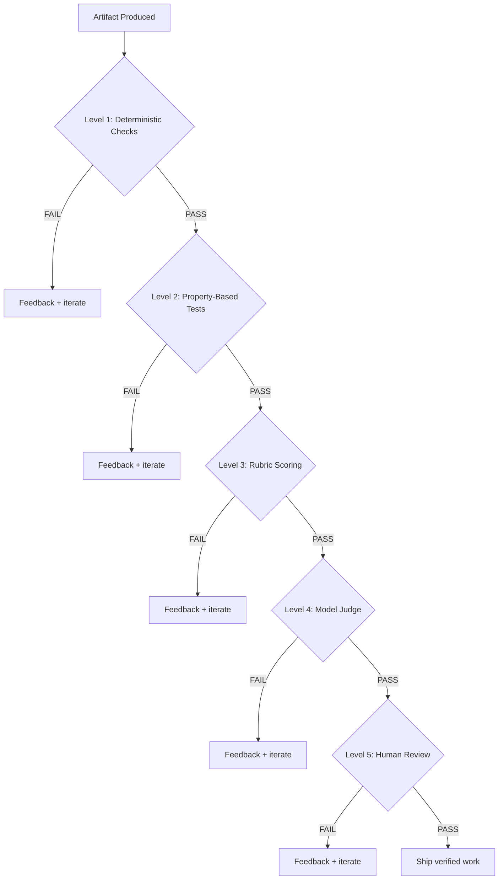
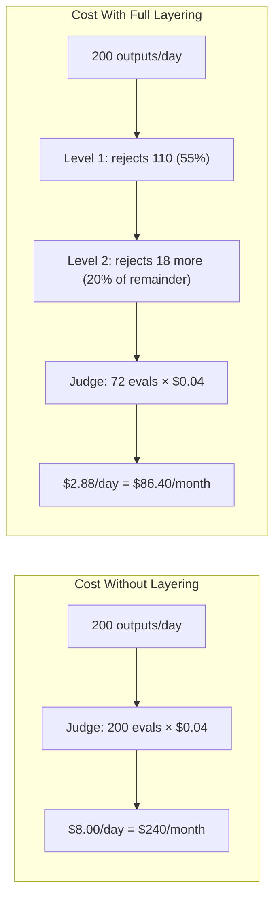

# Chapter 20: The Hierarchy of Oracles

> **Reading note.** The opening case and its numerical outcomes are illustrative, not a documented production incident. Code and LoopKit names are illustrative API sketches or pseudocode, not a tested published SDK. Inherited source pointers are identified separately from checked evidence; numerical examples are assumptions, not current provider quotations.

> "The oracle is not a post-hoc check. It is the loop's steering wheel."

## The \$14,000 Regression

Priya Anand ran platform engineering at a mid-size fintech called Ledger Systems. Her team had deployed a coding loop six weeks earlier to handle routine dependency upgrades across forty-two microservices. The loop followed a straightforward pattern: read the changelog for the new library version, bump the dependency, run the test suite, open a pull request if green. The oracle was simple and seemingly sufficient — the CI pipeline had to pass. Green build, merge. Red build, retry with a different approach, up to five attempts per scheduled run.

For six weeks, this worked. Priya's team tracked pass rate (89 percent) and average attempts-to-pass (1.7) and felt confident. Then the invoice arrived from their model provider: \$14,200 for the month, against a budget of \$3,800. She pulled the telemetry and found the problem immediately. Fourteen of the forty-two services had flaky integration tests — tests that passed or failed depending on network timing, database state, or container readiness. When a flaky test failed, the loop could not distinguish "your dependency upgrade broke something real" from "this test is unreliable today." So it treated every failure as actionable signal and retried. One service, the payment gateway, consumed eleven iterations across repeated scheduled runs before a flaky test happened to pass — not because the loop fixed anything, but because the test's random behaviour finally landed on green.

The command had genuinely returned a failing status, but that did not establish a candidate defect. As a defect detector it could produce false alarms caused by its environment. But its ability to discriminate between "broken by the change" and "broken by the environment" was nonexistent. The loop had no way to identify which failures were meaningful, so it treated all of them as evidence that more iteration would help. The result was a loop that burned three and a half times its budget retrying problems that did not exist while simultaneously passing real regressions that happened to coexist with flaky successes.

Priya's team needed three days to fix the immediate problem. They separated environment errors from candidate failures and added bounded diagnostic reruns. Stable unit and type checks ran first, while required integration evidence remained unresolved until the flaky suites were repaired or an authorised reviewer accepted a documented alternative. Quarantining a test changes coverage; it must not silently turn a required failure into a release pass.

The deeper lesson took longer to absorb. An oracle that cannot discriminate is not merely useless — it is actively harmful, because it gives the loop false confidence that iteration will help. The loop iterates, burns budget, and either succeeds by luck (teaching it nothing) or fails by exhaustion (wasting everything). The design problem is not "does the oracle eventually give the right answer" but rather "does the oracle's signal reliably correlate with the actions the loop can take to improve?"

This chapter formalises the choices Priya's team faced. Every loop needs an oracle. The question is which oracle, at what cost, with what precision and recall characteristics, arranged in what order, and monitored by what meta-process.

## The Five Levels

The oracle hierarchy arranges verification strategies from cheapest and most mechanical to most expensive and most judgment-dependent. The five levels are an editorial taxonomy, not five statistically ordered strengths. Rubric scoring is an instrument that either a model or human may apply; it is not inherently a separate evaluator:

**Level 1: Deterministic Checks.** Programs evaluating specified properties in a recorded environment; their result is only as valid as their implementation, inputs, and coverage.

**Level 2: Property-Based Tests.** Invariant assertions checked across generated input distributions.

**Level 3: Rubric Scoring.** Structured evaluation instruments decomposing quality into scored dimensions.

**Level 4: Model Judge.** A separate language model evaluating the artifact in its own context.

**Level 5: Human Review.** A domain expert evaluating the artifact.

The governing rule: **use the cheapest oracle that still discriminates.** "Discriminates" means the oracle reliably separates good output from bad output for the specific quality dimension under consideration. If a cheaper oracle cannot make that distinction for your quality requirement, you must escalate. If it can, spending more money on a higher-level oracle adds cost without improving outcomes.



Not every loop uses all five levels. Most production loops use two or three in combination. The diagram illustrates the gating principle: cheap oracles run first and reject early, so expensive oracles only evaluate work that has already cleared the mechanical bar. A loop that correctly rejects 70 percent of outputs at Level 1 saves 70 percent of the cost of Level 4 evaluation. This arithmetic, worked in detail later in this chapter, is the economic justification for layering. The five levels are not a progression that every output traverses; they are a menu from which you select the minimum sufficient configuration for your task.

## Level 1: Deterministic Checks

A deterministic check is a program that accepts an artifact and produces a result for specified properties without model inference; ambiguity may remain about test validity and environment. Test suites, type checkers, linters, JSON schema validators, compilation, regular-expression format checks, file-existence assertions — anything expressible as "run this command; exit code zero means pass."

The useful characteristic is reproducible rule application, not perfect truth. A type checker may model a library incorrectly; a test may assert an outdated requirement; a command may fail because a fixture is unavailable. Preserve the distinction between a violated assertion, an execution error, and a defect in the candidate. A passing suite also cannot establish properties it never checked.

The cost profile is negligible relative to model inference. Running a typical test suite takes two to thirty seconds of CPU time and zero dollars in model costs. You can invoke dozens of deterministic checks per iteration — type checker, linter, formatter, schema validator, test suite — without measurably affecting loop economics. If your loop's generation step costs \$0.05 in model tokens, your Level 1 oracle adds perhaps \$0.001 in compute.

But precision is only half the story. Recall — the fraction of actual defects the oracle catches — is bounded by what you thought to encode. A suite with 85 percent branch coverage leaves 15 percent of measured branches uncovered; this is not a count of execution paths or a percentage of possible defects. More importantly, it misses entire categories of quality that tests cannot express: is the code idiomatic? Is the algorithm efficient? Is the approach architecturally sound? Does the documentation accurately reflect the implementation?

This gap between what deterministic checks verify and what "correct" actually means is the design space where higher-level oracles operate. The practical implication: deterministic checks are necessary but rarely sufficient. They form the floor of your verification strategy, not the ceiling.

Deterministic checks fail — that is, become unsuitable as an oracle — under three conditions. First, when the check is itself non-deterministic (Priya's flaky tests). A check that sometimes passes and sometimes fails for identical input provides no reliable learning signal — the loop cannot distinguish "my change broke something" from "the check is unreliable today," and rational behaviour under that uncertainty is to retry blindly, which burns budget without learning. Second, when the quality dimension you care about cannot be formalised as a property (no test can verify "readable code," no linter can assess "appropriate algorithm choice"). Third, when writing sufficient deterministic checks is more expensive than the verification they provide — which happens when you are working in a domain with no existing test infrastructure and the cost of building that infrastructure exceeds the cost of model-judge evaluation for your expected volume.

## Level 2: Property-Based Tests

Property-based tests occupy the space between specific test cases and formal proofs. Instead of asserting that `sort([3,1,2])` equals `[1,2,3]`, a property test asserts that for all lists `xs`, the output of `sort(xs)` is non-decreasing and preserves the input's elements as a multiset. The testing framework — Hypothesis in Python, fast-check in TypeScript, QuickCheck in Haskell — generates hundreds of random inputs and checks the invariant against each.

The mechanism is automated exploration of the input space through constrained random generation. You define the property (what must always be true); the framework finds counterexamples (inputs that violate it). When a counterexample is found, the framework minimises it — shrinking the input to the simplest case that still triggers the violation — providing a clean, debuggable failure.

Cost is low but meaningful. A property test running 200 examples takes five to thirty seconds depending on the complexity of the operation under test. For a loop iterating five times, property testing adds twenty-five to one hundred fifty seconds of wall-clock time. This can be comparable to or greater than model inference, but enough that you should not run property tests on every quality dimension for every iteration when they are not discriminating.

A reproducible counterexample provides specific evidence. A counterexample is a concrete input with a concrete output that concretely violates the stated property. A reproducible counterexample demonstrates failure of the encoded property under that fixture. The property, generator, and fixture can still be wrong, and passing a bounded generated sample is not a universal proof. Coverage can complement hand-written specific tests because random generation explores edge cases systematically: empty inputs, single-element inputs, inputs with duplicates, inputs near boundary values, inputs with special characters. Teams adopting property-based testing routinely report finding bug classes that their hand-written suites missed entirely — off-by-one errors, unexpected interactions between parameters, and violations of invariants that hold for "typical" inputs but break at extremes.

Property tests fail when you cannot express your correctness criterion as a universal quantifier. "For all X, property P holds" is a powerful frame, but many quality dimensions resist it. "The documentation is accurate" is not a checkable property across random inputs. "The refactored code is more readable" cannot be automatically evaluated. When quality requires judgment — evaluation of meaning, clarity, appropriateness, or aesthetic — property tests cannot help, and you must escalate.

## Level 3: Rubric Scoring

A rubric decomposes quality into named dimensions, defines concrete levels within each dimension, and produces a numeric score. Rubrics bridge the gap between mechanical verification and pure judgment. They do not eliminate subjectivity — an evaluator must still score each dimension — but they channel subjectivity through a consistent framework that makes judgments auditable, comparable across evaluators, reproducible over time, and trainable through calibration. The rubric is the structure that makes model-based evaluation (Level 4) possible — without a rubric, asking a model "is this good?" produces unreliable, inconsistent verdicts driven by the model's implicit quality preferences rather than your explicit requirements.

The mechanism works as follows. You define three to seven dimensions relevant to the task at hand — perhaps accuracy, completeness, actionability, and style conformance for a documentation task. For each dimension, you describe what a score of 1, 3, and 5 looks like using concrete, observable criteria. "A score of 5 on accuracy means every claim is verifiable against a cited primary source." "A score of 1 on accuracy means the text contains factual assertions that contradict the source material." An evaluator reads the artifact, scores each dimension by matching observable properties to the level descriptions, and the weighted total determines the verdict.

The critical design variable is the specificity of the level descriptions. A rubric that says "5 = excellent, 3 = average, 1 = poor" is useless — it repackages the question "is this good?" into the question "what score should this get?" without adding structure. A rubric that says "5 = all public functions documented with params, returns, raises, and one usage example; 3 = all public functions documented with params and returns; 1 = fewer than 80 percent of public functions documented" is evaluable because you can count.

Precision depends on rubric quality. Concrete level descriptions make agreement measurable, but no general 70–85 percent reliability range is established here. Measure agreement and adjudicated error rates in the target domain; vague rubrics can obscure both. This means rubric design is not a one-time activity; it is an iterative engineering task where you pilot the rubric, measure inter-rater agreement, revise the level descriptions for dimensions with low agreement, and repeat.

Recall is bounded by the dimensions you chose to include. A rubric measuring accuracy, completeness, and style will miss security vulnerabilities, performance problems, and architectural concerns. You get what you measure, and only what you measure. The design challenge is selecting dimensions that cover the quality aspects your loop's goal requires. Under-specification here creates gaps that reward hacking exploits (Chapter 23, *Reward Hacking, Drift, and Self-Deception*).

Rubrics fail when the task produces outputs so variable in structure that no single rubric meaningfully applies to all of them, or when the dimensions interact in ways the rubric cannot capture. A rubric for "code quality" might score highly on readability, efficiency, and correctness separately while missing that the code achieves these properties through an overly clever abstraction that will be unmaintainable in six months. The gestalt quality of "is this a good engineering decision" resists decomposition into independent dimensions. This is the inherent limitation of rubric-based evaluation and the reason Level 4 and 5 oracles exist.

The practical implication for loop design: invest disproportionate effort in rubric construction. A twenty-minute rubric with vague level descriptions will produce inconsistent evaluations that confuse the loop — it cannot learn from feedback when the same output receives a 3 on one iteration and a 5 on the next due to rubric ambiguity. A two-hour rubric with concrete, example-grounded level descriptions produces consistent evaluations that enable rapid convergence. The rubric is infrastructure; treat its design with the same rigour you would apply to API design or database schema design.

## Level 4: Model Judge

A model judge is a separate language model instance that evaluates the maker's output in its own context window. The judge receives the artifact, the goal, and evaluation criteria — but critically not the maker's reasoning, planning, or conversation history. This independence is an architectural requirement explored in depth in Chapter 21 (*Maker-Checker: The Grader Must Not Share the Maker's Context*).

The mechanism is a structured evaluation prompt: present the artifact and criteria, demand per-criterion verdicts with evidence, parse the response into a structured evaluation. The judge's flexibility is its defining advantage — a model can evaluate virtually any quality dimension you can describe in natural language, from "does this code handle all edge cases?" to "is this explanation clear to a junior engineer?" to "does this architecture respect the principle of least privilege?"

Cost scales with artifact length and model selection. Evaluating a 2,000-token code artifact with a small, fast model costs roughly \$0.002 to \$0.005 per evaluation as of early 2026 at list price [ILLUSTRATIVE ASSUMPTION — not a measured result]. Evaluation with a frontier model costs roughly \$0.04 to \$0.08 per call. In a five-iteration loop, the cheap judge adds \$0.01 to \$0.025 total; the expensive judge adds \$0.20 to \$0.40. This cost difference is why model cascades matter — using the cheap model as a first-pass judge and the expensive model only for ambiguous cases.

Precision is variable, and this variability is the core engineering challenge. A model judge's precision — the probability that a PASS verdict corresponds to genuinely acceptable output — ranges from roughly 70 to 95 percent depending on task clarity, rubric specificity, model capability, and independence from the maker [ILLUSTRATIVE ASSUMPTION — not a measured result]. These inherited broad percentage ranges are not a validated operating estimate. Both model and deterministic checks can pass defective artifacts; estimate false acceptance against an independent reference on the target distribution. The model judge trades precision for coverage — it can evaluate dimensions that no test can reach, at the cost of sometimes being wrong.

Model judges have characteristic failure modes. They exhibit leniency bias — rating well-written, confident-sounding output higher than halting, uncertain output even when the uncertain output is more correct. They anchor on examples — if shown a high-scoring example before evaluation, they rate subsequent outputs higher. They are format-biased — structured, well-organised output scores higher regardless of content accuracy. They miss specific factual errors while correctly evaluating overall quality. Understanding these failure modes is essential for calibrating your expectations and your passing threshold. If an independent audit finds defects in 10 percent of accepted outputs, that is an observed 10 percent defect fraction among accepted outputs for that sample. A 10 percent miss rate among defective inputs is a different quantity. Whether this is acceptable depends entirely on the cost of those defects downstream.

## Level 5: Human Review

A qualified human evaluates the artifact. Qualified human review is an important reference for judgment-laden questions, but disagreement, limited context, and human error remain possible; it is not infallible ground truth. Its cost, availability, and review capacity can make it unsuitable as a per-output gate for some high-volume tasks. It costs \$10 to \$200 per evaluation depending on the reviewer's expertise and the artifact's complexity [ILLUSTRATIVE ASSUMPTION — not a measured result]. It takes minutes to hours. It blocks the loop until the reviewer is available. It does not scale — you cannot parallelise beyond the number of available qualified reviewers.

The value of human review lies in capabilities no automated oracle possesses. A human can evaluate "is this the right approach given our team's architectural philosophy?" A human can judge "will our customers understand this error message?" A human can identify "this code works but violates an unwritten convention that will confuse the next developer." These are questions of organisational context, aesthetic judgment, and shared understanding that resist formalisation into rubrics or test cases.

Human review fails through inconsistency and fatigue. Two qualified reviewers evaluate the same artifact differently 15 to 30 percent of the time on judgment-laden questions [ILLUSTRATIVE ASSUMPTION — not a measured result]. A single reviewer's standards drift during a long session — the first artifact gets more scrutiny than the twentieth. And human review creates a throughput bottleneck: if your loop can produce ten outputs per hour but your reviewer can evaluate three, the loop runs at reviewer speed, not model speed.

Human review can serve calibration or a required pre-action gate, depending on risk, policy, and the need for accountable judgment. Use Level 5 to validate your automated oracles: sample outputs periodically, have a human evaluate them, compare the human verdict with the Level 4 model judge's verdict. When they diverge systematically (judge passes things the human fails, or vice versa), adjust the automated oracle — fix the rubric, change the passing threshold, add a dimension. This keeps humans in the loop without making them the bottleneck, and it means human review cost is amortised across many loop executions rather than paid per output.

## The Precision-Recall Design Tension

Define the positive class before calculating precision or recall. In defect detection, let positive mean "defective." A true positive is a defective artifact rejected by the oracle; a false positive is an acceptable artifact incorrectly rejected; a false negative is a defective artifact accepted; and a true negative is an acceptable artifact accepted.

| Metric | Definition | Operational question |
|---|---|---|
| Defect precision | TP / (TP + FP) | Of flagged artifacts, how many were actually defective? |
| Defect recall | TP / (TP + FN) | Of defective artifacts, how many did the oracle reject? |
| False-reject rate | FP / (FP + TN) | How often was acceptable work rejected? |
| False-accept rate among defects | FN / (TP + FN) | How often did a defect escape? |
| Defect fraction among accepted outputs | FN / (FN + TN) | How much accepted work was actually defective? |

The last two denominators differ. A judge missing ten percent of defects does not imply ten percent of all accepted outputs are defective. The prevalence of defects matters. Likewise, agreement between two judges is not accuracy unless a defensible reference adjudicates which judge is right.

For example, suppose 1,000 artifacts contain 100 known defects. An oracle rejects 90 defects and 45 acceptable artifacts. Then TP=90, FN=10, FP=45, and TN=855. Defect recall is 90%; defect precision is 90/135, about 66.7%; the false-reject rate is 5%; and the defect fraction among accepted outputs is 10/865, about 1.16%. Report counts as well as percentages so the result can be recomputed.

Expected-loss calculations must use the same units. With defect prevalence p, defect miss probability m, false-reject probability f among acceptable artifacts, defect consequence C_d, and retry cost C_r, a simple per-input loss model is `p*m*C_d + (1-p)*f*C_r`. Add evaluation cost and the cost of delayed or blocked valid work. This model does not capture every tail risk, but it avoids confusing a conditional error rate with an unconditional per-output loss.

Choose thresholds before evaluating a held-out set, and show uncertainty. A security-critical system may reasonably tolerate additional false rejections to reduce escaped defects, but a judge that rejects everything has perfect defect recall and no delivery value. Measure both outcomes. Some harms demand a hard veto or human decision rather than being traded against a higher average quality score.

## Layered Oracles: The Cost Arithmetic

The layered approach — cheap checks first, expensive oracles only for survivors — produces quantifiable savings. Consider a concrete scenario: a loop processing 200 outputs per day.

**Without layering:** Every output goes directly to a Level 4 model judge at \$0.04 per evaluation [ILLUSTRATIVE ASSUMPTION — not a measured result]. Daily cost: \$8. Monthly: \$240.

**With deterministic gating:** A type checker and test suite (Level 1) reject 55 percent of outputs before the judge runs — outputs with type errors, test failures, or format violations that the judge would also reject but more expensively [ILLUSTRATIVE ASSUMPTION — not a measured result]. The judge evaluates only the 90 outputs that survive. Daily judge cost: \$3.60. Monthly: \$108. Savings: \$132/month (55 percent reduction).

**With property tests added:** Outputs surviving Level 1 face property-based invariant checks (Level 2) that reject an additional 20 percent — edge cases the specific tests missed but universal properties catch. The judge now evaluates 72 outputs. Daily judge cost: \$2.88. At thirty days per month, judge cost is $86.40 and savings are $153.60 (64%). These savings exclude the compute and maintenance cost of the earlier gates.



For the assumed constant workload and rejection rates, ten loops save $1,536 per thirty-day month in judge calls before earlier-gate costs. At one hundred loops, that is $15,360. Real scaling can change both rejection rates and infrastructure expense.

The arithmetic also applies to latency. A model judge takes 3 to 15 seconds per call. Rejecting an output at Level 1 (200 milliseconds for a type check) means the loop can begin its next iteration 3 to 15 seconds sooner. Over five iterations, that is 15 to 75 seconds saved — meaningful when tight feedback loops improve convergence.

## The Meta-Problem: Who Verifies the Oracle?

Every oracle is a system that can be wrong. Tests can have bugs. Rubrics can be poorly designed. Model judges can be systematically miscalibrated. The question "who checks the checker?" admits no infinite-regress answer. You cannot have an oracle that verifies the oracle that verifies the oracle.

Instead, you use three practical strategies that together provide confidence without requiring certainty.

First, **calibration through sampling**. Periodically select outputs that your oracle marked PASS and submit them to a higher-authority evaluator — a human expert, or a more capable model with a more comprehensive rubric. Measure the agreement rate. If the sample contains only oracle-accepted outputs and an adjudicated human reference rejects 12 percent, the observed defect fraction among that accepted sample is 12 percent. On a mixed sample, 88 percent agreement alone does not reveal the false-pass rate. Whether that rate is acceptable depends on the downstream cost of those false passes reaching users. Track this rate over time; if it drifts upward, the oracle is degrading (possibly because the model's outputs are becoming more sophisticated at satisfying the oracle's criteria without satisfying the human's — the reward-hacking dynamic explored in Chapter 23).

Second, **adversarial probing**. Deliberately submit outputs with known injected defects and verify that the oracle catches them. This is the oracle equivalent of mutation testing: intentionally break the artifact in ways that should trigger a FAIL, and measure detection rate. If you can consistently slip known-bad outputs past your oracle, the oracle has a recall gap that the loop will eventually find and exploit. Adversarial probes should cover each quality dimension the oracle claims to evaluate — if the rubric has five dimensions, your probes should include artifacts that fail on each individual dimension while passing the others.

Third, **oracle evolution**. Treat the oracle as a living system. When you discover outputs that passed the oracle but were actually defective (through calibration sampling, user reports, or downstream failures), add the failure mode as a new check. Convert the miss into either a new deterministic check (if the failure is mechanical and encodable) or a new rubric dimension (if the failure is judgment-based). The added check may improve coverage, but interactions, dataset drift, and false rejections can still degrade performance. Re-evaluate old and new cases together. In practice, this means maintaining a log of oracle misses — every output that passed but should not have — and addressing each miss by strengthening the oracle. This log is also the seed for your regression suite (Chapter 22, *Evals as Loop Infrastructure*).

The three strategies compose into a feedback loop for the feedback loop — a meta-loop that improves oracle quality over time, just as the oracle improves maker quality within a single execution. Calibration detects that a disagreement exists (pass rate according to oracle diverges from pass rate according to human audit). Adversarial probing identifies which quality dimensions the oracle under-covers. Oracle evolution closes the gap by adding checks for the discovered blind spots. Then the next calibration cycle verifies whether the fix worked. Teams should check whether agreement and defect detection improve after each cycle, rather than presume monotonic gains — when their changes genuinely close the measured gaps; no fixed improvement trajectory is established here.

## The `loopkit/oracles.py` Module

This module illustrates an oracle protocol used conceptually in later chapters; the book does not supply a validated interoperable SDK. The types are minimal — they describe the interface contract, not the implementation details.

```python

# loopkit/oracles.py
from __future__ import annotations

from dataclasses import dataclass
from enum import StrEnum
from typing import Protocol

from loopkit.contract import Goal

class Verdict(StrEnum):
    PASS = "pass"
    FAIL = "fail"
    INCONCLUSIVE = "inconclusive"

@dataclass(frozen=True)
class Evaluation:
    verdict: Verdict
    score: float | None          # normalised 0.0-1.0 when the oracle is graded
    feedback: str                # actionable; empty string is a defect
    cost_usd: float
    oracle_name: str

class Oracle(Protocol):
    name: str

    def evaluate(self, artifact: str, goal: Goal) -> Evaluation: ...

@dataclass(frozen=True)
class LayeredOracle:
    """Run oracles cheapest-first; short-circuit on first FAIL."""

    layers: tuple[Oracle, ...]

    def evaluate(self, artifact: str, goal: Goal) -> Evaluation:
        cumulative_cost = 0.0
        last_result: Evaluation | None = None
        unresolved: list[str] = []

        for oracle in self.layers:
            result = oracle.evaluate(artifact, goal)
            cumulative_cost += result.cost_usd
            last_result = result

            if result.verdict == Verdict.FAIL:
                return Evaluation(
                    verdict=Verdict.FAIL,
                    score=result.score,
                    feedback=result.feedback,
                    cost_usd=cumulative_cost,
                    oracle_name=f"layered/{result.oracle_name}",
                )
            if result.verdict == Verdict.INCONCLUSIVE:
                unresolved.append(result.oracle_name)
                continue  # Later layers cannot silently waive this requirement.

        # No evidence is not success. Any required unknown remains unknown.
        if not self.layers or unresolved:
            return Evaluation(
                verdict=Verdict.INCONCLUSIVE,
                score=None,
                feedback="Required checks missing or inconclusive: "
                         + ", ".join(unresolved or ["no layers configured"]),
                cost_usd=cumulative_cost,
                oracle_name="layered",
            )
        return Evaluation(
            verdict=Verdict.PASS,
            score=None,  # Different oracle scores need not share a scale.
            feedback="All configured required layers passed this artifact.",
            cost_usd=cumulative_cost,
            oracle_name="layered",
        )
```

The `LayeredOracle` encodes the gating principle: iterate through layers cheapest-first, return immediately on FAIL with the failing oracle's feedback, retain required INCONCLUSIVE results, and report PASS only when every configured required layer passes. If a higher-level oracle is allowed to resolve a lower-level uncertainty, model that as an explicit same-requirement resolution policy rather than assuming any later PASS erases it. The cumulative cost tracking ensures the `Evaluation.cost_usd` field reflects total verification cost, not just the last layer's cost. Downstream code — the runner (Chapter 3, *Anatomy of a Loop*), the checker (Chapter 21), the eval harness (Chapter 22) — imports these types directly.

## What Breaks

The hierarchy assumes that oracle levels form a clean escalation path — that you can reliably determine which level is "sufficient" for a given quality dimension. In practice, this determination is itself a judgment call that you may get wrong. A team that decides "our test suite is sufficient" stops before the model judge, and ships defects that the model judge would have caught. A team that insists on human review for everything ships nothing because the review queue grows faster than reviewers can drain it.

Oracle costs and behaviour can change. Track actual provider pricing, model version information, and workload rather than assuming a fixed quarterly change schedule. A judge evaluation that costs \$0.04 today may cost \$0.01 in six months (making layering less necessary) or \$0.08 (making layering essential). Model capability also shifts: a model that reliably identifies security issues today may miss them after a provider update, without any external signal that precision has degraded. The only defence is continuous calibration — at a cadence matched to change frequency and risk.

The most dangerous failure mode is oracle stasis. Once a team deploys a working oracle configuration, they tend to stop evolving it. The oracle freezes while the loop improves. Eventually the loop's outputs become sophisticated enough to satisfy the frozen oracle without satisfying users — not through malicious gaming but through natural capability growth outpacing oracle growth. The oracle that was discriminating six months ago is now a rubber stamp, and no alert fires because the pass rate looks the same. Only user complaints, downstream metrics, or periodic calibration reveals the degradation.

## Implementation Guidance: Test the Oracle's Failure Semantics

The most dangerous oracle bug is a false pass caused by missing evidence. An empty layer list, a timed-out command, an unparseable judge response, or a skipped test suite must not fall through to success. Give each check an explicit requirement ID, expected input revision, and allowed result states. Keep execution errors distinct from an assertion failure: the former asks for infrastructure diagnosis, while the latter may justify changing the candidate.

Layering is not voting. A schema validator and a security review assess different properties, so two passes cannot outvote a failed security requirement. Record required and advisory checks before the run. Advisory observations can accompany a complete result without blocking it; required checks stay blocking until passed or explicitly waived by the appropriate authority. The waiver itself is a decision record, not a fabricated successful check.

### Recovery Case: Green Unit Tests, Missing Database

A dependency upgrade passes unit tests, but its integration suite cannot connect to the disposable database. The controller first checks the fixture health without changing application code. If a bounded fixture repair succeeds, rerun the integration check against the same candidate. If not, report unit-test evidence and blocked integration coverage. Do not ask the maker to "fix" the application until some evidence links the failure to its change, and do not silently demote the integration requirement to keep throughput high.

### Exercise Acceptance Checks

For `LayeredOracle`, test no layers, all PASS, first FAIL, later FAIL, all INCONCLUSIVE, and INCONCLUSIVE followed by PASS. Only the all-required-PASS configuration should pass under the shown policy. Simulate command timeout and malformed judge output through the adapter and verify they become explicit unresolved evidence, not empty success. Bind each test receipt to the candidate and checker configuration. For calibration, include accepted and rejected examples and build the complete confusion matrix; a sample of only accepted artifacts can estimate accepted-output defect fraction but not overall recall. When comparing costs, include the time and infrastructure used by cheap gates and any retries their false rejections cause.

## Key Takeaways

- The oracle hierarchy has five levels: Level 1 Deterministic Checks, Level 2 Property-Based Tests, Level 3 Rubric Scoring, Level 4 Model Judge, Level 5 Human Review.
- The governing rule: use the cheapest oracle that still discriminates good output from bad for the relevant quality dimension.
- Define the positive class and denominators. For defect detection, precision concerns flagged defects and recall concerns all reference defects; accepted-output defect fraction is a different metric.
- Layered oracles can reduce expensive evaluations. The worked example yields a specific saving under assumed rejection rates, not a typical production guarantee.
- Choose verification effort from defect consequence and evidence value. High-stakes verification may justifiably cost more than generation.
- The meta-problem of oracle validity is addressed through calibration sampling, adversarial probing, and continuous oracle evolution — not through infinite regress.
- Every oracle produces an `Evaluation` carrying a verdict, optional normalised score, actionable feedback, dollar cost, and oracle identity.

## The Loop Contract, So Far

This chapter filled the **oracle** field of the Loop Contract. You now know how to select, layer, and calibrate the verification strategy that the loop uses to determine whether its output meets the goal. Combined with goal specification (Chapter 15, *Goal Specification*), two of the five fields are defined: the loop knows what to achieve and how to verify whether it achieved it. Chapter 21 addresses the critical architectural constraint that makes the oracle trustworthy: the checker must not share the maker's context.

## Exercises

1. **Oracle audit (analysis).** Take a loop you operate or a CI pipeline you maintain. List every verification step and classify each as Level 1 through Level 5. Identify the single largest recall gap — what class of defects could slip past all current checks undetected? Propose a specific oracle addition that would close the gap.

2. **Layering cost model (estimation).** For a loop running 80 iterations per day with a Level 4 judge at \$0.05/eval, calculate the monthly judge cost. Then estimate what fraction of outputs a Level 1 gate (type checker + linter + basic tests) would reject before the judge. What is the new monthly cost? At what daily volume does the engineering time to build the Level 1 gate pay for itself within one month?

3. **Build a `LayeredOracle` (build).** Implement the `LayeredOracle` from this chapter with two concrete oracle implementations: a deterministic one that runs a shell command and returns PASS/FAIL based on exit code, and a model-based one that evaluates a three-dimension rubric via API call. Demonstrate short-circuit behaviour — show via logging that the model oracle is never invoked when the deterministic oracle fails.

4. **Calibration experiment (build + analysis).** Collect 20 outputs from a generation system. Have your Level 4 judge evaluate all 20. Then evaluate the same 20 yourself against the same rubric. Compute agreement rate and classify disagreements as judge-too-lenient (false pass) or judge-too-strict (false fail). Compute the false-pass rate and propose a threshold adjustment.

5. **Adversarial oracle probe (build).** Craft three deliberately defective artifacts that target specific rubric dimensions — one with a factual error, one with a completeness gap, one with an actionability failure. Submit all three to your oracle. Report which pass and propose oracle improvements to catch each escape.

## Sources and Evidence Limits

- [Anthropic Engineering, Demystifying evals for AI agents](https://www.anthropic.com/engineering/demystifying-evals-for-ai-agents) — grader calibration, unknown outcomes, and harness-defect diagnosis.

Primary-source passages were reviewed in the shared editorial source packet dated 2026-10-07; the citations support only the bounded distinctions stated above. Opening cases, thresholds, cost examples, and code sketches are teaching material, not independently verified production measurements. The inherited “New in Claude Managed Agents” pointer could not be confirmed during source review and is not used as evidence.

------------------------------------------------------------------------

*Next: Chapter 21 examines why the oracle's independence from the maker is an architectural requirement, not a prompting trick — and what happens when the grader shares the maker's context window.*

[Previous: Chapter 19](chapter-19.md) · [Next: Chapter 21](chapter-21.md)
