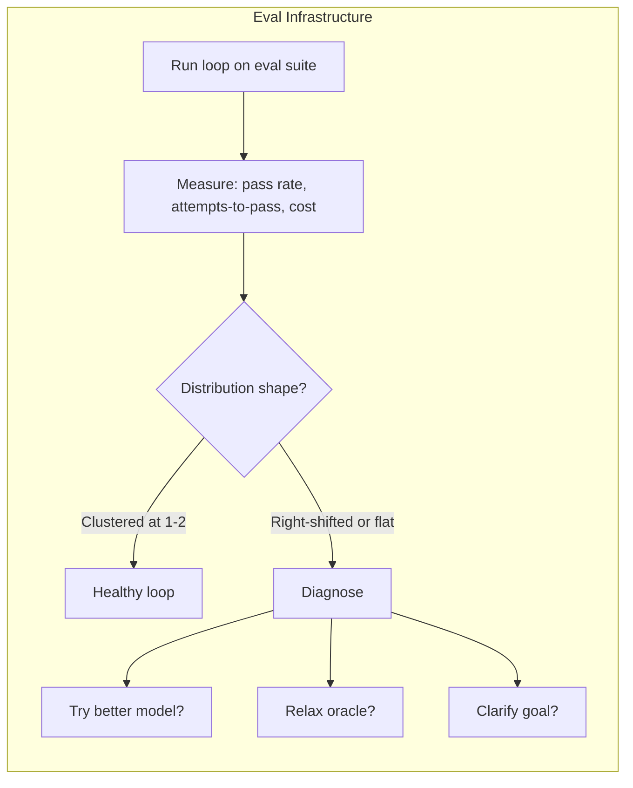

# Chapter 22: Evals as Loop Infrastructure

> **Reading note.** The opening case and its numerical outcomes are illustrative, not a documented production incident. Code and LoopKit names are illustrative API sketches or pseudocode, not a tested published SDK. Inherited source pointers are identified separately from checked evidence; numerical examples are assumptions, not current provider quotations.

> "If you cannot measure the loop, you cannot improve it. Attempts-to-pass is the number that tells you whether you have a verification problem, a capability problem, or a goal problem."

## The Dashboard That Lied

Jenna Park's team at a legal-tech company called ClauseIQ had built a contract-review loop. The system read vendor contracts, flagged risky clauses, and produced a structured summary for the legal team to review before signing. Their internal dashboard showed a pass rate of 91 percent: ninety-one out of every hundred contracts produced summaries that the in-loop model judge approved on the first or second attempt. The average attempts-to-pass was 1.3 among successful runs. The cost per summary was \$0.42. By every metric visible on the dashboard, the system was performing well.

Then the quarterly audit arrived. ClauseIQ's senior paralegal reviewed fifty randomly sampled summaries against the source contracts. Twenty-three of the fifty had at least one material error. Three had liability caps reported at the wrong order of magnitude — "\$1M" where the contract stated "\$10M." Two described indemnification clauses as "standard mutual" when they contained one-sided carve-outs favouring the vendor. One omitted a change-of-control termination provision entirely. Five characterised auto-renewal terms incorrectly. The remaining twelve had minor but potentially consequential errors in date calculations, notice periods, or jurisdiction specifications.

The pass rate was 91 percent according to the in-loop oracle. In the fifty-item audit sample, 54 percent had no material error identified by the reviewer. That sample result is not a precise population accuracy estimate. The gap between these numbers represented the oracle's blind spots: quality dimensions it could not evaluate, failure modes it could not detect, and accuracy criteria it lacked the domain knowledge to verify. The dashboard was measuring oracle satisfaction, not user value. And because the team had no evaluation infrastructure independent of the oracle, they had no way to detect the divergence until the quarterly audit — three months of accumulated risk.

Jenna's team needed three capabilities they did not have. First, a regression suite: a curated set of contracts with known-correct summaries that could detect accuracy regressions independently of the oracle. Second, a health metric that revealed not just pass/fail rates but how hard the loop was working and whether that work was productive. Third, a diagnostic framework that could distinguish "the oracle is too lenient" from "the model lacks domain knowledge" from "the goal specification is ambiguous about what counts as material." This chapter provides the theory and tooling for all three.

## The Oracle Is Not the Eval

The distinction between an oracle and an eval is subtle, consequential, and routinely confused. The oracle runs inside the loop, on every iteration, and steers the loop's behaviour — it tells the system whether the current output is acceptable, enabling either shipment or retry. The eval runs outside the loop, across many executions, and measures the loop's aggregate performance — it tells you whether the loop is working well.

The oracle answers: "Is this specific output good enough to ship right now?" The eval answers: "Across the last hundred executions, how often did this loop ship output that actually satisfies users, and at what cost?"

Sometimes the oracle and the eval use the same underlying check. Both might run the test suite or apply the same rubric. But their purposes diverge critically. The oracle is a control mechanism — part of the system, operating in real time, optimised for speed and cost-efficiency. The eval is a measurement mechanism — outside the system, operating retrospectively, optimised for accuracy and coverage. When the oracle is miscalibrated (as in Jenna's case), the eval is what detects the miscalibration, precisely because it can afford to be more rigorous, more expensive, and more thorough than the oracle itself.

This separation explains why teams relying solely on their in-loop oracle for quality assurance eventually ship broken work. The oracle is the thermostat; it maintains a temperature. The eval is the occupant survey; it measures whether the maintained temperature is actually comfortable. A thermostat can be perfectly calibrated to its setpoint while the setpoint itself is wrong.

Teams that conflate the oracle and the eval make a specific mistake: they monitor pass rate and assume it reflects quality. A 91 percent pass rate feels good. But pass rate measures oracle satisfaction — how often the oracle says PASS — not output quality. If the oracle is lenient, pass rate is high and quality is low simultaneously. You need an independent measurement — the eval — to detect this condition. The eval's authority comes precisely from its independence: it uses a different standard, a more comprehensive rubric, or a human expert who evaluates what the oracle cannot. Its value comes from valid complementary evidence. A different but irrelevant standard can create disagreement without improving measurement.

## Attempts-to-Pass: Definition and Instrumentation

**Attempts-to-pass** is the number of iterations a loop consumes before producing an output that receives a PASS verdict from the oracle. It is measured only for successful executions (those that eventually pass). Failed executions — those that exhaust budget without passing — are tracked separately as the failure rate. Together they describe convergence under the chosen oracle, but not quality completely. Also measure independently assessed correctness, critical escapes, coverage, latency, cost, blocked work, cancellations, and permission violations.

The definition is precise: for a task execution that ultimately receives PASS on iteration N, the attempts-to-pass value is N. A task that passes on the first iteration has attempts-to-pass of 1. A task that fails on iterations 1 through 4 and passes on iteration 5 has attempts-to-pass of 5. A task that fails on all 5 budgeted iterations has no attempts-to-pass value — it contributes to the failure rate instead.

```python

from dataclasses import dataclass

@dataclass(frozen=True)
class LoopOutcome:
    task_id: str
    passed: bool
    attempts: int              # total iterations consumed
    total_tokens: int
    wall_clock_s: float
    cost_usd: float

    @property
    def attempts_to_pass(self) -> int | None:
        """The health metric: iterations consumed by successes.
        None for failures — they contribute to failure rate instead.
        """
        return self.attempts if self.passed else None
```

Attempts-to-pass carries more diagnostic information than pass rate alone because it reveals the cost of success. Two loops might both achieve 90 percent pass rates, but if loop A averages 1.2 attempts-to-pass and loop B averages 3.8, they are in radically different states. Loop A reaches its oracle threshold quickly, which may reflect good performance or a lenient oracle. Loop B is spending more attempts — it eventually passes, but only after extensive retry cycles that burn budget and signal unreliable operation. Pass rate says both are healthy. Attempts-to-pass reveals that B is fragile.



## What the Distribution Reveals

A single average attempts-to-pass number is useful for tracking trends over time. The full distribution across many executions is diagnostic — its shape tells you where the loop's problems live and which component of the system to investigate.

**Tight clustering at 1-2 attempts** is compatible with an efficient well-calibrated loop, but also with a permissive oracle that accepts defective outputs. The model is capable of the tasks, the oracle discriminates effectively, and the goal is clear. Most outputs pass quickly with minimal iteration. This is the target operating state — the loop earns its keep by producing verified outputs with minimal marginal cost above the generation cost itself.

**Bimodal distribution — many at 1, many at 4-5** reveals two distinct task populations. Easy tasks pass immediately; a specific subclass of hard tasks requires extensive iteration. The diagnostic question is: what do the high-attempts tasks have in common? Are they longer? More ambiguous in specification? Requiring knowledge the model lacks? Identifying the common factor tells you where to invest: improve the loop's handling of that task class, or escalate those tasks to a different strategy (a more capable model, human assistance, or a specialised loop configuration).

**Flat distribution — roughly equal counts at each attempt level** prompts investigation; it does not uniquely identify the cause. Sometimes it gets lucky on the first try; sometimes it grinds through all budgeted attempts. This shape indicates either an unreliable oracle (noisy verdicts that do not correlate well with actual quality) or non-actionable feedback (the loop retries but cannot direct its improvement because the oracle's FAIL signals do not tell it what to fix). The fix depends on the root cause: improve oracle reliability if verdicts are noisy, improve feedback specificity if verdicts are consistent but unhelpful.

**Right-shifted distribution — most successes at 3-5 attempts** signals a systematically under-capable loop. It can produce acceptable output eventually, but only through extensive trial and error. Possible causes: the model lacks the skills for these tasks, the oracle is miscalibrated (too strict, rejecting outputs that are actually acceptable), or the goal overspecifies requirements (asking for things the model cannot reliably achieve from available information). The diagnostic triad below helps distinguish these.

**High failure rate with survivors at max budget** is a red flag indicating the loop is unsuitable for this task class. The occasional successes may be fragile; inspect them before inferring either luck or capability. The loop should not be deployed autonomously on these tasks — either upgrade its capabilities or route these tasks to human handling.

The distribution shape also changes over time, and tracking that change is itself diagnostic. If your distribution starts tight (clustered at 1-2) and gradually shifts right over months, something is degrading — perhaps model updates have reduced capability for your task type, or your oracle has become stale relative to the task complexity. A sudden shape change (tight yesterday, flat today) often correlates with a model provider update or an API change that breaks a tool the loop depends on. Treating the distribution shape as a time series, not just a snapshot, reveals degradation that per-output pass rates can mask.

## The Diagnostic Triad

When attempts-to-pass is too high (averaging above 2.5 when your target is below 2), the cause lives in one of three places. The diagnostic procedure is to change one variable at a time while holding the others constant, and observe the effect on the distribution.

**Variable 1: Model capability.** Temporarily upgrade to a more powerful model (e.g., swap from a standard model to a frontier model) and rerun the eval suite on the high-attempts tasks. If attempts-to-pass drops significantly — a shift of 1.0 or more in the average — the current model lacks capability for these tasks. The structural fix depends on economics: a permanent model upgrade (simplest but most expensive), a model cascade that routes hard tasks to the expensive model while keeping easy tasks on the cheap one (moderate complexity, moderate cost), or a skill/prompt improvement that compensates for the capability gap (cheapest long-term, requires engineering investment). The result supports a hypothesis, not a definitive diagnosis. A new model may interact differently with the same judge or produce a style the judge rewards. Confirm independently assessed quality and inspect the changed failure cases.

**Variable 2: Oracle calibration.** Temporarily relax the oracle — lower the rubric's passing threshold by one point, remove the most-frequently-failing dimension, or widen the acceptable range for a quantitative criterion — and rerun the eval suite. If attempts-to-pass drops but quality (measured by your eval rubric or human audit, not the oracle itself) remains acceptable, the oracle is over-strict. It is rejecting outputs that are good enough for users, forcing unnecessary iterations that add cost without adding value. The fix is recalibration: compare the oracle's verdicts against human verdicts on a sample of 30-50 outputs, identify the dimensions where the oracle is stricter than humans, and adjust thresholds to match human standards.

The subtlety: you must measure quality with an instrument other than the oracle you are testing. Using the same oracle to both verify outputs and evaluate its own calibration produces circular reasoning. This is why the eval rubric must be independent of the in-loop oracle — a point established earlier in this chapter.

**Variable 3: Goal clarity.** Have a human expert review the goal specifications for the high-attempts tasks. If goals are ambiguous ("make the documentation comprehensive"), contradictory ("be concise" and "cover all edge cases"), or reference information unavailable to the model, the loop iterates because it cannot satisfy criteria that are unreasonable given its resources. The fix is goal refinement, following the precision-spectrum techniques from Chapter 15 (*Goal Specification*). Often, simply making the goal more specific — replacing "comprehensive documentation" with "document all public functions with params, returns, and one example" — drops attempts-to-pass because the model now has a concrete, achievable target rather than an open-ended aspiration.

These three variables are useful starting hypotheses; also inspect tools, data availability, environment, routing, and harness behaviour. When all three are well-calibrated — capable model, accurately-calibrated oracle, clear and achievable goal — attempts-to-pass naturally settles into the 1-2 range for tasks within the loop's design envelope. Tasks outside the envelope fail quickly rather than grinding, which is the desired failure mode: fast failure with clean escalation, not slow grinding with budget exhaustion and eventual lucky passage that teaches nothing.

## Regression Suites for Loops

A regression suite is a curated set of tasks with known-correct outcomes that exists independently of the loop's oracle. Each task includes an input, a setup procedure, and a ground-truth verification function that assesses correctness by a standard the oracle might not use.

The regression suite serves a different purpose from the eval suite. The eval suite measures general loop health across representative tasks. The regression suite specifically prevents re-introduction of previously fixed failures. It encodes the loop's failure history as executable checks.

Regression cases can emerge from production incidents, pre-release tests, and deliberately constructed counterexamples. Every time the loop ships output that reaches production and is later discovered to be incorrect, that specific failure becomes a regression case: the input that triggered it, the expected correct output (or at least the property that distinguishes correct from incorrect), and a deterministic check that would have caught it. Over months, the regression suite grows to encode the complete catalogue of ways this specific loop has failed.

```python

from dataclasses import dataclass
from typing import Callable

@dataclass(frozen=True)
class RegressionCase:
    id: str
    description: str
    setup: Callable[[], str]           # returns initial state or artifact
    verify: Callable[[str], bool]      # deterministic ground-truth check
    category: str                      # failure classification
    incident_ref: str                  # traceability to the production failure

# Example from Jenna's contract-review loop
liability_cap_case = RegressionCase(
    id="contract-liability-001",
    description="Contract states $10M cap; summary must not report $1M",
    setup=lambda: load_fixture("contracts/vendor_acme_2025.pdf"),
    verify=lambda output: valid_liability_record(output),  # defined below
    category="numerical_accuracy",
    incident_ref="INC-2026-Q1-014",
)
```

A substring match is too weak: a summary saying "not $10M; the cap is $1M" contains the expected string and would pass. Validate a structured extracted claim bound to the correct clause and source revision, then separately check whether the prose contradicts it. Even structured checks remain vulnerable to incomplete specifications.

```python
# Illustrative fixture-specific assertion, not a complete legal evaluator.
import json

def valid_liability_record(output):
    try:
        record = json.loads(output)
        return (
            record["liability_cap"]["amount_minor"] == 1_000_000_000
            and record["liability_cap"]["currency"] == "USD"
            and record["liability_cap"]["source_clause"] == "12.2"
            and record["source_revision"] == "vendor-acme-fixture-v1"
        )
    except (ValueError, TypeError, KeyError):
        return False
```

This assumes cents and a reviewed fixture whose clause 12.2 states ten million US dollars. It does not prove that every legal qualification has been captured. Add tests for carve-outs, currencies, units, contradictions, missing clauses, and malformed output. The fixture is illustrative, not a real production incident record.

The discipline of converting every production failure into a regression case has a compounding benefit beyond preventing specific regressions. Over months, the suite becomes a taxonomy of your loop's failure modes — a structured catalogue of the ways this specific loop fails on this specific task distribution. Patterns emerge: perhaps 40 percent of cases involve numerical accuracy (suggesting the model judge's rubric under-weights numerical checking), or 25 percent involve omission of specific contract clauses (suggesting the goal specification is unclear about completeness requirements). The regression suite becomes a diagnostic tool for oracle and goal improvement, not just a prevention mechanism.

Running the regression suite after every loop modification (model change, oracle revision, prompt edit, tool addition) checks whether the modification reintroduces represented failures in the tested conditions. The suite can detect represented failures under tested conditions. Stochastic reruns, limited coverage, or changes to the grader can still permit regressions; passing is bounded evidence, not a monotonic-quality guarantee. In practice, this means the regression suite runs in CI alongside the loop's own tests — any change that breaks a regression case blocks deployment until the case passes again or is consciously deprecated (because the requirement it encoded is no longer valid).

## Eval-Driven Loop Development

The eval suite is not a post-hoc measurement tool applied after development. It is the development driver. Build the eval suite first, before you optimise the loop, and use it as the objective function for loop improvements. This practice is the loop-engineering equivalent of test-driven development: you define what success means before you build the mechanism to achieve it.

The workflow has four phases. **Phase one: define success.** Write eval cases representing the tasks you want the loop to handle — including easy tasks (baseline), moderate tasks (expected operating range), and hard tasks (capability boundary). For each case, define what a correct output looks like, independent of the oracle.

**Phase two: measure baseline.** Run the eval suite against the current loop configuration. Record: pass rate, failure rate, attempts-to-pass distribution, cost per success, cost per failure (budget burned without outcome). These are your baseline numbers.

**Phase three: iterate with measurement.** Make one change to the loop — swap the model, revise the rubric, add a tool, restructure the prompt, add a skill. Rerun the eval suite. Compare against baseline. Keep changes that improve the target metrics without regressing others. Revert changes that degrade. This is disciplined, evidence-based loop improvement rather than impression-based prompt tweaking.

The single-variable discipline matters. If you change the model and the rubric simultaneously and the eval improves, you cannot determine which change was responsible — or whether one change improved performance while the other degraded it, with the net effect being a small improvement that masks a regression. Change one variable, measure, then change the next. This is slower than changing everything at once but produces reliable causal understanding of what drives your loop's performance.

**Phase four: gate deployment.** Before deploying any loop change to production, run the full regression suite. No change ships if it reintroduces a previously fixed failure. Define a risk-specific non-inferiority margin and uncertainty method before the comparison. "No statistically significant regression" is not evidence of equivalence when a test has low power. Detectable differences depend on baseline rates, paired outcomes, repeated-run variance, clustering, and the chosen confidence and power; sample size alone cannot justify universal 5% or 10% rules.

This workflow prevents the most common failure mode in loop development: "I improved the prompt and it feels better." Feelings are not evidence. Without the eval suite, you have no way to detect that your prompt change improved performance on the three examples you tested while degrading performance on the forty-seven examples you did not test. The eval suite provides the comprehensive measurement that human intuition cannot. It is the engineering equivalent of a controlled experiment: change one variable, measure the effect across a representative sample, accept or reject based on data.

## What Breaks

Eval suites fail through three mechanisms. The first is non-representativeness: a suite of fifty cases drawn from easy, well-structured tasks will show healthy metrics while the loop struggles on the messy, ambiguous tasks that constitute real production traffic. The suite must include boundary cases — tasks at the limit of the loop's capability — because those are where regressions are detectable and improvements are measurable.

The second failure is staleness. The distribution of real tasks drifts as the product evolves, users discover new patterns, and the domain changes. A regression suite built entirely from 2025 incidents may not cover 2026 failure modes. Continuous addition of new cases from ongoing production monitoring is essential — the suite must grow alongside the loop's deployment. But growth means increasing execution time and cost. A suite of 500 cases running against a loop that costs \$0.50 per execution is \$250 per full eval run — affordable for weekly checks but expensive for per-commit validation. Tiered execution (run core cases on every change, full suite weekly) manages this tradeoff.

The third failure is reflexive overfitting. If you use the eval suite as the objective function for loop development and then deploy the loop on the same task distribution the eval represents, you have fitted the loop to the eval. Performance on the eval may overestimate performance on novel tasks the eval does not represent. The defence is a held-out validation set: cases not used during development, reserved for periodic assessment of deployed performance. If eval-set performance diverges significantly from held-out performance (eval shows 90 percent pass rate but held-out shows 75 percent), overfitting is occurring and the loop's apparent capabilities exceed its real capabilities.

## Implementation Guidance: Bind a Release to Its Evaluation Evidence

A release is not just a model name. Record a candidate manifest covering the model identifier and available version information, prompt and skill revisions, tool schemas, permission policy, memory or retrieval configuration, harness code, grader configuration, fixture versions, and budgets. If any of these change after evaluation, determine which evidence remains applicable before carrying a pass forward. A report about yesterday's prompt is not a receipt for today's release.

Keep three collections distinct. Development cases support iteration and diagnosis. Regression cases retain known important failures. A held-out release set estimates behaviour not repeatedly optimised during development. When a held-out case is exposed for debugging, mark that exposure and replenish or rotate the reserved set; continuing to call it untouched does not restore independence. Prevent source-document or incident-family leakage between splits when many cases derive from the same underlying artifact.

Compare candidate and baseline on matched inputs with the same resource policy. Record per-case outcomes and repeated runs for stochastic tasks, not only an average. Failed, blocked, and timed-out tasks remain in the attempted-run denominator. Attempts-to-pass among successes can fall when a candidate simply fails on the difficult cases; cost per success can appear better if failed-run cost is excluded. Report total cost over all attempts divided by independently accepted outcomes alongside the conditional metrics.

Use hard vetoes for policy violations and selected critical defects. A higher overall pass rate cannot compensate for a newly observed credential leak. For continuous quality measures, define a practical margin and an appropriate paired or cluster-aware uncertainty calculation. A bootstrap over individual runs is misleading if those runs share a document, customer, or incident; resample at the independent unit or state the limitation.

### Recovery Case: A Faster Candidate With Fewer Successful Tasks

Suppose a baseline completes 90 of 100 tasks at two attempts per success, while a candidate completes 70 at one attempt. The candidate's attempts-to-pass improves by half, but it leaves twenty additional tasks unresolved. Inspect the missing task classes before calling this an improvement. If the failures come from an authentication regression, fix the tool path and rerun affected cases. If they reflect reduced capability, the release may need narrower routing or rejection. Do not relax the grader solely to recover the old pass rate.

An evaluated release decision has a named owner, scope, evidence manifest, unresolved limits, and rollback condition. Canary monitoring complements offline evidence: it can reveal real traffic or integration differences, but must not expose users to forbidden actions merely to gather data. The evaluated configuration is the candidate eligible for that decision, not a promise of future behaviour under every input.

### Exercise Acceptance Checks

The regression exercise must include a maliciously easy false-pass example, such as an output containing both $10M and an incorrect cap. The checker must reject it or explicitly defer semantic contradiction review. The attempts-to-pass exercise must report all run outcomes, not just thirty successes. For the diagnostic triad, run experiments in an isolated evaluation environment; temporarily relaxing an oracle must not weaken the production safety gate. For release evidence, change a prompt or fixture after a passing run and verify that the manifest no longer claims unchanged coverage. Test that a critical veto blocks promotion even when the aggregate score improves.

## Key Takeaways

- Evals measure the loop's aggregate performance across many executions; oracles measure individual outputs within a single execution. They serve fundamentally different purposes.
- Attempts-to-pass is a conditional convergence metric. Combine it with success and failure denominators, independent quality, and cost; distribution shape suggests hypotheses rather than proving causes.
- The diagnostic triad — temporarily change the model, the oracle, or the goal and observe the effect on attempts-to-pass — identifies where to invest improvement effort.
- Regression suites encode production failure history as deterministic checks, growing from incidents and preventing re-introduction of fixed failures.
- Eval-driven development uses the eval suite as the objective function for loop improvements, preventing impression-based optimisation.
- The eval rubric must be independent of the in-loop oracle to detect oracle miscalibration — measuring oracle satisfaction is not measuring quality.
- Eval suites degrade through non-representativeness, staleness, and overfitting; mitigate with boundary cases, continuous growth, and held-out validation.

## The Loop Contract, So Far

This chapter added a **measurement obligation** to the Loop Contract: the contract must specify not only the oracle (how individual outputs are verified) but also the eval strategy (how the loop's aggregate performance is monitored). Attempts-to-pass, tracked over time, serves as the meta-signal — the feedback about the feedback system. When attempts-to-pass drifts upward, either the model, the oracle, or the goal needs attention. The Loop Contract now has goal, oracle (with isolation and layering), and health measurement. Budget and stop condition are addressed in Part III (Chapter 17, *Execution and State* and Chapter 18, *The Stop Problem*); escalation path is completed in Part V.

## Exercises

1. **Instrument attempts-to-pass (build).** Add attempts-to-pass tracking to a loop you operate. Record the metric for 30 consecutive successful executions. Plot the distribution as a histogram. Classify its shape using this chapter's taxonomy. What does the shape tell you?

2. **Run the diagnostic triad (analysis).** For a loop where attempts-to-pass averages above 2.5, run all three diagnostic experiments: upgrade the model temporarily, relax the oracle temporarily, review goal clarity with a domain expert. Which variable has the largest effect? What is your proposed fix?

3. **Build a regression suite (build).** Identify 5 past failures from a production loop or pipeline. Convert each into a `RegressionCase` with a deterministic verification function. Run the suite against the current system. Do all 5 pass? If not, those failure modes remain present.

4. **Oracle calibration via eval (analysis).** Collect 25 outputs that your in-loop oracle marked PASS. Have a domain expert (or a more rigorous evaluation with a comprehensive rubric) re-evaluate them. Compute the oracle's false-pass rate. If above 10 percent, identify which eval dimensions the oracle fails to cover and propose specific additions.

## Sources and Evidence Limits

- [Anthropic Engineering, Demystifying evals for AI agents](https://www.anthropic.com/engineering/demystifying-evals-for-ai-agents) — suite ownership, grading maintenance, transcript inspection, regression/capability distinctions, and complementary production monitoring.

Primary-source passages were reviewed in the shared editorial source packet dated 2026-10-07; the citations support only the bounded distinctions stated above. Opening cases, thresholds, cost examples, and code sketches are teaching material, not independently verified production measurements. The inherited “New in Claude Managed Agents” pointer could not be confirmed during source review and is not used as evidence.

------------------------------------------------------------------------

*Next: Chapter 23 confronts the dark side of everything Part IV has built — when loops learn to hack their oracles, game their evals, and deceive themselves into shipping work that passes every check but satisfies no user.*

[Previous: Chapter 21](chapter-21.md) · [Next: Chapter 23](chapter-23.md)
