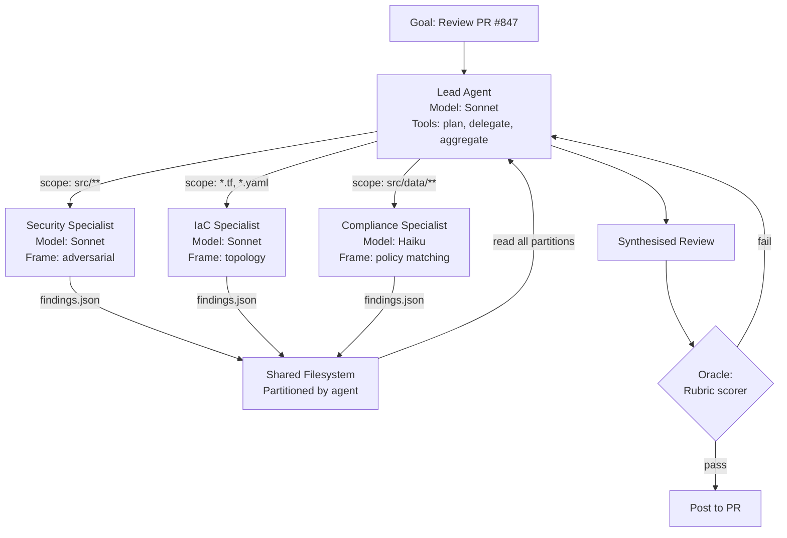
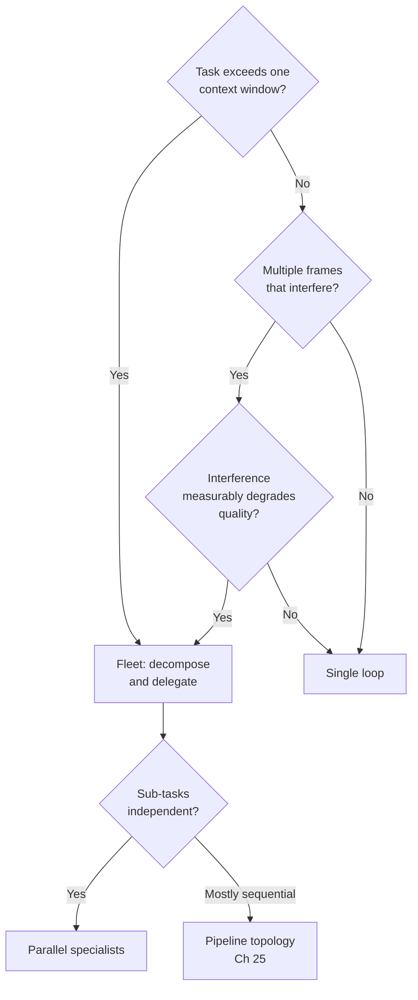

# Chapter 24: From Loop to Fleet

> **Reading note.** The opening case and its numerical outcomes are illustrative, not a documented production incident. Code and LoopKit names are illustrative API sketches or pseudocode, not a tested published SDK. Inherited source pointers are identified separately from checked evidence; numerical examples are assumptions, not current provider quotations.

> A second agent should buy a specific benefit: independent evidence, focused context, or useful parallel work. Coordination cost is real.

## The Context Contamination Problem

Priya Chandrasekaran leads the platform security team at a mid-size fintech company processing half a million transactions daily. Her team built a single-agent loop that reviews pull requests for security vulnerabilities — injection attacks, path traversal, hardcoded secrets, broken authentication patterns. For three months it worked well. The oracle is a rubric scorer that grades each finding for relevance and severity on a five-point scale. Pass rate holds steady at 88%. Cost per verified outcome is \$1.14. The engineering team trusts the reviews and has stopped treating them as noise.

Then the compliance team asks Priya to extend the loop. They need it to check infrastructure-as-code changes against their cloud security policy (23 rules), validate that new API endpoints have proper authentication middleware wired in (not just defined — actually called in the route handler chain), and verify that data-handling code complies with their 90-day retention policy. Reasonable asks. Priya adds the capabilities: loads the policy documents into the system prompt (18,000 tokens), expands the tool set to include Terraform plan analysis and middleware graph traversal, and adds new rubric dimensions to the oracle.

The loop collapses within a week. Pass rate drops to 41%. The agent conflates security findings with compliance findings, reporting "policy violation" when it means "injection risk" and vice versa. When reviewing a Terraform change that adds a new S3 bucket, the agent forgets the code-level authentication finding it made two iterations earlier — the one that actually matters more. It spends three full iterations re-reading `src/middleware/auth.ts` because the file appeared on page four of a 140,000-token context window and the model lost track of its own earlier analysis. Each run now costs \$4.80 — four times the original — and the output is qualitatively worse.

Priya's instinct is to add parallelism: run the reviews faster by processing files concurrently. That instinct is wrong. The problem is not speed. The problem is that a single context window is holding four distinct analytical frames simultaneously — adversarial security thinking, bureaucratic policy matching, infrastructure topology reasoning, and middleware graph analysis — and the model cannot maintain sharp focus across all of them at once. The security reviewer needs to think "how would an attacker exploit this?" The compliance reviewer needs to think "does this match page 14 of the policy document?" These are different cognitive stances that interfere when held simultaneously.

The fix is not a faster loop. It is multiple loops, each operating in a context window that contains only what that particular analytical frame requires. Context isolation and parallelism are separate possible justifications for multi-agent systems. Which matters more depends on the task and measured bottleneck; neither should be assumed from the number of agents. The fresh context is the product. Understanding this distinction correctly determines whether a fleet architecture improves quality (isolating competing frames) or merely adds complexity (splitting work that a single loop could handle fine). The fleet earns its coordination overhead only when isolation produces measurably better output than a single loop could achieve — and for Priya's case, where four competing analytical frames degraded pass rate from 88% to 41%, the case is overwhelming.

## Context Isolation: The Core Argument

Most teams reach for multi-agent architectures because they want speed. "If we run five specialists in parallel, we get results five times faster." This reasoning is not wrong — parallelism is a genuine benefit — but it misidentifies the primary value of decomposition. One possible product is improved context focus: each specialist reasons in a context window that contains only what it needs, free from the contaminating presence of unrelated material.

Chapter 21 (*Maker-Checker: The Grader Must Not Share the Maker's Context*) established a specific instance of this broader principle. When a checker operates in the maker's context, it evaluates the maker's intent rather than the maker's actual output. The model fills gaps with what it remembers meaning to do, producing systematically generous evaluations. The inherited numerical attribution did not establish a controlled isolation experiment. Treat context separation as a design hypothesis and compare source-grounded checker accuracy on the same tasks before claiming its benefit.

The same principle generalises to any division of analytical labour. Irrelevant material can impair performance, but the effect depends on the task, model, input ordering, and retrieval strategy; there is no established proportional law here. Three mechanisms drive this degradation, each independently sufficient to justify decomposition.

First, attention dilution. The "lost in the middle" phenomenon documented in Chapter 7 (*Context Engineering I*) demonstrates that models attend less to information positioned in the middle of long contexts than to information at the beginning or end. In Priya's 140,000-token context, the compliance policy documents — loaded after the diff but before tool results — occupy this attention dead zone. The model does not ignore them entirely, but it under-weights them relative to their importance for compliance checking. A specialist with a smaller relevant packet may perform better, but smaller context does not guarantee attention to every requirement. Check coverage explicitly.

Second, frame contamination. A security reviewer thinks adversarially: every function is a potential attack surface, every input is untrusted until proven otherwise, every permission check might be bypassable. A compliance reviewer thinks bureaucratically: does this data handling match the written policy, are the retention rules implemented as specified, do the access logs satisfy the audit requirements. These frames are not merely different — they actively interfere. An agent attempting adversarial analysis while simultaneously checking compliance tends to produce a muddled average: neither sharp adversarial insights nor precise policy mapping. It flags "potential security issue — may violate retention policy" without committing to either analytical frame deeply enough to produce actionable findings.

Third, context re-reading waste. When the single agent shifts from reviewing authentication middleware to reviewing Terraform configuration, it must mentally "page fault" — re-reading its own earlier authentication findings to avoid contradictions, re-reading the relevant policy sections to confirm which rules apply to infrastructure, and re-reading the tool schemas to recall which tools work for IaC analysis. Each domain switch costs tokens without producing new analysis. In a four-domain loop, the agent may spend 25-30% of its total token budget on re-reading material it has already processed [ILLUSTRATIVE ASSUMPTION — not a measured result].

The costs compound. Attention dilution reduces quality. Frame contamination reduces analytical depth. Re-reading waste increases cost. These mechanisms motivate testing a decomposition; they do not prove that four specialists outperform a well-designed single loop. The fleet is not merely faster — it is better, because each specialist's cognitive environment is optimised for its task rather than compromised by the presence of three other tasks' material.

The solution is decomposition into separate agents, each with its own model, system prompt, tool set, and context window. The lead agent holds the strategic view — which reviews need to happen, which specialists should handle them, and how to synthesise results. Each specialist holds only its domain context and reasons within that narrow scope at high quality. The specialist's smaller context can support a focused analytical frame and reduce re-reading overhead, while shared dependencies and coordination still impose costs.

## The Fleet Architecture

A fleet is a coordinated collection of loops in which a lead agent delegates work to specialist agents that operate in isolated contexts. The following design uses four useful properties. They are architecture choices, not a verified description of a vendor product:

A lead agent decomposes a job and delegates to specialists, each with its own model, prompt, and tools. The lead limits unnecessary detail, but must inspect enough source evidence and combined behaviour to accept the integrated result responsibly. The temptation is for the lead to "help" by doing preliminary analysis before delegating, or to perform detailed review of specialist outputs during aggregation. Both patterns contaminate the lead's context with detailed material that belongs in a specialist, recreating at the lead level the same cognitive overload that motivated the fleet. The lead routes specialist depth, yet may need to trace a disputed finding or integration failure. Delegation does not remove the lead's responsibility to distinguish completed evidence from an unsupported specialist assertion.

The lead needs enough domain understanding to route work, enough analytic depth to resolve material conflicts, and the ability to integrate results without inventing unsupported connections. These requirements determine model selection for the lead: the lead needs reliability and breadth more than depth, which is why production implementations often use faster, cheaper models for the lead while reserving expensive, capable models for the specialists that need deep reasoning within their domains.

Specialists work in parallel on a shared filesystem. Each specialist writes its structured findings to a designated location. Parallelism can reduce wall-clock time when independent work dominates, subject to shared rate limits, resource contention, and the critical path, but — as this chapter has argued — the more important benefit is that each specialist operates in its own context window, immune to contamination from other specialists' domain material. A security specialist's context contains only security-relevant code, the adversarial analysis prompt, and the security tool set. It does not contain the compliance policy documents, the infrastructure topology information, or the other specialists' partially-complete findings. This isolation is what enables the specialist to maintain a sharp, focused analytical frame for its entire execution.

Events are persistent, so the lead can check back mid-workflow and every agent remembers what it has done. The event log provides a complete history of the fleet's execution: which specialists have started, which have completed, what findings they have produced, and whether any specialist has encountered an issue requiring lead intervention. If a specialist discovers that its assigned scope has a dependency on another specialist's scope (the authentication code calls a cryptography utility function that belongs to the infrastructure specialist's domain), it posts this observation to the event log rather than expanding its own scope. The lead reads these cross-scope observations during aggregation and ensures they are addressed — either by the other specialist or by the lead's synthesis.

Reading the raw event log requires careful provenance: the presence of a `done` event is a worker assertion until the coordinator accepts its evidence. The event history should preserve rejections and superseded generations rather than rewriting them as successful work. Traceability at the fleet level means knowing not just what each specialist did, but in what order events occurred, how the lead's decisions were influenced by specialist outputs, and where delays or failures occurred in the coordination flow. Without fleet-level traceability, debugging a multi-agent system is guesswork: the lead produced an incorrect synthesis, but was the error in the lead's reasoning, or in the specialist's output that the lead relied upon? Traceability preserves useful observations and causal identifiers, but missing logs or ambiguous model decisions can still limit diagnosis.

The four properties together — delegated specialists, parallel execution on shared filesystem, persistent events, and full traceability — distinguish a fleet from ad hoc multi-agent scripts where agents fire-and-forget without coordination infrastructure. The infrastructure cost of implementing these properties is non-trivial (Chapter 29 addresses the telemetry implementation in detail), but it is the difference between a debuggable, observable production system and a non-reproducible sequence of model calls whose failures are undiagnosable.



## Model-Tiered Fleets: Illustrative Designs

Model tier should follow measured task needs, not organisational rank. A low-latency coordinator may be sufficient when routing is simple and schemas make completion explicit. A more capable coordinator may be necessary when integration requires difficult cross-domain reasoning. A small per-decision error rate can compound across many routing decisions, so a cheaper model is not automatically economical.

Consider three illustrative designs. In a writing workflow, a coordinator assigns independent drafts and an editor checks the selected draft against user-approved requirements. In build-log analysis, workers inspect independent batches while a lead checks proposed cross-batch patterns against the actual logs. In legal drafting, research, citation validation, and prose assembly have real dependencies; some stages must wait for accepted evidence rather than run as if independent.

The inherited manuscript attributed detailed architectures and performance figures to Spiral, Netflix, and Harvey through an unconfirmed vendor announcement. This edition removes those production attributions. The designs here explain possible trade-offs, not facts about those organisations. Likewise, a reported improvement from memory consolidation would not establish an improvement caused by fleet coordination; the treatment and outcome must match the claim.

Use a matched comparison to choose model tiers. Record routing errors, unsupported synthesis claims, independently assessed artifact quality, wall-clock duration, and total cost including unsuccessful workers. A coordinator saving pennies on tokens but misrouting a critical review may cost more overall. Conversely, a deterministic router may replace a model entirely when the dispatch rule is explicit.

## The loopkit Fleet Module

The fleet module defines the core abstractions for multi-agent coordination, consistent with the loopkit architecture established in Chapter 3. The types here are referenced throughout Chapters 24-25 and extended in Chapter 29 for tracing.

```python

from __future__ import annotations

import asyncio
import json
import logging
import time
import uuid
from dataclasses import dataclass, field
from pathlib import Path
from typing import Any, Protocol

from loopkit.contract import Budget, EscalationPolicy, Goal, LoopContract
# open_agent_session is an injected illustrative runtime adapter, not
# chapter 21's isolated_context message-construction helper.

logger = logging.getLogger(__name__)

class AgentProtocol(Protocol):
    """Any agent that can execute a scoped task and return structured results."""

    name: str
    model: str

    async def execute(self, task: str, context: dict[str, Any]) -> dict[str, Any]: ...

@dataclass
class Specialist:
    """A specialist agent with its own model, prompt, tools, and scope."""

    name: str
    model: str
    system_prompt: str
    tools: tuple[str, ...]
    scope: tuple[str, ...] = ()

    async def execute(self, task: str, context: dict[str, Any]) -> dict[str, Any]:
        """Execute the task in an isolated context window."""
        async with open_agent_session(self.model, self.system_prompt, self.tools) as ctx:
            return await ctx.run(task, context)

@dataclass
class EventLog:
    """Append-only persistent event log for fleet coordination."""

    path: Path

    def append(self, agent_name: str, event_type: str, data: dict[str, Any]) -> None:
        entry = {
            "ts": time.time(),
            "id": uuid.uuid4().hex[:12],
            "agent": agent_name,
            "type": event_type,
            "data": data,
        }
        with self.path.open("a") as f:
            f.write(json.dumps(entry) + "\n")

    def read_since(self, timestamp: float) -> list[dict[str, Any]]:
        if not self.path.exists():
            return []
        return [
            json.loads(line)
            for line in self.path.read_text().splitlines()
            if json.loads(line)["ts"] > timestamp
        ]

@dataclass
class Blackboard:
    """Partitioned shared filesystem for specialist outputs."""

    root: Path

    def write(self, agent_name: str, key: str, data: dict[str, Any]) -> Path:
        agent_dir = self.root / agent_name
        agent_dir.mkdir(parents=True, exist_ok=True)
        out_path = agent_dir / f"{key}.json"
        out_path.write_text(json.dumps(data, indent=2))
        return out_path

    def read_all(self) -> dict[str, list[dict[str, Any]]]:
        results: dict[str, list[dict[str, Any]]] = {}
        for agent_dir in sorted(self.root.iterdir()):
            if agent_dir.is_dir():
                results[agent_dir.name] = [
                    json.loads(f.read_text())
                    for f in sorted(agent_dir.glob("*.json"))
                ]
        return results

@dataclass
class Lead:
    """The lead agent: decomposes goals, delegates to specialists, synthesises."""

    name: str
    model: str
    specialists: list[Specialist]
    blackboard: Blackboard
    event_log: EventLog
    contract: LoopContract

    async def run(self, goal: Goal) -> dict[str, Any]:
        self.event_log.append(self.name, "fleet.started", {"goal": goal.statement})
        tasks = await self._decompose(goal)
        self.event_log.append(self.name, "fleet.decomposed", {"n": len(tasks)})

        if len(tasks) != len(self.specialists):
            raise ValueError("Every task needs an explicit assignment; zip must not truncate")
        results = await asyncio.gather(
            *[self._delegate(s, t) for s, t in zip(self.specialists, tasks)],
            return_exceptions=True,
        )
        successes = [r for r in results if not isinstance(r, Exception)]
        failures = [r for r in results if isinstance(r, Exception)]
        if failures:
            self.event_log.append(
                self.name, "fleet.partial_failure", {"failed": len(failures)}
            )

        synthesis = await self._synthesise(successes)
        status = "partial" if failures else "requires_integration_acceptance"
        self.event_log.append(self.name, "fleet.finished", {"status": status})
        return {"status": status, "synthesis": synthesis,
                "failed_required_tasks": len(failures)}

    async def _delegate(self, specialist: Specialist, task: str) -> dict[str, Any]:
        self.event_log.append(self.name, "delegated", {"to": specialist.name})
        result = await specialist.execute(task, {"goal": self.contract.goal.statement})
        self.blackboard.write(specialist.name, "result", result)
        return result

    async def _decompose(self, goal: Goal) -> list[str]:
        raise NotImplementedError  # illustrative adapter omitted, not a runnable SDK

    async def _synthesise(self, results: list[dict[str, Any]]) -> dict[str, Any]:
        raise NotImplementedError  # illustrative adapter omitted, not a runnable SDK
```

## When a Fleet Is Strictly Worse

Not every problem benefits from decomposition. Fleets carry three categories of overhead that a single loop avoids entirely, and teams must weigh these costs honestly before choosing the multi-agent path. The temptation to fleet is strong — multi-agent systems feel more sophisticated, more scalable, more aligned with how human teams work. But sophistication without justification is cost without benefit.

Coordination overhead compounds with fleet size. Every delegation requires the lead to formulate a task description that is self-contained enough for the specialist to act without further clarification. This formulation costs tokens at the lead's model rate. The lead must also read and synthesise each specialist's output — more tokens. For a fleet of five specialists with a single round of communication, the coordination tax is roughly ten extra inference calls: five delegation prompts (averaging 2,000 tokens each) and five result readings (averaging 4,000 tokens each). Total coordination cost: approximately 30,000 tokens at the lead's rate [ILLUSTRATIVE ASSUMPTION — not a measured result]. If the underlying task could have been handled by a single agent in three iterations totalling 50,000 tokens, the fleet is both more complex and more expensive for no quality gain. The break-even point is the context-window ceiling: if the task requires more context than fits in one window, the fleet's coordination overhead is the price of access to that context. Even a task that fits in one window may benefit from a distinct independent check or useful parallelism. Decide from evidence rather than token count alone.

Error amplification across handoffs is the second structural risk. Each handoff between lead and specialist is an information bottleneck. The lead must encode enough context in the delegation prompt for the specialist to act correctly, but not so much that the specialist's own context becomes polluted with irrelevant detail. This encoding is lossy. Under-specification produces specialists that solve the wrong problem: a security specialist told to "review the authentication code" without knowing which authentication framework the project uses may waste iterations discovering information the lead could have provided upfront. Over-specification removes the specialist's ability to exercise judgment, reducing it to a mechanical executor that could have been a simpler, cheaper tool call. Either failure requires a correction round that doubles that specialist's contribution cost.

Cost multiplication is the third risk and the most immediately visible in invoices. Each specialist loads shared context — the project overview, relevant configuration files, the output format specification. If five specialists each read the same 20,000-token project overview, the fleet pays for that context five times. Prompt caching (Chapter 28) mitigates this partially — if specialists start within the cache TTL window, the prefix is served at 10% cost. But each specialist still needs those tokens in its context window to reason about them; the physics of isolated contexts means duplication is inherent. You cannot simultaneously isolate contexts (for quality) and share context (for cost). The fleet's token budget must account for this duplication as a structural cost of isolation.

The decision framework reduces to three tests, applied in order. First, does the task exceed one context window? Measure the usable context budget of the actual model and task, accounting for output and tool results. No fixed 80,000-token threshold establishes when a fleet adds value. Second, does the task require multiple analytical frames that demonstrably interfere in shared context? If a generalist prompt produces output within five percentage points of specialist prompts on your actual task (measure this; do not assume), the frame-separation benefit does not justify fleet complexity. Third, is wall-clock time a binding constraint and are the sub-tasks genuinely independent? If sub-tasks have dense sequential dependencies — specialist B cannot start until A completes, C depends on B's output — the fleet provides no parallelism benefit and the pipeline topology (Chapter 25) with its serial overhead is the only option.



## The Delegation Prompt as Engineering Artifact

The quality of a fleet's output depends more on the delegation prompt than on any other single factor. This is counter-intuitive — teams invest heavily in model selection, oracle design, and tool implementation while treating the delegation prompt as a casual instruction to be written in two minutes. In practice, a well-engineered delegation prompt is the difference between a specialist that produces precise, aggregable findings and a specialist that wanders outside its scope producing findings the lead cannot use.

A delegation prompt must answer five questions for the specialist. First, what is the specific task — not "review the code" but "identify SQL injection, XSS, and path traversal vulnerabilities in the modified files"? Second, what is the scope boundary — which files, functions, or domains belong to this specialist and which are explicitly out of scope? The scope boundary prevents duplication between specialists and prevents a specialist from wandering into territory where it lacks the context to reason well. Third, what project context does the specialist need that it cannot discover efficiently on its own — the authentication framework in use, the database ORM, the deployment environment? Fourth, what constraints limit the specialist's freedom — "do not modify files," "do not flag style issues," "report only findings with severity High or Critical"? Fifth, what format must the output take — a specific JSON schema, mandatory fields, evidence requirements — so the lead can aggregate findings programmatically rather than parsing natural language?

The scope boundary deserves particular emphasis. In Priya's revised fleet, the security specialist reviews application code in `src/` for vulnerability patterns. The compliance specialist reviews the same code directories for data-handling policy conformance. Without explicit scope boundaries defining that the security specialist should flag potential data exfiltration while the compliance specialist should flag policy-non-conformant retention periods, both specialists flag the same logging statement — one calling it an information-disclosure vulnerability, the other calling it a data-retention violation. The lead wastes a synthesis round resolving apparent contradictions that are actually the same observation through different lenses. Clear boundaries prevent this duplication at the source.

Delegation prompts should be version-controlled alongside the fleet code, not embedded in orchestrator logic as string literals. They evolve as the team learns what works: a scope boundary that seemed clear proves ambiguous in practice (both specialists claim jurisdiction over input validation because one sees it as "security" and the other sees it as "data quality"), a context section proves insufficient (the specialist keeps making errors that indicate it does not know the project uses gRPC rather than REST), or a format requirement proves incomplete (the specialist produces valid JSON but omits a semantic distinction needed for aggregation; object-key order should not matter to a correct JSON parser). Each iteration of the delegation prompt improves the fleet's output quality without any change to the model, tools, or oracle. Teams that treat delegation prompts as write-once artifacts miss the single largest opportunity for fleet quality improvement.

## The N-Agent Sweet Spot and Hierarchical Fleets

Coordination cost grows super-linearly with fleet size because the lead's synthesis context grows with each additional specialist's output. A five-specialist fleet produces five structured finding sets that the lead must hold simultaneously during aggregation. At an average of 4,000 tokens per specialist's output, the lead's aggregation context contains 20,000 tokens of findings plus its own system prompt and synthesis instructions. Manageable.

Scale to twelve specialists and the lead's aggregation context holds 48,000 tokens of findings. The lead now faces the same attention-dilution problem that motivated the fleet in the first place — specialist twelve's findings receive less attention than specialist one's findings because they sit deeper in the lead's context. The fleet has recreated, at the aggregation layer, the exact problem it was supposed to solve at the analysis layer.

The failure is not merely theoretical. Teams that ignore this constraint observe a characteristic quality signature: findings from early-completing specialists are well-integrated into the synthesis (they entered the lead's context first), while findings from later-completing specialists are acknowledged but poorly correlated with the earlier findings. The synthesis appears complete — all specialists are cited — but cross-specialist insights that require deep attention to multiple specialists simultaneously are missing. The synthesis is broad but shallow, covering all domains without meaningfully connecting them.

The pathological case is instructive. A team decomposing a large codebase migration into twelve specialist reviewers discovers that the lead's synthesis pass consumes 180,000 tokens when it reads all specialist outputs plus the context needed to resolve cross-cutting issues. The lead becomes the quality bottleneck. Its synthesis is worse than any individual specialist's analysis because the lead is now operating under the same context-pressure conditions that degrade single-agent performance.

The solution for genuinely large problems is hierarchical: two or three sub-leads, each synthesising a cluster of four specialists, with a top-level lead synthesising across sub-leads. But hierarchy adds latency (two serial synthesis rounds instead of one) and another information-bottleneck layer (each sub-lead's synthesis is a lossy compression of its specialists' detailed findings). In an illustrative multiplicative model, two layers retaining 85% each retain about 72% overall. Real information loss is correlated and task-dependent, so measure required-claim coverage rather than assuming a fixed rate.

Most teams are better served by a flat fleet of three to five well-scoped specialists than by an elaborate hierarchy. If your task decomposes into more than five or six independent dimensions, consider whether some of those dimensions can be combined into a single specialist with a broader scope rather than adding a hierarchical layer [ILLUSTRATIVE ASSUMPTION — not a measured result].

## What Breaks

The fleet pattern has predictable failure modes that teams should anticipate during design rather than discover during incidents.

Scope leakage occurs when a specialist discovers that its assigned domain depends on material outside its scope. The security specialist reviewing authentication code finds that the auth logic calls a utility function in `src/utils/crypto.ts` — a file assigned to nobody because it seemed cross-cutting. The specialist either ignores the dependency (producing an incomplete analysis that misses a vulnerability in the utility), or reads outside its scope and contaminates its own context with material that may conflict with another specialist's analysis of the same file. The prevention is defensive scope design: include in each delegation prompt a list of adjacent files the specialist should note as dependencies but not deeply analyse, flagging them as "cross-cutting concerns for the lead to synthesise."

Synthesis hallucination occurs when the lead invents connections between specialist findings that do not exist in the evidence. Specialist A reports a null-pointer risk in `user_service.py`. Specialist B reports a performance regression in `payment_handler.py`. The lead, seeking coherence, synthesises: "the null-pointer risk in the user service may cause the payment handler performance regression when the null propagates through the event bus." This causal story is plausible-sounding and entirely fabricated — the two findings are independent. Structured output schemas that force the lead to cite the specific specialist and evidence for each synthesis claim reduce but do not eliminate this failure mode. The oracle must evaluate synthesis claims for evidence grounding, not just plausibility.

Specialist timeout brittleness affects fleets where one specialist depends on external services. If the specialist reviewing dependencies calls an external CVE database that is slow to respond, it may exceed its wall-clock timeout. The lead must then decide: wait indefinitely (blocking the entire fleet's output), proceed without that specialist's findings (producing an incomplete review), or retry (doubling cost for that specialist). None of these options is universally correct. The right policy depends on whether the timed-out specialist's domain is critical to the fleet's overall goal — a determination that should be encoded in the delegation metadata, not made ad hoc during execution.

Version drift between specialists is a subtle failure mode that emerges in long-running fleets processing many inputs over hours or days. If a specialist's model is updated mid-run (an API version rotation, for instance), later invocations may behave differently from earlier ones — producing findings in a slightly different format, applying a different severity threshold, or interpreting the delegation prompt slightly differently. The lead's aggregation logic, tuned to the earlier behaviour, may misparse or misinterpret later outputs. Pinning a version where the provider supports it reduces one source of drift but requires explicit version management as part of fleet deployment hygiene. The event log should record the model version used for each specialist invocation to make version drift diagnosable after the fact.

## Implementation Guidance: Delegate a Deliverable, Not a Conversation

Each assignment needs an owner, exact output location or schema, acceptance procedure, input revision, permitted write scope, and real dependencies. The worker should acknowledge the full assignment before acting, publish meaningful progress, and return artifacts with evidence rather than merely saying it is done. A lead collecting an idle worker screen has not collected a completed task.

Dispatch independent work together. If three reviewers inspect separate domains of the same pinned candidate, they need not wait serially for the first reviewer to finish. If a writer depends on an accepted source analysis, however, that dependency is real and cannot be replaced by a preliminary summary. Distinguish provisional drafts from accepted inputs so downstream workers do not build on moving evidence unknowingly.

The simplified module above omits production safeguards. Its event-log file needs a serial writer or transactional append service, sequence-based cursors, and handling for interrupted records. Its blackboard needs validated path components, immutable result versions, atomic publication, and access control. Calling a dictionary key an agent name does not stop path traversal or enforce ownership. These omissions are explicit implementation tasks, not guarantees supplied by the dataclasses.

### Recovery Case: Three Good Results and One Failed Worker

A four-worker review returns three useful reports while authentication analysis times out. Preserve and integrate the three completed reports as partial evidence, but do not label the overall review complete if authentication is required. Record which task failed, its original tool error, what evidence it produced, and what would permit retry. Re-running all four workers wastes accepted evidence and may introduce fresh inconsistency. Proceeding as if the fourth task never existed hides a material gap.

If the failed worker later returns, compare its task generation and input revision before accepting it. A late report for an old commit is historical evidence, not a result for the current candidate. The lead should either accept the matching result, request a narrowly scoped update, or explicitly retire the obsolete task; it must not merge both silently.

### Exercise Acceptance Checks

Test unequal task and worker counts so no `zip` truncation can silently drop a task. Test a required worker exception, a malformed result, and a stale-generation result; none should create full completion. Verify useful completed artifacts remain accessible in every failure case. In the scope-partition exercise, allow overlapping read scopes when needed for cross-cutting analysis while keeping write claims disjoint. Acceptance is coverage of required findings with evidence, not an artificial ban on two reviewers noticing the same important defect. For the kill decision, preserve the original stop reason and resource state; a declining score is a signal to assess, not authority to terminate somebody else's process.

## Key Takeaways

- Context focus, independent checks, and useful parallel work are distinct reasons to delegate; measure which benefit exceeds coordination overhead for the task.
- A fleet consists of a lead agent (decomposition, delegation, synthesis) and specialist agents (focused execution within narrow, non-overlapping scope).
- Each specialist has its own model, system prompt, tools, and scope boundary — enabling model-tiered designs where cheaper, faster models handle coordination while more expensive, capable models handle deep reasoning and generation.
- Model-tiered writing, log-analysis, and legal-drafting examples are illustrative; unconfirmed named-company performance attributions are not retained as evidence.
- Coordination overhead, handoff errors, and context duplication can make a fleet worse than a single loop. Fitting in one context is relevant but not decisive.
- The delegation prompt is an engineering artifact defining scope, constraints, success criteria, and output format — it determines fleet quality more than model selection does.
- Optimal fleet size is three to five specialists for most practical tasks; larger fleets recreate the context-pressure problem at the aggregation layer and increase coordination cost super-linearly.

## The Loop Contract, So Far

This chapter fills the **escalation path** field of the Loop Contract. When a single loop hits a context ceiling, capability ceiling, or quality ceiling, the escalation path is not merely "ask a human" — it includes architectural escalation to a fleet topology. The escalation path now specifies: the conditions under which decomposition is warranted, the topology choice (Chapter 25), the delegation strategy that preserves information fidelity across the handoff, and the model-tiering decision that determines cost characteristics. A complete escalation path answers: "when this loop's single-agent pass rate drops below the economic threshold, what fleet topology activates, with which specialists, at what cost ceiling?"

## Exercises

1. **Scope partitioning** (build): Take Priya's PR review scenario and define three specialists with non-overlapping scope boundaries. Write complete delegation prompts (system prompt + task template + output schema) for each. Verify that no finding category falls into a gap between specialists and no category is covered by two specialists simultaneously.

2. **Cost comparison** (analysis): For a task you currently handle with a single loop, estimate the total token cost including retries. Then design a three-specialist fleet decomposition and estimate the fleet's CPVO including coordination overhead and context duplication. At what task size (measured in tokens of relevant context) does the fleet become cheaper per verified outcome?

3. **Context isolation measurement** (build): Run the same analysis task in two configurations: (a) a single agent with all four analytical frames in one context, and (b) four specialists each with one frame. Compare pass rates, finding quality (human-evaluated), and cost. Quantify the quality gain from isolation for your specific task.

4. **Delegation prompt failure modes** (analysis): Write three versions of a delegation prompt for the security specialist: deliberately under-specified, deliberately over-specified, and correctly specified. For each, predict the failure mode. Then run the specialist with each prompt on the same PR and verify your predictions.

5. **Fleet kill decision** (build): A fleet of four specialists is running. Three have completed but the fourth (authentication review) is on iteration five with declining oracle scores \[0.72, 0.68, 0.65, 0.61, 0.58\]. Define a `should_kill_specialist()` function that takes the score history and the specialist's criticality level and returns a decision (wait, kill, or escalate). Justify your threshold choices.

## Sources and Evidence Limits

- [Anthropic Engineering, Demystifying evals for AI agents](https://www.anthropic.com/engineering/demystifying-evals-for-ai-agents) — evaluate outcomes and inspect agent transcripts; does not establish the named-company fleet claims removed here.

Primary-source passages were reviewed in the shared editorial source packet dated 2026-10-07; the citations support only the bounded distinctions stated above. Opening cases, thresholds, cost examples, and code sketches are teaching material, not independently verified production measurements. The inherited “New in Claude Managed Agents” pointer could not be confirmed during source review and is not used as evidence.

------------------------------------------------------------------------

*Next: Chapter 25 formalises the topologies available to a fleet — hierarchy, pipeline, mesh, and blackboard — and confronts the hardest coordination problem: shared mutable state between parallel specialists.*

[Previous: Chapter 23](chapter-23.md) · [Next: Chapter 25](chapter-25.md)
