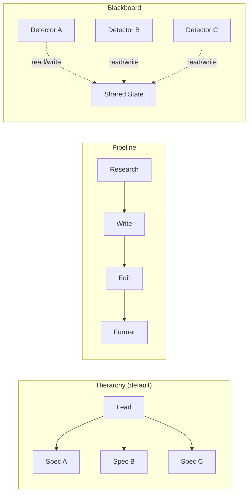

# Chapter 25: Topologies, Shared State, and Coordination

> **Reading note.** The opening case and its numerical outcomes are illustrative, not a documented production incident. Code and LoopKit names are illustrative API sketches or pseudocode, not a tested published SDK. Inherited source pointers are identified separately from checked evidence; numerical examples are assumptions, not current provider quotations.

> "The topology you choose determines which failures are possible. Choose the one whose failures you can survive."

## The Merge Conflict at 3 AM

David Okonkwo runs a documentation fleet at a developer tools company. Three specialist agents work in parallel on every release: one updates API reference documentation from code changes, one rewrites tutorials affected by breaking changes, and one regenerates code samples to match the new API surface. The fleet runs on every release tag — roughly twice a week — and has reduced documentation lag from two weeks to same-day publication.

For six weeks, it works flawlessly. The specialists operate in partitioned directories: `docs/reference/`, `docs/tutorials/`, and `docs/samples/`. No overlap. Then, on a Tuesday at 3:14 AM, a release changes the authentication API. The tutorial specialist must rewrite the authentication quickstart guide at `docs/guides/auth-quickstart.md`. The code-sample specialist must regenerate the authentication code sample embedded in that same file. Neither specialist knows the other has modified `auth-quickstart.md` — neither was designed to check, because the file lives outside all three original partitions. It sits in `docs/guides/`, a directory that was not assigned to any specialist when the fleet was designed. It was overlooked because it is a hybrid document: part tutorial prose, part inline code.

The lead agent aggregates their outputs at 3:47 AM, discovers two conflicting versions of the file, attempts a naive text merge, and produces a garbled hybrid: the tutorial specialist's rewritten paragraph contains the old code sample (it worked with the content available when it wrote), nested below the code-sample specialist's new code block sitting in the tutorial specialist's old paragraph structure. The oracle — a sample-compilation check — passes the code but cannot evaluate prose coherence. The fleet ships the garbled file to production documentation. Users report the issue at 9 AM. David spends ninety minutes understanding what happened.

David's fleet has two entangled problems. First, a topology problem: the flat hierarchy with no inter-specialist communication prevents agents from knowing about each other's writes. Second, a shared-state problem: the filesystem has no mechanism to prevent or even detect conflicting modifications to a single file. A correctly enforced single-writer policy could have prevented the overwrite without changing the topology; communication alone would not guarantee safe writes. This chapter addresses both: how agents connect determines coordination capability, and how agents share state determines write safety.

## The Four Topologies

Four communication topologies cover the practical design space for agent fleets. Each determines the paths along which information flows, the coordination overhead the fleet incurs, and the characteristic failure modes teams should anticipate.

**Hierarchy (star topology)** places a single lead agent at the centre, communicating with all specialists. Specialists never communicate directly with each other. All coordination flows through the lead. This is the topology described in Chapter 24, and it should be the default choice for teams deploying their first fleet. Its primary advantage is simplicity: one coordination point, full visibility (the lead sees every specialist's output), and natural authority (the lead resolves all conflicts because only the lead has cross-specialist context). Its primary limitation is that the lead becomes a bottleneck in large fleets — both in terms of context-window pressure (reading all specialist outputs during synthesis) and in terms of latency (if a specialist needs information from another specialist, that information must route through the lead, adding two inference calls to what could be a direct exchange).

For David's documentation fleet, hierarchy is the correct topology. The lead should know about all file modifications across all specialists and should coordinate access to shared files. David's mistake was not the topology — it was the implementation: the lead delegated without tracking which files each specialist intended to modify, so it could not detect the overlap at delegation time.

**Pipeline (chain topology)** connects agents sequentially, each transforming the previous agent's output. A research agent produces notes, a writing agent produces prose from those notes, an editing agent refines the prose, a formatting agent produces the final document. Each stage receives a single input (the previous stage's output) and produces a single output (passed to the next stage). Pipelines excel when quality requires iterative refinement through distinct transformation stages that cannot be parallelised because each depends on the previous result.

A single item follows its sequential critical path. Different items can still be pipelined concurrently when stage capacity and ordering permit. Its secondary limitation is fragility: a failure or quality degradation at any stage propagates through all downstream stages. If the writing agent produces a paragraph with a factual error, the editing agent may not catch it (editing for style, not facts), and the error propagates to the final output. Pipelines require each stage's oracle to be tuned for that stage's specific contribution rather than relying on end-to-end validation alone.

**Mesh (peer-to-peer topology)** allows every agent to communicate directly with every other agent without central coordination. This sounds maximally flexible, but it is rarely appropriate for production fleets. The communication overhead grows quadratically: N agents have N×(N-1)/2 potential channels, each of which could carry messages that must be processed. With five agents, that is ten channels. With ten agents, forty-five. Debugging can become harder because causal chains can follow any path through the mesh — when the final output has a problem, you cannot determine which agent contributed the error without tracing every inter-agent message.

Mesh topology also introduces consensus problems. If two agents independently decide to modify the same resource (possible because neither routes through a central authority), the system must detect and resolve the conflict post hoc. A hierarchy offers one place to enforce ownership, but it does not do so automatically. A mesh can also use an authoritative ownership service. Communication topology and mutation authority are distinct design decisions. Use mesh only when agents have genuine peer-to-peer negotiation needs that hierarchy cannot efficiently model — which is rare in practice. In most cases, a hierarchy with one or two selective lateral channels (explicitly defined, not arbitrary mesh communication) provides the needed flexibility without quadratic overhead.

**Blackboard (shared-state topology)** replaces direct communication entirely. Agents do not send messages to each other or to a lead. Instead, they read from and write to a shared data structure. Each agent monitors the blackboard for items relevant to its specialty, processes them, and posts results back. The blackboard acts as implicit coordination: agents react to state changes rather than receiving explicit instructions. The coordination protocol is emergent rather than explicit — no agent tells another agent what to do; each agent independently determines whether the current blackboard state contains work it should perform.

Blackboard topology suits continuous monitoring systems where specialists are long-lived and react to a stream of events. A fleet monitoring a production system might have a log-analysis agent watching for error spikes, a cost-analysis agent watching for spend anomalies, and a performance-analysis agent watching for latency regressions — each reading the same event stream independently and posting their findings to the shared state. Adding a new specialist (say, a security-anomaly detector) requires no changes to existing specialists or coordination logic — the new agent simply begins reading the blackboard and posting its own findings. The key advantage is this decoupling. Without an explicit protocol, the key disadvantage is undefined ordering and conflict resolution — two agents may both react to the same event, post contradictory assessments, and leave the contradiction unresolved because no coordinator exists to adjudicate.



The selection criteria reduce to three questions. Are the sub-tasks independent and parallelisable? Use hierarchy with parallel dispatch — the lead assigns all specialists simultaneously and awaits their results. Are the sub-tasks sequential, with each stage transforming the previous stage's output into input for the next? Use pipeline — the output flows in one direction through specialised transformation stages. Do agents need to react to a continuous event stream without centralised coordination or explicit task assignment? Use blackboard — each agent independently monitors shared state and acts when it detects relevant items. The fourth option, mesh, exists for completeness but should be chosen only after demonstrating that the other three topologies cannot support your specific inter-agent communication needs — which is rare in practice.

## Shared State: The Hard Problem

When multiple agents work in parallel, they must share information — at minimum, they must deposit their results somewhere for aggregation. The shared-state mechanism determines whether parallel execution is safe or whether it produces the kind of garbled merge that broke David's documentation.

**Partitioned filesystem** is a simple way to reduce direct write conflicts when its boundaries are enforced. Each specialist writes exclusively to its own directory. No specialist can modify another specialist's output. The lead reads from all directories during aggregation. Direct write conflicts are prevented only when ownership is enforced and all shared resources are included. Prompt-only partitions and unassigned paths do not provide that guarantee.

The limitation emerges when specialists must modify the same target artifact — David's exact situation, where two specialists needed to edit different aspects of a single file. Partitioning works only when the task decomposes into non-overlapping write targets. When it does not, other mechanisms are necessary.

**Append-only event log** resolves the ordering and conflict problem for information sharing (as opposed to artifact modification) by making all state changes sequential and immutable. Agents append events to the log — findings, decisions, questions, status updates. No agent mutates a prior event. The lead reads the full log during synthesis to understand what each specialist did and decided. With an appropriate transactional append service or single writer, concurrent submissions become distinct durable records; arbitrary file append from multiple processes does not guarantee complete records or the required durability; the lead resolves any apparent contradictions during its synthesis pass.

A persistent event log can support coordination and recovery. Persistence must be implemented and tested; it does not follow merely from calling a class EventLog. Persistence also enables crash recovery — if a specialist fails after writing three events but before completing its analysis, the lead can read those three events to understand partial progress and decide whether to retry or proceed without that specialist.

**Explicit locking** is necessary when multiple specialists must modify the same mutable resource and partitioning is impossible. A lock manager grants exclusive write access to a resource for the duration of a specialist's modification. Other specialists attempting to access the locked resource either wait (blocking) or skip it and report the conflict to the lead (non-blocking with escalation).

```python

import asyncio
from dataclasses import dataclass, field
from pathlib import Path

@dataclass
class FileLockManager:
    """Cooperative locks inside one event loop only; not cross-process fencing."""

    _locks: dict[str, asyncio.Lock] = field(default_factory=dict)
    _owners: dict[str, str] = field(default_factory=dict)

    def _get_lock(self, path: str) -> asyncio.Lock:
        if path not in self._locks:
            self._locks[path] = asyncio.Lock()
        return self._locks[path]

    async def acquire(self, path: str, agent_name: str, timeout: float = 30.0) -> bool:
        """Attempt to acquire exclusive write access. Returns False on timeout."""
        lock = self._get_lock(path)
        try:
            await asyncio.wait_for(lock.acquire(), timeout=timeout)
            self._owners[path] = agent_name
            return True
        except asyncio.TimeoutError:
            return False

    def release(self, path: str, agent_name: str) -> None:
        if self._owners.get(path) == agent_name:
            self._locks[path].release()
            del self._owners[path]

    def held_by(self, path: str) -> str | None:
        return self._owners.get(path)
```

Locking introduces classical concurrency problems. Deadlock occurs when specialist A holds file X and waits for file Y, while specialist B holds file Y and waits for file X. Starvation occurs when a long-running specialist holds a lock that blocks all others from progressing. These have classical solutions — lock ordering (always acquire locks in alphabetical path order) and timeouts (if a lock cannot be acquired within 30 seconds, skip and report). They add operational complexity that exclusive ownership often reduces, though shared external resources still need coordination. The preference order is clear: partition when possible, use append-only event logs for coordination information, and resort to locking only when the task genuinely requires multiple agents to modify overlapping mutable state.

## Write Conflicts: Taxonomy and Resolution

David's incident was a structural conflict — two specialists produced physically incompatible modifications to the same file region. Write conflicts in multi-agent systems come in three forms, each requiring different detection and resolution strategies.

**Structural conflicts** occur when two specialists modify the same lines of a file. The modifications are physically incompatible: you cannot apply both patches. Detection is straightforward (overlapping line ranges in the diff), but resolution requires judgment — which modification should win, or whether a synthesis of both is needed. In David's case, designate one file owner. The other specialist supplies a versioned code contribution for that owner to integrate. Two workers editing different ranges of the same mutable file still risk stale offsets and whole-file overwrites.

**Semantic conflicts** occur when two specialists modify different regions of the same file (or different files), but their modifications are logically inconsistent with each other. One specialist adds a function call; another removes the function being called. Neither modification overlaps textually, but applying both produces broken code. Detection requires understanding the semantic relationships between changes — something that automated merge tools cannot reliably do. The lead agent must evaluate cross-specialist consistency during its synthesis pass.

**Ordering conflicts** occur when the correctness of one specialist's modification depends on whether another specialist's modification has already been applied. Specialist A adds a migration that creates a new database column. Specialist B writes code that reads from that column. If B's code ships before A's migration runs, the application crashes. Ordering conflicts are invisible within a single merge operation — both changes apply cleanly in any order — but they manifest at deployment time when the order of application matters.

The resolution strategies, in order of preference:

First, prevent conflicts by design. Assign file ownership at delegation time. The lead examines the goal, identifies which files each specialist will likely need to modify, and assigns each file to exactly one specialist. If two specialists need to contribute to the same file, one of them owns the file and the other posts its contribution to the event log for the owner to incorporate. This prevention-by-design approach eliminates the entire category of structural conflicts at the cost of additional delegation complexity.

Second, detect conflicts at aggregation time and resolve them through the lead. Allow specialists to work freely (without locking), then programmatically check their outputs for overlapping modifications before attempting to merge. If overlaps are detected, the lead reads both modifications with full context about each specialist's intent (from the event log) and produces a resolution. Resolution cost varies with the conflict and may require rerunning integration tests or returning work to its owner; one model call is not a general guarantee.

Third, use branch-based isolation with automated merge. Each specialist works in its own git branch (or worktree, as described in Chapter 17). After all specialists complete, the system attempts automated merge. If merge conflicts occur, the lead resolves them. This approach leverages git's well-tested merge machinery for structural conflict detection and provides a natural rollback mechanism if the merged result fails the oracle.

## Result Aggregation Patterns

The lead's synthesis pass is where the fleet's value materialises. Individual specialist outputs are raw findings; the synthesis is the product. Three aggregation patterns serve different fleet architectures and goals.

**Union with deduplication** is the simplest aggregation. The lead collects all specialist outputs, identifies duplicates (by file path and line number for code findings, by topic hash for prose contributions), and presents the deduplicated union. This pattern works for review fleets where completeness is the goal: you want every finding from every specialist, without redundancy. The lead's role is minimal — it deduplicates and formats but does not exercise judgment about which findings matter more.

**Prioritised synthesis** applies when findings interact or when the consumer needs a coherent narrative rather than a list. The lead reads all specialist outputs, identifies cross-cutting themes (three specialists each flagged a different symptom of the same underlying architectural issue), resolves contradictions (specialist A says the code is thread-safe; specialist B identifies a race condition — the lead must determine who is correct by examining their evidence and reasoning), and produces a ranked, contextualised report. This pattern requires the lead to exercise genuine judgment, which is why the lead model must be capable enough for synthesis even if the lead delegates all detailed analysis. A lead that merely concatenates specialist outputs without evaluating consistency is performing union-with-deduplication disguised as synthesis — and the output quality reflects this.

**Sequential refinement** applies in pipeline topologies. Each stage takes the previous stage's output as input and improves it along its dimension of expertise. The research agent's notes become the writing agent's prose; the writing agent's prose becomes the editing agent's polished draft; the editing agent's draft becomes the formatting agent's final published artifact. The final output is not a combination of parallel contributions but a single artifact progressively refined through specialised lenses. The challenge specific to this pattern is error propagation: if the research agent introduces a factual error in its notes, the writing agent incorporates the error into confident prose, the editing agent polishes that prose into rhetorically convincing language, and the final output is confidently, convincingly wrong. Pipeline topologies therefore require per-stage oracles that check stage-appropriate quality dimensions — the research oracle verifies factual accuracy, the writing oracle checks clarity and structural coherence, the editing oracle checks grammar and tone consistency. End-to-end validation alone is insufficient because errors introduced early become increasingly expensive to detect as they are buried under subsequent stages' refinements.

## Communication Cost Budget

Communication between agents is not free. Every delegation prompt, every result summary, every conflict-resolution message consumes tokens at the model's rate. For fleets that run frequently, communication cost is worth quantifying and budgeting explicitly.

A five-specialist fleet with one delegation round and one result-collection round generates ten messages: five delegations (lead to specialist) and five result summaries (specialist to lead via blackboard). If each delegation prompt averages 2,000 tokens and each result summary averages 4,000 tokens, the communication cost is (5 × 2,000) + (5 × 4,000) = 30,000 tokens [ILLUSTRATIVE ASSUMPTION — not a measured result].

At an assumed input-only rate of $3 per million, 30,000 tokens cost $0.09, but that is not the full communication bill: delegation and reports are generated as outputs and may be read repeatedly. Count each billable leg and its input/output rate. But communication cost scales with both fleet size and communication rounds. If specialists need clarification (an additional round), the cost doubles to 60,000 tokens. If the fleet has ten specialists instead of five, communication cost for two rounds reaches 120,000 tokens — comparable to the analysis cost itself for simple tasks.

The design principle: invest upfront effort in clear delegation prompts that eliminate clarification rounds. Every additional communication round multiplies overhead linearly. A delegation prompt that takes an extra 500 tokens to specify scope precisely but eliminates one clarification round saves 6,000-8,000 tokens net. The economics strongly favour front-loading clarity into the delegation rather than relying on iterative clarification. This is a general principle of fleet design: the cheaper the run-time coordination, the more expensive the design-time delegation engineering must be. Teams that invest thirty minutes crafting a precise delegation prompt template save that time back within the first day of production operation through eliminated clarification rounds and reduced conflict-resolution costs.

## What Breaks

The topology itself becomes a failure mode when the fleet's real-world communication needs evolve beyond what the chosen topology efficiently supports. A team deploys a hierarchy for code review: the lead delegates to a security specialist, a performance specialist, and a correctness specialist. After three months of production operation, they discover that security findings frequently depend on performance characteristics — a denial-of-service vector exists only because the algorithm has O(n²) complexity. The security specialist cannot fully analyse the vector without the performance specialist's findings, but in a strict hierarchy, information flows only through the lead.

The options are unpalatable. Route all security findings through the lead for enrichment with performance context (adding latency and an extra inference call per finding). Add a lateral channel between the security and performance specialists (breaking the hierarchy's simplicity and the lead's full-visibility guarantee). Have the performance specialist write its findings first, then give the security specialist read access to the performance partition (introducing ordering dependencies that reduce parallelism). Each option trades one desirable property for another.

The reliable mitigation is to resist premature topology optimisation. Start with hierarchy — it is the simplest topology that provides full coordination — and observe where bottlenecks actually emerge after weeks of production data. Let measured communication-cost overhead and demonstrated information-flow needs drive topology evolution, rather than anticipating problems that may never materialise. Most teams will find that hierarchy with minor refinements (a shared context document that both security and performance specialists read before starting) handles their needs without topology changes.

## Implementation Guidance: Ownership Survives a Handoff

An assignment is a versioned claim on work, not merely a message. Record task ID, generation, owner, write targets, input revisions, acceptance checks, and dependency edges. A worker publishes against that identity. Acceptance should verify both the result and that the worker still owns the current generation. An old worker completing after reassignment must not overwrite the new owner's artifact.

Separate production, publication, and acceptance. Production creates a candidate artifact. Publication stores an immutable candidate and its evidence manifest where the coordinator can inspect it. Acceptance records that the candidate meets the task's requirements and is eligible for downstream use. A worker's `done` message does not perform acceptance, and a result file existing at a familiar path is not enough to distinguish current work from an old run.

A handoff packet should contain the current goal and constraints, accepted artifact hashes, pending checks, unresolved effects, failed approaches with reasons, and the next permissible action. It should not require the next worker to reconstruct a long transcript. Include relevant source references rather than only a compressed conclusion. The recipient revalidates changed dependencies and retains valid completed evidence instead of restarting everything.

### Leases Need Resource-Side Fencing

A lease lets an owner act for a limited interval, but expiry does not physically stop a paused process. Worker A can check that its lease is valid, pause, and resume after worker B has acquired a new lease. If A can still write the resource, both workers may act as owner. A monotonically increasing fencing token addresses this only when the resource endpoint rejects older tokens.

```text
Illustrative resource-side publish transaction:
  receive task_id, generation, fence, expected_artifact_revision, candidate
  verify caller authority for task and resource
  reject if task generation is no longer current
  reject if fence is older than resource's accepted fence
  reject if current artifact revision differs from expected revision
  atomically store immutable candidate pointer and accepted fence
  return durable publication receipt
```

A coordinator that checks the token but sends an unfenced write to a third-party API has not protected that API. Where the receiver lacks conditional writes or fencing, use an appropriately serialised effect gateway, receiver-supported operation keys, or a policy that prevents overlapping effects and reconciles uncertain completion. Do not claim a local `asyncio.Lock` solves distributed ownership; it coordinates only callers sharing that particular lock object in one process.

### Recovery Case: The Late Tutorial Writer

The tutorial worker loses connectivity. The lead reassigns the task with generation 9 while the original worker holds generation 8. The original eventually publishes its apparently complete quickstart. The publication service stores it as a historical candidate or rejects it, but does not replace generation 9's current result. The new owner may reuse factual findings after checking their source revisions; it must not inherit generation 8's authority. This preserves useful work without accepting a stale write.

### Exercise Acceptance Checks

Run two processes, not merely two coroutines, when testing distributed ownership. Pause the first after lease validation, let the second acquire a newer token and publish, then resume the first; its write must be rejected by the actual resource adapter. Test path aliases and symlinks so ownership cannot be bypassed by spelling the same file differently. For event replay, use durable sequence IDs rather than wall-clock timestamps alone: equal timestamps and clock adjustments must not lose events. Replay duplicate notifications and an interrupted final record without duplicating acceptance. For handoffs, change one upstream revision and verify only affected downstream checks are invalidated. A topology diagram is not a substitute for these executable invariants.

## Key Takeaways

- Four topologies cover the design space: hierarchy (default, full coordination through lead), pipeline (sequential refinement), blackboard (event-driven, decoupled specialists), and mesh (peer-to-peer, rarely appropriate).
- Shared state is the hard problem in parallel fleets. Prefer partitioned writes (structurally conflict-free), then append-only event logs (for coordination information), then explicit locking (only when overlapping writes are unavoidable).
- Write conflicts come in three forms: structural (overlapping edits), semantic (logically inconsistent changes), and ordering (correct only if applied in sequence). Prevention by design is cheaper than detection and resolution after the fact.
- Result aggregation patterns: union with deduplication (coverage goal), prioritised synthesis (coherence goal), and sequential refinement (pipeline quality).
- Communication cost grows with fleet size and round count. Front-load clarity in delegation prompts to eliminate clarification rounds.
- Start with hierarchy and evolve topology only in response to measured communication bottlenecks.

## The Loop Contract, So Far

This chapter extends the **escalation path** field with topology semantics. The escalation path now specifies not only whether to fleet and what delegation strategy to use (Chapter 24), but also which topology governs inter-agent communication, what shared-state mechanism prevents write conflicts, and what aggregation pattern produces the final output. These choices constrain the fleet's coordination overhead and failure characteristics.

## Exercises

1. **Topology selection** (analysis): For each task, identify the appropriate topology and justify: (a) generating a software architecture document requiring codebase analysis, writing, and diagram generation; (b) monitoring a production system with specialised anomaly detectors; (c) translating a legal document through three language pairs sequentially to verify translation fidelity.

2. **Conflict detection** (build): Implement a `ConflictDetector` class that takes a list of `(agent_name, file_path, line_range)` tuples representing planned modifications and returns all structural conflicts (overlapping line ranges on the same file). Write tests for the case where two agents modify adjacent but non-overlapping ranges (not a conflict) versus overlapping ranges (conflict).

3. **Communication budget** (analysis): Design a four-specialist fleet for a codebase migration task. Estimate delegation prompt size, result summary size, and likelihood of clarification rounds. Calculate communication cost per run and monthly communication cost at 20 runs/day. At what daily volume does communication exceed 25% of total fleet cost?

4. **Event log replay** (build): Extend the `EventLog` class from Chapter 24's `fleet.py` to support filtered reads (by agent name, by event type, by time range). Write a function that replays an event log to reconstruct the fleet's execution timeline as a human-readable narrative: "Agent security-reviewer started at T+0s, completed at T+34s. Agent compliance-reviewer started at T+0s, posted question at T+12s..."

## Sources and Evidence Limits

- [Martin Kleppmann, How to do distributed locking, 8 February 2016](https://martin.kleppmann.com/2016/02/08/how-to-do-distributed-locking.html) — paused clients, lease expiry, and storage-enforced fencing; historical discussion, not a current product audit.
- [AWS Prescriptive Guidance, Transactional outbox pattern](https://docs.aws.amazon.com/prescriptive-guidance/latest/cloud-design-patterns/transactional-outbox.html) — transactional event intent and duplicate consumer handling.

Primary-source passages were reviewed in the shared editorial source packet dated 2026-10-07; the citations support only the bounded distinctions stated above. Opening cases, thresholds, cost examples, and code sketches are teaching material, not independently verified production measurements. The inherited “New in Claude Managed Agents” pointer could not be confirmed during source review and is not used as evidence.

------------------------------------------------------------------------

*Next: Chapter 26 examines where humans belong relative to the fleet — in the loop, on the loop, or out of the loop — and how teams earn the right to reduce oversight through demonstrated reliability rather than optimism.*

[Previous: Chapter 24](chapter-24.md) · [Next: Chapter 26](chapter-26.md)
