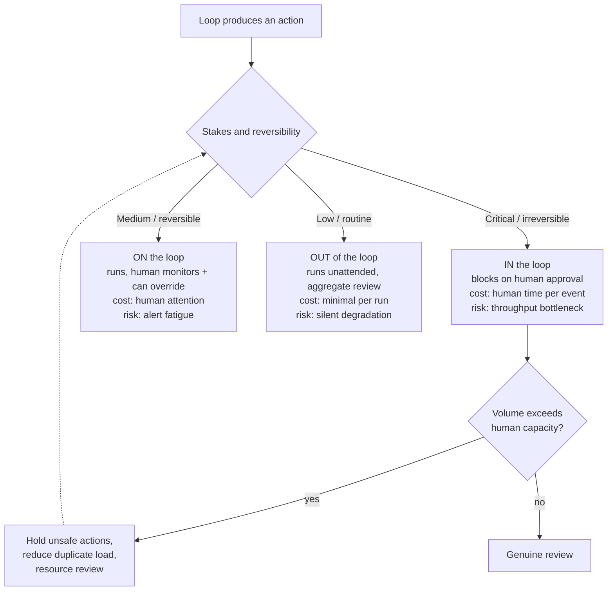

# Chapter 26: Human In / On / Out of the Loop

> **Reading note.** The opening case and its numerical outcomes are illustrative, not a documented production incident. Code and LoopKit names are illustrative API sketches or pseudocode, not a tested published SDK. Inherited source pointers are identified separately from checked evidence; numerical examples are assumptions, not current provider quotations.

> "The most dangerous configuration is not full automation. It is a human who rubber-stamps everything — manufacturing false assurance that nobody is actually checking."

## The Rubber-Stamp Incident

Marcus Chen manages the security review fleet at a logistics SaaS company serving twelve enterprise clients. His fleet runs on every pull request: three specialist agents review code for injection vulnerabilities, authentication defects, and data-handling violations. The fleet produces a structured report with severity ratings, evidence citations, and remediation suggestions. For findings rated Critical, the system sends a Slack notification to the `#security-approvals` channel, where a member of Marcus's four-person team must click "Approve block" or "Override — allow merge" before the PR can proceed.

For four months, the system works as designed. The fleet catches genuine issues. Engineers respect the findings because the evidence citations let them verify each claim in under a minute. Critical findings average two per week — infrequent enough that each receives genuine human attention. Average time from notification to decision: three hours and forty minutes. Marcus knows this because the system logs it. He also knows that 85% of critical findings are legitimate blocks (the team clicks "Approve block"), validating the fleet's judgment.

Then the company acquires a startup with 340,000 lines of legacy Python code and begins integrating it into their monorepo. PR volume triples. The fleet, doing its job correctly, produces proportionally more findings — not because code quality dropped industry-wide, but because more code is moving through the pipeline. Critical notifications jump from two per week to nine per day. Marcus's four-person team cannot review nine detailed security reports daily alongside their other responsibilities: pen-testing, architecture review, incident response, and the client security questionnaires that pay the bills.

The team begins approving without reading. Not maliciously — they are overwhelmed, each notification is one of nine competing for attention, and the fleet has been right 85% of the time so the prior probability favours approval. The approval latency drops from three hours forty minutes to six minutes. The team develops a muscle-memory pattern: notification appears, scan the title, click "Approve block." They are processing the queue, not reviewing the findings.

Six weeks later, a production SQL injection exploit traces back to a PR that the fleet correctly identified as containing a Critical vulnerability in the user-search endpoint. The fleet produced the finding, cited the exact line, recommended the fix. The Slack notification went to `#security-approvals`. A team member clicked "Approve block" within four minutes — except they clicked the wrong button. They meant to block the PR. They clicked "Override — allow merge" because after forty approvals that week, their finger went to the same button it always went to, and the button labels are small on mobile. The PR merged. The vulnerability shipped to production.

The fleet detected the issue, but the approval interface and capacity policy were part of the same safety system. Ambiguous buttons, unsafe overrides, and an overloaded queue were design defects, not evidence that the automated layer did everything right. The failure was sociotechnical — overwhelmed by volume, the human oversight system degraded from genuine supervision to performative checkbox-clicking. The audit trail showed "human reviewed" without evidence of effective review, creating false assurance about the control. It manufactured false assurance — the appearance of control without its substance.

## The Spectrum of Human Position

The human's relationship to an autonomous system is not a binary (supervised / unsupervised). It is a spectrum with meaningfully different operational characteristics at each position. Chapter 2 (*Levels of Agency: The Autonomy Ladder*) defined six levels from L0 (autocomplete) through L5 (self-designing fleet). The human's position maps onto these levels, but the mapping is per-decision-type, not per-system. A fleet can operate at L4 for routine findings while maintaining L2 for critical findings simultaneously.

**In the loop** means the system cannot proceed past a specific decision point without explicit human approval. The human evaluates and authorises each qualifying action before it takes effect. This position is appropriate during initial deployment when the system has no track record, for irreversible actions where the cost of an error exceeds the cost of waiting for a human, and for genuinely novel situations the system has not previously encountered. The operational cost is human time at each qualifying event. The operational risk is that the human becomes a throughput bottleneck, creating schedule pressure that degrades review quality — exactly what happened to Marcus's team when volume exceeded their capacity for genuine attention.

**On the loop** means the system executes autonomously while the human monitors outcomes and retains override capability. The system runs to completion without gating on human approval, but the human receives notifications of significant events and can intervene — halting the system, modifying its behaviour, or reversing its actions after the fact. This position is appropriate once the system has demonstrated reliability across a meaningful sample of runs. The operational cost is human attention (monitoring dashboards, reading periodic digests). The operational risk is alert fatigue — the progressive numbing of human attention when notification volume exceeds cognitive capacity for genuine evaluation, degrading monitoring from active supervision to passive acknowledgment.

**Out of the loop** means the system operates without ongoing human involvement for individual runs. The human defines the goal, configures constraints and budgets, and reviews aggregate outcomes on a schedule (weekly, monthly). Individual runs execute without notification unless they trigger an anomaly-based escalation. This position is appropriate for systems with extensive track records (hundreds of successful runs), robust multi-level oracles, and well-characterised failure modes with proven containment. The operational cost is minimal human time per run. The operational risk is silent degradation — the system's output quality drifts without detection because nobody examines individual outputs, and the drift may not manifest in aggregate metrics until it has accumulated significantly.

The three positions, and the routing rule that assigns actions to them, look like this:



The feedback edge is the part teams miss. When in-the-loop volume outgrows human capacity, the instinct is to process faster, which manufactures the rubber stamp. The correct move is to retain the risk classification, hold unsafe actions, remove duplicate notifications, and increase or reroute qualified review capacity.

The critical design insight: position should vary by action type within a single system, calibrated by stakes. Marcus's fleet should operate out of the loop for Low-severity findings (logged, included in a weekly quality digest, no notification). It should operate on the loop for Medium-severity findings (daily digest email, human spot-checks a sample). It should operate in the loop only for Critical findings — and Critical findings need sufficient qualified attention regardless of volume. If demand exceeds capacity, hold the affected actions, add reviewers or escalation coverage, and reduce avoidable duplicate work. Correct false positives using evidence, but never relabel genuine Critical risks as Medium merely to clear the queue.

## Escalation Design: Information Architecture for Human Decisions

Escalation is the mechanism by which a system transitions toward more human involvement when it encounters a situation beyond its automated handling capability. The quality of the escalation message determines whether the human can decide in seconds or must spend an hour re-investigating what the system already knows.

Every escalation must answer four questions explicitly. What happened — the specific condition that triggered the escalation, stated concretely ("SQL injection vector in `user_search.py:42` where query parameter `q` flows into a raw `LIKE` clause")? What was tried — the system's own analysis and any automated resolution it considered ("parameterised query would fix this; could not apply automatically because the surrounding function uses dynamic column selection")? What are the options — the decision the human needs to make, with tradeoffs stated for each option ("Option A: block the PR until fixed, delay estimated at 4-8 hours; Option B: allow merge with a follow-up ticket, vulnerability remains live until fixed; Option C: apply automated fix to parameterise the query, but this changes the function signature and may break two callers")? And what is the default if no response arrives within the timeout — whether the system waits indefinitely, proceeds with the most conservative option, or retries the escalation through an alternative channel?

The difference between a useful escalation and a useless one is not verbosity but information architecture. A notification reading "Security finding in PR \#847 — please review" forces the human to open the PR, locate the finding, understand the context, evaluate the severity, and make a judgment — five minutes minimum, often fifteen. A notification reading "SQLi in `user_search.py:42` — unparameterised LIKE on user input. Impact: read access to full users table. Fix: parameterise query (breaks 0 callers). Recommend: block PR. \[Block\] \[Override with reason\] \[Defer 24h\]" enables a decision in thirty seconds because it contains the finding, evidence, impact, recommended action, and available responses. The human is making a judgment call, not performing an investigation.

## Alert Fatigue: The Systemic Failure Mode

Alert fatigue is not merely an inconvenience or a staffing problem. It is a systemic failure mode that transforms human oversight from genuine supervision into performative compliance. When notification volume exceeds human cognitive capacity for careful evaluation, the response is not selective attention (carefully evaluating some notifications and skipping others) — it is surface-level processing of all notifications. Humans process the queue rather than review the items. The form of oversight persists (notifications are acknowledged, buttons are clicked, timestamps are logged) while the substance evaporates.

This can create more false assurance than openly acknowledged automation, but the relative harm depends on the system and its alternatives. Without a human in the loop, the system's autonomous output stands or falls on its own quality — if it fails, the failure is attributed to the system and drives improvement. With rubber-stamp oversight, the failure is masked by a human "review" that occurred on paper. Audit trails show that a person evaluated and approved every item. The system appears supervised. When a failure eventually manifests in production, the post-mortem discovers that supervision was nominal for weeks or months before the incident. The false assurance prevented earlier detection of the degradation.

Three design principles combat alert fatigue in autonomous loop systems:

First, reserve real-time human-blocking escalation for decisions whose stakes genuinely justify interrupting a human's other work, and whose volume is sustainably below the team's cognitive capacity. Marcus's team can meaningfully process two to four Critical escalations per day with genuine attention — meaning they read the full finding, evaluate the evidence, consider the recommendation, and make a deliberate choice. If the fleet produces more than available capacity, first determine whether findings are duplicates, false positives, or a real increase in risk. Keep real Critical findings blocked while assigning additional qualified owners, using backup coverage, slowing intake, or reducing risky deployment volume. Staffing can improve capacity when responsibility and review standards remain explicit. Confidence uncertainty may require investigation; it is not permission to lower severity.

Second, batch lower-urgency items into periodic digests. A daily email at 9 AM summarising yesterday's fourteen Medium-severity findings — with links for any that warrant deeper investigation — respects human attention better than fourteen Slack notifications distributed across the workday. Batching converts interrupt-driven oversight into schedule-driven oversight. The human reviews when they have allocated time and cognitive capacity, not when the system demands their attention. The psychological difference is significant: reviewing a digest is a planned activity with defined scope ("fourteen items, I'll spend twenty minutes"), while processing individual notifications is an interrupt that fragments whatever the human was previously doing. Twelve interrupts across a day destroy far more productive time than one twenty-minute digest review session.

Third, monitor the quality of human responses, not merely their existence. Track time-to-response, response depth (did the human leave a comment explaining their reasoning, or just click a button?), override rate (how often does the human disagree with the system's recommendation?), and decision consistency (does the same human approve similar items that they previously rejected?). If humans approve 100% of escalations in under sixty seconds with no comments, that is not efficient oversight — it is rubber-stamping, and the system should flag this pattern as a control failure regardless of what other metrics show. The metric to watch is not "were all escalations acknowledged" but "were escalations acknowledged in a manner consistent with genuine evaluation." Response time alone does not discriminate — a genuinely simple escalation might legitimately take thirty seconds to evaluate. But the combination of universal approval, short response time, and absent comments warrants an audit, not an automatic judgment about a reviewer's intent.

## Graduation Criteria: Earning Autonomy Through Track Records

Moving between positions — from in-the-loop to on-the-loop to out-of-the-loop — is not a configuration switch. It is a trust-building process with concrete, measurable graduation criteria. A system earns reduced oversight by demonstrating, through sustained operation, that its autonomous judgment is reliable enough to justify the reduced human attention.

**From in-the-loop to on-the-loop (L2→L3).** The system must demonstrate that its automated oracle catches the issues a human reviewer catches. The validation method: run the system in shadow mode for a period, where the system makes decisions but a human independently evaluates the same items without seeing the system's decision. After a prospectively chosen sample covering relevant task classes, compare the system's decisions to the human's decisions. A high agreement rate can support the decision, but is insufficient by itself: inspect consequential misses, disagreement adjudication, sample coverage, and uncertainty. The authority responsible for the action class decides whether residual risk is acceptable.

**From on-the-loop to out-of-the-loop (L3→L4).** Sustained reliability over a longer operational period. A zero-critical-failure run is useful evidence, not proof of safety. Under an independent Bernoulli model, zero failures in 200 runs gives a one-sided 90% upper bound of `1 - 0.1**(1/200)`, about 1.15%, not below 0.5%. Correlated cases or an unrepresentative task mix weaken even that interpretation. Set sample size and acceptable risk before observation. Additional illustrative criteria might include human override rate below 2% and cost per verified outcome within 20% of its rolling average for a month. Neither is a safety threshold: low overrides can reflect missed issues, and stable costs say little about correctness. Tested rollback mechanism — the team must have actually exercised the ability to revert the system's actions in a drill or real incident, confirming it works.

**Automatic demotion criteria** prevent autonomy from persisting past its justified lifetime. A critical failure should activate a predeclared containment policy for the affected action class, such as disabling mutation rights pending investigation. A two-level demotion is one illustrative policy, not a universal requirement. Three non-critical failures within a rolling seven-day window demotes one level. Human override rate exceeding 10% during on-the-loop operation demotes one level and triggers investigation into why the system's judgment diverges from human judgment — is the system degrading, or is the human applying criteria the system was not designed to satisfy? Containment should be instrumented and, where appropriate, automatic under a reviewed policy — implemented in code that monitors outcomes, not in a human process that relies on someone noticing and choosing to reduce trust. Relying on humans to voluntarily reduce a system's autonomy introduces the same optimism bias that characterises human oversight generally: people are reluctant to revoke trust they previously granted, even in the face of evidence that the trust is no longer warranted.

## Webhook-Driven Notification Architecture

Production fleet notification uses webhooks to decouple the loop's execution from human communication channels. The loop posts events to a notification router; the router delivers to the appropriate channel based on urgency, team preference, and time-of-day routing rules. This architecture allows the loop to run at full speed while humans receive information through their preferred channels at appropriate urgency levels.

```python

from __future__ import annotations

import asyncio
from dataclasses import dataclass
from enum import StrEnum

class Urgency(StrEnum):
    CRITICAL = "critical"   # Blocks loop execution until human responds
    HIGH = "high"           # Real-time notification, loop continues
    MEDIUM = "medium"       # Batched into next periodic digest
    LOW = "low"             # Logged for periodic audit only

@dataclass(frozen=True)
class EscalationPayload:
    """Complete information package for a human decision-maker."""

    summary: str            # One-line: what happened
    evidence: str           # Specific: file, line, data supporting the finding
    impact: str             # Concrete: what goes wrong if this is ignored
    options: tuple[str, ...]  # Named actions the human can take
    recommendation: str     # The system's suggested action
    urgency: Urgency
    timeout_seconds: float  # How long to wait for response
    default_on_timeout: str  # Action taken if human does not respond

class NotificationRouter:
    """Routes escalations to channels matched to urgency and team."""

    async def route(self, payload: EscalationPayload) -> str:
        """Returns the human's chosen action, or the default on timeout."""
        if payload.urgency == Urgency.CRITICAL:
            return await self._block_for_response(payload)
        elif payload.urgency == Urgency.HIGH:
            await self._send_realtime(payload)
            return payload.default_on_timeout
        elif payload.urgency == Urgency.MEDIUM:
            self._queue_for_digest(payload)
            return payload.default_on_timeout
        else:
            self._log_for_audit(payload)
            return payload.default_on_timeout

    async def _block_for_response(self, payload: EscalationPayload) -> str:
        try:
            return await asyncio.wait_for(
                self._await_human(payload),
                timeout=payload.timeout_seconds,
            )
        except asyncio.TimeoutError:
            return payload.default_on_timeout

    async def _await_human(self, payload: EscalationPayload) -> str:
        raise NotImplementedError  # illustrative transport adapter omitted

    async def _send_realtime(self, payload: EscalationPayload) -> None:
        raise NotImplementedError  # illustrative transport adapter omitted

    def _queue_for_digest(self, payload: EscalationPayload) -> None:
        raise NotImplementedError  # illustrative transport adapter omitted

    def _log_for_audit(self, payload: EscalationPayload) -> None:
        raise NotImplementedError  # illustrative transport adapter omitted
```

The key design decision is the `default_on_timeout` field. For Critical escalations where the loop blocks on human response, the conservative default should be the safest action — typically "block" or "halt" rather than "proceed." A timeout on a Critical escalation means the human is unavailable; proceeding without their judgment defeats the purpose of the escalation. For lower urgencies where the loop continues regardless of human response, the default should be the action the system would have taken autonomously — the escalation is informational, not gating.

The catastrophic antipattern is a Critical escalation whose default-on-timeout is "approve and continue." This transforms every unanswered escalation into silent approval — the exact rubber-stamp failure mode, automated. If the team goes on holiday and nobody responds to Critical notifications for three days, the system approves everything. The only safe default for a Critical gating escalation is "halt and retry escalation through backup channel."

## Maintaining Oversight at Fleet Scale

As loop count grows from one to twenty to a hundred, per-loop human oversight becomes physically impossible. A team cannot meaningfully monitor a hundred loops individually. Control must shift from attention-based oversight (a human watching each loop) to infrastructure-based oversight (automated systems that detect anomalies across all loops and surface only the genuine outliers for human attention).

This requires three capabilities operating simultaneously. Aggregate dashboards that display the pass rate, CPVO, attempts-to-pass, and escalation rate for every loop on a single screen — the human scans for outliers rather than reviewing each loop's output. A clear outlier deserves investigation, but green pass-rate dashboards do not remove the need for independent sampling; correlated grader errors can make every loop look healthy.

Anomaly detection that fires when any loop's behaviour deviates significantly from its own rolling baseline — not a fixed threshold but a statistical deviation from that specific loop's recent performance. A loop whose cost per run is normally \$1.10-1.40 and suddenly spikes to \$3.80 generates an automatic alert regardless of whether \$3.80 is "expensive" in absolute terms. The alert is relative to that loop's expected behaviour.

Periodic audits where a human samples outputs from each loop on a defined cadence — weekly for recently-promoted loops, monthly for long-established ones. The human reviews three to five random outputs and evaluates quality against the loop's acceptance criteria. This catches silent quality drift that quantitative metrics miss: a loop whose pass rate is stable at 90% but whose "pass" outputs have gradually become less thorough, less well-evidenced, or less actionable. The sampling cadence should be proportional to the stakes and inversely proportional to the loop's track record length. A loop that has been producing verified outputs for six months with zero escalations warrants less frequent sampling than one promoted to L3 last week.

## What Breaks

The autonomy graduation criteria assume stable operating environments. A system that earned L4 status reviewing Python web applications may behave entirely differently when the team introduces Rust microservices. The system's track record is built on Python code; it has no demonstrated reliability on Rust. Environmental shifts invalidate the statistical basis for the autonomy level, but teams rarely notice because the system's metrics look fine — until a failure mode specific to the new environment finally manifests.

The mitigation is to scope autonomy per system-in-context, not per system. A review fleet operating at L4 for repository A should operate at L2 for repository B until it builds a new track record in B's technology stack, codebase conventions, and failure patterns. This is operationally burdensome — maintaining per-repository autonomy levels requires configuration management and per-repository metric tracking — but it correctly models the non-transferability of reliability evidence across different domains.

The deeper philosophical issue: graduation criteria treat reliability as a property of the automated system in isolation. Marcus's incident demonstrates that reliability depends on the sociotechnical system — the fleet, the notification channel, the team's bandwidth, the button labels on mobile, the PR volume driving finding frequency. A change to any of these components can invalidate the autonomy justification even when the automated system itself has not changed at all. The fleet was always competent. The oversight layer failed because the organisation's context shifted (acquisition, tripled PR volume) faster than the oversight configuration adapted.

## Implementation Guidance: Approval Must Bind to the Action

An approval should identify the exact artifact or operation, relevant parameters, destination, approving identity, policy version, expiry, and allowed use count. A button saying "approve" without that binding can authorise a different revision than the reviewer saw. If a PR changes, a deployment target changes, or a payment amount changes, invalidate affected approval rather than carrying it forward because the task title is unchanged.

Notifications and authority are different. A Slack message is a delivery surface, not proof that the responder has permission to override a security block. The backend validates responder identity and role, checks that the action is still current, records the decision, and consumes a one-use approval atomically. Replayed callbacks and duplicate deliveries must not execute the action twice. An old mobile notification should produce "superseded" rather than approve a new candidate.

The router sketch above illustrates urgency-based delivery only. It does not implement authenticated callbacks, durable pending decisions, authorisation, replay protection, or a trustworthy action ledger. `default_on_timeout` should be an enumerated policy selected by the trusted controller, not arbitrary text supplied by an artifact or model. A returned string is not itself permission to execute anything.

### Recovery Case: The Reviewer Arrives After the Candidate Changed

A reviewer opens a notification for commit A and approves its deployment. While the notification was pending, the agent produced commit B. The system must either apply the approval only to A if that operation remains valid, or reject it as stale. It must not deploy B because both commits belong to the same task. Show the current version and the reason for expiry to the reviewer, preserve their original decision, and request a new approval only if B still requires one.

Capacity planning belongs in the same design. Estimate arrivals by risk class, the time required for genuine review, qualified reviewer availability, and queue-age limits. A burst of authentic Critical findings means more unsafe work is waiting; it does not make those findings less severe. Hold unsafe actions, deduplicate repeated alerts about the same root issue, assign clear owners, and escalate capacity shortfalls. Batching low-urgency notices can reduce interruptions, but batching must not defer time-critical containment beyond its safe window.

### Exercise Acceptance Checks

Test callback replay, unauthorised responders, expired decisions, changed artifact hashes, and two reviewers acting concurrently. Only the first valid current authorised decision should consume a one-use approval. Test timeout with no reviewer: the action stays held and a durable pending or expired state remains visible. The system must not silently approve or create a notification loop that hides the original deadline.

For the graduation tracker, record the domain and action class, actual failure counts, denominators, and evidence age. Change the repository or input language and verify that unrelated historical success does not automatically authorise the new domain. For alert-fatigue assessment, do not infer careless review from speed alone; combine sampling, decision quality, workload, and interface observations. The acceptance goal is demonstrably effective oversight, not a minimum number of comments or seconds spent clicking.

## Key Takeaways

- Human position relative to autonomous systems is a spectrum (in / on / out of the loop), not a binary. Position should vary by action type and stakes within a single system.
- Alert fatigue can turn nominal approval into false assurance. Preserve real risk classifications and hold unsafe work when review capacity is exhausted.
- Escalation quality is determined by information architecture: provide finding, evidence, impact, options, and recommended action so the human decides rather than investigates.
- Reduced oversight requires task-specific evidence, calibrated uncertainty, effective containment, and an accountable approval decision; neither 95% agreement nor 200 clean runs is a universal safety threshold.
- Predeclare containment and demotion rules for the affected permissions; distinguish examples of level changes from mandatory universal policy.
- At scale, oversight shifts from attention-based (watching each loop) to infrastructure-based (anomaly detection, aggregate dashboards, periodic audits).
- Autonomy is scoped per system-in-context; track records do not transfer across significantly different domains.

## The Loop Contract, So Far

This chapter extends the **escalation path** field with human-involvement semantics. The escalation path now specifies: the conditions under which a loop escalates (budget exhaustion, confidence below threshold, irreversible action), the urgency classification of each escalation type, which human position the escalation targets (Critical: block execution; High: notify without blocking; Medium: batch into digest), the default action on timeout, and the graduation criteria that govern when escalation requirements can be relaxed.

## Exercises

1. **Alert-fatigue audit** (analysis): Calculate Marcus's team's notification capacity: 4 people, each able to meaningfully review 2 Critical findings per day alongside other duties. At what PR volume does Critical finding count exceed 8/day? Design a capacity and backpressure response that preserves genuinely Critical severity. Specify duplicate suppression, qualified backup coverage, held actions, and which false positives can be corrected only after evidence-based review.

2. **Graduation tracker** (build): Implement a `TrustTracker` class that records loop outcomes (`record_run(passed: bool, severity: str)`), maintains the current autonomy level, proposes promotion when scoped evidence meets the configured criteria, records an authorised promotion decision, and applies predeclared containment after failures. Include methods `current_level() -> int`, `runs_at_current_level() -> int`, and `should_promote() -> bool`.

3. **Escalation message comparison** (analysis): Write three escalation messages for the same finding (a hardcoded AWS access key in a PR): (a) bad — forces the human to investigate from scratch; (b) mediocre — provides the finding but not the options; (c) good — enables a thirty-second decision. For each version, identify exactly which of the four required fields (what happened, what was tried, what are the options, what is the default) is present or missing.

4. **Timeout policy matrix** (build): Design timeout and default-action policies for five escalation types: deploy to production, merge to main branch, send customer-facing email, modify a database schema, update internal documentation. For each, specify timeout duration, default action on timeout, and the reasoning linking stakes to the policy choice.

## Sources and Evidence Limits

- [Anthropic Engineering, Demystifying evals for AI agents](https://www.anthropic.com/engineering/demystifying-evals-for-ai-agents) — automated evaluations complement human review, production monitoring, and feedback.
- [RFC 9700, Best Current Practice for OAuth 2.0 Security, January 2025](https://www.rfc-editor.org/rfc/rfc9700) — minimum privilege and audience constraints; transport authentication does not itself approve a task-specific effect.

Primary-source passages were reviewed in the shared editorial source packet dated 2026-10-07; the citations support only the bounded distinctions stated above. Opening cases, thresholds, cost examples, and code sketches are teaching material, not independently verified production measurements. The inherited “New in Claude Managed Agents” pointer could not be confirmed during source review and is not used as evidence.

------------------------------------------------------------------------

*Next: Part VI begins with Chapter 27. Most loops that never reach production are not abandoned because they fail — they are abandoned because they cost too much. Token economics determines which experiments graduate to infrastructure.*

[Previous: Chapter 25](chapter-25.md) · [Next: Chapter 27](chapter-27.md)
