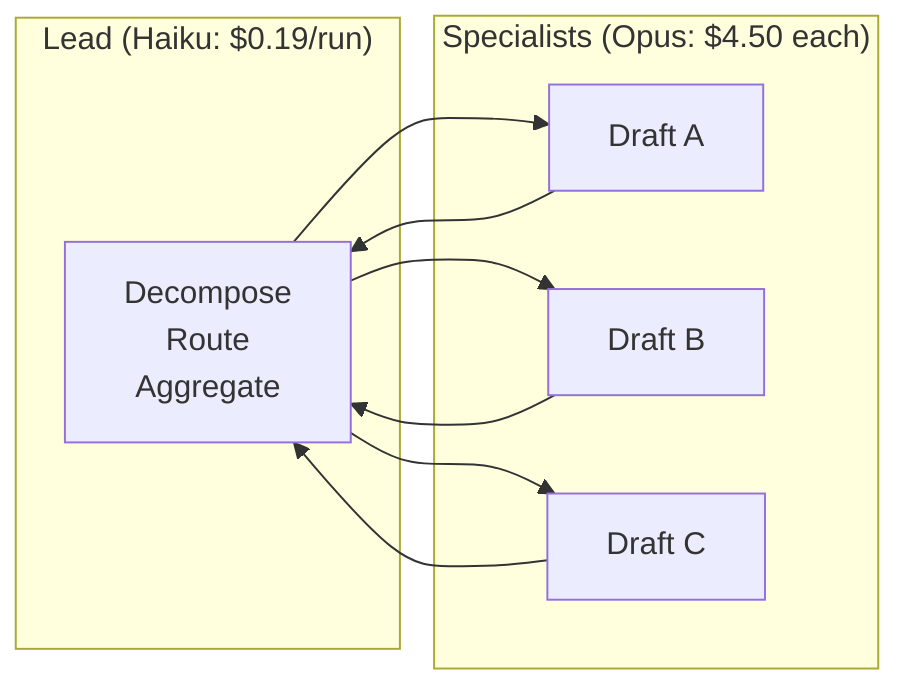

# Chapter 27: Token Economics of Loops

> **Reading note:** Named scenarios and numerical examples in this chapter are illustrative, not documented incidents or measured benchmarks. Code is a design sketch, not a tested implementation; `LoopKit` names describe the book’s illustrative API, not an established SDK. Provider behavior and prices require version-specific confirmation.

> "Cost kills loops before bugs do. A loop that works but cannot justify its expense is a demo, not infrastructure."

## The Loop That Ate the Budget

Tomás Reyes is a staff engineer at a healthcare data company processing electronic health records for forty regional hospital systems. His team built a loop that generates structured clinical summaries from unstructured physician notes. The loop reads a note (averaging 1,200 words), identifies diagnoses, medications, procedures, and follow-up instructions, then produces a JSON object conforming to their internal FHIR-adjacent schema. The oracle is a two-level validator: first, a deterministic schema check (JSON structure, required fields, coded values from approved terminology sets), and second, a rubric scorer that evaluates completeness by checking the summary against a term-extraction baseline. Pass rate stabilises at 91% after two weeks of prompt tuning. Physicians in this illustrative pilot report useful time savings on reviewed samples; broader clinical accuracy and deployment safety still require appropriate clinical evaluation.

Tomás runs the economics for production deployment. Assume 2,400 notes per day and an average **88,000 billed tokens per initiated run**, including retries and evaluation: 57,000 input and 31,000 output. This is a workload assumption, not a measured clinical deployment. The note itself is only a small fraction of the total; repeated instructions, schema context, tool results, generation, and verification account for the rest. A schema check and a terminology rubric are useful, but neither alone establishes clinical safety.

Use illustrative rates of $3 per million input tokens and $15 per million output tokens. These are arithmetic inputs, not a current quotation for an unspecified model family. The unrounded model cost is `(57,000 × 3 + 31,000 × 15) / 1,000,000 = $0.636`. Round to $0.64 for the planning tables below, and record that choice so billing reconciliation does not mistake rounding for unexplained spend.

At 2,400 runs per day, the rounded model-only estimate is $1,536 per day and $46,080 per 30-day month. Twelve such budget months cost $552,960; a 365-day operating year costs $560,640. If the $200,000 project budget reserves $50,000 for engineering and infrastructure, only $150,000 remains for model usage. That requires roughly a 73% reduction against the 360-day planning estimate, before additional operational costs. The pilot shows potential value, not flawless operation or a validated clinical oracle. Chapter 28 addresses possible reductions; this chapter makes the accounting explicit before the team commits to volume.

## Defining Cost Per Verified Outcome

Most teams track cost per API call or cost per million tokens. These metrics describe infrastructure consumption but do not answer the question that determines whether a loop should run in production: what does it cost to produce one unit of verified, shippable work?

**Cost per verified outcome** (CPVO) is defined precisely as the total monetary expenditure across all iterations, retries, verification passes, and coordination overhead, divided by the number of outputs that pass the oracle and ship to consumers.

The distinction between CPVO and per-run cost changes decisions, but it does not license counting retries twice. The $0.64 above already includes every attempted iteration in an initiated run. Divide aggregate spending by accepted outcomes over the same cohort. Separately report first-attempt pass rate, eventual acceptance rate, and human-resolved outcomes; 91% first-attempt success is not necessarily 91% eventual success.

This metric captures economic realities that raw token cost obscures. If a loop iterates five times before passing the oracle, the CPVO includes all five iterations' cost — not one-fifth of it. If a fleet of four specialists produces one verified synthesis, the CPVO includes all four specialists' token consumption plus the lead agent's coordination work. If a loop exhausts its budget without passing and escalates to a human, the tokens it consumed contributed zero verified outcomes — that expenditure increases the CPVO of the remaining successful runs because the denominator (successful outputs) does not grow while the numerator (total spend) does.

The precise formula:

CPVO_model = total billed model expenditure / N_accepted

CPVO_all_in = (model + tools + compute + storage + evaluation + human review + rework + allocated operations) / N_accepted

Use a common cohort and time window. Count each billing event once; categories such as retry, coordination, and input tokens overlap unless the ledger deliberately partitions them. Treat retry as a tag on an event rather than a second charge. Record unresolved outcomes separately and explain how late acceptances are attributed. When N_accepted is zero, CPVO is undefined or unbounded for decision purposes, not zero.

Retries are conditional experiments, not independent lottery tickets. Let q_j be the probability that attempt j is reached, c_j its conditional mean cost, and s_j its conditional pass probability. Then expected run cost is the sum of q_j c_j, and acceptance probability within the cap is the sum of q_j s_j. With comparable inputs and a fixed retry policy, their ratio estimates model CPVO. Use measured conditional rates: failures often concentrate on hard cases, stale tools, or a shared misunderstanding. A second attempt may succeed less often than a fresh first attempt.

For an illustrative three-attempt run, assume costs $0.40, $0.55, and $0.70, with conditional pass rates 0.80, 0.50, and 0.30. Reach probabilities are 1, 0.20, and 0.10. Expected cost is $0.58 and acceptance probability is 0.93, giving about $0.624 per accepted output before other costs. A repeated outage can make the later pass rates zero; retrying then adds spend without increasing acceptance. Increasing first-pass quality can reduce both cost and failure, but no universal 15–25% savings follows from a ten-point improvement. Even at constant cost, improving acceptance from 0.80 to 0.90 reduces CPVO by 11.1%, not 12.5%.

## Where Tokens Go: Single-Loop Anatomy

The useful categories are stable prompt/tool definitions, retained history, tool results, generated output, evaluation, and coordination. Their proportions depend on the workload. Do not treat an illustrative pie chart as a measured industry distribution. In particular, “failed iteration” is not an additional content category: failed calls contain the same input and output categories as successful calls.

Stable instructions and tool schemas can be large enough to dominate repeated requests. Measure the actual serialized request sent to the provider, including dynamically loaded tool definitions. Discovery-on-demand may reduce that cost, but introduces its own discovery calls and the risk of missing a necessary tool. History grows only if the harness retains it; pruning, compaction, and cache behavior alter both cost and evidence availability.

Tool results are often the easiest category to inspect. Reading 3,000 lines to answer a question about one function can waste tokens, but not every surrounding line is irrelevant: callers, imports, invariants, and security checks may change the conclusion. Extract a bounded slice with a source locator and an explicit truncation marker. Allow the agent to expand the slice when it identifies a gap. Filtering has compute and maintenance costs, and aggressive filtering can raise downstream rework costs.

At the illustrative $3/$15 rates, saving one output token saves five times as much as saving one uncached input token. Generating 30,000 output tokens costs $0.45; reading 55,000 uncached input tokens costs $0.165. The ratio of those totals is about 2.7, but the **per-token** leverage is five, not 2.7. Reducing verbosity is useful only while the output retains the evidence and structure its consumer needs.

Verification is not a quality guarantee. Its cost buys evidence about specified properties. A schema validator can reject malformed output but cannot establish clinical accuracy, security completeness, or a correct interpretation of a source. Run cheap discriminating checks first and reserve expensive judgments for remaining questions. Measure false acceptances and human correction effort rather than optimizing for an artificially high oracle pass rate.

Track failed-attempt expenditure separately as an overlapping diagnostic view. It can reveal a stalled dependency or a poor repair strategy without changing the invoice total. When retries become expensive, ask what prerequisite changes between attempts. A fresh prompt against the same unavailable tool is not a new opportunity for success.

## Where Tokens Go: Fleet Anatomy

A fleet multiplies the single-loop pattern by specialist count and adds coordination as a new cost category. Understanding fleet token distribution is essential because the coordination overhead — invisible in single-loop accounting — can dominate the budget for poorly designed fleets. The following model represents a five-specialist security review fleet with a lead on Sonnet, consistent with the architecture described in Chapter 24:

| Component | Input tokens | Output tokens | Cost (USD) |
|-----------------------------|--------------|---------------|------------|
| Lead: goal decomposition | 18,000 | 6,000 | \$0.14 |
| Lead: 5 delegation prompts | 12,000 | 5,000 | \$0.11 |
| Specialist A (auth review) | 48,000 | 22,000 | \$0.47 |
| Specialist B (data flow) | 42,000 | 18,000 | \$0.40 |
| Specialist C (API surface) | 52,000 | 25,000 | \$0.53 |
| Specialist D (dependencies) | 35,000 | 15,000 | \$0.33 |
| Specialist E (IaC review) | 40,000 | 18,000 | \$0.39 |
| Lead: result aggregation | 55,000 | 12,000 | \$0.35 |
| Oracle evaluation | 22,000 | 8,000 | \$0.19 |
| **Total** | **324,000** | **129,000** | **\$2.91** |


The illustrative coordination cost is $0.600, about 20.6% of the $2.907 total. Specialist work costs $2.121, so coordination adds about 28.3% on top of it; evaluation adds a separate $0.186. These shares do not prove that five specialists are worthwhile. Compare coverage and correction effort against a simpler design on equivalent tasks. Shared context, model biases, tools, and evaluators can create correlated errors despite separate worker contexts.

At 50 PRs per day, this fleet costs \$145.50 per day or roughly \$4,365 per month. Whether this is justified depends on the alternative cost — a question the break-even analysis below addresses directly.

## The Compounding Effect of Scheduled Execution

A run that seems cheap at unit cost becomes a major line item at sustained cadence. Teams consistently underestimate this compounding because they evaluate cost-per-run during development (where they run the loop manually, a few times per day) and do not project forward to production cadence. The psychological error is anchoring on the unit cost ("less than a dollar per run — basically free") without multiplying by the volume that production deployment implies.

The arithmetic for Tomás's clinical summary loop:

| Cadence | Runs/month | Monthly cost | 360-day budget year |
|-----------------------------|------------|--------------|-------------|
| Manual testing (10/day) | 300 | \$192 | \$2,304 |
| Pilot programme (100/day) | 3,000 | \$1,920 | \$23,040 |
| Single hospital (400/day) | 12,000 | \$7,680 | \$92,160 |
| Full deployment (2,400/day) | 72,000 | \$46,080 | \$552,960 |


The jump from pilot (affordable) to full deployment (budget-breaking) is a factor of 24 in volume. The loop did not get more expensive per run — the environment scaled, and the unit economics that worked at pilot volume become untenable at production volume. This is the single most common way loops die: they work technically, they pass pilot validation, they impress stakeholders in demos, and they fail economically when deployed at the scale they were designed for. The team discovers that "it works" and "it's affordable at scale" are different claims requiring different evidence.

At the rounded $2.91 per initiated run, 150 commits per day cost $13,095 per 30-day month. Four equally busy repositories cost $52,380. Running on forty eligible PRs per day across the same scope would cost $3,492, but only if the reduced cadence still meets the detection and freshness requirements. Cadence is both an engineering and a budget decision: a cheaper schedule that misses the required response window is not equivalent service.

A useful mental model: any loop that runs more than once per hour should have its annual cost calculated and posted on the team's cost dashboard before reaching production. Any loop that runs more than ten times per hour should require explicit budget approval from whoever manages the API spend. These are not bureaucratic hurdles — they prevent the gradual accumulation of scheduled loops from silently consuming the team's entire infrastructure budget. A team with ten loops running at moderate cadence can easily reach \$50,000 per month in aggregate API spend without any individual loop appearing expensive — each loop's owner sees only their \$5,000 line item, while the budget owner sees the aggregate. This is the "death by a thousand loops" failure mode that observability (Chapter 29) must surface before it becomes a budget crisis.

## Break-Even Against Human Baseline

A loop justifies its production cost when its cost per verified outcome is lower than the human alternative — adjusted for quality, speed, and the human time that remains necessary even with the loop running. This comparison is the fundamental economic test. If the loop costs more than the human it replaces (quality-adjusted), the loop should not run in production regardless of how technically impressive it is. If the loop costs less, the remaining question is whether the absolute cost fits within available budget.

The break-even calculation requires honest accounting on both sides. Teams commonly undercount the human cost (forgetting benefits, overhead, context-switching time, and the opportunity cost of senior engineers doing reviewable work) and undercount the loop cost (forgetting retries, human follow-up on loop failures, and the operational burden of maintaining the loop infrastructure).

Human cost must describe the same delivered outcome as the automated path. In the clinical illustration, seven minutes at $250/hour is $29.17 per manually completed summary. That is an opportunity-cost estimate, not necessarily cash that leaves the budget when automation succeeds. The team still needs evidence that review, correction, and downstream clinical work do not consume the apparent saving.

Consider a separate illustrative cohort of 100 initiated runs. Model spend including retries is $64. Ninety-one outcomes are accepted automatically. Nine require three minutes of professional review each, costing $112.50 at the assumed rate. If all nine are then accepted, total accepted outcomes are 100 and direct model-plus-review cost is $176.50/100 = $1.765 each. If only the 91 automatic outcomes are counted, the same expenditure divided by 91 is about $1.94, but that denominator omits the human-resolved deliverables and must be labeled accordingly. Do not divide model spend by one denominator and add human cost amortized over a different denominator.

Next add infrastructure, maintenance, incident handling, quality audits, and the cost of residual mistakes. These are not reasons to abandon the loop; they are part of its operating model. A clinical workflow may need checks for critical omissions that cost more than the extraction call. The economic comparison remains favorable only if the accepted outcome meets the required quality and liability constraints.

For the security-review illustration, the fleet model cost is $2.907 per initiated run. If 88% are accepted automatically and the remaining 12% each need ten minutes of human work at $85/hour, human follow-up costs $1.70 per initiated run. If those follow-ups produce accepted reviews, the direct cost is $4.607 per completed review, before operations and rework. The manual baseline of thirty minutes costs $42.50. Under these assumptions, even 100% ten-minute follow-up costs only $17.074 per run including the model; an 88% follow-up break-even point does not exist. If the human must repeat the entire thirty-minute review, the model may simply add cost. Specify the workflow before solving a break-even equation.

Speed can create additional business value, but do not count the same freed labor twice. If seven saved minutes are already valued at the physician's loaded rate, calling them “redirected productive time” does not automatically double the benefit. A separate speed premium needs separate evidence: for example, reduced waiting time that improves throughput at a constrained station without being included in the labor estimate. Report cash savings, released capacity, cycle-time benefits, and avoided losses as separate quantities.

Budget capacity is also different from return on investment. A positive expected return does not authorize spending beyond an approved ceiling. Forecast volume, preserve a contingency reserve for correlated failures, and give the budget owner a range rather than a single optimistic number. If a deployment cannot fit its envelope, reduce scope or cadence, improve the design, or obtain explicit budget approval; do not assume projected savings grant authority.

For batch workloads, meeting the deadline may matter more than shaving seconds off individual runs. For interactive workloads, response time can affect developer flow or operational delay. Quantify those benefits separately from labor savings and compare them against a credible human or deterministic baseline; a faster response is not automatically a higher-quality outcome.

## The Token Ledger

Production loops need instrumentation that tracks token expenditure by category, enabling targeted cost reduction. The `economics.py` module provides this ledger alongside the cost-model types:

```python

from __future__ import annotations

import time
from dataclasses import dataclass, field
from enum import StrEnum


class CostCategory(StrEnum):
    SYSTEM_PROMPT = "system_prompt"
    TOOL_SCHEMAS = "tool_schemas"
    CONVERSATION_HISTORY = "conversation_history"
    TOOL_RESULTS = "tool_results"
    ORACLE_EVALUATION = "oracle_evaluation"
    MODEL_REASONING = "model_reasoning"
    GENERATION = "generation"
    COORDINATION = "coordination"
    RETRY_OVERHEAD = "retry_overhead"


# Illustrative rate card only; production must pin model/version and effective date.
MODEL_RATES: dict[str, dict[str, float]] = {
    "haiku": {"input": 0.80, "output": 4.00},
    "sonnet": {"input": 3.00, "output": 15.00},
    "opus": {"input": 15.00, "output": 75.00},
}


@dataclass
class TokenEntry:
    """A single token-expenditure event tagged by category and model."""

    category: CostCategory
    input_tokens: int
    output_tokens: int
    model: str
    timestamp: float = field(default_factory=time.time)

    @property
    def cost_usd(self) -> float:
        rates = MODEL_RATES[self.model]  # Unknown models must not silently use another rate.
        return (
            self.input_tokens * rates["input"]
            + self.output_tokens * rates["output"]
        ) / 1_000_000


@dataclass
class TokenLedger:
    """Tracks token spend by category across a loop or fleet run."""

    entries: list[TokenEntry] = field(default_factory=list)

    def record(
        self,
        category: CostCategory,
        input_tokens: int,
        output_tokens: int,
        model: str = "sonnet",
    ) -> None:
        self.entries.append(
            TokenEntry(category, input_tokens, output_tokens, model)
        )

    @property
    def total_cost_usd(self) -> float:
        return sum(e.cost_usd for e in self.entries)

    def cost_by_category(self) -> dict[CostCategory, float]:
        breakdown: dict[CostCategory, float] = {}
        for entry in self.entries:
            breakdown[entry.category] = (
                breakdown.get(entry.category, 0.0) + entry.cost_usd
            )
        return breakdown

    def top_categories(self, n: int = 3) -> list[tuple[CostCategory, float]]:
        return sorted(
            self.cost_by_category().items(), key=lambda x: x[1], reverse=True
        )[:n]


@dataclass
class CostModel:
    """Predicts CPVO for a loop or fleet configuration."""

    base_input_tokens: int
    base_output_tokens: int
    model: str
    avg_iterations: float
    pass_rate: float
    specialist_count: int = 1
    coordination_tokens_per_specialist: int = 5_000

    @property
    def cost_per_attempt(self) -> float:
        rates = MODEL_RATES[self.model]  # Unknown models must not silently use another rate.
        per_specialist = (
            self.base_input_tokens * rates["input"]
            + self.base_output_tokens * rates["output"]
        ) / 1_000_000
        coordination = (
            self.coordination_tokens_per_specialist
            * self.specialist_count
            * rates["input"]
        ) / 1_000_000 if self.specialist_count > 1 else 0.0
        return per_specialist * self.specialist_count + coordination

    @property
    def cpvo(self) -> float:
        """Cost per verified outcome."""
        if not 0 < self.pass_rate <= 1 or self.avg_iterations < 1:
            raise ValueError("Require valid eventual acceptance rate and mean attempts")
        return self.cost_per_attempt * self.avg_iterations / self.pass_rate

    def monthly_cost(self, runs_per_day: int) -> float:
        # Volume is initiated runs, not accepted outcomes.
        return self.cost_per_attempt * self.avg_iterations * runs_per_day * 30
```

## The Model-Tiered Fleet as Economic Architecture

Consider an illustrative tiered fleet: a low-cost lead handles routine routing while specialists use a more capable model where the task warrants it. The labels below are placeholders for the rate card, not a verified description of a vendor deployment.

If the lead makes eight inference calls per fleet run (decompose goal, formulate five delegation prompts, read results, synthesise) and each averages 10,000 input + 4,000 output tokens, the lead's cost:

- On Haiku: (80,000 × \$0.80 + 32,000 × \$4.00) / 1,000,000 = \$0.064 + \$0.128 = \$0.19 per run
- On Sonnet: (80,000 × \$3.00 + 32,000 × \$15.00) / 1,000,000 = \$0.24 + \$0.48 = \$0.72 per run
- On Opus: (80,000 × \$15.00 + 32,000 × \$75.00) / 1,000,000 = \$1.20 + \$2.40 = \$3.60 per run

Using unrounded costs ($0.192, $0.720, $3.600), the low-cost lead is 3.75 times cheaper than the middle tier and 18.75 times cheaper than the high tier for this fixed token workload. Since routine routing can sometimes be implemented cheaply, the lead is worth evaluating at a lower tier. Do not assume its task is shallow: decomposing ambiguous goals and resolving conflicting results may require the strongest reasoning in the fleet.

A more capable specialist may reduce retries or human correction effort. But a model priced five times higher is not cheaper merely because it needs one attempt rather than two with similar token counts. Compare total accepted-outcome cost, including the lead's failures: routing, dependency management, and synthesis can require substantial reasoning too.



The general principle is to allocate model cost where measured capability differences improve accepted outcomes. Try a cheaper tier for bounded routing or formatting when evaluations justify it; do not assign a permanent reasoning hierarchy to product-family names. A coordinator resolving complex dependencies may need a stronger model than a specialist performing a narrow extraction.

The final-output acceptance rule, not a guessed percentage of “value contribution,” should govern tiering. Compare the same task cohorts with and without each specialist or lead model. A costly coordination step can prevent expensive downstream mistakes; a cheap one can conceal them. Report ablation results and uncertainty rather than assigning an arbitrary share of value to each worker.

For an idealized constant-cost, independent-attempt model only, acceptance probabilities 0.94 and 0.78 imply 1/p attempt factors about 1.06 and 1.28. At illustrative per-attempt costs $2.10 and $0.42, CPVO is about $2.23 and $0.54. The higher-priced model is still more expensive in that example. Real capped cascades need conditional success rates and attempt costs: hard failures, growing context, and shared missing evidence invalidate the simple geometric assumption.

## What Breaks

The cost model in this chapter assumes three things that drift over time: stable pricing, stable token consumption, and stable pass rates.

Model prices and billing categories can change across versions or contracts. Pin the applicable rate card and effective date, and alert on deviations between estimated and settled cost. An unchanged family name is not sufficient pricing identity.

Token consumption drifts as the environment evolves. Tomás's loop averaged 88,000 tokens when processing notes from forty hospital systems. If the company onboards ten additional systems whose physicians write longer notes (1,800 words versus 1,200 words average), per-run token consumption increases by roughly 15% without any change to the loop itself. Similarly, a code-review fleet's per-run cost grows as the codebase grows, because file reads return more content and more context is needed to understand the code under review.

Pass-rate definitions must remain stable. If eventual acceptance falls from 91% to 74% while total model spend per initiated run stays $0.64, model CPVO rises from about $0.703 to $0.865, a 23% increase. That calculation does not apply directly to first-attempt pass rate. Recalibrate against actual cohorts and investigate whether the task mix, model, tool availability, or evaluator changed.

A monthly CPVO increase of 3–5% compounds to roughly 43–80% over twelve periods. Alerting only against a moving baseline can normalize slow deterioration, so compare with both the approved budget and stable reference cohorts. Investigate pricing, task mix, context size, and retry policy before attributing the increase to a model change. Thresholds and review cadence should reflect workload volatility and the cost of delayed detection.

## Implementation Guidance: Make the Ledger Reconcile

The sketch above exposes the shape of accounting, not a production billing adapter. `avg_iterations` must include failed runs, while `pass_rate` is eventual acceptance under the same capped policy. Multiplying a constant attempt cost by the mean number of attempts is a simplifying approximation. When cost and difficulty are correlated, compute costs from actual events or the conditional model above rather than averaging them independently.

Give every provider request an immutable event ID and record the returned usage fields with the exact model version, pricing effective date, currency, cache-write/read categories, batch discount, and any tool fees. Some providers report reasoning usage inside output totals; adding it again double-counts tokens. Store estimated costs separately from settled charges, and reconcile daily totals against the provider invoice. Unknown usage after a timeout should remain unknown or estimated, not zero. A failed response can still incur a bill.

For shared fleets, reserve budget before dispatch and release unused reservations after workers finish. If each of five workers checks a $10 remaining balance independently, all five may spend it concurrently. The ledger needs an atomic shared reservation, not five optimistic reads. Budget events should distinguish committed spend, in-flight maximum exposure, and remaining allowance. Cancellation does not necessarily stop provider billing immediately.

A useful failure drill starts with a tool outage at the moment a large scheduled batch begins. The workers all fail on the same prerequisite, so their errors are correlated. The safe response is to trip the dependency circuit, retain completed outputs, and postpone affected work—not increase every worker's retry cap. The economic report should show successful outcomes preserved, unresolved items queued, and the avoided in-flight spend. Averages alone hide the burst and the human recovery queue.

Review economics by task class. Easy cases can subsidize pathological ones so completely that a healthy overall CPVO masks an unaffordable subtype. Track median and tail cost, acceptance, escalation minutes, and deadline misses for representative cohorts. Before optimizing, write down the constraint that cannot degrade: critical-defect recall, source coverage, latency, or review quality. A lower bill achieved by silently dropping hard tasks is a change in service, not an efficiency gain.

## Key Takeaways

- CPVO needs a clearly defined accepted outcome, cohort, and time window. Report model-only and all-in variants separately.
- Count billing events once. Retry and coordination tags must not duplicate input/output charges.
- Conditional retry success matters because hard cases and outages create correlated failures.
- Compare equal-quality delivered outcomes, including human review, rework, and operational costs.
- Do not double-count freed labor as a second speed benefit; distinguish released capacity from cash savings.
- Model tiering is an experiment, not a fixed cheap-lead rule. Measure routing and synthesis failures as well as specialist quality.
- Scope, cadence, tail costs, and in-flight reservations matter as much as price per token.

## The Loop Contract, So Far

The **budget** field specifies the accounting window, approved spend, maximum in-flight exposure, cost categories, and the accepted-outcome definition. It also states what happens when the budget is exhausted: preserve useful completed work, identify unresolved tasks, and return control to the owner. It does not authorize a fleet expansion or a new paid attempt simply because a previous attempt was expensive.

## Exercises

1. **Conditional retry model.** Recalculate the three-attempt example with second and third pass probabilities zero during an outage. Acceptance: show expected cost, accepted fraction, and CPVO; explain why the cold-start pass rate cannot substitute for conditional retry rates.
2. **Ledger reconciliation.** Record ten mocked requests including a cached call, a billed timeout, and a duplicate event delivery. Acceptance: invoice totals reconcile, the duplicate event is counted once, and missing usage is labeled rather than set to zero.
3. **All-in comparison.** Model 100 initiated reviews with 88 automatic acceptances and twelve human-resolved cases. Acceptance: use one denominator for all costs, then show how the conclusion changes if human follow-up repeats the entire review.
4. **Cadence sensitivity.** At $2.91 per initiated run, compare forty PRs/day, hourly, half-hourly, and 180 commits/day over a 365-day year. Acceptance: state the operating calendar and maximum runs/day below a $50,000 ceiling; do not assign an unstated rate to “continuous.”
5. **Concurrent budget drill.** Let five workers request the final $10 simultaneously. Acceptance: reservations never exceed the shared ceiling, completed work remains available after cancellation, and the report distinguishes settled cost from uncertain in-flight charges.

## Sources and Scope

- [Chapter 7](chapter-07.md), *Context Engineering I* — context as a finite resource.
- [Chapter 24](chapter-24.md), *From Loop to Fleet* — coordination and specialization.
- [Chapter 28](chapter-28.md), *Cost Engineering* — optimizing under quality constraints.
- [AWS Builders’ Library, Making retries safe with idempotent APIs](https://aws.amazon.com/builders-library/making-retries-safe-with-idempotent-APIs/) — service-specific retry identity and parameter-mismatch handling; not a pricing reference.

The rate card, clinical scenario, and fleet figures are illustrative arithmetic inputs. They do not certify current vendor prices, clinical safety, or observed productivity gains.

------------------------------------------------------------------------

*Next: Chapter 28 covers the engineering levers for reducing loop cost — prompt caching, batch processing, model cascades, extended-thinking budgets, context compression, and the discipline of killing loops that are not converging.*
