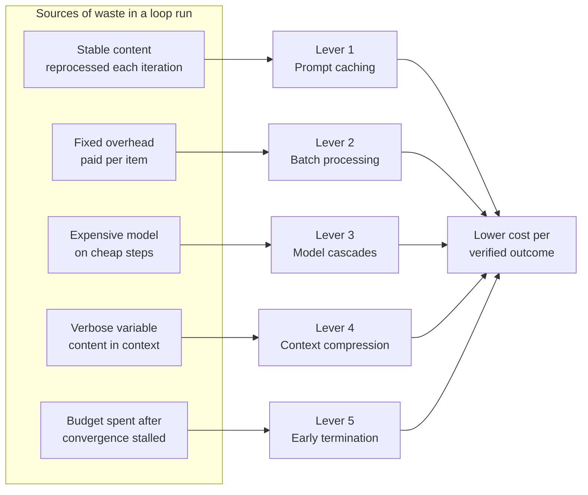

# Chapter 28: Cost Engineering

> **Reading note:** Named scenarios and numerical examples in this chapter are illustrative, not documented incidents or measured benchmarks. Code is a design sketch, not a tested implementation; `LoopKit` names describe the book’s illustrative API, not an established SDK. Provider behavior and prices require version-specific confirmation.

> "The cheapest token is the one you never send."

## The Thousand-Dollar Night

Kenji Watanabe runs a dependency-audit loop for a financial services firm. The loop runs nightly at 2 AM, scanning 340 internal packages across twelve microservices for known CVEs, checking licence compliance against the company's approved-licence list, and flagging outdated dependencies that have fallen more than two major versions behind. It works well: the security team trusts its nightly findings report and has eliminated two categories of manual checklist from their weekly process. The loop averages \$85 per night — acceptable for a compliance-critical function.

One Thursday evening, the company's build platform team completes a migration that adds twelve new monorepo packages from an acquired startup. Each package has deep dependency trees averaging 180 transitive dependencies — a consequence of the startup's preference for small, single-purpose npm packages. The loop, designed to read each `package-lock.json` in its entirety and cross-reference every entry against their CVE database, suddenly has 2,160 additional dependency entries to process.

The system prompt and tool schemas are reloaded for every package-level analysis call. Kenji never added prompt caching because the original 340 packages completed in twenty-two minutes and the cost was acceptable. The CVE database lookup tool returns verbose JSON for each known vulnerability: CVE identifier, description, affected version ranges, CVSS score, reporter information, timeline, references, and workaround notes — averaging 800 tokens per entry when only the identifier, affected versions, and CVSS score are needed for the loop's decision logic. Transitive dependency resolution adds extra iterations per package when the model must trace chains through three or four levels of indirection to determine whether a vulnerable transitive dependency actually affects the top-level package.

The loop runs from 2:00 AM to 5:47 AM and makes 1,247 model calls. The invoice estimate is $847, roughly ten times its normal $85 nightly cost. To keep this illustrative scenario arithmetically consistent, assume about **117.64 million billed tokens** at a 65/35 input/output mix and the chapter's hypothetical $3/$15 rates: the blended rate is $7.20 per million tokens. The previous draft's 4.2 million tokens would cost only $30.24, and could not contain 24.94 million repeated prefix tokens. Before optimizing anything, Kenji reconciles usage with billing and checks whether retries or repeated reads are counted twice. He then sets an 80% reduction target as an experiment, not a promised result.

## The Five Levers: Overview

Cost engineering targets overlapping sources of waste. The five levers below can be adopted incrementally, but their savings are neither independent nor additive. Caching and prompt-level batching both reduce repeated-prefix cost; compression changes the bytes that can be cached; a cascade can add extra calls on difficult inputs. Evaluate one change at a time, then the combined configuration, against all-in CPVO and the same quality constraints.

Prompt caching eliminates redundant processing of stable content across iterations. Batch processing amortises fixed overhead (system prompts, tool schemas) across multiple items in a single call. Model cascades ensure each step uses the cheapest model capable of handling it correctly. Context compression reduces the token count of variable content without losing decision-relevant information. Early termination stops loops that are not converging, saving the entire remaining budget for loops that would have exhausted it without passing.

Each lever can be adopted incrementally, but evaluate interactions before combining them. Start with the largest measured waste category rather than assuming caching is always the simplest or most valuable change.

Mapping each lever to the waste it removes shows why they compose rather than compete:



Note the target: every lever is judged against cost per verified outcome, not cost per call. A lever that halves token spend while doubling attempts-to-pass has achieved nothing.

## Lever 1: Prompt Caching

When stable content can be reused under a provider's cache rules, a cache read may cost less than a fresh input. Cache-write pricing, minimum prefix length, matching rules, lifetime, and model support are provider- and version-specific. For illustration only, assume a five-minute refreshable lifetime, reads priced at 10% of ordinary input, and a write multiplier of 1.25. Confirm actual terms before using this model in a budget.

The stable prefix in Kenji's example contains 20,000 tokens. Across 1,247 calls, uncached input cost is `20,000 × 1,247 × $3/M = $74.82`. Under the illustrative write/read multipliers, one cache write costs $0.075 and 1,246 reads cost $7.476, totaling $7.551. The saving is $67.269, about 89.9% of this prefix cost—not 89.9% of the entire $847 run. Expirations and prefix mutations require additional writes and reduce the benefit.

To maximise cache hits, structure every message with stable content first and variable content last. The system prompt, then tool schemas, then skill definitions, then conversation history (grows per iteration), then the current task. Any change to content before the variable section invalidates the cache for everything after it — so never intersperse variable data with stable definitions.

A slow tool can let the cache expire. Moving that tool to an asynchronous task does not shorten the interval between dependent model calls; the next call still needs its result. Accept the miss, use an appropriate supported lifetime, or overlap genuinely independent work. Do not send unnecessary keepalive inference requests or reorder safety checks just to preserve a discount.

A cache-friendly prompt separates stable policy from changing task data, which also makes revisions easier to audit. Do not claim a quality improvement from ordering alone. Evaluate instruction adherence and evidence use after restructuring, and ensure no stale cached prefix retains superseded policy.

## Lever 2: Batch Processing

Kenji's loop processes each package independently, making a separate model call per package. Each call loads the full system prompt and tool schemas. Prompt-level batching groups multiple items into a single model call, paying the system-prompt cost once for the batch rather than once per item.

Without batching: 352 packages × (20,000 token prefix + per-package analysis) = 7,040,000 tokens of repeated prefix cost. With batches of 10: 36 calls × (20,000 token prefix + 10 × per-package data) = 720,000 tokens of prefix cost. Savings on prefix alone: 6,320,000 tokens. Combined with prompt caching within the batch (the prefix is stable across the 36 calls), the savings compound further.

The tradeoff is quality versus cost. A model analysing ten packages simultaneously gives each package less attention than a model focused on one package alone — the same attention-dilution concern from Chapter 7. The design question: at what batch size does quality degrade below acceptable thresholds?

Batch size is empirical. Test single-item and grouped prompts on the same fixtures, including long items, mixed difficulty, and missing outputs. Even independent input items share an output budget and model context, so one malformed item can disrupt the whole response. Keep per-item identity and recovery explicit instead of asserting that ten or fifteen packages necessarily retain accuracy.

API-level batching is different from placing multiple items inside one prompt. A discounted asynchronous API may execute separate requests under a longer completion window; prompt-level batching changes the model's task and can couple failures across items. If a service offers a 50% discount with up to 24 hours to complete, a 2 AM audit due at 9 AM has only seven hours and cannot rely on that maximum window. Use it only when measured completion and a deadline-safe fallback satisfy the real contract. Count the fallback cost and prevent both paths from publishing duplicate results.

## Lever 3: Model Cascades

Not every step requires a language model. Parsing an installed version and matching an advisory range is normally a deterministic task with ecosystem-specific semantics. A model may help interpret ambiguous evidence, but a cheap model is not automatically an adequate substitute for a parser, nor is an expensive model proof of correct reachability analysis.

The cascade design for Kenji's loop:

Stage 1 (deterministic): Parse the lockfile, resolve package identities, and match installed versions against a pinned advisory snapshot. Return the covered inventory and unresolved entries as well as matches. A no-match result is bounded to that snapshot; it does not prove absence of vulnerabilities.

Stage 2 (model-assisted): For matched or ambiguous cases, inspect supporting evidence for reachability, exploit conditions, and operational impact. Preserve unknowns. Do not use a more expensive model to invent missing dependency data.

Stage 3 (specialist or human): Route unresolved high-consequence interpretation, including legal questions, to the appropriate expertise. A frontier model can assist the analysis; its price tier does not confer legal authority.

For a purely illustrative *exclusive routing* mix of 80%, 18%, and 2% with equal token volumes, the chapter27 rate card gives input cost $1.48/M and output cost $7.40/M. A true sequential cascade pays earlier-stage costs as well: all items pay Stage1, and escalated items also pay later stages. Weight by actual token volume, not only item count. If hard cases produce longer outputs, the cheap-tier share of items can be misleading.

A deterministic package parser and version-range matcher should perform the first pass. “The model returned no CVE identifiers” is not a completeness check: it may have missed a dependency, used stale advisory data, or failed to parse a lockfile. Accept a no-match result only when the inventory, advisory snapshot, ecosystem-specific version semantics, and coverage status are known. Escalate parse failures and unresolved package identities as unknown, not clean. Reserve model reasoning for evidence interpretation or reachability questions that deterministic tools cannot answer.

Separate contexts reduce one form of contamination, but do not establish independent failures. A cheap model and an expensive model can share training biases, the same stale source, the same broken tool, and the same weak validator. Test cascades on those common-cause failures; if a prerequisite is missing, route to evidence recovery rather than merely a higher-priced model.

## Lever 4: Context Compression

Every token in context costs money. Context compression reduces the token count of the variable portions of the prompt without losing the information needed for correct decisions.

**Tool result summarisation** addresses the largest single cost category (27% of tokens per Chapter 27's analysis). Kenji's CVE lookup returns 800 tokens per vulnerability entry when only four fields matter: CVE ID, affected versions, CVSS score, and a one-line description. A programmatic post-processing step — not a model call, just code — that extracts these four fields reduces each entry to approximately 100 tokens: an 87% reduction per lookup. Across 1,247 calls with an average of 3 lookups each, this saves roughly 2,617,500 tokens.

**Conversation history pruning** removes old iterations from the context window, retaining only recent iterations and their feedback. By iteration five of a complex package analysis, the conversation carries iterations one through four in full: approximately 50,000 tokens of historical context that the model must read on every subsequent call. Pruning to the last two iterations reduces this to roughly 20,000 tokens — a 60% reduction in history cost. The model loses access to iterations one through three's specific details, but the feedback from iteration four typically summarises what was learned from earlier iterations.

**Selective file loading** reads only the portions of files relevant to the current decision. Instead of loading an entire `package-lock.json` (which for a large monorepo package might span 15,000 tokens), a preprocessing step extracts only the dependency entries with known CVE matches (typically 200-500 tokens). Chapter 9 applies the same principle to tool schemas: discovery-on-demand can reduce up-front definitions, but its savings and retrieval coverage need measurement for the deployed tool inventory.

## Lever 5: Killing Non-Converging Loops

Early termination is a policy decision under uncertainty, not proof that a loop cannot converge. Three flat scores may indicate a stalled strategy, a noisy grader, or a prerequisite that is about to become available. Require a concrete next action that can change the evidence or prerequisite; otherwise stop with useful partial results. Use task-specific caps, dependency circuit breakers, and remaining budget alongside score trends.

Kenji's loop encounters this with complex transitive dependency chains. The model attempts to trace a chain, fails (the oracle rejects the incomplete analysis), tries again from a different starting point, fails again, then attempts a third variation that is no better than the first two. Without early termination, it would continue for all seven allowed iterations — consuming 175,000 tokens — before giving up and escalating. With a convergence guard that kills after three flat-or-declining iterations, it escalates at iteration three having consumed only 75,000 tokens.

The convergence guard from Chapter 18 (*The Stop Problem*) applies directly:

```python

from dataclasses import dataclass, field


@dataclass
class ConvergenceGuard:
    """Terminates loops that are not making measurable progress."""

    patience: int = 3
    min_improvement: float = 0.05
    scores: list[float] = field(default_factory=list)

    def record_score(self, score: float) -> None:
        self.scores.append(score)

    def should_terminate(self) -> bool:
        if len(self.scores) < self.patience:
            return False
        recent = self.scores[-self.patience:]
        # No meaningful improvement across the patience window
        if max(recent) - min(recent) < self.min_improvement:
            return True
        # Scores are monotonically declining
        if all(recent[i] >= recent[i + 1] for i in range(len(recent) - 1)):
            return True
        return False
```

Across an illustrative 28 stalled packages, saving 100,000 tokens each saves 2.8 million tokens. At a 65/35 input/output mix and the $3/$15 rates, that is $20.16. The earlier $33 figure does not follow from those assumptions. More importantly, termination shifts some work to a human queue; measure that queue's cost and deadline impact rather than presenting all avoided model spend as net savings.

What happens after termination matters as much as the termination decision itself. Three strategies serve different needs: escalate (flag for human review — appropriate when the analysis is critical and human expertise can resolve what the model cannot), skip and log (mark the package as "not analysed: convergence failure" and continue — appropriate for low-severity items where incomplete coverage is acceptable), or escalate to a more capable model (retry with Opus using a fresh context — appropriate when the task is genuinely hard but solvable with more reasoning capability). The choice should be encoded in the loop's configuration, not decided at runtime by the model itself.

## Latency Versus Cost

Cost optimisations and latency optimisations are correlated but not identical. Some techniques improve both: caching reduces reprocessing time (fewer tokens to process means faster responses) and compression reduces prompt size (shorter prompts yield lower first-token latency). Others trade latency for cost: cascading through cheap models first adds latency when the cheap model fails and must escalate (two calls instead of one), and API-level batching trades 24-hour latency for 50% cost reduction.

For Kenji's audit, latency has a seven-hour deadline rather than being irrelevant. Caching and bounded compression are candidates, but each must preserve coverage. Asynchronous discounted processing needs a deadline-safe fallback. Interactive tasks may tolerate a fast deterministic first stage while avoiding a slow multi-model cascade. Optimize the actual latency distribution and failure path, not the label “batch” or “interactive.”

The general principle is to optimize cost subject to the real latency and quality contract. A batch still has a deadline, and a faster response that omits evidence may create more human work. Measure normal and fallback paths before choosing a cascade or asynchronous service.

## Putting It Together: Kenji's Fix

Kenji starts with the reconciled baseline and changes one mechanism at a time. The cached-prefix estimate saves about $67.27 from the $847 example, leaving roughly $779.73 if nothing else changes. That result is useful but nowhere near an 80% reduction. It tells him to investigate the larger categories instead of celebrating a high cache-hit percentage.

He next moves deterministic inventory extraction and version matching outside the model. This is a redesign of the work allocation, not merely a cheaper model substitution. He retains the old and new inventory outputs for each package, compares them, and treats unmatched package identities as coverage gaps. The model receives only matched advisories plus enough dependency context to reason about applicability. A test set includes unusual version syntax, duplicated package names across ecosystems, stale advisory snapshots, and truncated lockfiles.

Prompt-level batching follows only after single-item behavior is sound. Each item carries its own stable ID and verdict; a failed item can be retried without rerunning the entire batch. The output validator checks cardinality, IDs, duplicates, missing items, and coverage. Batch size is bounded by output limits as well as input limits. A superficially valid JSON object that silently omits package nine is a failure, not a saving.

Finally, Kenji evaluates the combined system on the same task distribution, recording full model cost, tool compute, reviewer minutes, deadline misses, and unresolved coverage. He does not multiply optimistic percentage savings from overlapping categories. The 80% goal is accepted only if the measured all-in result meets it without degrading required coverage. If the evidence is insufficient, he publishes a bounded partial improvement and keeps the remaining work visible.

The release decision is separate from the experiment. Keep the baseline available, use a limited rollout, and roll back the cost optimization if critical findings disappear or the human queue grows beyond capacity. Chapter 40 expands this into evaluation-driven change control.

## What Breaks

Cost engineering introduces its own failure modes that teams must monitor. The most dangerous pattern is an optimisation that changes behaviour without anyone noticing the change.

Aggressive compression that removes information the model needed. A loop previously reading entire files now reads only targeted sections. If the section-selection heuristic misses a relevant code region — perhaps a function defined 200 lines above the flagged vulnerability that establishes the context needed to assess severity — the loop's analysis quality degrades. But the degradation is silent: the oracle still passes (the finding is structurally correct, just missing severity context), and cost metrics improve (fewer tokens consumed). The quality loss surfaces only when a human reviews the output months later and notices that severity assessments have become less nuanced.

Overly aggressive cascading. The cheaper model "passes" the validator because the validator checks structural correctness (valid JSON, required fields present) rather than analytical depth. The finding technically validates but is shallow — missing the transitive dependency path that a more expensive model would have identified. The cascade saves money by terminating at the cheap tier while the expensive tier would have produced a more complete analysis.

The cost of an optimization includes its quality regressions. Use matched inputs, independently adjudicated critical cases, and an evaluation set large enough for the proposed margin. Fifty inputs do not establish a two-percentage-point non-inferiority claim. Separate severity-specific gates from average scores, and inspect cases where compression or cheap routing suppresses a finding. Chapter 40 develops the release decision; here, the rule is to treat cost parameters as behavior-changing configuration.

## Key Takeaways

- Optimize all-in cost per accepted outcome, not just tokens or first-pass scores.
- Cache, batch, routing, compression, and retry effects overlap; measure the combined configuration.
- Cache-write costs, expiry, matching rules, and support are provider-specific.
- A seven-hour deadline is not compatible with relying on a 24-hour completion window.
- Use deterministic parsing and version matching before model interpretation; missing evidence is not “clean.”
- Common tools, sources, and validators can make cascade failures correlated.
- Stop stalled work with explicit partial coverage, without silently converting unknowns into successes.

## The Loop Contract, So Far

The **budget** field now includes optimization assumptions and a quality constraint: cache policy, batch size, routing, compression, and termination rules are versioned behavior. An optimization is accepted only when coverage, safety, and latency remain within the task's approved bounds. Reducing the scope of hard cases requires an explicit service decision, not a quiet change to the denominator.

## Exercises

1. **Cache economics.** Recalculate the 1,247-call example with ten cache writes instead of one. Acceptance: distinguish real token counts from billed token-equivalents, include write premiums, and reconcile to the rate card.
2. **Batch correctness.** Process twenty fixture items at batch sizes 1, 5, and 10. Inject one malformed response and one missing item. Acceptance: retain successful item results, identify every missing ID, and retry only unresolved work within the deadline.
3. **Cascade safety.** Use lockfiles with known matches, stale advisories, and unsupported version syntax. Acceptance: a missing CVE in model output never overrides deterministic evidence; unsupported inputs remain unknown.
4. **Compression audit.** Remove a relevant caller or a qualifying advisory paragraph from a tool slice. Acceptance: the pipeline expands evidence or flags insufficiency rather than passing a misleadingly concise answer.
5. **Correlated outage drill.** Fail the shared advisory tool for all workers. Acceptance: trip a shared circuit, retain completed results, avoid repeated paid reasoning against unchanged failure, and report the human recovery cost.

## Sources and Scope

- [Chapter 7](chapter-07.md), *Context Engineering I* — context selection.
- [Chapter 9](chapter-09.md), *Tool Design at Scale* — bounded tool results and discovery.
- [Chapter 18](chapter-18.md), *The Stop Problem* — bounded continuation.
- [Chapter 27](chapter-27.md), *Token Economics of Loops* — cohort accounting and conditional retry costs.
- [Anthropic, Demystifying evals for AI agents](https://www.anthropic.com/engineering/demystifying-evals-for-ai-agents) — grader calibration, transcript inspection, and maintaining evaluation suites; not a source for the numerical savings examples.

All rates and discounts in the examples are hypothetical planning assumptions. They do not establish current product pricing or measured savings.

------------------------------------------------------------------------

*Next: Chapter 29 covers the telemetry that tells you whether your cost engineering is working or your fleet is silently burning money — observability, per-agent tracing, and deterministic replay for post-hoc debugging.*
