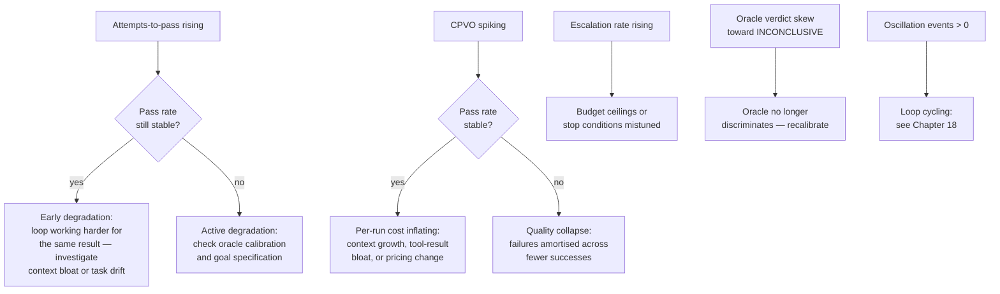

# Chapter 29: Observability, Tracing, and Replay

> **Reading note:** Named scenarios and numerical examples in this chapter are illustrative, not documented incidents or measured benchmarks. Code is a design sketch, not a tested implementation; `LoopKit` names describe the book’s illustrative API, not an established SDK. Provider behavior and prices require version-specific confirmation.

> "If you cannot trace it, you cannot trust it. If you cannot replay it, you cannot debug it."

## The Expensive Mystery

Rania Khalil manages an autonomous code-review fleet at a platform engineering consultancy. The fleet runs on client PRs across twelve repositories, deploying three specialists per review (security, logic, and performance). On Wednesday morning, the cost dashboard shows \$312 in API spend — triple the daily average of \$95-110. The fleet produced normal output: review comments on 47 PRs across the twelve repositories. Pass rate is 86%, within one standard deviation of the 30-day mean. Nothing in the fleet's visible output suggests a problem. From the consumer's perspective — the engineers reading review comments on their PRs — Wednesday was indistinguishable from any other day.

Rania opens the model provider's usage dashboard. Total tokens consumed: 2.8 million, where the daily average is 950,000. But the provider dashboard reports aggregate consumption. It cannot tell Rania which repository's loop consumed the excess, which specialist within that loop drove the overage, how many iterations that specialist ran, or what specific tool calls generated the excessive token consumption. The provider tracks API calls (model name, token counts, timestamps). It does not track loop semantics (iteration boundaries, oracle verdicts, decision rationale, tool-call-to-finding relationships).

Rania spends four hours reconstructing the incident from application logs, correlating timestamps between the fleet's stderr output, the provider's billing API, and the git history of the twelve repositories. She eventually identifies the culprit: a single PR in the `payments` repository contained a 4,200-line auto-generated protobuf file. The performance specialist — tasked with identifying computation-heavy patterns — read this file in its entirety on every iteration. The file was 42,000 tokens. The specialist iterated seven times because the oracle kept failing on an unrelated formatting issue in its findings report (it output markdown tables instead of the required JSON schema). Seven reads of 42,000 tokens total 294,000 input tokens, costing $0.882 at the illustrative $3/M uncached input rate. If the specialist consumed 1.4 million total tokens, that is half the day's token volume, not necessarily half its dollar cost. The $312 daily bill requires a separate model/rate/usage reconciliation; these token counts alone do not explain it.

If Rania had loop-level tracing, this investigation would take ninety seconds. Query: "traces from Wednesday where cost_usd \> 10." Result: one trace, the `payments` repository PR. Drill into the trace: specialist `performance-reviewer` ran seven iterations. Drill into iteration three: tool call `read_file("generated/payment_types.pb.go")` returned 42,000 tokens. Root cause identified. Time to resolution: under two minutes instead of four hours.

This chapter defines the telemetry that production agent fleets require. What to trace, how to structure multi-agent traces, which metrics predict fleet health problems before they become cost incidents, and how to build deterministic replay for post-hoc debugging when traces alone cannot explain why the model made a particular decision.

## Extend Existing APM with Loop Semantics

Traditional service telemetry remains useful. Latency, traffic, errors, and saturation still reveal queueing, tool outages, resource contention, and deadline failures. What it usually lacks is the application-specific relationship between a business task, its attempts, evaluator decisions, model requests, and external effects. Extend that model rather than replace it.

A loop's duration varies with task complexity, queueing, tool latency, and retries. P99 latency remains meaningful for a well-defined cohort and deadline; a global percentile mixing tiny edits and migrations may hide both. Record end-to-end latency, queue delay, and execution time separately, including incomplete and timed-out runs.

A loop is not a single request. From the infrastructure's perspective, a loop run generates dozens of independent API calls — each one a separate "request" with its own latency and token count. The loop is the logical unit of work, but traditional APM sees only the individual calls. Correlating these calls into the coherent unit that is "one loop run" requires explicit instrumentation that standard APM tools do not provide.

A loop is non-deterministic. Two runs on identical inputs may follow different tool sequences, read different files (because one finds the relevant code on the first search attempt while the other needs three searches), and iterate different numbers of times. Alerting on "unexpected tool sequence" is meaningless because tool-sequence variation is normal loop behaviour, not anomalous. The alerts that matter are aggregate: cost per run exceeding rolling baseline, iteration count exceeding historical average for similar inputs, pass rate dropping below threshold.

Cost is the primary operational metric. In traditional services, cost is infrastructure (servers, bandwidth) and roughly constant per request. In loops, cost varies by orders of magnitude between runs because it depends on iteration count, context size (which grows per iteration), model selection (if cascading), and tool-result volume. A single pathological run (Rania's protobuf incident) can consume more budget than fifty normal runs combined. The telemetry system must track cost as a first-class signal on every run, not just in monthly billing aggregates.

These four differences mean that agent loops require their own observability framework — one designed around iterations, decisions, and economic outcomes rather than requests, latencies, and error codes. The remainder of this chapter defines that framework.

## The Trace Schema

Every loop run produces a trace — a structured record of its execution semantics, designed for cost diagnosis, health monitoring, and debugging. The `telemetry.py` module defines the trace schema consistent with the loopkit architecture:

```python

from __future__ import annotations

import hashlib
import time
import uuid
from dataclasses import dataclass, field
from typing import Any


@dataclass
class ToolSpan:
    """One tool invocation within an iteration."""

    tool_name: str
    arguments_summary: str  # Truncated — never store full arguments (PII risk)
    result_tokens: int      # Token count of the result, not the result itself
    duration_ms: int
    error: str | None = None


@dataclass
class IterationSpan:
    """One complete loop iteration: model call + tool calls + oracle verdict."""

    index: int
    model: str
    input_tokens: int = 0
    output_tokens: int = 0
    cache_hit_tokens: int = 0
    thinking_tokens: int = 0
    tool_spans: list[ToolSpan] = field(default_factory=list)
    decision: str = ""           # One-line: what the model decided to do
    outcome: str = ""            # "continue" | "complete" | "escalate" | "killed"
    oracle_verdict: str = ""     # "pass" | "fail" | "inconclusive" | ""
    oracle_score: float | None = None
    cost_usd: float = 0.0
    started_at: float = field(default_factory=time.time)
    ended_at: float = 0.0

    @property
    def duration_ms(self) -> int:
        return int((self.ended_at - self.started_at) * 1000)

    @property
    def total_tool_tokens(self) -> int:
        return sum(ts.result_tokens for ts in self.tool_spans)


@dataclass
class Trace:
    """Complete execution trace of a loop or specialist run."""

    trace_id: str = field(default_factory=lambda: uuid.uuid4().hex[:16])
    loop_name: str = ""
    input_hash: str = ""       # Deterministic — enables deduplication
    parent_trace_id: str | None = None   # Links specialists to lead
    iterations: list[IterationSpan] = field(default_factory=list)
    child_trace_ids: list[str] = field(default_factory=list)
    status: str = "running"    # running | succeeded | failed | killed | escalated
    started_at: float = field(default_factory=time.time)
    ended_at: float = 0.0
    metadata: dict[str, Any] = field(default_factory=dict)

    @property
    def total_cost_usd(self) -> float:
        return sum(it.cost_usd for it in self.iterations)

    @property
    def total_iterations(self) -> int:
        return len(self.iterations)

    @property
    def total_tokens(self) -> int:
        return sum(it.input_tokens + it.output_tokens for it in self.iterations)

    def start_iteration(self, model: str) -> IterationSpan:
        span = IterationSpan(index=len(self.iterations), model=model)
        self.iterations.append(span)
        return span

    def close(self, status: str) -> None:
        self.status = status
        self.ended_at = time.time()

    @classmethod
    def for_input(cls, loop_name: str, task: str) -> "Trace":
        return cls(
            loop_name=loop_name,
            input_hash=hashlib.sha256(task.encode()).hexdigest()[:16],
        )
```

The critical design decisions encoded in this schema: store token counts and durations, not content. Full model responses and tool results are enormous — a seven-iteration trace with full content would exceed 500KB, creating storage cost problems at fleet scale. The trace stores the metadata needed for cost diagnosis and health monitoring. Full content goes to a separate replay store (discussed below) with shorter retention and higher storage tiers.

Store one-line decision summaries, not full reasoning. After each iteration, the trace records what the model decided — "retry with different file selection," "escalate: cannot resolve formatting issue," "read additional context from caller function." These summaries enable diagnosis ("why did it iterate seven times?" — answer: "it made the same formatting mistake on each iteration") without the storage overhead of the model's full chain-of-thought.

## Tracing a Fleet: Parent-Child Correlation

In a multi-agent fleet, the lead agent's trace is the root, and each specialist's trace is a linked child. When the lead dispatches a specialist, it passes a trace context that establishes the parent-child relationship. Any query that retrieves the lead's trace can follow child links to retrieve specialist traces, reconstructing the full fleet execution tree.

```python

@dataclass
class TraceContext:
    """Propagated across agent boundaries for trace correlation."""

    trace_id: str
    span_id: str = field(default_factory=lambda: uuid.uuid4().hex[:12])
    parent_span_id: str | None = None

    def child(self) -> "TraceContext":
        return TraceContext(
            trace_id=self.trace_id,
            parent_span_id=self.span_id,
        )


class FleetTracer:
    """Correlates traces across lead and specialist agents."""

    def __init__(self, root_trace: Trace):
        self.root = root_trace
        self.specialist_traces: dict[str, Trace] = {}

    def start_specialist(self, name: str, ctx: TraceContext) -> Trace:
        trace = Trace(
            loop_name=f"{self.root.loop_name}/{name}",
            parent_trace_id=ctx.trace_id,
        )
        self.specialist_traces[name] = trace
        self.root.child_trace_ids.append(trace.trace_id)
        return trace

    def fleet_summary(self) -> dict[str, Any]:
        return {
            "lead_cost": self.root.total_cost_usd,
            "lead_iterations": self.root.total_iterations,
            "specialists": {
                name: {"cost": t.total_cost_usd, "iterations": t.total_iterations, "status": t.status}
                for name, t in self.specialist_traces.items()
            },
            "total_cost": self.root.total_cost_usd + sum(
                t.total_cost_usd for t in self.specialist_traces.values()
            ),
        }
```

With parent-child tracing, Rania's investigation becomes: query for the lead trace covering the expensive PR, then inspect child traces. The performance specialist's child trace immediately shows seven iterations with 42,000 tokens of tool-result cost per iteration. The diagnostic path from "cost spike" to "root cause" follows the trace links without any log archaeology. The parent-child model also enables aggregate fleet-level queries: "across all specialist traces this week, which tool calls consumed the most total tokens?" — surfacing systemic patterns (a particular file or tool consistently generating large results) that would be invisible when examining individual traces in isolation.

## The Five Metrics That Predict Fleet Health

The five metrics below are useful diagnostics, not complete proof of fleet health. Combine them with service SLOs, safety events, data freshness, and the unresolved-effect queue. Interpret trends by task class and evaluator revision.

Read in combination rather than isolation, they form a diagnostic tree:



Attempts-to-pass can rise before completion falls, but not every failure develops gradually. Monitor both leading trends and immediate high-consequence events.

**Attempts-to-pass** measures attempts among runs that eventually pass. Report that conditional mean alongside overall completion, attempts spent on failed runs, and the configured cap. Otherwise a system can look more efficient by abandoning difficult work. There is no universal healthy range: first-attempt success may indicate a good model on easy tasks, not a lenient oracle. Calibrate the evaluator on known-good and known-bad cases instead of targeting a rejection rate.

**Cost per verified outcome** (CPVO), defined in Chapter 27, tracks economic health. A CPVO spike with stable pass rate means per-run cost is inflating (context bloat, tool-result growth, model pricing change). A CPVO spike with declining pass rate means quality is degrading (more runs failing, their cost amortised across fewer successes). Either pattern demands investigation, but the diagnostic path differs.

**Oracle verdict distribution** separates pass, fail, and inconclusive observations. State whether the denominator is attempts or terminal runs, and segment by task class. An increase in inconclusive results may indicate missing evidence, a broken tool, or an evaluator coverage gap; it is not automatically loss of model capability. Set thresholds against the task's risk and a stable baseline rather than a universal 80/15/5 distribution.

**Escalation rate** measures runs needing a decision or action outside the loop. Track the reason, queue age, human effort, and whether escalation was appropriate. A high rate may be correct for a high-stakes workflow; a low rate may hide unsafe autonomous actions. Compare against the designed authority boundary and staffing capacity, not an arbitrary percentage.

**Oscillation events** count runs where oracle scores alternate between improving and worsening without converging: \[0.6, 0.7, 0.5, 0.7, 0.5, 0.6...\]. One oscillation is normal exploration — the model tries an approach, the oracle rejects it, the model pivots. Three or more consecutive oscillations indicate the model is cycling between incompatible approaches without finding a path that satisfies all oracle dimensions simultaneously. The pattern often emerges when oracle dimensions conflict: improving on dimension A (code correctness) causes regression on dimension B (style conformance), and the model alternates between fixing A and fixing B without ever satisfying both. Oscillating runs should be terminated by the convergence guard (Chapter 28) and counted as a fleet-health signal. If oscillation events exceed 5% of total runs, the oracle dimensions may need rebalancing or the task may need decomposition into sub-tasks with non-conflicting success criteria.

## Deterministic Replay

Traces tell you what happened and how much it cost, but they cannot tell you why the model made a particular decision. When Rania needs to understand why the performance specialist read `payment_types.pb.go` on every iteration instead of recognising after the first read that the file was auto-generated and irrelevant, she needs replay: re-executing the loop from recorded data to observe the model's decision-making step by step.

Record/replay substitutes captured model outputs and tool observations into the old execution path. It can reproduce harness decisions only when the relevant environment, code, ordering, clocks, randomness, and state are controlled. A new live model call is a **counterfactual evaluation**, not deterministic replay. Neither mode reveals the model's private internal reasoning or proves why it chose an action.

```python

from pathlib import Path
import json


@dataclass
class Replay:
    """Re-executes a loop from recorded model and tool responses."""

    trace: Trace
    model_responses: list[dict[str, Any]]
    tool_responses: list[dict[str, Any]]
    _model_idx: int = 0
    _tool_idx: int = 0

    @classmethod
    def load(cls, recording_path: Path) -> "Replay":
        data = json.loads(recording_path.read_text())
        trace = Trace(**data["trace_metadata"])
        return cls(
            trace=trace,
            model_responses=data["model_responses"],
            tool_responses=data["tool_responses"],
        )

    def next_model_response(self) -> dict[str, Any]:
        """Return the recorded model response for the next call."""
        response = self.model_responses[self._model_idx]
        self._model_idx += 1
        return response

    def next_tool_response(self, expected_tool: str) -> str:
        """Return the recorded tool response, asserting tool name matches."""
        recorded = self.tool_responses[self._tool_idx]
        if recorded["tool_name"] != expected_tool:
            raise ReplayDivergence(
                f"Step {self._tool_idx}: expected '{recorded['tool_name']}', "
                f"got '{expected_tool}'"
            )
        self._tool_idx += 1
        return recorded["result"]


class ReplayDivergence(Exception):
    """The replay execution diverged from the recorded trace."""
    pass
```

Recording has serialization, I/O, storage, and privacy costs. Asynchronous buffering can reduce critical-path delay but may lose unflushed data on a crash. Choose durability according to the event's consequence; do not claim zero latency or guaranteed replay completeness from background writes. The illustrative 2–5 MB per full trace must be measured for the actual workload.

The retention strategy balances debugging utility against storage cost, using a tiered approach that keeps recent data at full fidelity and progressively reduces detail as data ages:

| Tier | Duration | What is stored | Per-trace size |
|----|----|----|----|
| Hot | 72 hours | Full replay data: model responses, tool results | 2-5 MB |
| Warm | 14 days | Trace metadata + iteration summaries | 100-300 KB |
| Cold | 90 days | Trace metadata only: cost, status, duration, iteration count | 5-15 KB |


The hot tier exists for active debugging (Rania's Wednesday incident). The warm tier exists for trend analysis (comparing this week's iteration patterns to last week's). The cold tier exists for long-term fleet health dashboards (monthly cost trends, seasonal patterns in pass rates). Automatic promotion from hot to warm at 72 hours, and from warm to cold at 14 days, prevents unbounded storage growth.

## The Money-Fire Dashboard

Rania's \$312 incident could have been caught in real time with a properly configured cost-velocity alert. The "money fire" pattern is identifiable in real time: a run whose cumulative cost is growing linearly (constant token expenditure per iteration) while its oracle score is flat or declining (not converging toward a pass). This pattern means the loop is spending money without approaching success — it will exhaust its budget and escalate, having wasted every token it consumed.

The dashboard widget that detects money fires monitors all active runs simultaneously and flags any run whose cost exceeds 3x the rolling average for that loop type while its score trajectory shows no improvement. Preventing four additional file reads would save 168,000 input tokens, or $0.504 at the illustrative $3/M rate, plus whatever other calls were avoided. Investigation time may also fall, but the exact saving must be measured rather than inferred from the existence of a dashboard.

The convergence guard from Chapter 28 should kill these runs automatically. The dashboard's role is not automated response (that is the guard's job) but visibility: showing operators how often guards activate, what conditions trigger them, and whether the activation threshold is correctly calibrated. A guard that activates on 25% of runs is too aggressive — it is killing runs that would have converged. A guard that never activates while the fleet's average cost-per-run is climbing is too passive — non-converging runs are consuming budget without triggering termination. The dashboard reveals these miscalibrations through trend lines that no individual run's alert would surface.

## Integration with Existing Observability Stacks

Agent traces must coexist with existing infrastructure telemetry. Two integration patterns serve teams with different observability stacks.

For OpenTelemetry-based systems (Datadog, Honeycomb, Jaeger, Grafana Tempo), map loop iterations to OTEL spans. The Trace ID propagates through fleet agent boundaries. Each iteration becomes a span with custom attributes (`loop.iteration`, `loop.cost_usd`, `loop.oracle_verdict`, `loop.model`). Tool calls within an iteration become child spans. This allows fleet execution to appear alongside traditional service traces in the same dashboard, correlated by trace ID when a loop is triggered by an incoming HTTP request or webhook. The key implementation detail: set the span's `service.name` attribute to distinguish loop components from traditional service components in the trace viewer. Without this distinction, a fleet trace appears as a confusing mix of agent spans and service spans with no visual separation between the AI coordination layer and the infrastructure layer it operates within.

For structured-logging systems (ELK, CloudWatch Logs Insights, Loki), emit structured log entries at each iteration boundary with consistent field names: `trace_id`, `loop_name`, `iteration`, `model`, `input_tokens`, `output_tokens`, `cost_usd`, `oracle_verdict`, `decision`. These enable log-query-based investigation without a dedicated tracing backend. The tradeoff is less structural correlation (no parent-child span linking) in exchange for zero additional infrastructure.

In both cases, the trace ID is the universal correlation key. When Rania's fleet receives a GitHub webhook triggering a PR review, the trace ID generated at that moment propagates through the lead agent's dispatch, into each specialist's execution, through every model call and tool invocation, and into the final PR comment. Any system in the chain — the GitHub integration, the fleet orchestrator, the billing dashboard, or the observability platform — can query by that trace ID to understand what happened during the run.

## What Breaks

Tracing systems introduce their own operational challenges that teams should anticipate.

Storage cost at scale. A fleet processing 5,000 runs per day at 3 MB per trace (hot tier) generates 15 GB of replay data daily. At 72 hours of hot retention, the hot tier alone requires 45 GB of fast storage. Warm retention (14 days at 200 KB per trace) adds another 14 GB. These are manageable numbers, but they grow linearly with fleet volume. A team that scales from 5,000 to 50,000 runs per day (not unusual as loops are extended to more repositories) needs 450 GB of hot storage. Retention policies must be enforced automatically from day one — the alternative is unbounded growth that eventually costs more than the fleet's API spend. The operational discipline is straightforward: set retention TTLs before the first production trace is written, and monitor storage consumption as a fleet-level metric alongside CPVO and pass rate.

Trace incompleteness. A specialist that crashes mid-execution may not write its final iteration's trace entries. A model call that times out may not record its token consumption. The trace store must handle partial traces — displaying known data and explicitly marking gaps — rather than rejecting incomplete records. Practically, this means trace writes should use fire-and-forget semantics with a background flusher, not synchronous writes that could block or fail and take the loop's execution with them. A useful implementation pattern is a local buffer that accumulates spans and flushes on a configurable interval (e.g., every 500ms); if the loop process terminates, whatever is in the buffer may be lost, but the preceding flushes are durable. For Critical loops where trace completeness matters for compliance, a write-ahead-log pattern (append to local file before flushing to remote store) ensures that even crash-terminated runs can be reconstructed from the WAL during incident investigation.

Observer effects. Recording full model responses (for replay) means storing potentially sensitive content — code under review, user data flowing through the loop, proprietary analysis. The trace store needs access controls matching the sensitivity of the data the loops process. For regulated environments (healthcare, finance), replay data may need encryption at rest, audit logging of access, and automatic deletion when retention expires. These are standard data-governance requirements but they apply to a new artifact (traces) that teams may not initially recognise as containing regulated content. The pragmatic approach is to treat trace storage as equivalent in classification to the production data the loop processes. If the loop reads patient records, the traces contain patient records; if the loop reads proprietary source code, the traces contain proprietary source code. Classify and protect accordingly from day one rather than discovering the exposure retroactively during a compliance audit.

## Implementation Guidance: Trace Evidence Without Replaying Effects

Keep business identity separate from diagnostic identity. A run ID names one execution; an operation ID names a requested external effect; a trace ID correlates telemetry. Restarting a run may create a new trace but must not silently create a new operation for a payment, comment, or deployment. Attach the operation ID, target resource version, authorization decision, and provider request ID to the relevant span. A span marked “request sent” is not evidence that the effect failed or succeeded.

Replay belongs in a deny-by-default environment. Replace every side-effecting adapter, not just the model client, and reject an unexpected network, filesystem, or queue operation. Compare canonicalized arguments and resource versions, not only tool names. `read_file` on a different path can be a material divergence even though the tool name matches. Concurrent tools need stable invocation IDs and recorded causal relationships; one global array index is insufficient when completion order can change.

The minimal replay class above is intentionally incomplete. It needs schema-versioned deserialization of nested spans, bounds checks, an end-of-recording assertion, argument matching, and explicit handling of missing observations. A changed model should run in a separate evaluation mode with mocked mutations. If a recording is incomplete, the replay should report the first gap rather than substitute a live tool call to make the test pass.

Separate best-effort telemetry from the durable effect journal. Dropping a debug span under load may be acceptable if the gap is visible. Losing the only record of a consequential request is not. Before dispatch, record the intended effect durably; after a crash, reconcile with the resource system. The transactional outbox pattern commits local business state and an outbox entry together, but the relay may still deliver duplicates. Consumers need deduplication, and a remote API outside that transaction needs its own identity and reconciliation policy. [AWS's outbox guidance](https://docs.aws.amazon.com/prescriptive-guidance/latest/cloud-design-patterns/transactional-outbox.html) supports this local-transaction distinction; Chapter 39 develops the execution contract.

Privacy controls apply to metadata too. A truncated argument may still expose a credential; an input hash may permit guessing a low-entropy identifier. Use allowlisted fields, redacted error codes, tenant isolation, retention limits, and keyed digests where appropriate. Record a pointer to protected content rather than copying secrets into labels. For a useful drill, crash a worker after an external request is sent but before its completion span is stored. Acceptance means the dashboard shows an unresolved effect and reconciliation work—not a fabricated failure or a second live submission.

## Key Takeaways

- Extend APM with task, attempt, evaluator, and effect identity; latency, errors, traffic, and saturation remain useful.
- Trace at the loop level (iterations, oracle verdicts, decisions, per-iteration cost) rather than the API-call level. Store metrics, not content.
- Fleet tracing uses parent-child trace correlation: the lead's trace links to specialist traces, enabling full execution-tree reconstruction from any starting point.
- Five metrics predict fleet health: attempts-to-pass (leading indicator of degradation), CPVO (economic health), oracle verdict distribution (oracle calibration), escalation rate (capability adequacy), and oscillation events (convergence failures).
- Deterministic replay requires recording model responses and tool results. Store in tiered retention: hot (72h, full replay), warm (14d, metadata + summaries), cold (90d, metadata only).
- The "money fire" pattern (growing cost, flat score) should trigger automatic convergence-guard termination and real-time dashboard alerts.
- Trace storage grows linearly with fleet volume; enforce retention policies from day one to prevent unbounded accumulation.

## The Loop Contract, So Far

This chapter extends the Loop Contract with observability requirements. A production loop contract now specifies: which metrics are traced (iteration count, cost, oracle verdicts, tool-call inventory), what retention tier applies (hot/warm/cold durations), at what thresholds alerts fire (attempts-to-pass \> 3, CPVO \> 2x baseline, kill rate \> 15%), and what replay fidelity is maintained. These are not optional for loops operating at L3 or above on the Autonomy Ladder — untraced autonomous loops are operationally unacceptable because failures are undiagnosable.

## Exercises

1. **Trace diagnosis** (analysis): A trace shows seven iterations with per-iteration costs of \[\$0.42, \$0.51, \$0.63, \$0.78, \$0.95, \$1.12, \$1.34\]. Identify the cost pattern (monotonic growth from context accumulation). Calculate total cost (\$5.75) versus what it would have been with history pruning keeping only the last 2 iterations (estimate each iteration at \$0.42-0.50 if context is controlled). What percentage of total cost was attributable to context growth?

2. **Fleet tracer** (build): Implement a `FleetTracer` that manages trace correlation across a lead and three specialists. Write a `fleet_summary()` reporting per-specialist cost, iteration count, status, and total fleet cost. Handle the case where one specialist's trace is incomplete (crashed after iteration 2 of 5) — report what is known and mark the gap.

3. **Alert calibration.** Assume a pass-rate mean of 89% (standard deviation 3 percentage points), CPVO $3.50 (standard deviation $0.80), and attempts-to-pass 1.8 (standard deviation 0.4). Explain why these summaries do not determine a 1% false-alarm threshold without distribution and independence assumptions. Acceptance: separate single-run outliers from aggregate drift and evaluate thresholds on held-out historical windows.

4. **Replay isolation.** Extend the replay sketch to match operation IDs, canonical arguments, and resource versions. Acceptance: a missing recording or changed argument produces an explicit divergence; no live mutation is possible. Run a new model only in a separately labeled counterfactual mode with mocked effects.

5. **Retention cost model.** For 8,000 runs/day, assume mutually exclusive retention intervals: hot days0–3 at3 MB/trace, warm days3–14 at200 KB, and cold days14–90 at10 KB. Use a hypothetical $0.023/GB/month storage rate and $2.50 model spend per initiated run. Acceptance: state units, include retention occupancy rather than monthly ingest alone, and show why proportional storage/API cost does not acquire a volume crossover if both scale linearly.

## Sources

- [AWS, Transactional outbox pattern](https://docs.aws.amazon.com/prescriptive-guidance/latest/cloud-design-patterns/transactional-outbox.html) — local atomicity and duplicate-delivery handling, not end-to-end exactly-once effects.
- Chapter 27, *Token Economics of Loops* — CPVO definition, token distribution anatomy, cost categories.
- Chapter 28, *Cost Engineering* — convergence guard, prompt caching, early termination mechanics.
- Chapter 18, *The Stop Problem* — convergence detection, oscillation patterns, termination policy.
- OpenTelemetry Specification — span hierarchy, trace context propagation, custom attributes (opentelemetry.io/docs/specs).

------------------------------------------------------------------------

*Next: Part VII begins with Chapter 30, addressing security in autonomous loops — when an agent can execute code, read files, and call APIs without human supervision, the blast radius of a compromised or misbehaving agent becomes the central engineering concern.*
