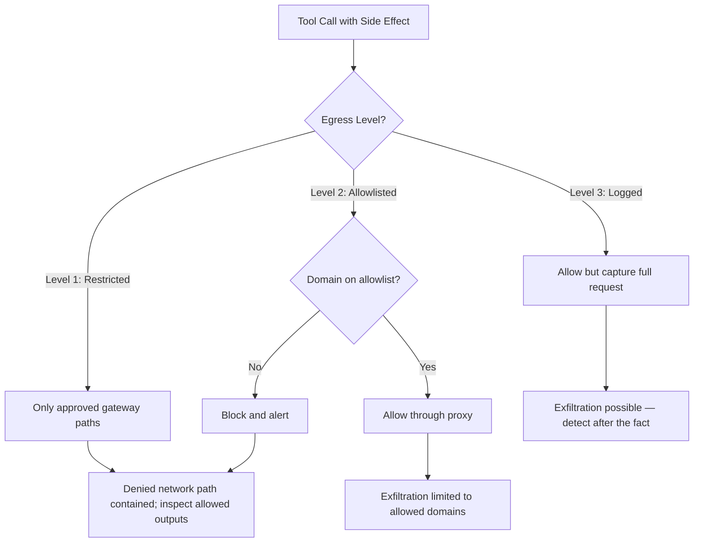

# Chapter 31: Sandboxing, Permissions, and Blast Radius

> **Reading note:** Named scenarios and numerical examples in this chapter are illustrative, not documented incidents or measured benchmarks. Code is a design sketch, not a tested implementation; `LoopKit` names describe the book’s illustrative API, not an established SDK. Provider behavior and prices require version-specific confirmation.

> Assume the agent is already compromised. Now design the box it is standing in.

## The Deploy Bot With Cluster-Admin

Marcus Chen inherited the infrastructure team's deploy agent at a logistics company called FreightSync. The agent was a standard Kubernetes operator pattern — it watched a deploy queue, picked up requests, pulled container images, and rolled them out to staging and production clusters. It had been running for four months with zero incidents. The team was proud of its reliability. When Marcus joined and asked for the service account's RBAC bindings, the answer came back as a one-liner that made him close his laptop for the day: `ClusterRole: cluster-admin`.

The original developer had encountered permission errors during testing — the agent needed `create` and `update` on Deployments and Services in three namespaces. Rather than debug the minimum permission set, they applied cluster-admin and moved on to other priorities. Four months later, the agent could read every Secret in every namespace, modify RBAC policies, delete PersistentVolumes, exec into any running pod, and reach any service the cluster's network policy allowed. It needed none of these capabilities. It used exactly three verbs on two resource types in three namespaces.

The gap between required permissions and actual permissions was the blast radius. If the model processing deploy requests had been successfully injected through a poisoned manifest — or if the deploy queue had been fed a malicious request by a compromised CI system — the attacker would have inherited cluster-admin across production. Every customer database, every signing key, every TLS certificate, every inter-service credential: reachable through a single compromised loop.

Marcus spent two weeks scoping the RBAC down to the minimum. During those two weeks, he discovered that the agent had been processing deploy manifests from a shared repository that three external contractors could push to. Those manifests contained annotation fields — free-text strings that the agent passed to the model for "intelligent deploy decisions." Any contractor could have embedded injection content in an annotation field at any time during those four months. The blast radius had been the entire production cluster for the entire operational life of the agent, and the injection vector had been open the entire time.

The agent's functionality did not change at all when Marcus scoped the permissions. It had never used the excess capabilities. But for four months, anyone who could compromise the model — through a single poisoned annotation in a single deploy manifest — would have owned the production infrastructure.

This chapter does not ask "how do we prevent compromise?" — Chapter 30 covered that, and concluded that prevention is probabilistic. This chapter asks the question that matters for production systems: "when compromise occurs, what is the maximum damage an attacker can inflict?" Every design decision serves one objective: making that maximum damage as small as possible, as bounded as possible, and as recoverable as possible.

## The Already-Compromised Design Principle

The design principle for autonomous loop containment is adversarial by assumption. You do not design the sandbox assuming the model will behave correctly. You design it assuming the model is actively hostile — that it will attempt to read secrets, exfiltrate data, modify its own configuration, escalate privileges, and reach systems outside its intended scope. Then you ask: given this hostile actor, what damage can it actually achieve within the sandbox you have constructed?

The threat model should assume that injection may succeed; its frequency depends on exposure and defenses, not a universal inevitability claim. Containment determines which consequences remain possible and how they can be detected and recovered.

Every capability you add to a loop is a capability an attacker gains when injection succeeds. This is not hypothetical risk — it is the concrete blast radius of the system you are building. A tool added for convenience during development becomes an attack surface in production. A filesystem path widened to fix a one-time error becomes a permanent exposure. An egress rule added for a demo becomes an exfiltration channel.

The discipline is to start from zero capabilities and add only what the task requires, justifying each addition against the question: "what does an attacker gain if this loop is compromised and has this capability?" If the answer is "nothing useful," the capability is safe to grant. If the answer is "access to customer data" or "ability to reach the internet" or "ability to modify infrastructure," the capability requires either explicit justification (the task genuinely cannot be completed without it) or compensating controls (the capability is narrowly scoped, rate-limited, and monitored).

This principle also applies to the operational lifecycle. Capabilities should be audited periodically — not just at initial deployment but quarterly or after any significant change to the loop's task scope. Teams accumulate permissions over time as they solve one-off issues, and without regular pruning, the gap between needed permissions and actual permissions grows silently.

## Network Egress Control and Allowed Output Paths

Network egress restriction is one important containment layer. Its value depends on the task's actual data paths and what remains allowed. Model requests, logs, comments, shared files, and internal service calls can still disclose data. Use data minimization and application-level authorization alongside network policy.

Egress control is not merely "remove the HTTP tool." As Chapter 30 established, exfiltration channels include DNS queries, file writes to shared storage, commit messages, error logs, and metadata in API responses. True egress control combines network policy with application-level rules for allowed outputs and data destinations.

**Level 1: Restricted egress.** The worker reaches only an approved model gateway and any explicitly required internal services. A hosted model API is still a data destination, not automatically internal or exempt from data policy. Disable arbitrary DNS forwarding, package installation, shared publication, and unapproved output sinks. This configuration reduces exposure, but is not literally “no egress.”

**Level 2: Allowlisted egress.** The loop can reach specific, pre-approved domains via a proxy that terminates and inspects all outbound connections. The allowlist is as short as possible: the model API, perhaps one documentation site, perhaps a package registry. The proxy enforces the allowlist at the domain level and logs all requests. This is appropriate for loops that need limited external access — fetching documentation, checking dependency metadata.

**Level 3: Logged egress (weakest).** The loop can reach arbitrary destinations, but all outbound traffic is captured, logged, and subject to anomaly detection. This is the weakest form of egress control — it detects exfiltration after the fact rather than preventing it. Use only when the task genuinely requires broad internet access, and combine with tight data-access restrictions so there is nothing valuable to steal even if egress succeeds. Logged egress is better than no egress control at all, but it does not prevent data loss — it only enables detection and forensics after the event.



The choice between these levels should be made per loop, not per deployment. A fleet may contain loops at all three levels: coding loops at Level 1, documentation-fetching loops at Level 2, and a research loop at Level 3. The key is that each loop runs at the tightest level its task permits, not at the loosest level available in the infrastructure.

For container-based deployments:

```yaml

# Kubernetes NetworkPolicy: deny all egress except internal model API
apiVersion: networking.k8s.io/v1
kind: NetworkPolicy
metadata:
  name: coding-loop-egress
spec:
  podSelector:
    matchLabels:
      loop-type: code-reviewer
  policyTypes:
    - Egress
  egress:
    - to:
        - ipBlock:
            cidr: 10.0.50.0/24  # Model API subnet only
      ports:
        - port: 443
          protocol: TCP
    - to:
        - ipBlock:
            cidr: 10.0.0.53/32  # Internal DNS only
      ports:
        - port: 53
          protocol: UDP
```

The critical implementation detail that teams often miss: DNS must be controlled independently of TCP/HTTP egress. A loop that cannot establish TCP connections to external hosts but can query an external DNS resolver still has an exfiltration channel — data encoded in subdomain labels of DNS queries reaches the attacker's authoritative nameserver. DNS labels and full names have bounded lengths, yet repeated queries can carry encoded fragments; normal resolver logs may not expose the pattern clearly. The solution is to restrict DNS resolution to an internal resolver that only resolves allowlisted domains, or to block all DNS egress except to a controlled internal resolver that does not forward queries for unknown domains.

A common mistake when implementing egress control is allowing "internal" destinations too broadly. If your allowlist permits traffic to any host within your VPC, a compromised loop can reach internal services that hold sensitive data — databases, secret stores, other microservices. The egress allowlist should specify the exact IP addresses or narrow CIDR blocks the loop legitimately needs to reach, not a broad "internal network" rule. Defence in depth applies here: even within your own network, apply least privilege.

## Credential Architecture: Secrets Never Enter Context

The cardinal rule of credential handling in autonomous loops: secrets must never appear in the model's context window. If the model can observe a credential — in its system prompt, in a tool result, in an environment variable it can read, in a configuration file it can access — then a successful injection can exfiltrate that credential through any available channel.

The architectural pattern is a narrowly scoped tool broker: it authenticates the worker, checks delegated task authority and resource scope, and obtains a downstream credential without exposing it to the model. Keeping the token secret is necessary but insufficient. A generic proxy that accepts arbitrary authenticated endpoints still lets an injected model misuse the token's authority. Expose a specific operation with constrained identifiers instead of a general-purpose API client.

```python

from dataclasses import dataclass
from typing import Protocol


class SecretStore(Protocol):
    def get(self, key: str) -> str:...


@dataclass
class CredentialProxy:
    """Illustrative read-only broker, not a production SDK."""
    store: SecretStore
    policy: object

    async def read_pull_request(self, repo_id: int, number: int, auth) -> dict:
        # auth is attached by the trusted transport, never supplied by model text.
        grant = self.policy.require(auth, "pull_request:read", repo_id)
        if number <= 0:
            raise ValueError("Invalid pull request number")
        import httpx
        token = self.store.get(grant.credential_reference)
        endpoint = f"/repositories/{repo_id}/pulls/{number}"
        async with httpx.AsyncClient(follow_redirects=False, timeout=10) as client:
            response = await client.get(
                f"https://api.github.com{endpoint}",
                headers={"Authorization": f"Bearer {token}"},
            )
            response.raise_for_status()
            data = response.json()
            # Explicit output allowlist; error sanitization belongs at broker boundary.
            return {"number": data["number"], "state": data["state"]}
```

**Anti-patterns that expose secrets to the model:**

Passing secrets as environment variables in a container where the model has a shell tool. The model can call `env` or `printenv` and read every variable. Instead, inject secrets only into the specific tool processes that need them, not into the model's execution environment.

Including credentials in the system prompt ("use this API key when making requests"). The secret is now in the context window for the entire session.

Returning API responses that contain auth headers or tokens without stripping them. A tool that fetches a URL and returns the full response — including `Authorization` headers — has leaked the credential into context.

Loading a `.env` file into the model's readable filesystem. Even if you never explicitly show it, a model with `read_file` access can read any file in its accessible paths.

Beyond architecture, use short-lived credentials wherever possible. An OAuth token with five-minute expiry limits the window of exploitation even if it is somehow exposed. AWS temporary credentials via STS, short-lived deploy tokens, one-time-use API keys — each reduces the blast radius of credential exposure from "permanent access until manually rotated" to "access for minutes at most."

The credential proxy pattern also solves a rotation problem. When credentials are baked into a system prompt or stored where the model can read them, rotating the credential requires updating the prompt or file and potentially restarting the loop. When credentials exist only in the secrets backend, rotation happens transparently — the next tool call retrieves the new credential without any change to the loop's configuration or context. The model does not even know the rotation happened, because it never knew the credential existed.

## Filesystem Isolation

A loop that can read any file on the system can find credentials, source code, customer data, configuration secrets, and infrastructure state. A loop that can write anywhere can modify its own scripts, overwrite security controls, plant backdoors in application code, or corrupt data. Filesystem isolation restricts both read and write access to the minimum set of paths required for the task.

The principle is simple: enumerate what files the loop needs to read, enumerate what files it needs to write, and make everything else invisible or inaccessible. The implementation varies by deployment model:

**Container mounts (strongest).** Mount only required directories into the container. Mount read-only wherever the loop does not need to write. Never mount the host's home directory, `/etc`, or any credential directory. The container's filesystem view is exactly and only what the loop needs — nothing more exists from its perspective.

**Filesystem namespaces.** For non-containerised deployments, use Linux namespaces or bind-mount overlays to present the loop process with a restricted filesystem view. The `unshare` system call can create a mount namespace where the process sees a different filesystem topology from the host.

**Path enforcement in the harness.** At minimum, the harness canonicalises all file paths in tool arguments and rejects any path outside the allowed set. This is the weakest form because it relies on correct implementation of path checking — symlinks, relative paths, path traversal sequences like `../../`, and Unicode normalisation can defeat naive checks. Production implementations must resolve symlinks to their real path before checking against the allowlist, must reject paths containing `..` components, and must handle both absolute and relative path forms.

**Temporary filesystem for scratch work.** Many loops need a writable area for intermediate files — test outputs, generated artifacts, compilation results. Provide a dedicated temporary directory that is mounted writable but is isolated from the source tree and destroyed after the run completes. This prevents intermediate files from persisting and limits the area where a compromised loop can write.

The meta-rule: a loop must never have write access to its own configuration, its own skill files, its own system prompt, or its own sandbox definition. If it can modify these, a successful injection can permanently alter the loop's future behaviour — weakening its own guardrails, expanding its own permissions, or installing persistent backdoor instructions that execute on every subsequent run. The loop's definition is code, and code changes go through code review — never through the loop's own tool calls.

A common failure pattern is the "debug access" that persists into production. During development, the loop needs broad filesystem access to troubleshoot issues. The developer mounts the entire repository root with read-write access. The loop ships to production with this configuration unchanged. Six months later, the loop can read `.env` files, credential directories, infrastructure-as-code templates containing secrets, and any other file in the repository — none of which it needs for its actual task. Regular access audits — comparing what the loop can reach versus what it actually reads in production traces — catch this drift before it becomes a vulnerability.

## The `loopkit/safety.py` Module

This chapter and Chapter 30 own the `safety.py` module in the loopkit system. The canonical types:

```python

# loopkit/safety.py
from __future__ import annotations

from dataclasses import dataclass, field
from enum import IntEnum, StrEnum
from typing import Any


class PermissionTier(IntEnum):
    """Action classification by required authorisation level."""
    AUTONOMOUS = 0
    LOGGED = 1
    GATED = 2
    HUMAN_REQUIRED = 3


class Reversibility(StrEnum):
    """How recoverable an action is after execution."""
    FULL = "fully_reversible"
    COSTLY = "costly_reversible"
    IRREVERSIBLE = "irreversible"


@dataclass(frozen=True)
class Permission:
    """A single capability grant with constraints."""
    tool_name: str
    tier: PermissionTier
    reversibility: Reversibility
    argument_constraints: dict[str, Any] = field(default_factory=dict)
    rate_limit_per_run: int | None = None
    allowed_paths: tuple[str,...] = ()


@dataclass(frozen=True)
class Sandbox:
    """Complete containment specification for one loop."""
    name: str
    permissions: tuple[Permission,...]
    network_egress: bool = False
    egress_allowlist: tuple[str,...] = ()
    filesystem_read: tuple[str,...] = ()
    filesystem_write: tuple[str,...] = ()
    max_wall_clock_s: int = 300
    max_memory_mb: int = 4096
    inherit_env_vars: tuple[str,...] = ()

    def permits(self, tool_name: str) -> Permission | None:
        for p in self.permissions:
            if p.tool_name == tool_name:
                return p
        return None


@dataclass
class BlastRadius:
    """Quantified worst-case from a fully compromised loop."""
    sandbox: Sandbox
    can_read_secrets: bool = False
    can_read_customer_data: bool = False
    can_modify_source: bool = False
    can_modify_infrastructure: bool = False
    can_communicate_externally: bool = False
    can_delete_data: bool = False
    affected_systems: tuple[str,...] = ()
    max_financial_exposure_usd: float = 0.0

    @property
    def risk_score(self) -> int:
        score = 0
        if self.can_read_secrets: score += 3
        if self.can_read_customer_data: score += 2
        if self.can_modify_source: score += 2
        if self.can_modify_infrastructure: score += 3
        if self.can_communicate_externally: score += 2
        if self.can_delete_data: score += 3
        return min(score, 10)

    @property
    def requires_security_review(self) -> bool:
        # A score is only a triage hint, never deployment authorization.
        return True
```

## Worked Blast-Radius Analysis: The Coding Loop

Consider the coding loop from Chapter 34 (*Case Study: The Coding Loop*). It receives a task — fix a bug, implement a feature, address a review comment — reads source code, makes changes, runs tests, and submits a pull request. Here is the full blast-radius analysis as a production assessment.

**Required capabilities:** Read source code in the repository. Write source code on a feature branch (never main). Run tests. Create a branch. Submit a PR.

**Unnecessary capabilities that teams often grant by default:** Read secrets or environment variables. Network egress. Access to other repositories. Write access to main or protected branches. Deploy capability. Shell access beyond what tests require.

**Sandbox specification:**

```python

CODING_LOOP = Sandbox(
    name="coding-loop-v1",
    permissions=(
        Permission("read_file", PermissionTier.AUTONOMOUS,
                   Reversibility.FULL,
                   allowed_paths=("./src/", "./tests/", "./docs/")),
        Permission("write_file", PermissionTier.LOGGED,
                   Reversibility.FULL,
                   allowed_paths=("./src/", "./tests/")),
        Permission("run_tests", PermissionTier.GATED,
                   Reversibility.FULL,
                   rate_limit_per_run=10),
        Permission("create_branch", PermissionTier.LOGGED,
                   Reversibility.FULL,
                   rate_limit_per_run=1),
        Permission("submit_pr", PermissionTier.LOGGED,
                   Reversibility.COSTLY,
                   rate_limit_per_run=1),
    ),
    network_egress=False,
    filesystem_read=("./src/", "./tests/", "./docs/", "./config/"),
    filesystem_write=("./src/", "./tests/"),
    max_wall_clock_s=600,
    max_memory_mb=4096,
    inherit_env_vars=(),
)
```

**Blast-radius assessment:**

The worst case if this loop is fully compromised: it writes malicious code to a feature branch and opens a PR. The PR contains code that passes the test suite but introduces a subtle vulnerability or backdoor. The code cannot reach production without a human reviewer approving the PR. The human reviewer is the final circuit breaker — not within the loop, but in the organizational process around the loop. This is the key architectural insight: the sandbox does not need to prevent all bad output; it needs to ensure that bad output cannot reach consequential systems without human validation.

The score is not a release gate. Source modification, test execution, and PR publication each need their own threat analysis. A test process can execute hostile repository code; a PR can expose confidential code through notifications or trigger privileged CI. Keep test execution secret-free and isolated, and let a separate publisher handle approved artifact submission. The declared sandbox object does not enforce any of these controls by itself.

Now compare the same loop with typical "just make it work" permissions: shell access (can read environment variables, exfiltrate data via DNS queries), inherits CI runner's env vars (which contain deploy tokens and service credentials), has network egress configured "for pulling documentation" (but equally capable of exfiltrating source code to any destination), and can push directly to main (bypassing code review entirely). Risk score: 10. Indefensible for autonomous operation. The loop's functionality is identical between these two configurations — it does not use any of the excess capabilities in normal operation. But the blast radius is the difference between "one bad PR that a human must still review" and "full compromise of production infrastructure, credentials, and source code."

The disparity between these two configurations — identical functionality, vastly different blast radius — is why permission auditing is not optional. The loop works fine with either configuration. The difference only matters when something goes wrong. And the entire premise of this chapter is that something will, eventually, go wrong.

## What Breaks

Sandbox enforcement introduces operational friction. Path-based access controls are fragile — symlinks, `../` traversal, hard links, and filesystem race conditions can defeat naive implementations. Production-grade path enforcement requires canonicalisation, symlink resolution, and race-condition mitigation on every access check. Teams that implement this in-house typically under-invest in the edge cases.

Egress control conflicts directly with capability. A research loop that cannot reach the internet cannot research. A dependency-update loop that cannot fetch packages cannot update them. A documentation loop that needs to verify external links cannot function without HTTP access. The honest answer is that some loops require capabilities that increase blast radius, and for those loops you compensate with tighter monitoring, shorter budgets, stricter rate limits, and human gates on the highest-consequence actions. Not every loop can be made safe through containment alone — some require accepting higher blast radius with correspondingly higher investment in detection and response.

Credential proxies add indirection that complicates debugging and error handling. When a tool call fails because of an expired token, the error surfaces at the proxy layer rather than in the model's context — the model cannot self-diagnose "my token expired" because it never knew the token existed. The proxy must surface actionable error messages without revealing credential details: "Authentication failed for github_api — credential expired, rotation may be required" rather than exposing the token value in the error message. This requires careful design of the error boundary — too much detail leaks secrets; too little detail makes the model unable to report the problem usefully to operators.

The blast-radius assessment is only as complete as the threat model that informs it. If you fail to enumerate a capability the loop possesses — perhaps a logging sink that happens to be externally accessible, or a shared filesystem that another team reads, or a side-channel through error messages flowing to external monitoring services — your assessment understates the true blast radius. Regular audits, not one-time analyses, are the only defence against assessment drift. The recommended audit cadence is quarterly for production loops, and immediately after any significant change to the loop's task scope, infrastructure, or tool set.

## Implementation Guidance: Test the Boundary, Not the Configuration

A `Sandbox` dataclass is a policy description. It does not install a mount namespace, enforce a syscall filter, control a child process, or prevent a tool server from using its own credentials. Draw the actual execution graph: model gateway, worker, test subprocesses, credential broker, publisher, and downstream services. For each edge identify which component enforces identity, arguments, data classification, and resource limits. A control with no enforcing component is documentation, not containment.

In Kubernetes, confirm that the cluster network implementation enforces the selected policy. Standard NetworkPolicy works at network/transport layers; it does not understand tenant authorization, HTTP paths, payloads, or arbitrary domain allowlists. Allowing an internal DNS resolver is insufficient if it forwards every attacker-selected name. Policies are additive, so a broader policy selecting the same pod can reopen traffic. Test the actual pod and namespace with harmless probes, including DNS, IPv4/IPv6 where enabled, metadata endpoints, and an allowed model-gateway request. Do not infer effective isolation from a YAML parse.

Filesystem checks need the same discipline. Canonicalizing a pathname and then opening it leaves a race if an attacker can swap a symlink between operations. Prefer an isolated filesystem plus platform-supported descriptor-relative access and no-follow/beneath constraints. Test hard links, archive extraction, alternate encodings, and writable parents where relevant. A container shares important host resources; privileged mode, host mounts, host networking, or a mounted container socket can defeat the intended boundary.

Return to Marcus's deploy bot. Reducing RBAC from cluster-admin is only the first repair. A principal that can create workloads may indirectly run a pod with a powerful service account or mount sensitive volumes unless admission policy constrains the workload specification. Bind deployments to allowed image digests, namespaces, service accounts, security contexts, and rollout operations. Have the trusted deployment controller enforce those constraints rather than accepting arbitrary model-authored manifests.

Exercise a revoked authorization and an expired approval before a deploy, then between proposal and execution. Acceptance means the resource-side gate rejects the action and records the reason, while preserving the safe draft. The [OAuth security BCP, RFC9700](https://www.rfc-editor.org/rfc/rfc9700), supports minimum-privilege and audience-limited tokens; those tokens still need resource/action policy. The [MCP authorization profile](https://modelcontextprotocol.io/specification/2025-06-18/basic/authorization) is transport authorization, not a grant to execute every exposed tool. Chapter 41 follows that delegation chain in detail.

Finally, test recovery. Kill the worker and verify its child processes stop, its grants expire or are revoked as designed, and no new publications occur. Keep the effect journal available so already-issued requests can be reconciled. Revocation is not retroactive cancellation: a server may have accepted a request before the revoke reached it. The blast-radius assessment must include those in-flight effects and the time required to discover them.

## Key Takeaways

- Design every loop for the already-compromised case. Every capability granted is a capability an attacker inherits upon successful injection.
- Restrict network egress and separately control permitted output channels; a model-API exception is still egress.
- DNS must be controlled independently of HTTP egress — data encoded in subdomain labels is a proven exfiltration channel.
- Secrets must never enter the model's context window. Use credential proxies that inject authentication at the execution layer.
- Short-lived, narrowly-scoped credentials (five-minute tokens, temporary STS credentials) limit the window of exploitation if exposed.
- Filesystem isolation restricts read/write to the minimum required paths. A loop must never have write access to its own configuration or skill files.
- The `loopkit/safety.py` module provides canonical types: `Sandbox`, `Permission`, `BlastRadius`, `PermissionTier`, `Reversibility`.
- Blast-radius scores are triage aids, not authorization or safety thresholds. Review concrete capabilities and enforced controls.
- The gap between required capabilities and granted capabilities is the excess blast radius. Eliminate the gap through least-privilege discipline.

## The Loop Contract, So Far

This chapter fills the **budget** field with resource enforcement (wall-clock caps, rate limits, memory bounds). It constrains the **escalation path** by defining permission tiers: irreversible actions at Tier 3 route to human operators, gated actions at Tier 2 pass through automated checks, and the loop proceeds autonomously only for Tier 0-1 actions. The **stop condition** gains a new trigger: any sandbox violation (path traversal attempt, blocked egress attempt, rate-limit exhaustion) halts the loop immediately.

## Exercises

1. **Permission audit.** Take a loop running in your organisation (or a hypothetical one). List every tool available to it, every file path it can read and write, every network destination it can reach, and every environment variable it can access. Identify the gap between what it needs and what it has. Propose a scoped `Sandbox` definition that eliminates the gap.

2. **Egress verification.** Deploy a loop in a container with the NetworkPolicy from this chapter. Attempt to reach an external endpoint from within the loop (via DNS lookup, TCP connection, and HTTP request). Verify that all three are blocked. Then verify that the model API remains reachable.

3. **Blast-radius scorecard.** Complete a `BlastRadius` assessment for three different loop types: a code-review loop, a data-pipeline loop, and a deployment loop. For each, compute the risk score and propose specific capability reductions or compensating controls for any scoring above 3.

4. **Credential proxy refactor.** Take an existing tool implementation that receives a credential as an argument or reads it from the environment. Refactor it to use the `CredentialProxy` pattern. Verify that the credential never appears in the message history by inspecting the full trace after a test run.

5. **Symlink escape test.** In a sandboxed loop with filesystem restrictions, create a symlink from an allowed path to a disallowed path. Verify that the harness's path enforcement correctly resolves the symlink and blocks the access. Document the canonicalisation approach and any edge cases discovered.

**Exercise acceptance standard:** Run probes only in an authorized test environment with dummy credentials. Record the effective policy, allowed control request, blocked requests, child-process behavior, and any untested paths. For the broker, also test cross-tenant/resource denial and revoked authority; hiding a token alone does not pass. A blast-radius score is not acceptance evidence.

## Sources

- CWE-250: Execution with Unnecessary Privileges. MITRE CWE database.
- CWE-269: Improper Privilege Management. MITRE CWE database.
- CWE-22: Improper Limitation of a Pathname to a Restricted Directory (Path Traversal). MITRE CWE database.
- Kubernetes Network Policies documentation — egress control at the pod level. — https://kubernetes.io/docs/concepts/services-networking/network-policies/
- OWASP Top 10 for LLM Applications (2025), LLM01: Prompt Injection — recommends limiting agent access to minimum necessary capabilities.

------------------------------------------------------------------------

*Next: Chapter 32 addresses what happens inside the model — when a loop that has passed all mechanical guardrails still takes actions its operators did not intend, because alignment assumptions that hold in conversation break down under autonomous execution.*
