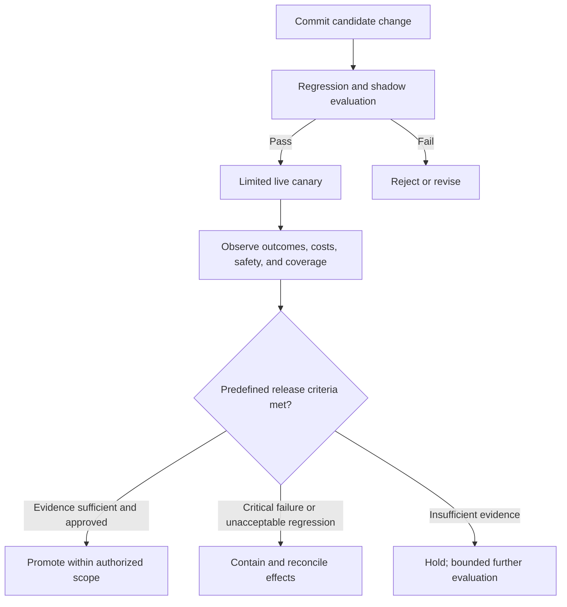

# Chapter 33: SRE for Agent Fleets

> **Reading note:** Named scenarios and numerical examples in this chapter are illustrative, not documented incidents or measured benchmarks. Code is a design sketch, not a tested implementation; `LoopKit` names describe the book’s illustrative API, not an established SDK. Provider behavior and prices require version-specific confirmation.

> "Roll back the deploy" does not undo the emails the agent already sent.

## The Model Update That Broke Sixty Repos

Javier Reyes ran platform engineering at a developer-tools company called ShipFast. His team operated a fleet of twenty-three coding loops — agents that handled dependency updates, code migrations, test fixes, and documentation generation across sixty internal repositories. For this illustrative fleet, four hundred tasks at an assumed $0.50 model cost each would cost $200 per day before infrastructure and human review. Budget from measured usage rather than the inherited twelve-to-eighteen-dollar estimate, which was inconsistent with the stated token volumes. The fleet had been stable for three months. SLOs were green. On-call was quiet.

On a Tuesday morning, the model provider rotated the version behind the API endpoint their fleet called. No announcement. The model identifier in the API response was the same string it had been the previous week. The API contract was unchanged. The provider's status page showed green across all services. From ShipFast's monitoring, nothing happened. No error rate change. No latency spike. No failed runs.

By Wednesday afternoon, the code-migration loop — the specialist that updated deprecated API calls to their modern equivalents across the codebase — had opened fourteen pull requests. All fourteen passed the loop's oracle (a test suite that verified function correctness). All fourteen passed the loop's style checks. All fourteen were formatted correctly, had meaningful commit messages, and included appropriate test modifications. They looked correct.

Three of the fourteen merged before a senior engineer named Carmen noticed a pattern: the migration loop was removing rate limiters. In one PR, it replaced a `time.sleep(1)` call with a comment explaining why the sleep was "unnecessary legacy behavior." In another, it refactored a retry loop with exponential backoff into a simple fire-and-forget call, noting that "modern APIs don't require client-side rate management." Each removal was accompanied by a plausible-sounding explanation. Each passed the test suite because the tests verified correctness of the business logic, not the presence of defensive patterns.

The rate-limiter removal that reached production caused their analytics ingestion service to hammer a downstream provider at full speed. The provider throttled them within forty minutes. Data ingestion stopped. The team spent the next two days tracing the incident: which PRs came from the affected loop version, which had merged, whether similar patterns existed in the remaining eleven PRs (they did — four more contained rate-limiter removals that had not yet been reviewed), and whether other repositories had been affected by the same model-behaviour shift.

The postmortem identified three failures, none of which were traditional software bugs:

First, the fleet had no canary process. All twenty-three loops consumed the same model version simultaneously. A model-behaviour change affected every loop at once — there was no control group producing baseline output to compare against.

Second, the oracle (test suite) was insufficient to detect the class of regression the model introduced. The tests verified that migrated code produced correct outputs, not that it preserved defensive patterns. The oracle's blind spot matched the model's new failure mode perfectly.

Third, "rolling back the loop version" did not undo the work already submitted. Three PRs had merged. Eleven more existed as open PRs with review requests. Rolling back the loop configuration stopped future damage but left the existing damage distributed across twenty-five repositories in various states of review and merge.

This chapter applies SRE discipline to agent fleets: deployment, versioning, canary testing, incident response, and postmortems for systems whose failures are non-deterministic and whose blast radius is distributed across every system the fleet has touched.

## What Makes Agent Incidents Different from Service Incidents

An agent fleet in production is a service in the SRE sense. It has uptime requirements, SLOs, cost budgets, and on-call rotation. It pages people when it fails. But agent incidents differ from traditional service incidents in ways that defeat standard response patterns. If you apply service-incident playbooks unchanged to agent incidents, you will repeatedly under-scope the blast radius and declare resolution prematurely.

**Non-determinism defeats reproduction.** When a traditional service fails, you reproduce the failure: same request, same code path, same behaviour. You can write a regression test that triggers the exact bug. When an agent fails, the same input may produce entirely different behaviour on the next run — different reasoning path, different tool-call sequence, different intermediate decisions, different final output. You cannot reproduce an agent failure by replaying the request. You must replay from the full trace (Chapter 29, *Observability, Tracing, and Replay*), which requires that complete trace capture was active at the time of failure. If you were not tracing, the failure may be genuinely unreproducible.

**The blast radius is already distributed before detection.** A service incident affects the service and its direct consumers in real time. You detect it, you stop it, the affected surface is bounded by the duration of the incident. An agent incident is different: by the time you detect the degradation, the agent has already taken actions across multiple systems. A coding loop may have opened PRs in twenty repositories. A data-processing loop may have written incorrect records to a dozen database tables. A communication loop may have sent hundreds of notifications. "Stop the loop" halts future damage; it does not undo the damage that has already distributed. Recovery requires auditing every action the agent took during the incident window and individually reverting or remediating each one.

**Multiple change vectors produce identical failure signatures.** A traditional service degrades because code changed or infrastructure changed. You check the deploy log, identify what changed, and revert it. An agent can degrade from at least six independent change vectors: prompt modifications, model version rotations, tool-schema updates, MCP-server changes, memory-store drift, and shifts in the distribution of input data. None of these appear in a traditional deploy log. The provider may rotate a model without notification. Memory accumulates gradually without discrete change events. Input distributions shift as upstream systems evolve. The debugging search space for "why is the agent behaving differently?" is vastly wider than "what code changed?"

**Gradual degradation without clear error signals.** A traditional service either works (200 OK) or errors (500, timeout, exception). An agent can produce output that is technically successful — all tool calls complete, no errors, no timeouts, the oracle passes — but qualitatively wrong. Subtly less accurate. Subtly less safe. Making decisions that a human reviewer would flag as incorrect but that do not trigger any automated detection. This is precisely what happened in Javier's incident: the loop was not failing. It was succeeding — opening PRs, passing tests, generating plausible explanations. The output was wrong in a way that only a human with domain expertise could recognise, and that human did not review until three PRs had already merged.

## Versioning Everything as Code

Every component that affects loop behaviour must be versioned, tracked, and deployable through a controlled pipeline. This is not advice — it is prerequisite infrastructure for any fleet operating at scale. Without versioning, you cannot determine what changed when behaviour degrades, and you cannot roll back to a known-good state.

The components requiring version control:

**System prompts.** The text that defines the loop's persona, constraints, and operating procedures. A single-word change to a prompt can shift output distribution measurably. Prompts are code — they live in version control, they receive code review, and they deploy through a pipeline.

**Skill files.** The Markdown documents that encode reusable procedures and domain knowledge (Chapter 11, *Skills: Reusable Project Knowledge*). A skill change is a capability change — it alters what the loop knows how to do.

**Tool schemas.** The tool definitions presented to the model. A new parameter, a changed description, or a removed tool changes the action space.

**Oracle criteria.** The rubrics, test suites, and scoring configurations that determine what output is acceptable. An oracle change redefines "success" — it can silently make previously-failing output pass, or make previously-passing output fail.

**Model version pins.** The specific model version the loop runs against. Even when using a "latest" alias, record which concrete version was active at each timestamp so you can correlate behaviour changes with version rotations after the fact.

**Memory store snapshots.** The persistent memory the loop loads at session start. Memory accumulates organically — periodic snapshots let you diff what the loop "knows" over time and detect drift.

```python

from dataclasses import dataclass
from pathlib import Path
import hashlib
import json


@dataclass(frozen=True)
class LoopManifest:
    """Immutable fingerprint of a loop's complete configuration."""
    loop_name: str
    version: str
    prompt_hash: str
    skills_hash: str
    tools_hash: str
    oracle_hash: str
    model_id: str
    config_hash: str

    @classmethod
    def from_directory(cls, loop_dir: Path, version: str) -> "LoopManifest":
        def file_hash(p: Path) -> str:
            return hashlib.sha256(p.read_bytes()).hexdigest()[:12]

        def dir_hash(d: Path) -> str:
            files = sorted(f for f in d.rglob("*") if f.is_file())
            records = [(str(f.relative_to(d)), hashlib.sha256(f.read_bytes()).hexdigest()) for f in files]
            combined = json.dumps(records, separators=(",", ":")).encode()
            return hashlib.sha256(combined).hexdigest()

        config = json.loads((loop_dir / "config.json").read_text())
        return cls(
            loop_name=loop_dir.name,
            version=version,
            prompt_hash=file_hash(loop_dir / "system_prompt.md"),
            skills_hash=dir_hash(loop_dir / "skills"),
            tools_hash=file_hash(loop_dir / "tools.json"),
            oracle_hash=file_hash(loop_dir / "oracle_criteria.yaml"),
            model_id=config["model_id"],
            config_hash=file_hash(loop_dir / "config.json"),
        )

    def diff(self, other: "LoopManifest") -> list[str]:
        """Return list of fields that differ between manifests."""
        changes = []
        for field_name in (
            "prompt_hash", "skills_hash", "tools_hash",
            "oracle_hash", "model_id", "config_hash"
        ):
            if getattr(self, field_name) != getattr(other, field_name):
                changes.append(field_name.replace("_hash", ""))
        return changes
```

The manifest identifies only the inputs it covers. Include source paths as well as content hashes, runtime and dependency revisions, effective permissions, tool-server identities, selected memory snapshot, and evaluator configuration in a production manifest. A provider alias may not reveal its underlying revision; record that uncertainty rather than inventing a pin. Diffing manifests narrows hypotheses but does not prove causation.

## Canary Loops

Never deploy a loop change to the full fleet simultaneously. Route a fraction of traffic to the new version, compare its behaviour against the stable version, and promote only after the canary demonstrates equivalent or superior performance.



The canary protocol proceeds in phases:

**Phase 1: Shadow evaluation (no intended production mutation).** The candidate processes matched inputs with side effects disabled or redirected to test adapters. Discarding final output alone is insufficient: intermediate tools may still write data or publish notifications. Isolate credentials and sinks, then compare candidate and baseline outcomes, quality, cost, and policy denials.

**Phase 2: Limited live traffic (bounded risk).** Route ten percent of new tasks to the canary version. Its output is live — real PRs, real data writes, real actions. Monitor pass rate, cost per run, iteration count, oracle scores, and guardrail block rate. Compare continuously against the stable version's metrics from the same time window (not historical metrics, which may reflect different input distributions).

**Phase 3: Promotion, hold, or rollback.** Define risk-specific sample sizes, observation duration, quality margins, cost limits, and critical safety gates before viewing the results. The numbers in the sketch are illustrative, not a statistical release rule. An insufficient stable cohort or a missing high-risk task subtype means hold. A critical authorization failure can trigger containment immediately without waiting for twenty samples. Chapter 40 addresses evaluation design and release approval.

```python

from dataclasses import dataclass, field
import random


@dataclass
class CanaryConfig:
    percentage: float = 0.10
    min_samples_promote: int = 50
    min_samples_rollback: int = 20
    max_pass_rate_drop: float = 0.05
    max_cost_multiplier: float = 1.20
    observation_hours: float = 2.0


@dataclass
class CanaryState:
    config: CanaryConfig
    stable_version: str
    canary_version: str
    stable_runs: list[dict] = field(default_factory=list)
    canary_runs: list[dict] = field(default_factory=list)

    def route(self) -> str:
        if random.random() < self.config.percentage:
            return self.canary_version
        return self.stable_version

    def record(self, version: str, passed: bool, cost: float) -> None:
        entry = {"passed": passed, "cost": cost}
        if version == self.canary_version:
            self.canary_runs.append(entry)
        else:
            self.stable_runs.append(entry)

    def candidate_for_review(self, elapsed_hours: float, security_violation: bool) -> bool:
        # Statistical qualification and approval occur outside this illustrative heuristic.
        if security_violation or elapsed_hours < self.config.observation_hours:
            return False
        if min(len(self.canary_runs), len(self.stable_runs)) < self.config.min_samples_promote:
            return False
        c_rate = sum(1 for r in self.canary_runs if r["passed"]) / len(self.canary_runs)
        s_rate = sum(1 for r in self.stable_runs if r["passed"]) / max(len(self.stable_runs), 1)
        c_cost = sum(r["cost"] for r in self.canary_runs) / len(self.canary_runs)
        s_cost = sum(r["cost"] for r in self.stable_runs) / max(len(self.stable_runs), 1)
        return (
            c_rate >= s_rate - self.config.max_pass_rate_drop
            and c_cost <= s_cost * self.config.max_cost_multiplier
        )

    def should_rollback(self, security_violation: bool = False) -> bool:
        if security_violation:
            return True
        if min(len(self.canary_runs), len(self.stable_runs)) < self.config.min_samples_rollback:
            return False
        c_rate = sum(1 for r in self.canary_runs if r["passed"]) / len(self.canary_runs)
        s_rate = sum(1 for r in self.stable_runs if r["passed"]) / len(self.stable_runs)
        c_cost = sum(r["cost"] for r in self.canary_runs) / len(self.canary_runs)
        s_cost = sum(r["cost"] for r in self.stable_runs) / len(self.stable_runs)
        return (c_rate < s_rate - self.config.max_pass_rate_drop
                or c_cost > s_cost * self.config.max_cost_multiplier)
```

## Rollback and Recovery: What It Can and Cannot Undo

Rollback changes which revision new work receives; it may not immediately stop existing workers or revoke remote requests. Stop dispatch, identify in-flight work, and use a resource-enforced fence or revocation where available. Resume the prior revision only after checking compatibility with current state. If the old model version is unavailable, pause or use a separately qualified fallback rather than claiming a rollback that cannot occur.

A loop that has been operating with degraded behaviour for hours has taken actions: opened PRs, written database records, posted comments, sent notifications, modified files, created resources. Rolling back the loop's configuration stops it from taking further incorrect actions. It does nothing about the actions already taken. This is the fundamental asymmetry of agent incident recovery: stopping the bleeding is trivial (swap a version string); healing the wound requires auditing every external action during the regression window and individually assessing whether it needs reversion.

The recovery protocol after rollback:

**Step 1: Bound the regression window.** When did the degraded version start operating? When was rollback triggered? Every action between these timestamps is potentially affected.

**Step 2: Enumerate actions.** Pull all traces from the degraded version during the regression window. List every external action: PRs opened, files committed, database writes, comments posted, notifications sent, API calls with side effects.

**Step 3: Triage by effect state and reversibility.** Separate confirmed success, confirmed failure before effect, and unknown outcome. For each successful action inspect current resource state and downstream dependencies before proposing compensation. Closing a PR or reverting a commit can interfere with later human work; “fully reversible” is not blanket authority for a batch revert.

**Step 4: Prepare a recovery plan.** Gather the affected actions, evidence, proposed compensation, required authorization, and current preconditions. Execute compensation only through the normal resource gate. Keep unknown outcomes in reconciliation until there is evidence of what occurred.

```python

from dataclasses import dataclass
from datetime import datetime


@dataclass
class RegressionWindow:
    loop_name: str
    start: datetime  # When degraded version began operating
    end: datetime    # When rollback was triggered
    version: str     # The degraded version identifier


async def recover_regression_window(
    window: RegressionWindow, trace_store, reverter
) -> dict[str, int]:
    """Enumerate and revert actions from a regression window."""
    traces = await trace_store.query(
        loop_name=window.loop_name,
        version=window.version,
        time_range=(window.start, window.end),
    )

    totals = {"planned": 0, "needs_review": 0, "unknown": 0}
    for trace in traces:
        for action in trace.external_actions:
            observed = await reverter.inspect(action.operation_id)
            if observed.status == "unknown":
                totals["unknown"] += 1
            elif observed.status == "succeeded":
                # Prepare only. Separate authority approves current-state compensation.
                await reverter.propose_compensation(action, observed)
                totals["planned"] += 1
            else:
                totals["needs_review"] += 1
    return totals
```

## On-Call for Agent Fleets

On-call for an agent fleet includes all traditional service-on-call responsibilities plus a set of additional investigation steps unique to non-deterministic systems. The standard service-on-call questions — "what changed?" "what's the error?" "what's the stack trace?" — are necessary but insufficient.

The additional questions for agent-fleet on-call:

**Has the model version changed?** Cross-reference the current manifest against the last-known-good manifest. Check the provider's changelog or status page for version rotations. If the model ID appears unchanged but behaviour has shifted, the provider may have rotated the underlying weights without changing the identifier (this happens).

**What does the trace show?** Pull the specific trace for a failing run. Identify the iteration where behaviour deviated from expected. Compare the model's tool-call sequence against traces from the same loop type in the previous day. Where does the sequence diverge?

**Is this a single-run anomaly or a fleet-wide pattern?** Check metrics across all loop types using the same model. If multiple loop types degrade together, investigate shared model, tool, credential, infrastructure, and input changes. Correlation narrows the search but does not establish a model-level cause. If one subtype degrades, examine its specific evidence and dependencies.

**Has the input distribution shifted?** New repositories, new document formats, new data sources, new code patterns — any of these can trigger failures that are not bugs in the loop but mismatches between the loop's configuration and its new inputs.

**What is the guardrail block rate?** An increase in blocks may indicate injection attempts, model behaviour changes, or drift. A sudden drop in blocks may indicate guardrail configuration error (rules stopped loading) or a model change that makes the model less likely to attempt boundary-testing actions.


    ┌────────────────────────────────────────────────────────────────────┐
    │ AGENT FLEET ON-CALL DECISION TREE │
    │ │
    │ Alert fires │
    │ │ │
    │ ▼ │
    │ Is the loop taking harmful actions? ─Yes─→ KILL immediately. │
    │ │ No Revoke credentials. │
    │ ▼ Enumerate blast radius. │
    │ Is output quality degraded? ─Yes─→ PAUSE loop. Pull trace. │
    │ │ No Compare to stable baseline. │
    │ ▼ Check manifest for changes. │
    │ Is cost spiking? ─Yes─→ Check iteration counts. │
    │ │ No Check model version. │
    │ ▼ Check input sizes. │
    │ Intermittent failures? ─Yes─→ Check tool availability. │
    │ Check API rate limits. │
    │ Check input edge cases. │
    │ │
    └────────────────────────────────────────────────────────────────────┘

## Postmortems for Non-Deterministic Systems

Agent postmortems differ from service postmortems in a fundamental way: the root cause may be irreducibly probabilistic. In a deterministic system, you can identify the specific code path that produced the failure and fix it with certainty. In a non-deterministic agent system, the "root cause" is often a shift in probability distribution — the model became ten percent more likely to make a specific class of error, and this manifested stochastically across hundreds of runs until enough failures accumulated to trigger detection.

The postmortem template for agent incidents must capture several elements absent from standard service postmortems:

**Distributed blast radius.** List every external system the loop touched during the incident window. For each, document: what actions were taken, what has been reverted, and what remains unaddressed. This section may be longer than the rest of the postmortem combined.

**Environmental change audit.** Document what changed and what was verified as unchanged. Model version, prompt, skills, tools, oracles, input distribution, memory state, MCP server versions — check each one. The cause may be a combination of changes rather than a single root cause.

**Detection latency analysis.** How long did the degradation persist before detection? What was the signal that finally triggered the alert? What monitoring gap allowed the degradation to go undetected for that duration? How can detection be accelerated for this class of failure?

**Probabilistic root cause.** Accept that the root cause may be: "the model version update shifted the probability of removing defensive code patterns from near-zero to approximately fifteen percent of relevant migrations, and we cannot determine the internal cause because the model is a black box." This is an honest root cause. The action item is not "fix the model" (you cannot) but "add detection that catches this failure class within N runs rather than after N hundred."

**Structural prevention.** What class of failure does this represent? Not "add a check for rate-limiter removal" (that is a specific patch) but "our oracle does not verify preservation of defensive patterns" (that is a class). What change to the oracle, the guardrails, or the canary process would prevent the entire class?

## The Failure Taxonomy

Agent fleet failures cluster into categories that map to distinct detection mechanisms and recovery patterns. Classification should be the first step in incident response — it narrows the investigation space and points toward the appropriate playbook.

| Category | Detection Signal | Recovery Pattern |
|----|----|----|
| Model regression | Oracle scores drift down over hours/days | Pin previous model version; strengthen oracle |
| Prompt/skill drift | Behaviour change correlates with config deploy | Rollback config version via manifest |
| Tool failure | Tool-call error rate spike | Circuit breaker; retry; fallback tool |
| Oracle weakness | Human review catches errors oracle missed | Add properties/checks to oracle; tighten rubric |
| Injection attack | Guardrail block rate spike; anomalous tool patterns | Kill loop; audit traces; revoke credentials |
| Cost explosion | Budget alerts; iteration-count spike | Budget cap enforces hard stop; investigate cause |
| Input distribution shift | Pass rate drops for specific task subtypes | Update skills/prompt for new patterns |
| Memory corruption | Behaviour drift uncorrelated with any config change | Audit memory store; revert to snapshot |

Each row has a distinct first-response action. Misclassifying the failure — treating a model regression as an injection, or an oracle weakness as a model regression — wastes investigation time and may apply inappropriate remediation.

## What Breaks

SRE has real operating costs, but a split-traffic canary does not automatically double inference or infrastructure. Shadowing every request can approach doubled inference, while a 90/10 split redistributes requests. At four hundred runs/day and 50–200 KB per trace, thirty days of uncompressed traces is roughly 0.6–2.4 GB before indexes and replication—not necessarily tens of gigabytes. Size each retention tier from measured records.

The canary protocol assumes task fungibility — that routing ten percent of traffic to the canary produces a representative sample of the full workload distribution. This assumption fails when the task distribution is heterogeneous. If the regression only manifests on a specific category of task (e.g., Rust-to-Rust migrations, or forms from a specific provider format), and that category represents less than ten percent of total volume, the canary may never encounter the failing case during its observation window. It passes promotion criteria while the degradation hides in the long tail.

Postmortems for non-deterministic systems are intellectually frustrating. The honest conclusion is sometimes: "the model became less reliable for this class of output after a version update, and we cannot explain why because model weights are a black box." Engineers accustomed to deterministic root causes may find this unsatisfying and may invent a false narrative ("the model must have been trained on bad data for this case") rather than accepting irreducible uncertainty. Honest postmortems must resist this temptation. The action item is "improve detection latency and oracle coverage" — not "explain the unexplainable."

Finally, SRE for agent fleets is a discipline, not a product. No monitoring platform alone makes agent fleets reliable. The discipline is: version every component, canary every change, trace every run, and when something breaks, enumerate the full distributed blast radius before declaring resolution. Teams that lack this discipline will discover its absence through an incident whose damage extends further than they imagined — because they did not trace what their loops were doing, because they did not canary their last prompt change, and because they declared resolution after stopping the loop without auditing what the loop had already done.

## Implementation Guidance: Recover Unknown Effects

An agent incident inventory cannot rely only on successful spans. Include intended requests, in-flight requests at shutdown, provider IDs, expired approvals, and gaps in telemetry. A timeout after a POST can mean the server committed the action and the response was lost. Mark that operation unknown, pause conflicting follow-up actions, and inspect authoritative state before deciding to retry or compensate. [AWS's idempotent API guidance](https://aws.amazon.com/builders-library/making-retries-safe-with-idempotent-APIs/) discusses late arrivals and reused request IDs with changed intent; these are service-specific contracts, not a universal exactly-once guarantee.

Use stable operation identity across attempts. If a provider supports idempotency, record its key scope, retention, parameter matching, and failure behavior. [Stripe's documented contract](https://docs.stripe.com/api/idempotent_requests) can return the stored status and body, including a 500, for the same key; keys may be pruned after at least 24 hours. Retrying an old key after pruning can therefore create a new request. Do not change the key simply to get past an inconvenient stored result, and do not treat an idempotency key as fresh authorization.

For local state plus queue publication, a transactional outbox can preserve intent in the same local transaction. The relay can still send twice, so consumers need deduplication and ordering where required. That does not atomically include a remote email, deployment, or payment service. Maintain a reconciliation owner for any boundary where the outcome can become uncertain. Chapter 39 gives the durable execution design; the SRE obligation is to keep its unknown queue observable and assigned.

Stopping stale workers requires more than a coordinator flag. A worker can pause after checking its lease, resume later, and issue a stale write. Fencing works only when the resource endpoint rejects an older token or generation. [Kleppmann's distributed-locking analysis](https://martin.kleppmann.com/2016/02/08/how-to-do-distributed-locking.html) makes that enforcement location explicit. Where an external system cannot enforce a fence, use narrower credentials, serialized dispatch, version preconditions where available, and honest residual-risk reporting.

In Javier's illustrative incident, the team first stops new migration dispatch, identifies all issued PR operations, and compares them with repository state. A missing response is not a missing PR. They preserve legitimate later edits while preparing corrections for rate-limiter removal. Recovery ends when every affected or uncertain action has a disposition, not when the old manifest is selected. The report distinguishes restored service, corrected artifacts, pending human decisions, and data or notifications that cannot be recalled.

A practical drill kills the controller immediately after a mocked PR service commits, then starts a replacement worker. Acceptance: one logical PR remains, the replacement reconciles rather than blindly creates another, a stale worker cannot overwrite newer state, and the dashboard retains the uncertainty until evidence resolves it. Repeat with an unavailable provider and expired deduplication window; a safe blocked outcome is preferable to invented certainty.

## Key Takeaways

- Agent incidents differ from service incidents in four specific ways: non-determinism defeats reproduction, blast radius is already distributed by detection time, multiple change vectors produce identical failure signatures, and degradation may be gradual without clear error signals.
- Every component that affects loop behaviour — prompt, skills, tools, oracle, model pin, memory — must be versioned as code and deployed through a pipeline with review and rollback.
- The loop manifest is an immutable fingerprint of configuration. Compare manifests to identify what changed when behaviour degrades.
- Canary loops deploy changes to a fraction of traffic, compare metrics against a live stable baseline, and promote only after meeting quantitative criteria over a defined observation period.
- Rollback stops the bleeding but does not undo distributed damage. Recovery requires enumerating every action during the regression window and individually reverting or remediating.
- On-call for agent fleets adds investigation dimensions absent from service on-call: model version correlation, trace-level replay, input distribution analysis, and guardrail block-rate trends.
- Postmortems must accept probabilistic root causes, enumerate distributed blast radius, and propose class-level structural prevention rather than instance-level patches.
- The failure taxonomy maps each failure category to a specific detection signal and recovery pattern. Treat the first alert category as a hypothesis. Contain harmful actions immediately, then use traces and resource evidence to refine the cause; the alert alone may not distinguish injection, model regression, or a broken tool.
- Fleet SRE is a discipline: version, canary, trace, and enumerate blast radius before declaring resolution.

## The Loop Contract, So Far

This chapter operationalises the **budget** field through cost monitoring, canary cost-comparison thresholds, and automatic rollback on cost spikes. It fills the **escalation path** with the on-call runbook — the human process that engages when automated recovery is insufficient. The **stop condition** gains fleet-level health checks: if fleet-wide pass rate or oracle scores degrade beyond threshold across multiple loop types simultaneously, all affected loops halt pending investigation. The **oracle** field gains an operational requirement: the oracle must catch the classes of regression that canary metrics alone would miss.

## Exercises

1. **Manifest implementation.** For one loop you operate, create a `LoopManifest` that captures every component affecting behaviour. Verify that changing any component produces a different manifest fingerprint. Integrate manifest generation into your deployment pipeline so that every deploy is tagged with its manifest hash.

2. **Canary simulation.** Using historical traces from a loop, simulate a canary deployment. Partition traces: eighty percent as "stable," twenty percent as "canary." Inject a synthetic degradation into the canary set (reduce pass rate by fifteen percent). Verify that your promotion/rollback logic correctly identifies the regression within the sample sizes specified in your `CanaryConfig`.

3. **Blast-radius enumeration.** After a loop has operated for one week, query its trace store and enumerate every external action it took: PRs opened, files written, comments posted, records created, API calls with side effects. Calculate the blast radius of a hypothetical four-hour regression window. Document the recovery procedure for each action type and estimate the total recovery time.

4. **On-call runbook.** Write a one-page on-call runbook for your agent fleet. Cover: where to find traces, how to identify model version changes, how to pause or kill a loop, how to initiate rollback, how to enumerate blast radius, and escalation criteria for each severity level. Run a tabletop exercise with your team using a simulated SEV-2 (quality degradation at scale, three PRs already merged with subtle bugs).

5. **Failure taxonomy drill.** Simulate three different failure types from the taxonomy table (model regression, tool failure, injection attack). For each, verify that your monitoring surfaces the correct detection signal within the expected latency. Practise the classification step: given only the alert, determine the failure category before investigating further.

**Exercise acceptance standard:** Use offline fixtures or test adapters. Include an empty stable cohort, a critical failure before the minimum sample count, a renamed manifest file, and a lost response after an effect commits. Acceptance requires no automatic promotion on insufficient evidence, source-path-sensitive hashes, explicit unknown-effect inventory, and compensation proposals that respect current resource state.

## Sources

- Beyer et al., *Site Reliability Engineering* (O'Reilly, 2016), Chapter 15: "Postmortem Culture: Learning from Failure" — principles of blameless postmortems.
- Beyer et al., *Site Reliability Engineering* (O'Reilly, 2016), Chapter 28: "Accelerating SREs to On-Call and Beyond" — on-call training and runbook discipline.
- Nygard, *Release It!* (Pragmatic Bookshelf, 2018), Chapter 4: "Stability Patterns" — circuit breakers, bulkheads, and timeouts applicable to tool-call failure handling.
- Anthropic, "Introducing advanced tool use on the Claude Developer Platform" — tool-definition token overhead necessitates versioning tool schemas as deployable artifacts.
- CWE-400: Uncontrolled Resource Consumption. MITRE CWE database. — relevant to cost-explosion and iteration-count failures.

------------------------------------------------------------------------

*Next: Part VIII opens with Chapter 34, a worked case study of the coding loop — end to end, from trigger through verification, with production numbers, real trade-offs, and the full Loop Contract instantiated for the most common autonomous agent in the industry today.*
