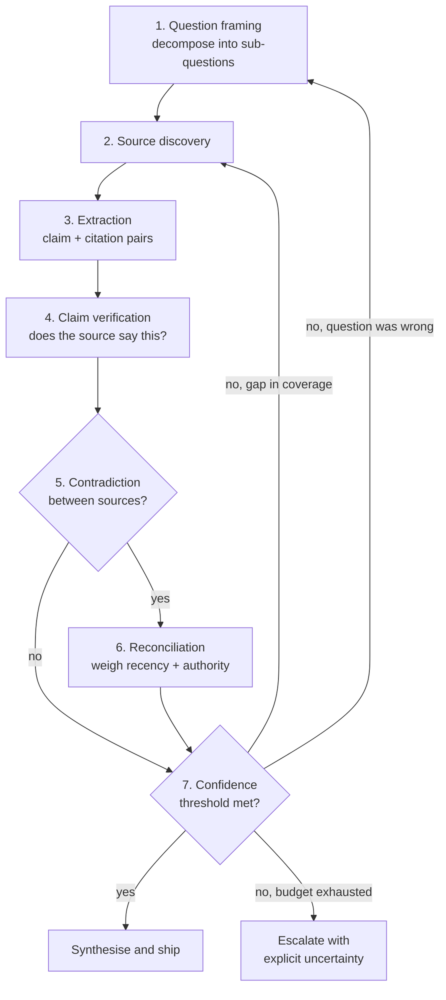

# Chapter 35: Case Study — The Research Loop

> **Reading note:** Named scenarios and numerical examples in this chapter are illustrative, not documented incidents or measured benchmarks. Code is a design sketch, not a tested implementation; `LoopKit` names describe the book’s illustrative API, not an established SDK. Provider behavior and prices require version-specific confirmation.

> "A citation either confirms a claim or it doesn't. The hard part is that 'confirms' lives on a spectrum from 'directly states' to 'vaguely implies.'"

## The Analyst Who Cited a Ghost

Marcus, a senior security analyst at a fintech consultancy, runs an automated research loop to produce threat-landscape reports for enterprise clients. The loop searches vulnerability databases, vendor advisories, and technical publications, then synthesises a monthly report with inline citations for every factual claim. For six months the system works well. Clients praise the reports for density, timeliness, and the footnote trail that allows their teams to verify anything that surprises them. Then a client's Chief Information Security Officer calls about a referenced CVE that does not exist.

The loop had extracted a claim from a technical blog post: "CVE-YYYY-NNNNN allows unauthenticated remote code execution in ExampleTLS 3.2." The blog post existed. The sentence existed in the blog post. But the author had invented the CVE number as a hypothetical example in a paragraph exploring what a critical vulnerability might look like if discovered. The paragraph began with "Imagine if researchers found…" — a framing the extraction stage ignored. The loop recorded the claim with its source URL. The verification stage confirmed that yes, the source URL contained those exact words. Nobody checked whether the source *asserted the claim as fact* rather than presenting it as speculation.

Marcus had built an oracle that verified textual presence: does the cited source contain the claimed information? He had not built an oracle that verified epistemic status: does the source present the information as a factual assertion rather than a hypothetical, an opinion, a reported-but-unconfirmed rumour, or an illustrative example? The difference between textual presence and factual assertion cost his firm a client relationship, a week of remediation communications, and a reputational wound that took months to heal.

This chapter builds the research loop correctly — with verification that goes beyond "the source says these words" to assess whether the source asserts them as established fact, whether the source is authoritative for the claim type, and whether independent sources corroborate the assertion.

## The Loop Contract for Research

The research loop's contract differs fundamentally from a coding loop's because its primary oracle is a model judge (Level 4 in the hierarchy from Chapter 20), not a deterministic check (Level 1). This makes every verification cycle more expensive, less certain in its pass/fail boundary, and susceptible to the biases that model judges carry. The contract must account for this uncertainty.

```python

from loopkit.contract import LoopContract, Goal, Budget, StopCondition, EscalationPolicy
from loopkit.oracles import JudgeOracle, DeterministicOracle

research_contract = LoopContract(
    goal=Goal(
        statement="Produce a sourced analysis of SQLite vs PostgreSQL tradeoffs "
                  "for a 10-user internal tool, with every factual claim grounded "
                  "in a cited source that asserts it as fact.",
        acceptance=(
            "Every factual claim has an inline citation to a specific source",
            "Each cited source asserts the claim as fact, not as hypothetical or opinion",
            "Independent corroboration appropriate to claim stakes; shared origins disclosed",
            "Conflicting evidence is acknowledged explicitly, not suppressed",
            "Source version, applicability, and freshness checked for each material claim",
        ),
    ),
    oracle=JudgeOracle(
        rubric="source_grounding_rubric_v2",
        threshold=0.80,
        pre_filter=DeterministicOracle(checks=[
            ("format", "every_claim_has_citation_marker"),
            ("urls_valid", "all_cited_urls_return_200"),
        ]),
    ),
    budget=Budget(
        max_iterations=7,
        max_tokens=400_000,
        max_usd=1.50,
        max_wall_clock_s=300,
    ),
    stop=StopCondition(
        success="All sub-questions at confidence >= 0.80 with verified citations",
        exhaustion="Report partial findings with explicit confidence scores per section",
        stuck="Two consecutive discovery rounds add zero new verified claims",
    ),
    escalation=EscalationPolicy(
        on_stuck="Flag low-confidence sub-questions for human research",
        on_budget="Deliver partial report with per-section confidence",
        on_ambiguity="Present conflicting sources to human for adjudication",
    ),
)
```

The critical architectural choice visible in this contract: the oracle evaluates source grounding, not factual truth. The loop cannot determine whether SQLite actually handles ten concurrent writers gracefully. What it can verify is whether its claim about SQLite's concurrency behaviour is supported by an authoritative source that presents that information as factual documentation rather than speculation. This is an important epistemological boundary that practitioners must understand. The research loop produces well-sourced analysis, not guaranteed truth. A well-sourced analysis can still be wrong — if every available source is wrong, the loop will produce a well-cited wrong answer. The loop's guarantee is traceability (every claim has a verifiable origin), not omniscience.

## The Seven Stages of Research

A research loop passes through seven stages. Unlike a coding loop, which iterates primarily between Execute and Verify, a research loop can cycle back to any earlier stage when evidence is insufficient, contradictory, or when new information reframes the original question.



The two cycle-back edges are what distinguish a research loop from a search pipeline. A gap in coverage sends the loop back to discovery; evidence that reframes the question sends it all the way back to framing. A loop that can only re-search, never re-frame, will confidently answer the wrong question.

**Stage 1: Question Framing.** The raw user question is decomposed into precise, independently answerable sub-questions. "What are the tradeoffs of SQLite vs PostgreSQL for a small internal tool?" is not directly answerable because "tradeoffs" spans multiple dimensions: concurrency, operational overhead, deployment complexity, feature set, performance characteristics, and migration paths. Each dimension becomes its own sub-question, specific enough to have a factual answer backed by documentation or benchmarks.

The framing stage also sets a scope budget. Seven sub-questions is an illustrative allocation, not a universal ceiling. Estimate the evidence required for the requested decision, prioritize material questions, and narrow or stage the work when the available budget cannot support adequate depth. Some questions need one authoritative passage; others need a much larger investigation.

The failure mode at this stage is over-decomposition. Twenty sub-questions means shallow answers to all of them rather than deep answers to the ones that matter. The heuristic: if a sub-question can be answered with a single sentence from a single source, it does not need to be a separate research thread. Merge it into a broader sub-question.

**Stage 2: Source Discovery.** Search across source types according to the claim. Official documentation can establish supported behavior for a particular version; benchmarks support measurements under their stated conditions; practitioner reports describe scoped experience; papers provide methods and findings that require applicability checks. Source code and changelogs may expose implementation details, but only when the relevant revision, build configuration, and deployed caller are identified. No source type is automatically current, complete, or correct.

A well-designed discovery stage explicitly searches for counterarguments after initial discovery. If the first five sources all favour SQLite, the loop generates targeted queries: "SQLite limitations production," "PostgreSQL advantages small team," "why not SQLite." This active diversification prevents confirmation bias from shaping the evidence base before verification even begins.

The failure mode is echo-chamber sourcing. Blog posts cite each other, creating an illusion of independent corroboration. Three posts all citing the same Stack Overflow answer are one source, not three. The loop must trace citation chains when possible and count independent origins rather than raw source volume.

**Stage 3: Information Extraction.** Each source is parsed into structured claims with metadata: the factual assertion, the source URL, the publication date, how directly the source states the claim (direct quote vs. paraphrase vs. inference), and which sub-question it addresses. The directness score ranges from 1.0 (the source explicitly states this fact in clear language) through 0.7 (the fact is clearly implied by the source's content) to 0.4 (the fact is inferred from indirect evidence in the source).

The failure mode is hallucinated extraction. The model "reads" a source and produces a claim that the source does not actually make. This happens because the model's training data contains information about the topic, and it conflates what it knows from training with what the specific source states. The extraction prompt must be explicit: "Extract only information that this specific source document states or clearly implies. Do not add information from your general knowledge." Even with explicit instructions, extraction can introduce unsupported details. Measure that error rate on the deployed model and task distribution rather than adopting an unsourced 5–15% estimate; this risk motivates the separate verification stage.

**Stage 4: Claim Verification.** This is the stage Marcus's loop failed and where a production research loop earns its reliability. Verification is a three-part check performed in isolated context (per Chapter 21, *Maker-Checker: The Grader Must Not Share the Maker's Context*). The verifier receives only the source text and the claim. It does not see the extraction context, the model's reasoning, or the confidence score assigned during extraction. This isolation prevents the extractor's confidence from biasing the verification judgment.

```python

from loopkit.checker import isolated_context
from loopkit.oracles import Evaluation, Verdict

async def verify_research_claim(
    claim: str,
    source_text: str,
    source_url: str,
) -> Evaluation:
    """Three-part verification: presence, epistemic status, authority."""
    # Part 1: Is the claim textually present in the source?
    if not text_similarity_above_threshold(claim, source_text, threshold=0.6):
        return Evaluation(
            verdict=Verdict.FAIL, score=0.0,
            feedback="Claim not found in source text",
            cost_usd=0.0, oracle_name="source_grounding",
        )

    # Part 2: Is the claim asserted as fact? (isolated judge)
    epistemic = await isolated_context(
        # Select the relevant passage with surrounding qualifications; not the first 4000 chars.
        # The helper must return insufficient evidence if the necessary context is absent.
        passage=select_relevant_passage(source_text, claim),
        prompt=(
            f"Claim: {claim!r}\n\n"
            f"Classification: Is this claim presented as (A) a factual assertion, "
            f"(B) a hypothetical/example, (C) someone else's reported claim, "
            f"or (D) an opinion/recommendation? Answer with letter and one sentence."
        ),
        model="haiku",
    )
    if epistemic.startswith("B"):
        return Evaluation(
            verdict=Verdict.FAIL, score=0.1,
            feedback="Source presents claim as hypothetical, not assertion",
            cost_usd=0.002, oracle_name="source_grounding",
        )

    # Part 3: Source authority assessment
    authority = score_source_authority(source_url, claim_domain="database_engineering")

    # Only an explicit factual assertion can support an unqualified factual claim.
    # Reported claims and opinions require attribution; malformed/unknown output is inconclusive.
    supported = epistemic.startswith("A") and authority >= 0.8
    return Evaluation(
        verdict=Verdict.PASS if supported else Verdict.INCONCLUSIVE,
        score=1.0 if supported else 0.0,
        feedback=f"Epistemic: {epistemic[:60]}, Authority: {authority:.2f}",
        cost_usd=0.003, oracle_name="source_grounding",
    )
```

The key innovation is Part 2: epistemic status classification. A lightweight model (Haiku-class, costing fractions of a cent per call) classifies whether the source presents the claim as established fact, as speculation, as someone else's claim being reported, or as the author's opinion. This single check would have caught Marcus's ghost CVE — the blog post presented it with "Imagine if…" framing that a factual-assertion classifier would flag immediately.

**Stage 5: Contradiction Handling.** When two verified sources assert contradictory claims — "SQLite handles concurrent writes gracefully with WAL mode" versus "SQLite's single-writer lock creates significant contention under concurrent write load" — the loop does not pick a winner based on which source it found first or which source scored higher on authority. It records both, notes the contradiction, and actively searches for a third source to provide context. Often the contradiction dissolves with context: both statements are true under different conditions (low write volume vs. high write volume). Sometimes the contradiction is genuine (one source is outdated). The resolution is surfaced in the final output as acknowledged complexity rather than suppressed to produce a cleaner narrative.

Suppressing contradictions is the research loop's equivalent of deleting a failing test. It makes the output look better while making it less trustworthy. A client reading the report sees clean consensus. They make a decision based on that consensus. Later they discover the suppressed counter-evidence. Trust is permanently damaged — not because the report was wrong, but because it was selectively honest. The practical implementation of contradiction handling uses structured fields that require explicit resolution: a contradiction record carries both claims, both sources, the resolution type (context-dependent, one-outdated, genuine-disagreement), and the reasoning that produced the resolution. Unresolved contradictions are escalated to the synthesis stage where they appear in the output as "Evidence disagrees on this point" rather than being silently dropped.

**Stage 6: Evidence Sufficiency.** Keep directness, applicability, source authority, independence, freshness, and contradictions visible. Newer evidence is not automatically better: an older specification may govern the deployed version, while a recent benchmark may use irrelevant hardware or workloads. A claim may need one primary source or several independent origins depending on uncertainty and consequence. Do not convert source count or average age into universal acceptance thresholds.

A claim-evidence score is a rubric output, not a probability that the conclusion is true. Directness, source authority, independence, and applicability should remain visible as separate reasons. A source can explicitly assert something false; a careful inference can be well supported without sharing the exact wording. Use numerical thresholds only after calibration against independently labeled cases, and retain unknown when the evidence is missing.

**Stage 7: Synthesis and Stop.** Once all sub-questions meet threshold (or budget is exhausted), the loop synthesises findings into a coherent answer that leads with the recommendation, supports with cited evidence, acknowledges limitations and contradictions, and provides decision criteria ("Choose SQLite when… Choose PostgreSQL when…"). The synthesis undergoes a final meta-verification: does every factual claim in the output trace back to a verified claim in the evidence set? Any assertion that appears in synthesis but not in the verified evidence is flagged and removed. This prevents the model from adding "helpful" context from its training data that has not been source-grounded.

## The Oracle Hierarchy for Research

The hierarchy from Chapter 20 applies but populates differently in the research domain:

Level 1 (Deterministic, ~\$0): Does every claim have a citation marker? Are all URLs syntactically valid? Does the output follow the required format? These catch mechanical errors instantly and for free.

Level 2 (Property-Based, ~\$0.001): Does the cited URL return HTTP 200? Does the page contain text with high similarity to the claimed content? This programmatic check catches hallucinated URLs and gross extraction errors without needing a model judge.

Level 3 (Rubric, illustrative cost): Is the source mix suitable for the claim, is corroboration genuinely independent where needed, and does the evidence apply to the target version and decision? These questions may require semantic judgment; counting links and dates alone does not answer them.

Level 4 (Model Judge, ~\$0.003): Does the source assert the claim as fact? Is the extraction a fair characterisation of what the source says? Does the synthesis faithfully represent the verified evidence? These require genuine reading comprehension and are where the model judge earns its cost.

Level 5 (Human, ~\$10–50 per adjudication session): Resolving genuinely ambiguous cases where the model judge cannot determine whether a source supports a claim, or where two verified sources present irreconcilable contradictions. In a well-designed research loop, fewer than 5% of claims should reach this level.

Total verification cost for a typical seven-sub-question research task with 30–40 claims: approximately \$0.10–0.15 for verification alone. The full loop including discovery (search API calls), extraction (Sonnet-class model reading source documents), verification, and synthesis (Sonnet-class model assembling the final report) runs \$0.30–1.00 depending on iteration depth and source volume.

## A Complete Trace: Research in Practice

To ground the architecture concretely, trace how the loop handles one sub-question from the SQLite vs. PostgreSQL analysis: "What are SQLite's concurrency limitations under ten simultaneous writers in WAL mode?"

Round 1 (Discovery): The loop generates three targeted queries: "SQLite WAL mode concurrent writers documentation site:sqlite.org," "SQLite write lock contention benchmark 2024 2025," and "SQLite concurrent access limitations production experience report." Discovery returns eight sources: the official WAL documentation page, two performance benchmark blog posts from 2024, a Stack Overflow thread with high engagement, a GitHub discussion on the SQLite repository, and three practitioner experience reports.

Round 2 (Extraction): The loop separates the documented concurrency model from application-specific configuration. A single-writer limitation, a busy-handler setting, and a measured latency under a benchmark's workload are different claim types. It must not promote a language binding's timeout default into a universal SQLite default. For the intended application, record the actual driver, version, connection settings, transaction length, and workload before judging whether contention is acceptable.

Round 3 (Verification): The verifier checks the exact documentation passage and benchmark conditions. It preserves “we observed” as useful scope rather than penalizing careful wording. A benchmark without hardware, data size, transaction design, or concurrency details may support a narrow reported observation but not a deployment recommendation.

Round 4 (Sufficiency): The loop reports what the sources establish and what needs measurement in the target application. Ten simultaneous users do not imply ten continuously active writers. If the recommendation depends on write contention, a representative local workload test is more useful than collecting additional copies of a generic claim. A numerical confidence score is not a substitute for that missing evidence.

This trace illustrates an evidence-checking workflow, not proof that every research loop outperforms every RAG system. The benefit depends on whether the added steps find material gaps and whether the evaluator detects unsupported claims. Compare matched outputs against domain-expert judgments and include the cost of unresolved questions.

## Research Loop vs. RAG: When to Iterate

The practical question practitioners face is not "should I build a research loop?" but "does this question warrant a research loop, or is RAG sufficient?" The distinction maps to decision stakes and verification needs.

RAG describes retrieval-augmented generation, not a promise of a single pass or an absence of verification. A simple retrieve-and-answer pipeline may be sufficient for a curated corpus; a more elaborate RAG system can include iterative search, contradiction handling, and checks. The engineering question is which evidence gaps justify another step, not whether one architecture has the more ambitious label.

A research loop is useful when the question has material evidence gaps that a single retrieval cannot resolve. It does not eliminate the need for expert review in clinical, legal, security, or other high-consequence decisions. The report should expose its limitations so a responsible decision-maker can judge whether the evidence is adequate.

The cost differential is roughly 10–50x: a RAG query costs \$0.01–0.05; a research loop costs \$0.30–1.00. The quality differential should exceed the cost differential to justify the spend. For a \$500/hour decision-maker reading the output, the cost of a wrong answer (\$500+ of wasted time pursuing a bad recommendation) vastly exceeds the cost difference between RAG and a research loop (\$0.25–0.95). For a \$15/hour customer support interaction, RAG's cost-to-quality ratio is typically better.

## What Breaks

The research loop's fundamental limitation is that it verifies source grounding, not truth. If every available source on a topic is wrong — because they all cite the same flawed study, because the field's consensus has shifted but publications lag, or because a widely-copied blog post contains an error that propagated through citation chains — the loop will produce a well-sourced, well-cited, confidently-scored answer that is factually incorrect. The loop will not detect this failure because its oracle checks agreement between claims and sources, not agreement between claims and reality. This is an inherent epistemological boundary, not a bug to be fixed. The loop guarantees traceability (you can check its work). It does not guarantee omniscience (it might trace back to a source that is wrong).

Circular sourcing is the most insidious failure because it defeats the corroboration mechanism that is supposed to provide confidence. Blog A cites Blog B, which cites a Stack Overflow answer, which cites a now-deleted blog post from 2019. The loop sees three apparently-independent sources agreeing on the same claim and assigns high confidence. But there is one origin and three echoes. The confidence is illusory. Detecting circular sourcing requires tracing citation chains backward — following "source cited" or "according to" attributions until reaching either a primary source (documentation, original research, first-hand measurement) or a dead end (deleted page, uncited assertion). This capability exists in academic citation analysis but is not yet standard in agentic research loops. The partial mitigation available today: assign higher authority weights to primary sources and apply a discount when multiple secondary sources share phrasing similarity that suggests a common origin.

Temporal decay erodes accuracy silently and continuously. A claim verified against PostgreSQL 12 documentation may be false for PostgreSQL 16 because the feature's behaviour changed, was deprecated, or was replaced entirely between versions. The loop cannot know what it does not know — if no recent source contradicts the old claim, and the old documentation page still exists at the same URL with the same text, the loop has no signal that the claim is stale. The mitigation is aggressive recency weighting in confidence scoring (claims whose newest supporting source is older than two years receive a staleness penalty that reduces confidence by 20–30%) combined with explicit freshness searches ("What changed in \[topic\] since \[oldest source year\]?"). Neither is perfect. A staleness penalty may discount still-valid claims about stable behaviour (the speed of light has not changed since 2019). A freshness search may find nothing new because nothing has changed. But both are strictly better than assuming all verified claims remain perpetually valid regardless of when their evidence was published.

## Implementation Guidance: Preserve Claim Scope and Source Status

Store a claim as more than a sentence and URL. Include the source revision or content hash, locator, relevant excerpt, publication and retrieval dates, product version, population, conditions, and epistemic status. “A vendor reports a sixfold improvement on its internal test” is a different claim from “this method improves completion sixfold.” The first may be faithfully sourced while the second overgeneralizes. Source authority cannot repair that change in scope.

The verifier needs enough context to judge the claim. The first 4,000 characters of a long document may omit the relevant paragraph; a matching sentence may omit the preceding “imagine if.” Retrieve the passage plus nearby qualifiers, table headings, footnotes, and definitions. If the evidence depends on a diagram or an unextracted table, label the extraction gap and inspect the original before making the claim. A search snippet is a discovery hint, not a substitute for the source.

Marcus's repaired workflow treats the ghost vulnerability as a source-status failure. It preserves the hypothetical paragraph for the regression fixture, removes the unqualified vulnerability claim from the report, and searches the appropriate primary advisory source. If the identifier cannot be confirmed, the report says so; it does not invent an alternative ID or reinterpret silence as proof that no vulnerability exists. The placeholder used in this chapter is intentionally not an assertion about a real CVE.

Separate deterministic checks from semantic judgments. URL syntax and HTTP status can be checked mechanically, but a 200 response can be a login page, a soft 404, or unrelated content. A 403 can block access to a real source. Lexical similarity is a retrieval aid, not an entailment test. The illustrative code needs structured classifier output, schema validation, and independent calibration before use; its score is not a calibrated truth probability.

Stop when the requested questions have adequate support for their stakes, or when a specific gap cannot be resolved within the authorized budget. “Two rounds found nothing new” is not sufficient if those rounds used the same failing search provider. Preserve useful completed findings and report the original access or extraction failure. Conversely, do not continue collecting loosely related sources after the requested answer is sufficiently supported.

An acceptance fixture should include a direct fact, a negated claim, a hypothetical, a reported vendor result, an outdated product version, and two websites copying one origin. The output must retain scope, distinguish attribution from endorsement, reject unsupported synthesis, and count independent evidence correctly. [Anthropic's evaluation guidance](https://www.anthropic.com/engineering/demystifying-evals-for-ai-agents) supports calibrated graders, unknown outcomes, and transcript inspection; the research process still needs domain-specific source judgment. High-consequence decisions may require an accountable expert even when citations are complete.

## Key Takeaways

- The research loop verifies source grounding (does the source assert this as fact?), not factual truth — an important epistemological boundary.
- Seven stages cycle non-linearly: frame, discover, extract, verify, handle contradictions, score confidence, synthesise.
- Claim verification requires epistemic status assessment: distinguishing factual assertions from hypotheticals, opinions, and reported-but-unverified claims.
- The verifier operates in isolated context (Chapter 21) to prevent extraction confidence from biasing verification.
- Contradictions are surfaced, not suppressed — suppressing them is the equivalent of deleting a failing test.
- Confidence scoring reflects independent corroboration, source authority, and recency — not raw source count.
- Iterative research can improve evidence coverage, but costs and reliability are workload-specific. High-consequence decisions may still require expert review.

## The Loop Contract, So Far

This chapter demonstrated how the Loop Contract adapts when oracles shift from deterministic to model-judged:

- **Goal:** Acceptance criteria defined in terms of source grounding quality, not factual truth
- **Oracle:** Level 4 judge for epistemic assessment, with Level 1–3 structural checks filtering first
- **Budget:** Higher per-iteration cost compensated by fewer iterations (3–7 rounds typical)
- **Stop condition:** Confidence threshold per sub-question, OR diminishing returns, OR budget exhaustion
- **Escalation path:** Partial report with explicit confidence scores; low-confidence sections flagged for human research

## Exercises

1. **Build the epistemic classifier.** Implement the three-part verification function for a domain you work in. Test it with ten claims: five genuine factual assertions from documentation and five that are hypothetical, speculative, or opinion. Measure precision and recall. What confidence threshold produces the best F1 score?

2. **Detect circular sourcing.** Given a set of five blog posts on a technical topic, trace citation chains. For each factual claim, identify whether corroboration is independent (distinct primary sources) or circular (same origin, multiple echoes). Propose and implement a scoring penalty for echo-chamber evidence.

3. **Compare RAG vs. research loop.** Take a technical decision question relevant to your work. Answer it with a single RAG pass (one retrieval, one generation). Then answer it with a three-round research loop (discovery, verification, targeted re-search). Compare outputs on: citation accuracy, contradiction handling, actionability, and confidence calibration.

4. **Design the staleness oracle.** Write a check that flags claims whose supporting evidence is older than a configurable threshold. Distinguish stable domains (mathematical properties — unlikely to change) from volatile domains (API surfaces, library behaviour — change frequently). Implement the domain-stability heuristic.

## Sources

- Chapter 3, *Anatomy of a Loop* — the five stages and Loop Contract formalism.
- Chapter 20, *The Hierarchy of Oracles* — oracle levels and the governing rule.
- Chapter 21, *Maker-Checker: The Grader Must Not Share the Maker's Context* — isolated-context verification.
- SQLite documentation, sqlite.org/wal.html — WAL mode concurrency, used in worked example.
- PostgreSQL documentation, postgresql.org/docs/ — MVCC and concurrency, used in worked example.

------------------------------------------------------------------------

*Next: Chapter 36 applies loop patterns to operations — security triage and browser automation — where actions change running systems and the oracle must confirm no collateral damage.*
