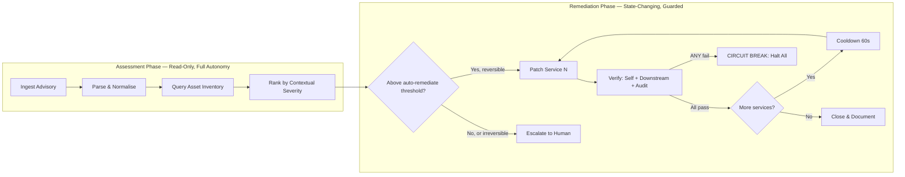

# Chapter 36: Case Study — The Operations Loop

> **Reading note:** Named scenarios and numerical examples in this chapter are illustrative, not documented incidents or measured benchmarks. Code is a design sketch, not a tested implementation; `LoopKit` names describe the book’s illustrative API, not an established SDK. Provider behavior and prices require version-specific confirmation.

> An operations loop needs bounded evidence about downstream effects and an explicit policy for what it cannot observe.

## The Patch That Became an Outage

Javier manages security operations for a healthcare SaaS company running twenty-three microservices across four Kubernetes clusters. On a Thursday afternoon, a critical CVE drops for a logging library their services depend on — remote code execution, CVSS 9.8, public exploit code. Their security triage loop — two months in development, battle-tested on medium-severity advisories — ingests the advisory, cross-references the dependency inventory, and identifies fourteen affected services ranked by exposure: six internet-facing with direct dependencies, four internal with direct dependencies, four with transitive dependencies only.

The loop begins remediation, patching services one at a time in severity order. Service one: dependency upgraded in manifest, lock file regenerated, tests pass in CI, canary deployed, health checks pass, full rollout. Service two: same sequence, clean. Service three: same sequence, health check passes — but unknown to the loop, the new library version changed the structured log format from JSON-lines to a nested JSON object. Service three's log-aggregation sidecar expects JSON-lines. The sidecar cannot parse the new format. It silently drops every log message. The loop's health check calls the service's `/health` endpoint, which returns 200. The health check does not monitor log delivery to the aggregation pipeline.

Services four, five, six, and seven patch cleanly — same log format change, same silent log drop. The loop reports seven successful remediations. Forty minutes later, the on-call engineer notices the logging dashboard has gone blank for four services. She traces the issue to the reformatted logs. The patches are correct — the vulnerability is closed in all seven services. When the team lacks audit records for part of the rollout, it has an operational control gap that requires investigation against its applicable logging and retention requirements. This illustrative case does not establish a specific HIPAA violation merely from a fixed number of minutes without logs. The compliance team files an internal incident. The remediation that fixed the security vulnerability created a compliance vulnerability.

Javier's retrospective conclusion: the loop's oracle was necessary but insufficient. It verified "is the patched service healthy?" without verifying "did this change break anything downstream of the service's own endpoints?" The loop needed a blast-radius oracle that checked the service's outputs and consumers, not just its inputs and internal state.

This chapter builds an operations loop for security alert triage — from advisory ingestion through verified remediation — with the escalation design, blast-radius controls, and multi-signal oracles that make it safe to run unattended on production systems.

## The Loop Contract for Security Triage

```python

from loopkit.contract import LoopContract, Goal, Budget, StopCondition, EscalationPolicy
from loopkit.oracles import DeterministicOracle
from loopkit.safety import BlastRadius

triage_contract = LoopContract(
    goal=Goal(
        statement="Assess and remediate CVE-2026-XXXXX across all affected services "
                  "with vulnerability closure and defined downstream safety checks.",
        acceptance=(
            "Vulnerability scanner clean on all previously-affected services",
            "Service health unchanged: p99 latency within 1.5x, error rate within 2x baseline",
            "Downstream consumer health unchanged: log delivery, queue depth, replication lag",
            "Complete audit trail: every action logged with rationale and before/after state",
        ),
    ),
    oracle=DeterministicOracle(checks=[
        ("vuln_scan", "trivy image {service} --severity CRITICAL,HIGH --exit-code 1"),
        ("health_self", "assert_latency_p99_within 1.5x AND assert_error_rate_within 2x"),
        ("health_downstream", "assert_log_delivery_stable AND assert_queue_depth_stable"),
        ("audit_trail", "assert_audit_entry_for {action_id}"),
    ]),
    budget=Budget(
        max_iterations=50,
        max_tokens=600_000,
        max_usd=5.00,
        max_wall_clock_s=3600,
    ),
    stop=StopCondition(
        success="All affected services patched and all acceptance criteria pass",
        exhaustion="Halt; report patched vs remaining; escalate remainder to human",
        stuck="Same service fails verification three consecutive attempts",
    ),
    escalation=EscalationPolicy(
        on_stuck="Page on-call with service name, error, and three attempt diffs",
        on_budget="Report progress; human handles remaining services",
        on_ambiguity="If ANY patch breaks health: halt ALL remaining patches immediately",
    ),
)
```

The contract includes a circuit breaker that distinguishes operations from coding and research: if any single patch breaks a health check, the loop halts all remaining patches, not just the failed one. This reflects a critical operational insight that Javier learned the hard way. A patch failing verification on one service may indicate a systemic problem with the upgrade — like the log format change — that will manifest on every subsequent service too. Continuing to patch in the face of a verification failure is exactly the wrong response in operations. The safe response is to stop, diagnose, and understand whether the failure is local (specific to this service's configuration) or systemic (inherent to the library upgrade).

## Two Phases, Two Risk Profiles

Every operations loop has a fundamental architectural split between its assessment phase and its remediation phase. These phases have completely different risk profiles and warrant completely different autonomy levels.



The assessment phase is lower risk, not risk-free. Reads can expose confidential inventory, consume production capacity, contact external services, or bring injected content into the model. Keep it scoped and rate-limited, use approved data destinations, and preserve the boundary between assessment and mutation. Read-only authority must not quietly include a tool with side effects.

The remediation phase changes running production systems. Every action is potentially destructive. A dependency upgrade might break API compatibility. A configuration change might invalidate cached values in downstream services. A container restart might drop in-flight requests. The architectural response is sequential, verified, guarded execution: patch one service, verify comprehensively (self-health, downstream-health, audit trail), wait for effects to propagate (cooldown), then proceed to the next service only if all signals are clean. This is slower than parallel remediation but bounded in blast radius. This bounds the number of direct changes before the next verification, not every downstream consequence. Shared dependencies may propagate harm beyond that service.

The cooldown between services is not optional overhead. It serves a specific engineering purpose: operational changes take time to manifest their full effects. A patch that breaks log delivery takes seconds to affect the aggregation pipeline but minutes to produce a visible gap in monitoring dashboards. Without the cooldown, the loop might patch three more services before the first failure becomes observable in downstream metrics. The cooldown window should exceed the longest expected propagation time for the system's observable effects.

## The Assessment Phase in Detail

The assessment phase transforms a raw advisory into a prioritised, actionable remediation queue. Three sub-stages execute in sequence, each adding context that the next stage requires.

**Parse and normalise.** Vulnerability advisories arrive in heterogeneous formats: NVD JSON for CVE feeds, GitHub Security Advisory format (GHSA), Markdown for vendor announcements, HTML for CERT bulletins, and unstructured prose for bug bounty reports. The loop normalises every source into a structured representation containing: CVE identifier (if assigned), affected packages with version ranges, CVSS base score and attack vector, exploit availability (proof-of-concept, weaponised, or none known), whether a patched version exists, and the advisory's publication timestamp.

The parser must handle absence without invention. A bug bounty report that says "I found an XSS in the login page" has no CVE ID, no CVSS score, no specific affected package version. The normaliser records what the report states and leaves absent fields null. Inferring "probably CVSS 6.1 based on similar XSS vulnerabilities" is a judgment call that belongs in the assessment stage where contextual information is available, not in the parsing stage where the only input is the raw advisory text. Parsing extracts; assessment interprets.

**Cross-reference the asset inventory.** The loop queries the organisation's dependency database to identify which services use the affected package within the affected version range. This cross-reference is where the loop creates the most value relative to manual triage. A human analyst checking twenty-three services' dependency manifests against a version range spends thirty to sixty minutes on a medium-complexity advisory. The loop does it in seconds because the dependency data is already structured and queryable.

Directness is one input to applicability, not a priority rule. A transitive dependency may execute the vulnerable path automatically, while a direct dependency may not use it. Rank by affected deployed version, reachable behavior, exposure, exploit evidence, and compensating controls; unknown reachability is not evidence of safety.

**Rank by contextual severity.** Raw CVSS scores describe vulnerability severity in isolation. Contextual severity accounts for the specific deployment. A CVSS 9.8 RCE vulnerability in a development-only CLI tool with no network exposure is operationally less urgent than a CVSS 7.5 privilege-escalation vulnerability in an internet-facing production API processing patient health records. The ranking algorithm combines base severity (CVSS score), exposure (internet-facing vs. internal), data sensitivity (handles PII/PHI vs. non-sensitive), dependency directness (direct vs. transitive), and exploit availability (weaponised exploit in the wild vs. theoretical).

The resulting queue determines remediation order: internet-facing services with direct dependencies to libraries with known exploits at the top; internal services with transitive dependencies and no known exploit at the bottom. This ordering ensures that if the loop runs out of budget mid-remediation, it has already closed the highest-risk exposure.

## The Remediation Phase: Multi-Signal Verification

The remediation protocol for each service follows four steps: build the patch, deploy to staging, deploy to production (with canary if available), and verify comprehensively.

The verification step is where Javier's loop failed and where a production operations loop earns its reliability. Verification must check three independent signal categories:

**Self-health:** The patched service's own metrics remain within acceptable bounds. Latency has not increased beyond 1.5x baseline. Error rate has not increased beyond 2x baseline. The service responds to health probes. Its internal metrics (queue depths, thread counts, connection pool usage) are stable.

**Downstream health:** Services that consume this service's outputs continue to function normally. Log delivery rate to the aggregation pipeline is stable. Message queue depth for event consumers is not growing. Replication lag for dependent data stores is not increasing. This is the signal category Javier's loop lacked — and it is the one that would have caught the log-format breakage immediately, because log delivery rate would have dropped to zero within seconds of the format change.

**Audit trail completeness:** Every action the loop took is recorded with timestamp, rationale, before-state, after-state, and the verification result. This is not just good engineering practice — in regulated industries (healthcare, finance, critical infrastructure), it is a compliance requirement. An auditor reviewing the trail six months later must be able to reconstruct the complete decision chain without re-running anything.

```python

from loopkit.oracles import Evaluation, Verdict
from loopkit.safety import BlastRadius

async def verify_remediation(
    service_id: str,
    baseline_metrics: dict,
    blast_radius: BlastRadius,
) -> Evaluation:
    """Multi-signal post-patch verification."""
    failures: list[str] = []

    # Self-health signals
    current = await metrics.get_service_health(service_id, window_minutes=5)
    if current.p99_latency_ms > baseline_metrics["p99_latency_ms"] * 1.5:
        failures.append(f"Latency degraded: {current.p99_latency_ms}ms vs "
                       f"baseline {baseline_metrics['p99_latency_ms']}ms")
    if current.error_rate > baseline_metrics["error_rate"] * 2.0:
        failures.append(f"Error rate spike: {current.error_rate:.3%} vs "
                       f"baseline {baseline_metrics['error_rate']:.3%}")

    # Downstream health signals
    for consumer in await topology.get_downstream_consumers(service_id):
        health = await metrics.get_consumer_health(consumer.id, window_minutes=5)
        if health.throughput < consumer.baseline_throughput * 0.8:
            failures.append(f"Downstream {consumer.name}: throughput "
                          f"{health.throughput:.0f}/s vs baseline "
                          f"{consumer.baseline_throughput:.0f}/s")

    # Blast radius tracking
    blast_radius.record_action(service_id, success=len(failures) == 0)
    if not blast_radius.within_bounds():
        failures.append("Blast radius limit reached")

    verdict = Verdict.PASS if not failures else Verdict.FAIL
    return Evaluation(
        verdict=verdict, score=1.0 if not failures else 0.0,
        feedback="; ".join(failures) if failures else "All signals nominal",
        cost_usd=0.0, oracle_name="ops_verification",
    )
```

## Browser Automation as an Operational Modality

Some systems in an organisation's operational landscape have no API. An internal admin panel built in 2014 that nobody wants to add endpoints to. A third-party SaaS dashboard for vendor management. A government compliance portal for filing regulatory notifications. A legacy HR system that predates REST. For these systems, the operations loop must drive a browser as one of its tools.

Browser automation is not a separate loop architecture — it is a modality within the operations loop. The same triage loop that patches services via CLI commands might also need to update a firewall rule in a web-only admin panel, or submit a compliance notification through a government portal's multi-step web form.

The reliability challenges specific to browser automation are well-characterised and require explicit engineering:

**Non-determinism.** The same page may render differently on consecutive loads: A/B tests serving different layouts, lazy-loaded content appearing at unpredictable times, server-side personalisation changing available options. The loop must verify page state before acting, never assuming the page is in the expected state from a previous visit. A click on coordinates that worked last time may hit a different element this time because a banner shifted the layout.

**Brittleness.** DOM changes can invalidate a selector or make it ambiguous. Prefer stable semantic roles and accessible names, then verify the resolved element's identity, surrounding context, enabled state, and expected action. A fallback is acceptable only if it preserves those assertions. “Any working selector” is dangerous for consequential actions: matching a second Submit button can operate on the wrong resource. Stop rather than guess when identity is uncertain.

**Partial failure.** A form submission might succeed on the server but produce no visible confirmation because a JavaScript error prevents the success banner from rendering. The loop sees "nothing changed" and retries, submitting the form a second time — potentially creating a duplicate record. The mitigation: verify success through an independent channel when possible. Check the database, check for a confirmation email, query a read API if one exists. Trust the backend state over the frontend presentation.

**Session management.** Long operational workflows hit session timeouts mid-execution. The page suddenly redirects to login. The loop must detect this state (check URL, check for login-page indicators), re-authenticate, and resume from where it was interrupted. This requires tracking workflow progress outside the browser's state — in the loop's own context — so that re-authentication does not mean restarting the entire multi-step operation from scratch. The implementation pattern that works: checkpoint each completed form step in a workflow state object. After re-authentication, read the checkpoint and skip forward to the uncompleted step rather than re-executing steps that already succeeded. Without this pattern, a session timeout on step seven of a nine-step form means repeating all seven steps — each of which carries its own risk of failure, duplication, or state inconsistency.

**Rate limiting and throttling.** Browser automation against production systems must respect rate limits that are implicit rather than documented. An internal admin panel may not advertise rate limits, but submitting fifty configuration changes per second will overwhelm its backend and potentially trigger account lockouts or automated abuse detection. The operations loop should enforce configurable minimum delays between actions (default: 1–2 seconds between clicks, 5–10 seconds between form submissions) and back off exponentially when receiving error responses or unexpected redirects.

The oracle for browser-based operations follows the same hierarchy as everything else in the book. Prefer DOM assertions (is the success banner present? does the confirmation table contain the expected row?) over visual assertions (screenshot analysis). DOM assertions are free, instant, and binary. Visual assertions cost \$0.01–0.05 per image-input model judgment and produce probabilistic verdicts rather than certainties.

## The Escalation Design That Makes It Safe

The single most important design decision in any operations loop is where autonomous action ends and human judgment begins. Getting this boundary wrong in either direction is expensive. Too conservative: everything escalates, the loop provides no value, and you have built an expensive notification system. Too liberal: the loop causes damage that manual execution would have avoided, and the team loses trust in automation permanently.

The boundary should be drawn around reversibility, not around confidence or complexity.

Reversible actions may proceed only within explicit authority and tested preconditions. Rollback can itself fail, take time, or leave downstream effects. Require a recovery plan and observation criteria, not merely a label saying the operation can be undone.

This chapter's conservative policy requires human approval for high-consequence irreversible actions such as regulatory filing, data deletion, or public security notification. Other systems may operate under narrowly pre-authorized policies, but a model's confidence never creates that authority. Document the authorized scope and consequences before execution.

Ambiguously reversible actions — upgrading a database schema (technically reversible with a migration, practically risky), modifying a production configuration that downstream services cache (rollback does not un-cache), deploying to a cluster without rollback automation — should be treated as irreversible. The safe default when reversibility is uncertain is to require approval.

The blast-radius guard limits direct mutations per approved batch. It does not guarantee that only N services experience consequences: a shared database or event stream can propagate effects further. Reset the batch allowance only after its evidence and required approval are complete. Choose N from failure domains and consequence, not a universal default.

The time-of-day policy must account for both change risk and ongoing exposure. Do not assume waiting until morning is always safer during active exploitation. Define a pre-authorized emergency containment path, on-call escalation, and the limits of autonomous action before the incident. If approval is required and unavailable, preserve assessment findings and escalate through the established emergency channel rather than inventing permission.

## What Breaks

Operations loops have a failure mode that coding and research loops do not: they can make things actively worse. A coding loop that fails produces bad code that sits in a branch until a human reviews it. A research loop that fails produces a wrong report that the reader can challenge. An operations loop that fails can degrade production availability, violate compliance requirements, or cause data loss. The failure is not "wrong output" — it is "wrong action taken on a live system."

The characteristic failure is cascading response. The loop patches a service. The patch triggers a readiness probe failure because the new version takes thirty seconds to warm up — JVM class loading, connection pool initialisation, cache warming. The loop detects the failing probe within its verification window. It interprets the probe failure as evidence that the patch broke the service. It rolls back. The rollback reintroduces the vulnerability. On its next scan, the loop re-detects the vulnerability. It re-patches. The service oscillates between "vulnerable and healthy" and "patched and warming up," never reaching "patched and healthy" because the verification window is shorter than the warm-up time.

Each oscillation generates alerts. Each alert may trigger other automated responses — the monitoring system fires, the incident bot opens a ticket, the auto-scaling system tries to add capacity for the "degraded" service. The cascading response transforms a straightforward patch into a multi-system incident, entirely caused by measuring state before the operation's effects have propagated.

The fix is operation-specific verification delays calibrated to each action type's expected propagation time. Container restarts need 10–60 seconds before readiness probes stabilise. DNS changes propagate over minutes to hours depending on TTL values and resolver behaviour. Certificate renewals need minutes for all connected clients to renegotiate TLS. Database schema migrations need time proportional to dataset size for replica synchronisation. A verification that runs before the propagation window closes sees stale state. If the loop acts on stale state — rolling back a successful patch because the health check has not yet passed — it creates the oscillation pattern. The engineering discipline: every action type must specify its propagation time, and verification must not begin until that time elapses. Conservative delays cost seconds. Cascading incidents cost hours.

The second characteristic failure is oracle inversion: the verification tool provides false confidence. The vulnerability scanner has a stale signature database and reports "clean" when the vulnerability persists — the signature for the new CVE was not in the scanner's last update. The health endpoint returns 200 even though the service is serving errors on all business-logic endpoints — because the health check only queries database connectivity, not application-layer function. The log-delivery monitor shows "green" because it checks that the pipeline process is running, not that logs arrive end-to-end.

In each case, the loop observes a green signal and acts with confidence. The signal is technically accurate (the scanner did not find this pattern; the database is up; the process is running) but instrumentally misleading (the vulnerability exists; the service is broken; logs are being dropped). The loop closes the ticket. The problem persists.

The mitigation is multi-signal verification with independent data sources. Never trust a single oracle for operations where the cost of a false positive is a missed vulnerability or a missed outage. Cross-check the scanner with a direct package version query (does the manifest show the patched version?). Cross-check the health endpoint with actual business-traffic error rates from the observability stack. Cross-check the log pipeline status with an end-to-end delivery test (inject a known message and verify arrival within bounded time). Each cross-check adds seconds. Seconds are cheap compared to trusting a single misleading signal and missing a live vulnerability.

## Implementation Guidance: Verify Bounded Safety Properties

“No collateral damage” is an aspiration, not a property a finite monitoring window can prove. Define the dependencies, signals, observation period, sample adequacy, and limits that justify proceeding. For Javier's logging change, test delivery end to end with a known harmless audit event and confirm arrival at the intended sink. A running sidecar and a green health endpoint do not establish that records reached storage. If the metric is absent, stale, or has insufficient traffic, the verdict is inconclusive rather than pass.

The illustrative code above omits these adequacy checks and its audit-trail check; they are required before using that design operationally. Relative thresholds also need absolute limits. Doubling a zero baseline is still zero, while a low-traffic window can make a percentile meaningless. Use minimum sample counts, absolute error budgets, a contemporaneous control where possible, and domain-specific thresholds. Multiple signals from the same broken telemetry pipeline are correlated, not independent confirmation.

Sequential rollout reduces concurrent changes but does not guarantee only one affected service. A shared dependency, queue, or database can propagate damage beyond the patched instance before monitoring reacts. Bound rollout by failure domains and require an observation window tied to expected propagation and workload cycles. Do not merely sleep sixty seconds and declare the environment settled. Continue passive observation immediately while waiting for enough evidence to authorize the next mutation.

A browser timeout is an external-effect uncertainty problem. Persist the intended operation and resource identity before clicking, then verify server-side state through an authorized independent channel where possible. After reauthentication, reconcile that operation rather than blindly skipping to the next visible form step or resubmitting. If no reliable status channel exists, report unknown and require manual resolution for consequential actions. Chapter 39 covers the same pattern for API calls; browser automation does not escape it.

For recovery, compare the risks of leaving the patched version, rolling back, or applying a forward fix. Reverting the logging library may reopen the vulnerability. A configuration rollback may not undo transformed data or downstream notifications. The approved runbook should identify who can choose among these options and what evidence is required. The model can summarize the tradeoff; it cannot acquire emergency authority from the urgency of its own assessment.

Test this with an illustrative third-service failure in a ten-service rollout. The expected result is not just “loop stopped”: the journal shows which changes were accepted, which remain unknown, which later actions were prevented, and who owns recovery. Include a stale scanner, a missing log-delivery metric, and a lost browser confirmation. Acceptance requires explicit inconclusive states, no duplicate submission, no unchecked fourth service, and preservation of useful completed assessment. [AWS's retry-identity guidance](https://aws.amazon.com/builders-library/making-retries-safe-with-idempotent-APIs/) supports careful handling of late requests; the exact remediation remains specific to the operating environment.

## Key Takeaways

- Operations loops change live systems, making their failure modes more severe than coding or research loops — a bad patch causes outages, not just bad PRs.
- Read-only assessment is lower risk, not risk-free. Mutation needs scoped authority, adequate observations, and containment.
- Verify specified downstream properties; missing telemetry is inconclusive, not proof of no collateral damage.
- The escalation boundary is drawn around action reversibility: irreversible actions always require human approval, regardless of the loop's confidence level.
- Browser automation is a modality within the operations loop for systems lacking APIs, with specific challenges: non-determinism, selector brittleness, partial failure, and session expiry.
- Blast-radius guards and inter-service cooldowns prevent systematic errors from propagating across the fleet before they become observable in metrics.
- The scanner, business metrics, log delivery, and audit journal cover different properties, but may share failure dependencies. Confirm each signal's freshness and scope, and use independent data paths where feasible. Corroboration reduces some blind spots; it does not prove absence of harm.

## The Loop Contract, So Far

This chapter demonstrated how the Loop Contract adapts for operations:

- **Goal:** Defined safety properties and observation windows accompany the remediation objective.
- **Oracle:** Multi-signal checks with explicit coverage, common dependencies, and inconclusive outcomes.
- **Budget:** Higher iteration count (many services) but stricter per-service bounds and a global circuit breaker
- **Stop condition:** Circuit breaker on first verification failure halts all remaining remediation
- **Escalation path:** Irreversible actions always escalate; reversible actions escalate on verification failure; ambiguous reversibility treated as irreversible

## Exercises

1. **Map your downstream dependencies.** For a service you operate, identify its three most critical downstream consumers. For each, define a quantitative health signal (delivery rate, latency, queue depth) and a threshold that constitutes "degraded." Implement the downstream health check.

2. **Design the cooldown schedule.** For five operational actions relevant to your infrastructure (container deploy, config change, DNS update, certificate rotation, database migration), determine the appropriate verification delay. For each, explain the propagation mechanism and justify the chosen delay.

3. **Implement the circuit breaker.** Build a blast-radius guard that tracks actions across a multi-service patching run, enforces per-run limits, and halts all remaining operations if any single verification fails. Test it with a simulated failure on the third of ten services.

4. **Classify your escalation boundary.** For your team's operational runbooks, classify each action as reversible, irreversible, or ambiguous. For ambiguous actions, document which side of the boundary they fall on and why.

5. **Compare browser oracle strategies.** Choose a web-based operational action in your environment. Implement both a DOM-based assertion and a screenshot-based visual assertion for verifying success. Execute each twenty times and compare reliability (false positive and false negative rates) and cost.

## Sources

- Chapter 3, *Anatomy of a Loop* — the five stages and Loop Contract formalism.
- Chapter 20, *The Hierarchy of Oracles* — oracle levels applied to operational verification.
- Chapter 24, *From Loop to Fleet* — context isolation and blast-radius principles.
- Chapter 27, *Token Economics of Loops* — cost implications of multi-signal verification.
- Chapter 30, *Security in Autonomous Loops* — permission models and sandbox architectures.

------------------------------------------------------------------------

*Next: Chapter 37 provides a staged 90-day build plan for going from your first closed loop to a coordinating fleet.*
