# Chapter 37: Your First 90 Days — From One Loop to a Fleet

> **Reading note:** Named scenarios and numerical examples in this chapter are illustrative, not documented incidents or measured benchmarks. Code is a design sketch, not a tested implementation; `LoopKit` names describe the book’s illustrative API, not an established SDK. Provider behavior and prices require version-specific confirmation.

> A staged plan is useful only when evidence, not the calendar, controls promotion.

## The Team That Deployed a Fleet on Day Three

Reyes leads a DevOps team of four at a B2B analytics company processing event streams for mid-market customers. After a conference talk on agentic systems, she decides to deploy an "autonomous engineering fleet" within a week. Day one: she provisions infrastructure — a Redis message queue for task routing, a Qdrant vector database for memory, three containerised agent services behind a load balancer. Day two: she writes skill files for a code reviewer, a documentation generator, and a triage bot, plus rubrics for each and routing logic to dispatch incoming tasks. Day three: she deploys the fleet and connects it to their GitHub webhooks.

Day four: the fleet posts its first PR comment. The comment is wrong. The routing logic sent a documentation question to the code reviewer, which hallucinated findings about a file that exists in the repository's history but was deleted six months ago. Reyes patches the routing. Day five: the documentation generator produces a README update that conflicts with their existing docs-as-code pipeline because nobody told the agent about the pipeline. Day six: the memory service crashes — Reyes used an in-memory store for what turns out to be 200MB of accumulated embedding context after processing 300 webhook events. Day seven: the cost dashboard shows \$340 in API charges for a week that produced four useful outputs and sixteen that were incorrect, duplicative, or ignored by engineers who stopped reading bot comments on day five.

Week two, Reyes tears everything down. She starts over with one loop doing one thing: posting structured ruff lint findings as PR comments, with a deterministic oracle (does the output contain only findings for files actually changed in this PR?). No queue. No memory. No fleet. Just a webhook, a model call, a check, and a GitHub comment. It works on the first day. It works on the twentieth day. At day twenty-five she adds memory — storing which lint rules the team consistently ignores so the bot stops flagging them. At day forty-five she adds a checker that verifies the bot's suggestions are actually actionable (not "consider refactoring" but "rename `x` to `request_count`"). At day sixty she adds a second specialist for test-coverage analysis. At day eighty-five she connects the orchestrator.

The lesson: each capability must prove itself individually before it compounds with others. A fleet amplifies the individual loop's properties — both strengths and defects. A fleet of unreliable loops is an unreliable fleet that fails in coordinated, expensive, trust-destroying ways. This chapter provides the sequence that works, the checkpoints that gate advancement, and the characteristic failure at each stage.

## Why Order Matters

The six building blocks from Chapter 13—automations, worktrees, skills, plugins/connectors, subagents, and memory—have useful dependencies, but there is no universal adoption order. A scheduled read-only report may need a trigger before memory. A high-stakes task may need an independent checker from its first prototype. A deterministic lint publisher may not need a model at all. The sequence below is one illustrative path; add a capability only when an observed need and acceptance test justify it.

Memory needs trustworthy inputs; triggers need bounded effects and duplicate handling; checkers need relevant criteria; specialists need explicit roles; orchestration needs working components and a justified coordination benefit. These are engineering dependencies, not a requirement to spend a fixed number of weeks on every stage. Build an independent checker immediately when the risk requires one, and omit memory when it adds no value.

Drawn as a dependency chain, with the gate that must close before each stage begins:

```mermaid

flowchart LR
    S1["Days 1-7<br/>One closed loop"] -->|"gate: 20 real inputs,<br/>attempts-to-pass < 2.5"| S2["Days 8-21<br/>Memory"]
    S2 -->|"gate: retrieval measurably<br/>beats cold start"| S3["Days 22-45<br/>Triggers"]
    S3 -->|"gate: 2 weeks unattended,<br/>no runaway spend"| S4["Days 45-60<br/>Maker-checker split"]
    S4 -->|"gate: checker catches<br/>known-bad fixtures"| S5["Days 60-75<br/>First specialist"]
    S5 -->|"gate: specialist beats<br/>generalist in its domain"| S6["Days 75-90<br/>Fleet + orchestrator"]
```

Every arrow is a gate, not a date. The dates describe how long these stages take when they go well; the gates decide when you actually advance. A team that hits day 22 without passing the day-21 gate should stay at stage two, because the alternative is Reyes's day-six memory crash arriving later and more expensively.

Each stage that is skipped leaves a load-bearing gap in the foundation. The gap manifests one level above as an inexplicable failure that is actually perfectly explicable if you examine the missing stage. Reyes's memory crash on day six was not a memory-service bug. It was the consequence of running a memory system before the underlying loops were stable enough to know what was worth storing. The memory stored everything because no filtering logic existed — because filtering logic requires understanding what "useful" means for your specific loop, which requires observing the loop running correctly for weeks.

## Days 1–7: One Loop, One Task, Closed

**What you build.** A single loop performing one specific, bounded task that verifies its own output and produces a useful result. No infrastructure beyond what the task requires. A skill file tells the loop what to do. An oracle tells it whether the output is correct. A budget limits how much it can spend per execution. That is the entire system.

**Choosing the first task.** The ideal first task satisfies four criteria simultaneously. First, it must be repetitive — happening at least weekly, ideally daily. Second, it must have deterministic success criteria — you can describe correct output without ambiguity or subjective judgment. Third, it must be low-stakes — wrong output causes inconvenience, not catastrophe. Fourth, it must be bounded — a human completes it in five to thirty minutes, not hours.

Tasks that meet all four criteria: posting structured lint findings on PRs (repetitive, deterministic, low-stakes, five-minute task). Generating changelogs from git commit history (repetitive, deterministic, low-stakes, fifteen-minute task). Labelling incoming issues by content analysis (repetitive, mostly deterministic, low-stakes, two-minute task). Converting OpenAPI schemas into typed client interfaces (repetitive, deterministic, low-stakes, twenty-minute task).

Tasks that fail one or more criteria: full code review with actionable fix suggestions (subjective success criteria). Customer support resolution (high-stakes). Security vulnerability remediation (high-stakes and unbounded). Multi-step data pipeline debugging (unbounded).

**The characteristic failure at this stage.** Over-engineering. Reyes's day-three fleet is the canonical example. The failure mode is building infrastructure before proving value. You do not need a message queue, a vector database, a container orchestrator, a monitoring dashboard, retry logic with exponential backoff, or a microservice architecture in week one. You need a script that runs, produces output, and can tell whether that output is correct.

The temptation to over-engineer comes from two sources. First, engineers who build production systems for a living are trained to think about scale, reliability, and maintainability from day one. These instincts are correct for systems you know will run in production for years. They are counterproductive for systems whose fundamental value proposition is unproven. Second, building infrastructure feels like progress — it produces tangible artifacts (services, databases, dashboards) that look impressive in demos. But infrastructure for an unvalidated loop is waste. It is equivalent to buying office furniture before you have customers.

**Budget checkpoint:** The illustrative first-week envelope is $5–20 of model spend. If actual cost exceeds it, inspect run count, context volume, tool fees, and retry causes. A permissive oracle causes false acceptance; excessive false rejections or inconclusive verdicts can cause unnecessary retries. Neither diagnosis follows from cost alone.

**Gate to advance:** The loop produces correct output on at least 80% of twenty or more diverse real inputs. Not cherry-picked demos — real inputs from your actual workflow, including edge cases you did not anticipate. You understand the failure modes: which inputs produce wrong output, and why. The oracle demonstrably catches errors — tested by deliberately feeding it known-bad output and confirming it rejects.

## Days 8–21: Add Memory

**What you add.** The loop stores what it did, what failed, what humans corrected, and what patterns it observed. On future runs, it consults relevant memories to avoid repeating mistakes.

**Why memory comes second.** Memory amplifies whatever the loop already does. If the loop is reliable (80%+ accuracy), memory makes it more reliable by encoding corrections that prevent future mistakes. If the loop is unreliable (below 60% accuracy), memory stores a mixture of correct and incorrect outputs that it cannot distinguish between. On future runs, it retrieves this mixed memory and becomes confused by contradictory examples. Memory on a broken loop is noise added to a noisy signal. Memory on a working loop is signal added to a good signal.

**What to store.** Three categories earn their storage cost. First, corrections: when a human changes the loop's output, the before/after pair encodes an implicit rule that was missing from the skill file. Second, failures: when the oracle rejects output, the reason for rejection encodes a constraint the model violated. Third, successful patterns on novel inputs: when the loop handles an input type it has not seen before and the oracle passes, the input-output pair serves as an exemplar for future similar inputs.

What not to store: routine successes on familiar input types (they add volume without adding information). One-off failures caused by unusual inputs that are unlikely to recur (they add noise). Entire execution traces (they consume retrieval budget without proportional retrieval value).

**The characteristic failure.** Memory without curation. The team stores everything, retrieves everything, and the loop's context window fills with irrelevant past examples. A correction about date formatting in changelogs gets injected into a run that is labelling issues. The irrelevant memory wastes context tokens and occasionally confuses the model by implying constraints that do not apply to the current task.

The fix: retrieval selectivity. Only inject memories with high semantic similarity to the current input. Limit injection to three to five memories per run. Implement decay: memories not retrieved in thirty days drop in retrieval priority. And separate the correction store (things the loop got wrong) from the exemplar store (things it got right) so retrievals do not mix positive and negative examples in confusing ways.

**Budget checkpoint:** \$20–50/month. Memory adds cost through two channels: the embedding computation for similarity search, and the additional context tokens injected into each execution.

**Gate to advance:** The loop's success rate has measurably improved since memory was added — you can show the before/after numbers. You can point to specific corrections in the memory store that prevented specific errors on subsequent runs. Memory retrieval is selective and relevant — not every run receives the same memories regardless of input.

## Days 22–45: Add Triggers and Automation

**What you add.** The loop runs without a human initiating it. Triggers — webhooks, schedules, file-system watchers — fire the loop on relevant events. Filters ensure it only fires when the event is worth processing. Delivery routes output to wherever humans or systems need it.

**Why triggers come third.** A triggered loop runs without oversight. Nobody is watching each execution. Nobody reviews output before it reaches its destination. If the loop's oracle is still being debugged (a problem belonging to stages one and two), triggers convert an occasionally-wrong loop into a continuously-wrong automated system that spams recipients with low-quality output. Within a week, engineers learn to ignore its comments. The loop continues running, consuming budget, producing nothing of value. Reyes's team muted the bot on day five.

**The characteristic failure.** Alert fatigue. The loop triggers too often, on irrelevant events, and recipients tune it out. Common causes: firing on every PR including Renovate dependency bumps, documentation-only changes, and draft PRs. Firing on every push event rather than only on PR creation. Posting new comments instead of updating existing ones, producing a PR with twelve bot comments that nobody reads.

Filter events according to relevance and authority, not a target exclusion percentage. Deduplicate by task/resource revision and update an existing publication where appropriate. Rate-limit bursts and reserve shared budget before dispatch. Measure whether outputs are used through feedback and workflow outcomes, while respecting privacy; absence of reactions does not prove absence of value.

**Budget checkpoint:** \$50–150/month. Automation dramatically increases execution frequency. A loop that ran five times per day under manual trigger may fire fifty times per day on events.

**Gate to advance:** During a defined pilot window, the loop meets task-specific quality and delivery criteria, handles duplicate events, respects budgets, and escalates appropriately. Zero interventions is not automatically desirable; some events should require a human. Record false triggers and useful outcomes separately rather than equating “someone read it” with correct triggering.

## Days 45–60: Maker-Checker Split

**What you add.** Generation and verification become separate model calls with different roles and different contexts. The maker produces output (creative, exploratory, allowed to be bold). The checker evaluates output against a rubric (skeptical, independent, with no access to the maker's reasoning). Per Chapter 21 (*Maker-Checker: The Grader Must Not Share the Maker's Context*), the checker operates in isolated context.

**Why the split may come here.** Production history can improve a rubric, but domain requirements and known failure cases can justify independent evaluation from the first prototype. Use history to refine coverage, not as a reason to postpone a necessary checker. Keep development fixtures separate from held-out acceptance cases.

**The characteristic failure.** Rubric miscalibration, manifesting in two symmetric failure modes. A lenient rubric rubber-stamps everything: the checker approves every output because the rubric criteria are vague ("Is the output good?") rather than specific ("Does every lint finding reference an actual file path in the PR diff?"). A strict rubric rejects everything: the maker cannot satisfy the checker's criteria because they require perfection that the model cannot consistently achieve, causing every execution to consume the maximum iteration budget without converging. Rejection rate alone cannot establish rubric quality; evaluate labeled false acceptances and false rejections by consequence.

**Budget checkpoint:** \$100–300/month. This is the first stage where the economics demand justification — the cost has doubled but the quality gain must be tangible to justify the spend.

**Gate to advance:** The checker catches independently confirmed errors and does not reject acceptable work beyond the agreed operational tolerance. Evaluate precision and recall on labeled cases rather than targeting a 15–35% rejection rate. A declining rejection rate may indicate better inputs, easier tasks, or a weaker checker; it does not prove the model learned. Preserve test versions and compare matched cohorts.

## Days 60–75: First Specialist

**What you add.** The generalist loop splits into two specialists with non-overlapping domains plus routing logic that directs each task to the correct specialist.

**Why specialists come fifth.** Domain boundaries emerge from the generalist's failure patterns. Tasks where the generalist consistently underperforms reveal domains that need specialised skills, tools, or oracles. You cannot know these boundaries without running the generalist long enough to see where it struggles. The split point is empirical, not theoretical.

**The characteristic failure.** Overlapping domains. If both specialists can handle the same task type, routing becomes a coin flip. The same input routed to specialist A produces different output than when routed to specialist B. Users cannot predict which quality level they will get. Trust erodes because the system is inconsistent.

The test for a useful split is explicit responsibility, routing, and write ownership—not zero conceptual overlap. Specialists may intentionally overlap for independent review or complementary expertise. Define when each is selected, who integrates their results, and how disagreement is handled. Avoid duplicate writers on the same artifact and measure whether the added coordination improves outcomes enough to justify its cost.

**Budget checkpoint:** \$200–500/month. The economic justification: each specialist must measurably outperform the generalist on its domain. If they produce equivalent output at higher cost, the split does not pay for itself.

**Gate to advance:** Routing accuracy exceeds 90%. Each specialist outperforms the generalist on its domain (measured on a held-out set of historical tasks). Handoff works: a task that starts with one specialist and needs the other can transition through shared state without loss of context.

## Days 75–90: Full Fleet with Orchestrator

**What you add.** An orchestrator (lead agent per Chapter 24, *From Loop to Fleet*) that decomposes complex multi-domain tasks, assigns sub-tasks to specialists, manages dependencies between sub-tasks, handles specialist failures with retry or re-routing, and assembles the final output from sub-task results.

**Why orchestration comes last.** Orchestration is a coordination layer on top of specialists that already work independently. If the specialists cannot do their jobs reliably, orchestration adds coordination overhead without adding capability. You end up with a system that spends half its budget planning and routing work to agents that then fail — producing elaborate decomposition plans for work that never gets done correctly. The orchestrator should manage dependencies and resolve conflicts, not compensate for specialist incompetence.

**The characteristic failure.** Coordination without sufficient benefit. Track orchestration cost, critical-path latency, missed handoffs, duplicated work, and integration defects. There is no universal 25% overhead ceiling or three-interaction minimum: a two-worker design may be valuable for independent checking, while a large fleet may add cost without improving quality. Compare against the simplest adequate baseline.

**Budget checkpoint:** \$500–2,000/month. The economic justification: the fleet handles tasks that no single specialist could handle alone, producing outcomes that justify the coordination cost.

**Gate to declare success:** The fleet delivers accepted multi-domain outcomes that justify coordination cost, with bounded permissions and recovery. Monitor completion, per-task cost, tail latency, and unresolved work. A human reviewing the evidence can reconstruct actions and their authority without relying on the lead's narrative alone.

## The 90-Day Cost Curve

The cost progression follows a predictable non-linear curve:

| Week | Daily Spend | Monthly Equiv. | What Changed |
|------|-------------|----------------|-----------------------------------------|
| 1 | \$0.50 | \$15 | Single loop, manual trigger, 3–5 runs |
| 3 | \$2 | \$60 | Memory added, 5–10 runs |
| 5 | \$5 | \$150 | Triggers automated, 20–30 runs |
| 8 | \$10 | \$300 | Maker-checker doubles per-run cost |
| 10 | \$15 | \$450 | Two specialists plus routing |
| 12 | \$30–60 | \$900–1,800 | Full fleet, orchestrator, complex tasks |

At \$1,500/month, the fleet must replace meaningful human time to justify its existence. At \$75/hour fully loaded for a senior engineer, \$1,500/month breaks even against twenty hours of replaced work — five hours per week. Most mature fleets targeting repetitive engineering tasks (code review, documentation, test generation, triage) replace twenty to forty hours per week, providing clear positive ROI.

But the breakeven at intermediate stages matters too. A \$150/month automated loop must replace at least two hours of monthly human work to justify itself. If it automates a five-minute weekly task (\$75/hr × 5min/60 × 4 weeks = \$25/month of human cost), the loop costs six times more than the manual approach. Start with the task that consumes the most human time, not the most elegant technical challenge.

## What Breaks

The meta-failure that kills more fleet deployments than any individual stage failure: advancing before the current stage is solid. This manifests as debugging foundation-level issues (oracle not discriminating, skill prompt misaligned, memory retrieval irrelevant) while simultaneously trying to solve coordination-level issues (routing accuracy, orchestrator decomposition, cross-specialist handoffs). The symptoms overlap and the developer cannot distinguish between "the specialist is wrong" and "the routing sent the task to the wrong specialist" because both produce wrong output.

The diagnostic: if you are still tuning the loop's core behaviour (what it knows, what it checks, what it remembers) at the stage where you should be tuning fleet coordination (how tasks get decomposed, how specialists share state), you advanced too early. Return to the appropriate stage. Fix the foundation. The fleet structure will still be there when the individual loops are solid.

## Implementation Guidance: Make Promotion a Decision Record

Use the ninety-day calendar as a planning aid, not a maturity certificate. Before each addition, write four short fields: the observed limitation, the smallest proposed capability, the evidence needed to keep it, and the condition for removing it. “We reached day sixty” is not evidence. A team may finish with one reliable loop and no memory or fleet; that can be a successful outcome if it meets the business need.

Start with the non-agent baseline. Reyes's lint publisher can often parse ruff's structured output and publish a deterministic summary without a model. If the actual need is explaining findings or proposing edits, add a model only to that bounded stage and compare its incremental benefit. This prevents the project from treating the existence of agents as its success criterion. Count accepted useful outputs and human effort saved, not workers launched.

Sampling gates must reflect risk. Twenty diverse cases can expose obvious defects, but they cannot establish a very low failure rate. With zero failures in twenty independent, representative trials, a one-sided 95% binomial upper bound is about 13.9%. Correlation and distribution shift weaken even that interpretation. For critical failures, use targeted adversarial and boundary cases, an appropriate statistical design, and constrained rollout rather than declaring autonomy from a small clean sample. Chapter 40 develops release evidence in more depth.

Memory needs provenance and authority from its first use. A human correction is a useful observation but may apply only to one client or task. Store the scope and source, distinguish failed methods from tested repairs, and do not promote model-generated summaries into facts. Preserve deletion and retention obligations even when the design calls a correction store “immutable.” Repeated retrieval is not proof of usefulness; measure whether the retrieved item changed a later outcome on relevant cases.

Triggers require authentication, deduplication, and bounded dispatch, even in an early pilot. Verify the webhook source, bind the event to a repository and revision, and avoid an event storm consuming the month's budget. If publication is enabled, use stable operation identity and reconcile uncertain responses. None of this requires a large microservice platform: a small implementation can still have a correct authority and persistence boundary.

Finish each phase with a keep, revise, or remove decision. A useful removal example is a memory layer that increases latency and repeats stale rules without improving accepted outcomes. Roll it back, retain the evidence, and continue with the simpler loop. That is not project failure; it is successful elimination of an unhelpful mechanism. The same standard applies to a checker, specialist, or orchestrator.

For a final tabletop, simulate a burst of duplicate events while one specialist's dependency is unavailable. Acceptance: no duplicate publications, no uncontrolled parallel retries, useful completed outputs preserved, unresolved work assigned, and spending bounded by shared reservations. The lead should be able to explain why the system stopped without inventing a new workflow phase or hiding the original failure behind a generic status label.

## Key Takeaways

- Add capabilities only when an observed need and acceptance test justify them; the calendar is one illustrative path.
- Choose a bounded first task and compare it with a deterministic baseline. Twenty cases are a starting diagnostic set, not a low-failure-rate guarantee.
- Memory amplifies quality in both directions — only add it after the underlying loop is reliable.
- Triggers earn the loop unattended operation only after it has proven reliable under observation.
- The maker-checker rubric must target actual failure modes from execution history, not hypothetical quality criteria.
- Specialists need explicit routing, ownership, and conflict handling; deliberate overlap can support review.
- Orchestration needs measured coordination benefit, not a universal minimum worker or subtask count.
- Gate every advancement on quantitative criteria measured from real execution data, not on enthusiasm or schedule pressure.

## The Loop Contract, So Far

This chapter applied the Loop Contract at increasing complexity across six stages:

- **Goal** grows from a single-task statement (stage 1) to a multi-objective decomposition handled by an orchestrator (stage 6)
- **Oracle** evolves from a simple deterministic check through memory-augmented evaluation to maker-checker separation with per-specialist rubrics
- **Budget** increases non-linearly; each stage introduces a cost multiplier that must be justified by proportional quality or throughput gain
- **Stop condition** at each stage includes the gate criteria for advancing: "ready for next stage" is itself a stop condition
- **Escalation path** broadens from "show the human" (stage 1) to structured routing between specialists with human oversight on fleet-level decisions (stage 6)

## Exercises

1. **Identify your first loop.** List three candidate tasks in your team's workflow meeting all four criteria (repetitive, deterministic, low-stakes, bounded). For each, estimate weekly human time consumed and likely per-execution API cost. Choose the task with the best time-saved-to-cost ratio.

2. **Write the gate criteria.** For your chosen first task, define precisely what "80% accuracy on diverse inputs" means. Enumerate the twenty test inputs you will use. Define what "correct output" looks like for each. Implement the oracle that evaluates correctness.

3. **Project the cost curve.** Using your team's expected task volumes and current model pricing, build a week-by-week cost estimate for ninety days. At what week does fleet cost exceed the human time it replaces? What task volume makes the fleet economically viable?

4. **Design the memory schema.** Specify what gets stored (corrections, failures, patterns), what gets discarded (routine successes, one-offs), and how retrieval works (semantic similarity, recency weighting, domain filtering). Implement storage and retrieval and measure the hit rate — what fraction of retrievals actually help the current execution?

**Exercise acceptance standard:** State the held-out inputs, severity-specific criteria, cost categories, and decision rule before collecting results. Include a no-agent baseline and a keep/revise/remove decision. A correct decision to omit memory or orchestration passes; a calendar date or a rejection-rate target does not.

## Sources

- Chapter 3, *Anatomy of a Loop* — Loop Contract and five stages.
- Chapter 13, *Choosing Your Primitive* — the six building blocks.
- Chapter 14, *Triggers and Automations* — event-driven execution.
- Chapter 20, *The Hierarchy of Oracles* — oracle levels and cost-effectiveness.
- Chapter 21, *Maker-Checker* — isolated-context verification.
- Chapter 24, *From Loop to Fleet* — fleet composition and orchestration.
- Chapter 27, *Token Economics of Loops* — cost-per-verified-outcome, budget management.

------------------------------------------------------------------------

*Next: Chapter 38 explores the frontier — loops that write their own skills, curate their own memory, tune their own rubrics, and design their own fleet topologies.*
