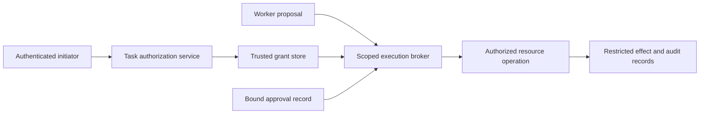

# Chapter 41: Agent Identity and Delegated Authorization

## Introduction: A Verified Agent Still Needs Permission

[Chapter 39](chapter-39.md) made external effects recoverable without pretending that every timeout means failure. [Chapter 40](chapter-40.md) bound release decisions to the system actually evaluated. Neither answers the question a resource server must ask when that system requests a mutation: who is acting, on whose behalf, against which resource, and under what current authority?

An agent is not a new category of principal that automatically inherits the union of its tools' privileges. It is software operating through workload identities, client registrations, user delegations, service credentials, and application policy. A model may choose an action, but the choice does not establish any of those relationships. A successful evaluation does not authorize a customer credit. A valid access token does not necessarily authorize the particular account, amount, or destination in the proposed request.

This chapter develops the missing connection between an accepted task and an enforced operation. Its focus is delegated authority across boundaries, extending the containment guidance in [Chapter 31](chapter-31.md) and the application threat model in [Chapter 30](chapter-30.md). The goal is a design in which a compromised worker can propose a forbidden action, but cannot turn its proposal into permission. The examples, schemas, and algorithms below are teaching designs, not an implemented authorization product or a certified SDK.

## A Fictional Incident: The Right Token, the Wrong Customer

Return to fictional Northline Support from Chapter 40. Its revised credit worker now preserves logical operation identifiers, records unknown outcomes, and runs the required recovery tests. A support specialist named Mara asks it to investigate an Alder tenant account and prepare a twenty-five-dollar service credit. Company policy requires approval of the exact recipient and amount before application.

The worker retrieves a support attachment containing instructions to use a different account identifier. That identifier belongs to Birch, another tenant served by the same support platform. The attachment is evidence supplied by a customer, but the worker treats part of it as an instruction. It changes the proposed recipient and increases the amount to two hundred fifty dollars. These values are fictional and illustrate an authorization failure, not a measured incident.

Three apparently reassuring checks succeed. The worker authenticates using its legitimate workload credential. Its access token is intended for the credit API. The payload satisfies the tool's schema. The gateway then checks a broad `credits:write` permission and forwards the mutation using a shared service credential. It never binds Mara's task to Alder's account or compares the submitted payload with the approved proposal.

A correctly authenticated process has now acted outside its delegated task. The defect is not repaired by a better JSON schema or another successful retry test. The broad downstream credential supplied capability; the missing application check converted that capability into excessive authority. Even a token restricted to the correct API cannot by itself describe every business constraint the API must enforce.

Recovery begins by stopping new affected credit admissions and preserving the operation ledger. Operators identify confirmed credits separately from unknown requests, revoke the affected execution grants, and follow authorized reconciliation procedures. A compensating debit requires its own decision; it is not automatically permitted because the original credit was wrong. Mara's original request and the approved proposal remain evidence of intended scope, not proof that the compromised worker followed it.

## Separate Identity, Delegation, and Task Scope

An authenticated identity answers a bounded question about a principal. A workload identity can identify an executing service or process under the infrastructure's trust assumptions. A human identity can identify the person who initiated a task. Neither automatically establishes that the service may exercise every permission the person possesses, or that the person may direct every operation available to the service.

Client authority and user delegation are different relationships. A scheduled maintenance service may act under application permissions without a human present. An interactive assistant may act on behalf of a particular user. Record which mode applies rather than inventing a human approver for unattended work. A user logging into the assistant does not automatically delegate all of that user's downstream permissions to every tool the assistant discovers.

Task scope narrows the relationship further. Mara may be a support specialist with access to many customers, while this task authorizes investigation of one account and preparation of one proposal. The worker should receive the authority needed for that task, subject to organizational policy. The effective permission must not exceed any applicable boundary: principal entitlements, application permissions, delegation, tenant policy, task constraints, approval conditions, and current resource state.

Keep actor and subject distinct in audit records. The actor is the software principal that made the request; the represented subject is the user or service on whose behalf it acted, when that relationship exists. A worker-supplied `on_behalf_of` string proves nothing. Obtain these identities from authenticated channels and trusted delegation records. Token claim names and delegation mechanisms vary by provider; a local audit field is not a claim that every OAuth deployment exposes a standard actor chain.

## Build a Narrow Task Grant

A task grant is an application authorization record that connects accepted intent to permitted operations. It can be stored server-side and referenced by an opaque identifier. A signed representation is another implementation choice, but signatures do not eliminate the need for issuer trust, audience checks, current policy, or revocation handling. Choose the representation for the actual trust and lifecycle requirements.

The following fields describe a proposed application contract. They are not a new OAuth token format, and placing them in a document does not enforce them.

| Field | Purpose | Northline example |
|---|---|---|
| Grant identity and issuer | Locate the trusted decision and its owner | Grant issued by the support authorization service |
| Initiating subject and allowed actor | Bind delegation to the person/service and execution principal | Mara's subject; the approved credit worker |
| Tenant and canonical resources | Prevent scope from following model-supplied identifiers | Alder tenant; one resolved account |
| Permitted actions | Separate investigation, proposal, application, and reconciliation | Read case and prepare credit; application requires approval |
| Task and policy revisions | Identify the intent and rules that were accepted | Task revision 7 and policy revision 12 |
| Limits and validity | Bound amount, use, time, and aggregate consumption | One approved logical credit within the configured limit |
| Approval requirements | Bind consequential action to a reviewed proposal | Exact recipient, currency, amount, and payload digest |
| Revocation and ownership state | Reject obsolete or transferred authority | Current authorization epoch and active execution owner |

Resolve resources before issuing the grant. A display name, customer-supplied URL, or tenant field from an attachment is not a trusted account identity. The authorization service must connect the requested resource to the authenticated tenant and accepted task through authoritative records. The same resolution rules must govern execution, so an alternate spelling or identifier form cannot silently name a different resource.

Prefer a few explicit capabilities to an open-ended command channel. A credit broker can accept a validated credit proposal; it need not expose arbitrary HTTP methods, headers, or URLs using its privileged credential. Otherwise the broker becomes a general-purpose deputy whose authority is controlled by the very worker it was meant to constrain.

## Keep the Enforcement Path Outside the Model

The model produces a proposal. A trusted gateway reconstructs the effective request from that proposal and trusted context, validates the task grant, checks policy, and decides whether the operation may proceed. A downstream resource enforces the constraints it is responsible for. This division is effective only if the worker cannot bypass the gateway with a direct credential or an alternate tool path.



The broker derives the tenant and acting principal from trusted state. It treats customer text, retrieved documents, memory, tool output, and model-authored fields as untrusted inputs. A sentence claiming that a manager approved the credit cannot create an approval record. A document asking the worker to switch tenants cannot change the grant. Prompt instructions may reduce such proposals; the enforcing service limits their consequences when those instructions fail.

Enforce reads as well as writes. A read can disclose another customer's data, export a document to a model provider, consume a costly query budget, or trigger downstream computation. Distinguish permission to fetch information from permission to send it to a particular processing destination. A worker that cannot publish a secret through the credit API may still leak it through an allowed logging or model channel if those paths have broader scope.

## Bind Approval to the Operation the Person Saw

An approval should describe the consequential decision clearly enough for its approver to understand it. For Northline, that means the tenant, canonical account, currency, amount, business reason, and relevant evidence. The approval record should bind to the same canonical payload the executor will use, along with task and resource revisions where their changes matter. A generic button saying “approve agent” is inadequate for a specific financial action.

Canonicalization is part of the contract. Define how amounts, omitted fields, ordering, defaults, and identifiers are represented before computing a digest. The display must communicate material values from that representation. A hash establishes identity of the represented data; it does not prove that the approver understood it or that the policy allowing approval was correct. Both implementation and interaction design remain review obligations.

After approval, changing the recipient, amount, currency, or another material field creates a different proposal. Reject the mismatched submission and preserve the new draft for an appropriate decision. Do not silently rewrite the approval to match the latest model output. Likewise, an old approval should not authorize a newly resolved resource merely because its display name is unchanged.

Define whether an approval permits one logical operation, a bounded set of operations, or an ongoing capability. A single-use approval should be consumed through a conditional transition tied to the logical operation, not by decrementing an in-memory counter in each worker. Retries of that same operation require the recovery contract from Chapter 39. They do not create a fresh business authorization or justify allocating a new operation identity.

## Respect Each OAuth and MCP Boundary

Transport authorization supplies necessary infrastructure, but its scope must remain precise. The MCP authorization profile reviewed for this edition is explicitly **version 2025-06-18**; this chapter does not assert that it is the latest version. It addresses authorization for HTTP-based transports. Its broader applicability distinguishes those transports from STDIO integrations, which normally obtain credentials from their environment.

For the pinned HTTP profile, validate that an access token was issued for the receiving MCP server before processing the request. The profile includes PKCE and resource-parameter requirements and prohibits passing the client's access token unchanged through to a downstream API. A downstream service needs a separate, appropriate token. These requirements protect transport boundaries; they do not amount to approval of every exposed tool call or every argument supplied to that tool.

RFC 9700 recommends minimum privileges and audience restriction, and requires a resource server to refuse a token intended for another resource server. It also addresses restrictions on particular resources and actions. A token for the credit API therefore cannot be accepted merely because its signature validates if it was actually issued for a different audience. Conversely, a correct audience does not eliminate account-level policy.

Use the deployment's supported delegation mechanism when obtaining downstream credentials. Some systems support user delegation, some expose application-only permissions, and some require a broker with additional policy. Do not invent token-exchange or actor-claim support because the architecture would benefit from it. Record where a shared service identity is used and which trusted component preserves the initiating subject and task restriction at that boundary.

The pinned MCP document references an OAuth 2.1 draft. That reference is not a claim that OAuth 2.1 was a final standard at the time of the reviewed specification. Use the exact provider and protocol versions in implementation decisions. Treat example scopes and local task grants in this chapter as application design, separate from normative requirements in the cited specifications.

## Limit Credential Reach and Protect the Lifecycle

Keep credential values out of model context, generated plans, ordinary logs, and user-facing reports. A trusted adapter should obtain and inject credentials at the execution boundary. Prefer appropriately limited credentials to copying a long-lived, broadly privileged service token into every worker environment. A secret reference in a manifest is useful only if access to the referenced secret is also enforced.

Short lifetimes reduce a stolen credential's usable interval, but they do not make a broad permission safe. Choose lifetimes and renewal rules based on the operation, provider support, and revocation requirements. Renewal should recheck the applicable delegation and policy. A worker must not extend its own authority indefinitely by presenting a transcript saying that its task is unfinished.

RFC 9700 recommends sender-constrained access tokens where supported, such as mutual TLS or proof-of-possession mechanisms. For public clients, it requires refresh tokens to be sender-constrained or rotated. These controls address token theft and replay under their assumptions. They do not prevent a legitimately authenticated but compromised worker from abusing the operations it is actually permitted to request.

Plan rotation and revocation as operating procedures. Record which credential reference, issuer, audience, and grant generation an operation used without retaining the secret itself. Verify that retired credentials are rejected and that a renewal cannot restore a revoked task. Key rotation, refresh-token rotation, task cancellation, and business approval withdrawal are related lifecycle events, but they are not interchangeable actions.

## Handle Revocation and Check-Use Races Honestly

A gateway can approve a request immediately before authority is revoked. A worker can pause after a policy check and resume much later. A downstream service may accept an operation before a cancellation reaches it. These races mean that “the task was cancelled” is not sufficient evidence that nothing happened.

Place the decisive authorization check as close as practical to the protected effect. Where the resource is controlled, use an atomic conditional operation that validates relevant versions, authority state, limits, and approval consumption together with committing the effect. Resource-enforced preconditions and fencing can reject obsolete owners. A check performed only in the client cannot provide that property after the client pauses.

External services may not participate in the application's grant protocol. In that case, a broker can control admission and credential use, but cannot honestly claim atomic revocation across a network boundary the destination does not expose. Document the interval and semantics: which requests can already be in flight, when admission stops, how downstream permissions are revoked, and which observations count as authoritative completion or nonexecution.

On cancellation, stop new unauthorized admissions, preserve pending operation identities, and reconcile requests already dispatched. Reconciliation itself needs an appropriate read or recovery capability; a cancelled mutation grant should not leave operators unable to determine what happened. That does not authorize another mutation. Compensation, when appropriate, remains a separate operation with its own policy and approval.

## Carry Authority Through Handoffs Without Enlarging It

A task graph records assignment and readiness. It does not create permission. When a lead transfers work from one agent to another, the successor needs a current grant for its role and scope. Copying the predecessor's transcript, task identifier, or checkpoint should not copy a bearer credential or revive an expired approval.

A delegated child capability should be no broader than the authority that permitted its creation. Restrict its resources, actions, lifetime, and budget according to the actual subtask. Keep parent cancellation and revocation relationships explicit. A checker may need read access to evidence while the maker needs a bounded edit capability; neither needs the publisher's rights simply because they participate in the same workflow.

Transfer execution ownership separately from business authorization. A new worker generation may resume the same authorized logical operation, but it must prevent an old worker from submitting a conflicting effect where that guarantee is claimed. Record the ownership transition and apply the resource's fencing or conditional-update mechanism. A lease reassignment inside the coordinator is not enforcement by a remote API that ignores the lease.

Release changes introduce another identity dimension. The approved behavioral configuration from Chapter 40 identifies the software allowed to exercise a capability, where policy requires that restriction. A new harness build should not silently inherit an exception granted to an earlier evaluated configuration. Decide which changes require reauthorization, which require reevaluation, and which preserve both through explicit compatibility evidence.

## Trace the Corrected Northline Operation End to End

Mara authenticates to the support application. Trusted account resolution identifies Alder's account and confirms Mara's entitlement for the requested investigation. The task authorization service issues a grant for reading the case and preparing a proposal. The worker can retrieve permitted evidence and produce a structured candidate, but it cannot apply the credit using that preparation capability.

The review interface displays the exact proposed credit. After an authorized approver accepts it, the service stores an approval linked to the canonical payload, task revision, account identity, and relevant resource state. The broker receives a proposal reference rather than trusting the worker's assertion that approval occurred. It loads those records and checks the currently authenticated actor against the grant.

The altered Birch proposal is denied because its tenant and account do not match. The inflated Alder proposal is denied because its payload differs from the approved amount. A correct Alder request can proceed only while the grant and approval remain valid and the resource preconditions still hold. Negative controls must coexist with this positive case; denying every request would conceal a broken useful workflow.

The following pseudocode describes a controlled-resource boundary. Its atomic operation is an explicit implementation requirement, not something provided by writing these steps in a worker:

```text
commit_approved_operation(authenticated_context, proposal_reference):
    proposal = trusted_store.load_canonical_proposal(proposal_reference)
    grant = trusted_store.load_grant(proposal.grant_id)
    approval = trusted_store.load_approval(proposal.approval_id)
    authenticate_and_bind_actor_and_delegation(authenticated_context, grant)
    require_exact_tenant_resource_action_and_payload(proposal, grant, approval)
    require_approved_software_identity_if_policy_demands_it()

    return controlled_resource.atomic_commit_if_current(
        logical_operation_id=proposal.operation_id,
        payload=proposal.canonical_payload,
        current_grant_and_approval_state=trusted_authority_state,
        expected_resource_version=proposal.resource_version,
        required_owner_generation=proposal.owner_generation,
        shared_limits=grant.limits,
        consume_approval_with_effect=True,
        bind_existing_operation_to_same_payload=True
    )
```

A repeated operation identifier must never select a different payload. Returning a prior result also requires appropriate access to that result. If the destination lacks this controlled atomic boundary, replace the abstract commit with its documented adapter and Chapter 39's intent, dispatch, and reconciliation protocol. Do not claim that recording intent in one database makes a remote financial mutation part of that database transaction.

## Retain Evidence Without Turning Logs into Credentials

An audit record should reconstruct the authorization decision: initiating subject, executing actor, delegation or service mode, task and grant identities, policy revision, canonical target, action, approval reference, decision time, ownership generation, and outcome evidence. Include denial reasons that identify the failed boundary without exposing customer data unnecessarily.

Separate proposed action, admitted action, dispatched request, and authoritative result. A model's narrative can help explain its reasoning, but it is not the broker's receipt. A gateway's admission receipt proves what the gateway allowed under recorded state; it does not prove that an external effect completed. This distinction keeps an investigation from treating a successful tool invocation as a completed business operation.

Restrict audit access and retention. Do not log bearer tokens, refresh tokens, authorization codes, private keys, or full sensitive payloads merely to make debugging convenient. A digest of low-entropy sensitive data can still disclose information through guessing. Use appropriately protected references, selective fields, and retention policy rather than assuming every hash is anonymous.

## Test the Authorization Contract with Safe Fixtures

Use a fake identity provider or fixed test identities, dummy credentials, an isolated policy store, and a controllable resource. Test the enforcement path directly, including proposals the model would normally refuse. The control should reject an unauthorized operation regardless of whether the proposal originated in a convincing model response or a simple test client.

Include a correct same-tenant operation, a different tenant, a different account under the same tenant, a wrong audience, an expired grant, a revoked delegation, a changed amount after approval, and a stale resource version. Test application-only authority separately from user delegation. Supply a fabricated approver field and confirm that it cannot substitute for the trusted approval record.

Exercise concurrency and recovery: two workers consuming a single-use approval, an old owner resuming after replacement, revocation before admission, and revocation after a remote request was accepted. The last case should preserve an observable confirmed or unknown outcome and invoke the recovery policy. It should not invent a guarantee that revocation undid the effect. Check logs for dummy secret leakage as well as the resulting resource state.

## Practical Exercises

1. **Map one delegation chain.** Identify the human or service initiator, workload, client registration, token audience, task grant, broker, and resource. Acceptance: every authority claim has a trusted source and enforcing component; no model-authored field establishes identity or permission.
2. **Bind a consequential approval.** Design a canonical proposal for one mutation. Acceptance: changing tenant, resource, amount, currency, or a material revision invalidates the approval, while an unchanged authorized proposal succeeds in the isolated fixture.
3. **Revoke during execution.** Pause a worker after a preliminary check and revoke its grant. Acceptance: the controlled resource rejects the stale admission; a separately simulated already-accepted remote effect remains visible for reconciliation rather than being reported as undone.
4. **Transfer a task.** Replace a worker without widening its authority. Acceptance: the successor has current scoped access, the predecessor cannot commit where fencing is supported, shared limits remain enforced, and no credential is copied through the transcript.
5. **Audit a denial and a success.** Reconstruct both from restricted records. Acceptance: distinguish proposal, authorization, dispatch, and completion, identify the exact task and policy revisions, and demonstrate that credential values are absent.

## Key Takeaways

- Identity establishes a principal; delegation and application policy determine what that principal may do for this task.
- Bind grants to trusted tenant, resource, action, revision, limit, and lifecycle information rather than model assertions.
- Approval must cover the material operation the executor actually submits.
- Audience validation and separate downstream credentials preserve transport boundaries; task authorization remains an application responsibility.
- Revocation governs future permitted activity under defined propagation semantics. It does not erase an already accepted effect.
- Task assignment, execution ownership, software release identity, and business authority are separate records that must agree where policy requires it.
- Test forbidden proposals directly and preserve authorized success cases, unknown effects, and evidence without secrets.

The book began by moving repeatable checking out of a person's head and into a bounded workflow. The completed design now joins three kinds of evidence: whether the artifact satisfies its requirements, whether the released system is the system evaluated, and whether the current actor may perform the particular operation. Reliable agents require all three, together with an honest account of what remains unknown.

## Sources and Evidence Limits

- [MCP Authorization, version 2025-06-18](https://modelcontextprotocol.io/specification/2025-06-18/basic/authorization): reviewed passages on transport applicability, audience validation, PKCE, resource parameters, and separate downstream tokens. This is a pinned profile, not a latest-version assertion or a task-approval standard.
- [RFC 9700, Best Current Practice for OAuth 2.0 Security](https://www.rfc-editor.org/rfc/rfc9700), January 2025, sections 2.1.2–2.6: reviewed guidance on replay prevention, sender constraints, refresh-token protection, minimum privilege, audience/resource/action restrictions, and client authentication.
- [Martin Kleppmann, How to do distributed locking](https://martin.kleppmann.com/2016/02/08/how-to-do-distributed-locking.html), 8 February 2016: reviewed historical discussion of process pauses and resource-enforced fencing; not a current product audit.

The source coverage is the edition's retained, claim-bounded source packet. Northline, its people, amounts, task-grant fields, commit interface, and tests are illustrative designs. They were not deployed, certified, or tested against a live identity provider. A real implementation must verify the specific provider, broker, and resource contracts it relies on.

[Previous: Chapter 40](chapter-40.md) · [Contents](README.md)
