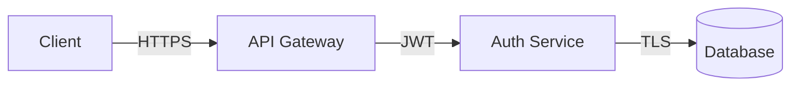

# Chapter 16: Hooks, Skills, and the Extension Stack

---

You've built the CLIs. You've wired their memory. You've connected them through IPC channels so they can talk, coordinate, and share context. But right now, every CLI in your forge is a sealed box — it receives instructions, executes them, and reports results. There's no way for the system to *react*. No way for one CLI's action to automatically trigger another CLI's response. No way for the forge itself to enforce quality gates, inject context, or evolve its own capabilities over time.

That changes in this chapter.

Hooks and skills are the extension stack — the layer that transforms a collection of independent CLIs into a reactive, self-improving system. If IPC channels (Chapter 15) are the forge's communication backbone, hooks are its nervous system and skills are its muscle memory. Hooks fire when things happen: a session starts, a tool executes, a file changes, an agent spawns. Skills encode reusable workflows that any CLI can invoke, share, and — critically — improve automatically based on outcomes.

Here's the practical reality. In a production multi-CLI setup, you need three things that neither memory nor IPC alone can provide:

**Reactive coordination.** When the Coder CLI writes a file, the Validator CLI should automatically run linting. When the Validator finds issues, the Security CLI should scan for secrets. This shouldn't require polling, manual triggering, or explicit orchestration messages. It should *happen* — reliably, within seconds, every time.

**Quality gates.** Before any CLI executes a dangerous operation — deploying to production, deleting files, running untrusted code — the system should enforce checks. Not after the fact. Not as suggestions. As hard gates that block execution until conditions are met.

**Capability evolution.** When a skill works, the system should reinforce it. When a skill fails, the system should refine its prompt. When a new pattern emerges across multiple sessions, the system should crystallize it into a new skill automatically. Static configurations don't survive contact with real codebases. The extension stack must learn.

Claude Code ships with twenty-seven hook lifecycle events, eight hook categories, a full skills system with auto-discovery, and — behind feature flags — mechanisms for skill auto-improvement and MCP-based skill serving. Most users never touch any of it. They run Claude Code with default hooks (none configured) and default skills (whatever ships in the box). They're leaving ninety percent of the system's extensibility on the table.

This chapter walks through every piece of that extension stack. You'll learn every hook event, see implementation patterns for each hook type, build a complete hook configuration for multi-CLI coordination, write skills that encode your forge's specialized capabilities, and wire up the auto-improvement loop that lets skills evolve without manual intervention.

By the end, your forge won't just execute tasks. It will *react* to events, *enforce* standards, and *improve* itself — the three properties that separate a collection of CLI instances from an integrated agent system.

---

## 16.1 The Nervous System: What Hooks Actually Are

A hook, in Claude Code's architecture, is a function that fires when a specific lifecycle event occurs. That's it. No magic. The system maintains an event bus — implemented in `utils/hooks/hookEvents.ts` — and when something happens (a session starts, a tool executes, a permission is requested), the bus emits an event. Any registered hook function that matches that event type receives the event payload and can act on it.

The implementation lives across several files in the source:

```
utils/hooks/hookEvents.ts    — Event bus, event type registry
utils/hooks/hookRunner.ts    — Executes hook handlers (bash, HTTP, inline)
schemas/hooks.ts             — Hook configuration schema
utils/sessionStart.ts        — processSessionStartHooks(), processSetupHooks()
```

When Claude Code boots, the startup sequence in `main.tsx` initializes hooks early — intentionally in parallel with MCP connections so the REPL can render immediately rather than blocking for the ~500ms that `SessionStart` hooks typically take:

```typescript
// From main.tsx — hooks run in parallel with MCP connections
const hooksPromise = processSessionStartHooks('startup', {
  sessionId,
  workingDirectory: cwd,
  // ... context payload
});

// REPL starts rendering immediately
// hooksPromise resolves in background
```

This parallel initialization is a design choice worth understanding. Hooks are *not* blocking by default. They fire asynchronously, and the system continues operating while hooks execute. The exceptions are specific categories — `PreToolUse` hooks and permission hooks — where the system *must* wait for the hook result before proceeding because the hook's return value determines whether the operation continues.

The distinction matters for multi-CLI coordination. When you wire a `PostToolUse` hook to notify another CLI, that notification fires asynchronously — the originating CLI continues its work while the notification propagates. When you wire a `PreToolUse` hook as a quality gate, the originating CLI blocks until the gate returns its verdict. Understanding which hooks block and which don't is the difference between a responsive forge and a deadlocked one.

### Hook Configuration: Three Levels

Hooks can be configured at three levels, each scoping to a different boundary:

| Level | File Location | Scope | Use Case |
|-------|--------------|-------|----------|
| **User** | `~/.claude/hooks/` | All sessions, all projects | Personal preferences, global security gates |
| **Project** | `.claude/hooks/` (in repo root) | All sessions in this project | Team-wide quality gates, project-specific automation |
| **Session** | Programmatic via SDK | Single session only | Dynamic hooks for specific workflows |

Project-level hooks live in the repository and are version-controlled — which means your entire team shares the same quality gates. User-level hooks are personal and override project hooks when there's a conflict. Session-level hooks are ephemeral, created programmatically through the SDK, and destroyed when the session ends.

For the multi-CLI forge, you'll use all three. User hooks enforce global safety policies (no CLI can delete production data, ever). Project hooks enforce team-wide quality standards (all TypeScript files must pass strict mode checks before commit). Session hooks handle dynamic coordination (when the Orchestrator spawns a Coder CLI for a specific task, it injects hooks that route that Coder's events back to itself).

---

## 16.2 The Twenty-Seven Hook Lifecycle Events

Claude Code's event bus defines twenty-seven distinct lifecycle events. Every hook you write targets one or more of these events. The table below is the complete reference — extracted from the source's `hookEvents.ts` registry and verified against the runtime behavior documented in Claude Code's internals.

### Session Lifecycle Events (4)

| Event | Fires When | Payload | Blocking? |
|-------|-----------|---------|-----------|
| `SessionStart` | Session initializes, after environment setup | `sessionId`, `workingDirectory`, `model`, `config` | No |
| `SessionEnd` | Session terminates (normal exit, interrupt, or crash) | `sessionId`, `duration`, `tokenUsage`, `exitReason` | No |
| `SessionInterrupt` | User sends SIGINT (Ctrl+C) or abort signal | `sessionId`, `currentTool`, `interruptSource` | No |
| `Setup` | First-time project initialization or `--init` flag | `projectRoot`, `gitInfo`, `detectedLanguages` | Yes |

`SessionStart` is where you bootstrap your multi-CLI coordination. When the Orchestrator spawns a Coder CLI, the Coder's `SessionStart` hook can announce itself to the IPC bus, register its capabilities, and pull any queued tasks. `SessionEnd` is where you clean up — deregister from the bus, flush pending notifications, archive session logs.

The `Setup` hook deserves special attention. It fires only during first-time initialization — when a user runs `claude --init` or enters a project directory for the first time. This is where you generate project-specific `CLAUDE.md` files, detect the tech stack, configure linters, and create initial skill definitions. For the forge, the Orchestrator's `Setup` hook is where it profiles the codebase and decides which specialist CLIs to spawn.

### Tool Lifecycle Events (6)

| Event | Fires When | Payload | Blocking? |
|-------|-----------|---------|-----------|
| `PreToolUse` | Before any tool executes | `toolName`, `toolInput`, `sessionId`, `conversationHistory` | **Yes** |
| `PostToolUse` | After tool execution completes | `toolName`, `toolInput`, `toolOutput`, `duration`, `exitCode` | No |
| `PostToolUseFailure` | After tool execution fails | `toolName`, `toolInput`, `error`, `exitCode`, `stderr` | No |
| `ToolRetry` | When tool execution is retried after failure | `toolName`, `attempt`, `maxAttempts`, `previousError` | No |
| `ToolTimeout` | When tool execution exceeds time limit | `toolName`, `timeoutMs`, `partialOutput` | No |
| `ToolAbort` | When tool execution is forcefully terminated | `toolName`, `abortReason`, `pid` | No |

`PreToolUse` is the single most important hook event for multi-CLI coordination. Because it *blocks* — the tool will not execute until every `PreToolUse` handler returns a verdict — it's your enforcement point. A security CLI can register a `PreToolUse` hook that intercepts every `bash` tool call across the forge, scans the command for dangerous patterns (rm -rf, curl to external endpoints, credential access), and returns `{ allow: false, reason: "Blocked: command accesses production credentials" }` to prevent execution.

`PostToolUse` is the coordination trigger. When the Coder CLI finishes writing a file (tool: `file_write`), the `PostToolUse` hook fires with the file path in the payload. Your hook script sends that path to the IPC bus, where the Validator and Security CLIs are listening. They pick it up and begin their respective scans — no polling, no delays, pure event-driven reactivity.

### Permission Events (3)

| Event | Fires When | Payload | Blocking? |
|-------|-----------|---------|-----------|
| `PermissionRequest` | Tool needs approval beyond current permission level | `toolName`, `toolInput`, `requiredLevel`, `currentLevel` | **Yes** |
| `PermissionDenied` | User or hook denies a permission request | `toolName`, `reason`, `deniedBy` | No |
| `PermissionGranted` | Permission is approved (by user or auto-approve hook) | `toolName`, `approvedBy`, `scope` | No |

In a single-user setup, permission requests surface as interactive prompts — "Claude wants to run `rm -rf node_modules`. Allow?" In the multi-CLI forge, you can't have interactive prompts on headless CLI instances. Permission hooks let you automate the decision: the Orchestrator registers `PermissionRequest` hooks on every CLI it spawns, with rules encoded as a security policy. Trusted operations auto-approve. Risky operations route to the Security CLI for review. Dangerous operations deny outright.

### Agent Lifecycle Events (5)

| Event | Fires When | Payload | Blocking? |
|-------|-----------|---------|-----------|
| `AgentSpawn` | A sub-agent is created (task tool, background agent) | `agentId`, `agentType`, `parentId`, `prompt` | No |
| `AgentComplete` | Sub-agent finishes execution | `agentId`, `result`, `duration`, `tokenUsage` | No |
| `AgentError` | Sub-agent fails with an error | `agentId`, `error`, `stackTrace`, `attempt` | No |
| `TeammateIdle` | A teammate agent has no pending work | `agentId`, `agentType`, `capabilities`, `lastTaskCompleted` | No |
| `TaskCreated` | New task is added to the work queue | `taskId`, `description`, `priority`, `assignedAgent` | No |

`TeammateIdle`, `TaskCreated`, and `TaskCompleted` are the orchestration trinity. In Chapter 12, you built the Orchestrator's task decomposition and assignment logic. Hooks make that logic *reactive*. When the Coder CLI finishes its task and becomes idle, the `TeammateIdle` event fires. The Orchestrator's hook catches it, checks the work queue, and — if there's pending work — assigns the next task immediately. No polling interval. No wasted cycles. The forge operates at the speed of events.

### Notification Events (3)

| Event | Fires When | Payload | Blocking? |
|-------|-----------|---------|-----------|
| `Notification` | System generates a user-facing notification | `type`, `message`, `severity`, `source` | No |
| `CostThreshold` | Token spend exceeds configured threshold | `currentCost`, `threshold`, `sessionId`, `model` | No |
| `ContextWindowWarning` | Context usage exceeds configured percentage | `usagePercent`, `tokensUsed`, `tokensMax`, `sessionId` | No |

`CostThreshold` is essential for forge management. When you're running five CLIs in parallel, each burning through Claude API tokens, costs can spiral. Register a `CostThreshold` hook on every CLI that reports spend to the Orchestrator. When aggregate spend crosses your budget, the Orchestrator can pause non-critical CLIs, switch to cheaper models, or gracefully shut down the forge.

### File System Events (3)

| Event | Fires When | Payload | Blocking? |
|-------|-----------|---------|-----------|
| `FileChanged` | A tracked file is modified (by CLI or external) | `filePath`, `changeType`, `diff`, `changedBy` | No |
| `FileCreated` | A new file is created in the watched directory | `filePath`, `content`, `createdBy` | No |
| `FileDeleted` | A file is deleted from the watched directory | `filePath`, `deletedBy`, `wasTracked` | No |

File system events use glob patterns for filtering — you don't register for every file change in the repository. You specify patterns like `src/**/*.ts` or `*.config.json` and only receive events matching those globs. This is how you build targeted pipelines: changes to TypeScript files trigger the type-checker, changes to config files trigger validation, changes to migration files trigger the database CLI.

### API and Sampling Events (3)

| Event | Fires When | Payload | Blocking? |
|-------|-----------|---------|-----------|
| `PreSampling` | Before an API call to the LLM | `messages`, `systemPrompt`, `model`, `temperature` | **Yes** |
| `PostSampling` | After receiving LLM response | `assistantMessage`, `cost`, `latency`, `inputTokens`, `outputTokens` | No |
| `SamplingError` | API call fails (rate limit, network error, etc.) | `error`, `statusCode`, `retryAfter`, `attempt` | No |

`PreSampling` hooks are *prompt hooks* — they can mutate the system prompt and message history before the API call fires. This is extraordinarily powerful for multi-CLI coordination. The Orchestrator can inject real-time context into any CLI's next API call: "The Security CLI just found a critical vulnerability in auth.ts — prioritize fixing it." The CLI receives this as part of its system prompt, seamlessly woven into its existing context, without consuming a conversation turn.

That's twenty-seven events across seven categories. Every event in the system is hookable. Every hook can trigger coordination logic. Every coordination pattern you'll build in the rest of this chapter starts with one of these twenty-seven events.

---

## 16.3 Four Hook Implementation Patterns

Hooks aren't just configuration entries — they're executable code. Claude Code supports four distinct implementation patterns for hooks, each suited to different use cases. Understanding when to use each pattern is the difference between hooks that work reliably in production and hooks that fail silently at 2 AM when nobody's watching.

### Pattern 1: Command Hooks (Bash Scripts)

The simplest and most common pattern. A command hook is a shell script that executes when the event fires. The event payload arrives as environment variables.

```bash
#!/usr/bin/env bash
# .claude/hooks/post-tool-use-notify.sh
# Fires after any tool execution — notifies the IPC bus
set -euo pipefail

# Event payload arrives as environment variables
EVENT_TOOL="${CLAUDE_HOOK_TOOL_NAME:-unknown}"
EVENT_OUTPUT="${CLAUDE_HOOK_TOOL_OUTPUT:-}"
EVENT_SESSION="${CLAUDE_HOOK_SESSION_ID:-}"
EVENT_EXIT_CODE="${CLAUDE_HOOK_EXIT_CODE:-0}"

# Only notify on file write operations
if [[ "$EVENT_TOOL" != "file_write" && "$EVENT_TOOL" != "file_edit" ]]; then
  exit 0
fi

# Extract the file path from the tool output
FILE_PATH=$(echo "$EVENT_OUTPUT" | grep -oP '(?<=wrote to ).*' | head -1)

if [[ -z "$FILE_PATH" ]]; then
  exit 0
fi

# Send notification to the IPC bus (Unix socket)
SOCKET="/run/forge/ipc.sock"
if [[ -S "$SOCKET" ]]; then
  echo "{\"event\":\"file_changed\",\"path\":\"$FILE_PATH\",\"source\":\"$EVENT_SESSION\",\"exit_code\":$EVENT_EXIT_CODE}" \
    | socat - UNIX-CONNECT:"$SOCKET"
fi

exit 0
```

**Hook configuration** (in `.claude/hooks.json` or `.claude/settings.json`):

```json
{
  "hooks": {
    "PostToolUse": [
      {
        "name": "ipc-file-notify",
        "command": ".claude/hooks/post-tool-use-notify.sh",
        "timeout_ms": 5000,
        "enabled": true
      }
    ]
  }
}
```

Command hooks are ideal for integration glue — firing webhooks, writing to log files, sending IPC messages, triggering external processes. They run in a subprocess, inherit the session's environment variables, and are killed if they exceed the configured timeout.

**Multi-CLI use case:** Every Coder CLI in the forge runs this hook. When any Coder writes a file, the IPC bus receives a notification within milliseconds. The Validator CLI, listening on that bus, picks up the notification and starts linting. The Security CLI picks it up and starts scanning. No orchestrator involvement needed — the hook *is* the coordination.

### Pattern 2: HTTP Hooks (Webhooks)

HTTP hooks send the event payload as a POST request to a URL. Claude Code includes SSRF protection — the URL must resolve to a non-private IP address unless explicitly allowlisted — and enforces a configurable timeout (default: 5 seconds).

```json
{
  "hooks": {
    "PostSampling": [
      {
        "name": "cost-tracker",
        "type": "http",
        "url": "https://forge-metrics.internal:9090/api/v1/sampling",
        "method": "POST",
        "headers": {
          "Authorization": "Bearer ${FORGE_METRICS_TOKEN}",
          "Content-Type": "application/json"
        },
        "timeout_ms": 3000,
        "retry": {
          "max_attempts": 2,
          "backoff_ms": 500
        }
      }
    ],
    "CostThreshold": [
      {
        "name": "budget-alert",
        "type": "http",
        "url": "https://forge-alerts.internal:9090/api/v1/budget",
        "method": "POST",
        "timeout_ms": 2000
      }
    ]
  }
}
```

The payload sent to the webhook endpoint includes the full event context:

```json
{
  "event": "PostSampling",
  "timestamp": "2025-07-15T14:32:01.847Z",
  "sessionId": "coder-cli-01-abc123",
  "payload": {
    "model": "claude-sonnet-4-20250514",
    "inputTokens": 45230,
    "outputTokens": 3847,
    "cost": 0.0234,
    "latency_ms": 2841,
    "assistantMessage": "..."
  }
}
```

**Multi-CLI use case:** A central metrics service collects `PostSampling` events from every CLI in the forge. A dashboard shows real-time token usage, cost accumulation, and latency per CLI. When aggregate cost crosses a threshold, the `CostThreshold` webhook fires and the metrics service sends a shutdown signal to non-critical CLIs via the IPC bus.

### Pattern 3: Prompt Hooks (System Prompt Mutation)

Prompt hooks are unique — they don't just observe events, they *mutate state*. A prompt hook intercepts the `PreSampling` event and can modify the system prompt, the message history, or both before the API call fires. This is the most powerful hook type and the most dangerous if misused.

```typescript
// .claude/hooks/inject-context.ts
// Prompt hook that injects real-time forge state into the system prompt

import type { PreSamplingHookContext, HookResult } from '@anthropic/claude-code-sdk';

export default async function injectForgeContext(
  ctx: PreSamplingHookContext
): Promise<HookResult> {
  // Read current forge state from shared memory
  const forgeState = await readForgeState('/run/forge/state.json');

  // Build context injection
  const injection = buildContextInjection(forgeState, ctx.sessionId);

  // Mutate the system prompt — append forge context
  const mutatedPrompt = ctx.systemPrompt + `\n\n<!-- FORGE CONTEXT -->\n${injection}\n<!-- END FORGE CONTEXT -->`;

  return {
    systemPrompt: mutatedPrompt,
    // messages left unchanged — return undefined to preserve original
    messages: undefined,
    // allow: true means the API call proceeds
    allow: true
  };
}

function buildContextInjection(state: ForgeState, sessionId: string): string {
  const lines: string[] = [];

  // What other CLIs are working on
  for (const cli of state.activeCLIs) {
    if (cli.id !== sessionId) {
      lines.push(`- ${cli.role}: Currently ${cli.currentTask || 'idle'}`);
    }
  }

  // Recent findings from other CLIs
  for (const finding of state.recentFindings.slice(-5)) {
    lines.push(`- [${finding.severity}] ${finding.source}: ${finding.message}`);
  }

  // Pending tasks in the queue
  const pending = state.taskQueue.filter(t => t.status === 'pending');
  if (pending.length > 0) {
    lines.push(`- ${pending.length} tasks pending in queue`);
  }

  return lines.join('\n');
}
```

**Multi-CLI use case:** Every API call from every CLI in the forge gets injected with real-time forge state. The Coder CLI doesn't just know about its own task — it knows that the Security CLI just found a vulnerability in `auth.ts`, that the Validator CLI is currently running tests, and that three tasks are pending in the queue. This ambient awareness transforms isolated CLIs into a collaborative team.

**Warning:** Prompt hooks add latency to every API call. Keep them fast — under 50ms. Read from local files or shared memory, never from remote APIs. Cache aggressively. A slow prompt hook on a CLI that makes hundreds of API calls per session will add minutes of cumulative latency.

### Pattern 4: Agent Hooks (Sub-Agent Lifecycle)

Agent hooks fire when sub-agents are created, complete, or fail. In the multi-CLI forge, agent hooks are how the Orchestrator tracks the lifecycle of every CLI it spawns.

```typescript
// .claude/hooks/agent-lifecycle.ts
// Tracks sub-agent lifecycle for orchestration

import type { AgentHookContext, HookResult } from '@anthropic/claude-code-sdk';

export default async function trackAgentLifecycle(
  ctx: AgentHookContext
): Promise<HookResult> {
  const { event, agentId, agentType } = ctx;

  switch (event) {
    case 'AgentSpawn':
      // Register new CLI in the forge registry
      await registerAgent(agentId, agentType, ctx.prompt);
      // Inject coordination hooks into the spawned agent
      await injectCoordinationHooks(agentId);
      console.log(`[FORGE] Agent spawned: ${agentId} (${agentType})`);
      break;

    case 'AgentComplete':
      // Update forge registry
      await markAgentComplete(agentId, ctx.result);
      // Check if there's queued work for this agent type
      const nextTask = await dequeueTask(agentType);
      if (nextTask) {
        await assignTask(agentId, nextTask);
      }
      console.log(`[FORGE] Agent completed: ${agentId}`);
      break;

    case 'AgentError':
      // Log error, update registry, potentially respawn
      await handleAgentError(agentId, ctx.error);
      console.log(`[FORGE] Agent error: ${agentId}: ${ctx.error.message}`);
      break;

    case 'TeammateIdle':
      // Agent has no work — check queue
      const task = await dequeueTask(ctx.agentType);
      if (task) {
        await assignTask(agentId, task);
      } else {
        // No work available — agent stays idle
        await markAgentIdle(agentId);
      }
      break;
  }

  return { allow: true };
}
```

**Multi-CLI use case:** The Orchestrator uses agent hooks as its primary coordination mechanism. When a `TaskCreated` event fires (someone added work to the queue), the Orchestrator checks for idle agents via the registry and assigns immediately. When `TeammateIdle` fires, the Orchestrator checks the queue from the other direction. This bidirectional matching — tasks seeking agents, agents seeking tasks — ensures zero idle time when work is available.

---

## 16.4 Hook-Driven Multi-CLI Coordination: A Complete Walkthrough

Theory is useful. Watching hooks coordinate five CLIs in real time is better. Let's trace a single event — a Coder CLI writes a file — through the entire hook chain and watch the forge react.

### The Scenario

The Orchestrator has decomposed a task: "Add rate limiting to the API gateway." The Coder CLI is working on the implementation. At timestamp T+0, the Coder writes a new file: `src/middleware/rate-limiter.ts`.

### T+0ms: Coder CLI writes the file

The Coder CLI calls the `file_write` tool. Before the write executes, the `PreToolUse` hook fires:

```bash
# PreToolUse hook on Coder CLI
# Checks: is the file path within the allowed directory?
FILE_PATH="$CLAUDE_HOOK_TOOL_INPUT_PATH"

# Coder is restricted to src/ — block writes outside
if [[ "$FILE_PATH" != src/* ]]; then
  echo '{"allow": false, "reason": "Coder CLI restricted to src/ directory"}'
  exit 0
fi

echo '{"allow": true}'
```

The path is `src/middleware/rate-limiter.ts` — allowed. The write proceeds.

### T+15ms: PostToolUse fires

The file write completes. `PostToolUse` fires with the file path in the payload. The command hook sends the event to the IPC bus:

```
→ IPC Bus: {"event":"file_changed","path":"src/middleware/rate-limiter.ts","source":"coder-01","tool":"file_write"}
```

Three CLIs are subscribed to `file_changed` events matching `src/**/*.ts`:

1. **Validator CLI** — runs TypeScript type-checking and linting
2. **Security CLI** — scans for secrets, injection vulnerabilities, and unsafe patterns
3. **Documentation CLI** — checks if public APIs have JSDoc comments

### T+50ms: Validator CLI receives the event

The Validator's IPC listener picks up the message. It spawns a targeted lint run:

```bash
#!/usr/bin/env bash
# validator-cli/hooks/on-file-changed.sh
set -euo pipefail

FILE_PATH="$1"

# Run TypeScript compiler on the changed file
TSC_OUTPUT=$(npx tsc --noEmit --pretty "$FILE_PATH" 2>&1) || true
TSC_EXIT=$?

# Run ESLint
LINT_OUTPUT=$(npx eslint --format json "$FILE_PATH" 2>&1) || true
LINT_EXIT=$?

# Report results to IPC bus
RESULT="pass"
DETAILS=""

if [[ $TSC_EXIT -ne 0 ]]; then
  RESULT="fail"
  DETAILS="TypeScript errors: $(echo "$TSC_OUTPUT" | head -5)"
fi

if [[ $LINT_EXIT -ne 0 ]]; then
  RESULT="fail"
  DETAILS="$DETAILS | ESLint violations: $(echo "$LINT_OUTPUT" | jq '.[0].errorCount')"
fi

echo "{\"event\":\"validation_result\",\"path\":\"$FILE_PATH\",\"result\":\"$RESULT\",\"details\":\"$DETAILS\",\"source\":\"validator-01\"}" \
  | socat - UNIX-CONNECT:/run/forge/ipc.sock
```

### T+85ms: Security CLI receives the event

Simultaneously, the Security CLI processes the same file. It runs three checks:

```bash
#!/usr/bin/env bash
# security-cli/hooks/on-file-changed.sh
set -euo pipefail

FILE_PATH="$1"
FINDINGS=""

# 1. Secret scanning — check for hardcoded credentials
if grep -qP '(api[_-]?key|secret|password|token)\s*[:=]\s*["\x27][^\s]{8,}' "$FILE_PATH"; then
  FINDINGS="$FINDINGS | CRITICAL: Potential hardcoded secret detected"
fi

# 2. Injection check — check for unsanitized user input
if grep -qP '(eval|exec|Function\(|innerHTML\s*=)' "$FILE_PATH"; then
  FINDINGS="$FINDINGS | HIGH: Potential injection vulnerability"
fi

# 3. Dependency check — any new imports from untrusted sources?
NEW_IMPORTS=$(grep -oP "from ['\"]([^'\"]+)['\"]" "$FILE_PATH" | sort -u)
for import in $NEW_IMPORTS; do
  if ! grep -q "$import" package.json 2>/dev/null; then
    FINDINGS="$FINDINGS | MEDIUM: Undeclared dependency: $import"
  fi
done

RESULT="pass"
if [[ -n "$FINDINGS" ]]; then
  RESULT="fail"
fi

echo "{\"event\":\"security_result\",\"path\":\"$FILE_PATH\",\"result\":\"$RESULT\",\"findings\":\"$FINDINGS\",\"source\":\"security-01\"}" \
  | socat - UNIX-CONNECT:/run/forge/ipc.sock
```

### T+200ms: Results arrive at the Orchestrator

The Orchestrator's IPC listener collects all results:

```
← validator-01: PASS (no TypeScript or lint errors)
← security-01: PASS (no secrets, no injection, all imports declared)
← docs-01: WARN (public function rateLimiter() missing JSDoc)
```

### T+250ms: Orchestrator injects feedback via prompt hook

The Orchestrator updates the forge state file. On the Coder CLI's next API call, the prompt hook picks up the updated state and injects it:

```
<!-- FORGE CONTEXT -->
- [PASS] Validator: src/middleware/rate-limiter.ts passed all checks
- [PASS] Security: No vulnerabilities detected
- [WARN] Documentation: rateLimiter() missing JSDoc — add before commit
- 2 tasks remaining in queue
<!-- END FORGE CONTEXT -->
```

The Coder CLI receives this context seamlessly. It adds the JSDoc comment, writes the file again (triggering another round of hooks), and moves on to the next task. Total elapsed time from file write to feedback injection: 250 milliseconds.

This is what hooks buy you. Not manual coordination. Not orchestrator bottlenecks. Event-driven reactivity where every CLI contributes its expertise the moment it's relevant.

---

## 16.5 The Skills System: SKILL.md Format, Discovery, and Invocation

If hooks are the forge's nervous system, skills are its muscle memory. A skill is a reusable workflow encoded as a markdown document — a `SKILL.md` file — that teaches Claude Code *how* to perform a specific task. Skills aren't code in the traditional sense. They're structured prompts with metadata that the model reads, internalizes, and executes as natural extensions of its capability.

### The SKILL.md Format

Every skill follows the same structure: YAML frontmatter for metadata, followed by markdown instructions:

```markdown
---
name: security-scan
description: >
  Run comprehensive security analysis on changed files.
  Checks for secrets, injection vulnerabilities, dependency CVEs,
  and OWASP Top 10 violations. Use when files are modified or
  before any commit.
trigger: manual
tags: [security, audit, pre-commit]
---

# Security Scan

## When to Use
- After modifying files in `src/` that handle user input
- Before committing any changes to authentication or authorization code
- When the Orchestrator routes a security review task

## Steps

1. **Identify changed files**: Run `git diff --name-only HEAD` to find modified files
2. **Secret scan**: For each file, search for hardcoded credentials:
   ```bash
   grep -rnP '(api[_-]?key|secret|password|token)\s*[:=]\s*["\x27][^\s]{8,}' $FILE
   ```
3. **Dependency audit**: Check for known CVEs:
   ```bash
   npm audit --json | jq '.vulnerabilities | to_entries[] | select(.value.severity == "critical" or .value.severity == "high")'
   ```
4. **OWASP check**: Review files for common vulnerability patterns:
   - SQL injection: raw string concatenation in queries
   - XSS: unsanitized output in templates
   - CSRF: missing token validation in state-changing endpoints
5. **Report**: Generate findings in severity-ranked format with file:line references

## Output Format
```
[CRITICAL] src/auth/login.ts:47 — Hardcoded API key: "sk-..."
[HIGH] src/api/users.ts:123 — SQL injection: raw string in query
[MEDIUM] src/views/profile.hbs:89 — Unsanitized user input in template
[PASS] No issues found in: src/utils/helpers.ts
```

## Integration
- Results are posted to the IPC bus under event type `security_result`
- Critical findings block the commit pipeline via PreToolUse hook
- Findings are stored in forge memory for trend analysis
```

### Skill Discovery

Claude Code discovers skills through a deterministic search order:

1. **Project skills**: `.claude/skills/*/SKILL.md` in the current project
2. **User skills**: `~/.claude/skills/*/SKILL.md` in the user's home directory
3. **MCP-served skills**: Skills exposed by MCP servers (more on this in Section 16.7)
4. **Built-in skills**: Skills bundled with Claude Code itself

Each directory under `skills/` is a skill. The directory name is the skill's identifier. The `SKILL.md` file is the skill's definition. Additional files in the directory — scripts, templates, configuration — are resources the skill can reference.

```
.claude/skills/
├── security-scan/
│   ├── SKILL.md
│   ├── patterns.yaml          # Vulnerability patterns database
│   └── report-template.md     # Output template
├── code-review/
│   ├── SKILL.md
│   └── rubric.md              # Review criteria
└── deploy-check/
    ├── SKILL.md
    └── checklist.yaml          # Pre-deploy verification list
```

### Per-CLI Skills in the Forge

In the multi-CLI forge, each CLI has its own skill set — a curated collection of skills matched to its role:

```
forge/
├── coder-cli/
│   └── .claude/skills/
│       ├── implement-feature/SKILL.md
│       ├── write-tests/SKILL.md
│       └── refactor-code/SKILL.md
├── security-cli/
│   └── .claude/skills/
│       ├── security-scan/SKILL.md
│       ├── threat-model/SKILL.md
│       └── dependency-audit/SKILL.md
├── validator-cli/
│   └── .claude/skills/
│       ├── lint-check/SKILL.md
│       ├── type-check/SKILL.md
│       └── test-runner/SKILL.md
└── orchestrator-cli/
    └── .claude/skills/
        ├── task-decompose/SKILL.md
        ├── assign-work/SKILL.md
        └── forge-status/SKILL.md
```

The Orchestrator's `task-decompose` skill knows how to break down a user request into sub-tasks. The Coder's `implement-feature` skill knows how to plan, write, and verify code. The Security CLI's `security-scan` skill knows the OWASP Top 10 and how to find each vulnerability pattern. Each CLI is a specialist because its skills make it one.

### Skill Invocation

Skills are invoked in three ways:

1. **Explicit**: The user or orchestrator says "run the security-scan skill"
2. **Automatic**: The model recognizes that a task matches a skill's description and invokes it
3. **Hook-triggered**: A hook fires and its handler invokes a skill as part of its response

The third pattern is the most powerful for multi-CLI coordination. When the Validator CLI's `PostToolUse` hook detects that tests failed, it automatically invokes the `test-runner` skill to provide detailed diagnostics. The skill's output — structured, formatted, actionable — gets posted to the IPC bus for the Coder CLI to consume.

---

## 16.6 SKILL_IMPROVEMENT: Auto-Evolving Prompts

Behind the feature flag `SKILL_IMPROVEMENT`, Claude Code includes a mechanism for skills to improve themselves. This isn't speculative — the gate exists in the source, the infrastructure is implemented, and the behavior is observable when the flag is enabled.

### How It Works

When a skill executes, the system tracks three outcomes:

1. **Success**: The skill achieved its stated goal (verified by the model's self-assessment or by a subsequent validation hook)
2. **Partial success**: The skill completed but with caveats — warnings, incomplete coverage, manual corrections needed
3. **Failure**: The skill failed to achieve its goal — errors, incorrect output, user intervention required

After each execution, the outcome is recorded alongside the skill's current prompt text and the input context:

```json
{
  "skill": "security-scan",
  "version": 14,
  "execution_id": "exec-2025-07-15-001",
  "input_context": {
    "files_scanned": 12,
    "languages": ["typescript", "python"],
    "project_type": "api-gateway"
  },
  "outcome": "partial_success",
  "outcome_details": "Missed SQL injection in ORM-generated query (SQLAlchemy raw())",
  "prompt_hash": "a7f3b2c1..."
}
```

When enough outcomes accumulate (configurable, default: 10 executions), the improvement engine analyzes the pattern:

```
skill: security-scan v14
success_rate: 0.70 (7/10)
failure_patterns:
  - "Missed ORM-level injection" (3 occurrences)
  - "False positive on environment variable reference" (2 occurrences)
recommended_changes:
  - Add: "Check ORM raw query methods (SQLAlchemy raw(), Django extra(), Prisma $queryRaw)"
  - Modify: "Exclude environment variable patterns ($ENV_, process.env.) from secret detection"
```

The engine generates a modified skill prompt that addresses the identified failure patterns and reduces false positives. The modification is *not* applied automatically — it's proposed as a new version. In a single-user setup, the user reviews and approves. In the forge, the Orchestrator reviews proposed skill improvements and either accepts them (bumping the skill version) or rejects them with feedback.

### The Improvement Loop in the Forge

In the multi-CLI forge, skill improvement is continuous:

```
Cycle 1: Security CLI runs security-scan v14
         → Misses ORM injection → outcome: partial_success
         → Improvement engine notes the pattern

Cycle 2: Security CLI runs security-scan v14 again
         → Same miss on ORM injection → pattern confirmed
         → Improvement engine proposes v15 with ORM checks

Cycle 3: Orchestrator reviews v15 proposal
         → Accepts → security-scan v15 deployed to Security CLI
         → Next execution catches ORM injection → success

Cycle 4: Improvement engine sees success rate improved from 0.70 to 0.85
         → Continues monitoring for new failure patterns
```

Over weeks and months, every skill in the forge sharpens itself against the actual code it encounters. A security scan skill that starts with generic OWASP patterns evolves to catch project-specific vulnerability patterns. A code review skill that starts with standard best practices learns the team's architectural conventions. The forge doesn't just execute — it *learns*.

### RUN_SKILL_GENERATOR: Automatic Skill Creation

Complementing `SKILL_IMPROVEMENT` is the `RUN_SKILL_GENERATOR` flag. When enabled, the system monitors for repeated task patterns that don't match any existing skill and proposes new skills automatically.

The heuristic is straightforward: if the model performs a similar sequence of tool calls three or more times across different sessions — reading the same types of files, running the same types of commands, producing the same types of output — the skill generator extracts the pattern, packages it as a `SKILL.md`, and proposes it for inclusion.

```
Detected pattern: "Database migration verification"
Occurrences: 5 sessions in the last 7 days
Common steps:
  1. Read migration file
  2. Run migration in dry-run mode
  3. Check schema diff against expected state
  4. Verify rollback works
  5. Run affected tests

Proposed skill: migration-verify/SKILL.md
```

In the forge, the Orchestrator collects skill proposals from all CLIs, deduplicates them, and adds approved skills to the appropriate CLI's skill set. The forge's capability surface grows organically — not because an engineer wrote new skills, but because the system observed what it does repeatedly and crystallized those patterns into reusable workflows.

---

## 16.7 MCP_SKILLS: Skills Served via Protocol

The `MCP_SKILLS` feature flag unlocks a paradigm shift: skills that aren't just files in a directory but tools served via the Model Context Protocol. Any MCP server can expose skills as tools, and any CLI with access to that MCP server can invoke them.

### Why This Matters for the Forge

In the standard skill model, each CLI has its own skill files. If the Security CLI develops a brilliant vulnerability detection skill through the improvement loop, that skill lives in the Security CLI's directory. The Coder CLI can't use it. The Validator CLI doesn't know it exists.

MCP_SKILLS changes this. The Security CLI's skills are served via an MCP server. Any CLI in the forge that connects to that server gains access to the Security CLI's skills — not as files to copy, but as tools to invoke over the protocol.

```yaml
# forge-mcp-config.yaml
# Central MCP configuration for the forge

mcpServers:
  forge-skills:
    command: "node"
    args: ["./mcp-servers/forge-skills-server.js"]
    env:
      SKILLS_DIR: "./shared-skills"
      FORGE_REGISTRY: "/run/forge/registry.json"

  security-skills:
    command: "node"
    args: ["./mcp-servers/security-skills-server.js"]
    env:
      SKILLS_DIR: "./security-cli/.claude/skills"
      EXPOSE_AS_TOOLS: "true"

  validator-skills:
    command: "node"
    args: ["./mcp-servers/validator-skills-server.js"]
    env:
      SKILLS_DIR: "./validator-cli/.claude/skills"
      EXPOSE_AS_TOOLS: "true"
```

When the Coder CLI needs a security check mid-implementation, it doesn't need to message the Security CLI through IPC and wait for a response. It invokes the `security-scan` tool directly via MCP — the same skill, the same logic, executed locally within the Coder CLI's context.

### The MCP Skill Server

An MCP skill server reads `SKILL.md` files and exposes them as MCP tools:

```typescript
// mcp-servers/skill-server.ts
import { Server } from '@modelcontextprotocol/sdk/server/index.js';
import { StdioServerTransport } from '@modelcontextprotocol/sdk/server/stdio.js';
import { readSkillFiles } from './skill-loader.js';

const server = new Server({
  name: 'forge-skill-server',
  version: '1.0.0',
});

// Load all SKILL.md files from the configured directory
const skills = await readSkillFiles(process.env.SKILLS_DIR || './skills');

// Register each skill as an MCP tool
server.setRequestHandler('tools/list', async () => ({
  tools: skills.map(skill => ({
    name: skill.name,
    description: skill.description,
    inputSchema: {
      type: 'object',
      properties: {
        target: {
          type: 'string',
          description: 'File path, directory, or scope to apply the skill to',
        },
        options: {
          type: 'object',
          description: 'Skill-specific options',
          additionalProperties: true,
        },
      },
      required: ['target'],
    },
  })),
}));

// Execute skills when invoked
server.setRequestHandler('tools/call', async (request) => {
  const skill = skills.find(s => s.name === request.params.name);
  if (!skill) {
    return { content: [{ type: 'text', text: `Skill not found: ${request.params.name}` }] };
  }

  // Return the skill's instructions as context for the model
  // The model executes the skill steps using its available tools
  return {
    content: [{
      type: 'text',
      text: `Execute the following skill:\n\n${skill.fullContent}\n\nTarget: ${request.params.arguments.target}`,
    }],
  };
});

const transport = new StdioServerTransport();
await server.connect(transport);
```

This architecture means the forge's total skill set is the *union* of all CLIs' skills. The Coder CLI can invoke security scans. The Security CLI can invoke code review rubrics. The Orchestrator can invoke any skill from any CLI. The forge becomes greater than the sum of its parts.

---

## 16.8 Complete Hook Configuration for Multi-CLI Setup

Let's bring it all together. Here's the complete hook configuration for a five-CLI forge — Orchestrator, Coder, Validator, Security, and Documentation — with every coordination pattern we've discussed.

### Orchestrator CLI: `.claude/hooks.json`

```json
{
  "hooks": {
    "SessionStart": [
      {
        "name": "forge-init",
        "command": "./hooks/forge-init.sh",
        "timeout_ms": 10000,
        "description": "Initialize forge registry, start IPC bus, verify all CLIs"
      }
    ],
    "SessionEnd": [
      {
        "name": "forge-shutdown",
        "command": "./hooks/forge-shutdown.sh",
        "timeout_ms": 15000,
        "description": "Graceful shutdown: drain queues, persist state, stop CLIs"
      }
    ],
    "TaskCreated": [
      {
        "name": "task-assign",
        "command": "./hooks/task-assign.sh",
        "timeout_ms": 5000,
        "description": "Match new task to idle CLI or enqueue"
      }
    ],
    "TeammateIdle": [
      {
        "name": "work-dispatch",
        "command": "./hooks/work-dispatch.sh",
        "timeout_ms": 3000,
        "description": "Assign queued work to idle teammate"
      }
    ],
    "AgentComplete": [
      {
        "name": "result-collect",
        "command": "./hooks/result-collect.sh",
        "timeout_ms": 5000,
        "description": "Collect results, update forge state, trigger dependents"
      }
    ],
    "AgentError": [
      {
        "name": "error-handler",
        "command": "./hooks/error-handler.sh",
        "timeout_ms": 5000,
        "description": "Log error, decide: retry, reassign, or escalate"
      }
    ],
    "CostThreshold": [
      {
        "name": "budget-control",
        "type": "http",
        "url": "http://localhost:9090/api/budget/check",
        "timeout_ms": 2000,
        "description": "Check aggregate spend, pause non-critical CLIs if over budget"
      }
    ]
  }
}
```

### Coder CLI: `.claude/hooks.json`

```json
{
  "hooks": {
    "PreToolUse": [
      {
        "name": "path-guard",
        "command": "./hooks/path-guard.sh",
        "timeout_ms": 1000,
        "description": "Block file operations outside allowed directories"
      },
      {
        "name": "destructive-op-guard",
        "command": "./hooks/destructive-guard.sh",
        "timeout_ms": 1000,
        "description": "Block rm -rf, DROP TABLE, and other destructive operations"
      }
    ],
    "PostToolUse": [
      {
        "name": "file-notify",
        "command": "./hooks/file-notify.sh",
        "timeout_ms": 3000,
        "description": "Notify IPC bus of file changes for validator/security"
      }
    ],
    "PreSampling": [
      {
        "name": "forge-context-inject",
        "command": "./hooks/inject-forge-context.sh",
        "timeout_ms": 50,
        "description": "Inject forge state into system prompt"
      }
    ],
    "ContextWindowWarning": [
      {
        "name": "context-alert",
        "command": "./hooks/context-alert.sh",
        "timeout_ms": 2000,
        "description": "Alert orchestrator when context is 80%+ full"
      }
    ]
  }
}
```

### Security CLI: `.claude/hooks.json`

```json
{
  "hooks": {
    "SessionStart": [
      {
        "name": "load-vuln-db",
        "command": "./hooks/load-vuln-database.sh",
        "timeout_ms": 8000,
        "description": "Load latest CVE database and project-specific patterns"
      }
    ],
    "PreToolUse": [
      {
        "name": "sandbox-enforce",
        "command": "./hooks/sandbox-enforce.sh",
        "timeout_ms": 500,
        "description": "Security CLI operates in read-only mode — block all writes"
      }
    ],
    "PostToolUse": [
      {
        "name": "finding-publish",
        "command": "./hooks/publish-findings.sh",
        "timeout_ms": 3000,
        "description": "Publish security findings to IPC bus and forge memory"
      }
    ]
  }
}
```

### Quality Gate: The PreToolUse Chain

The most critical configuration is the `PreToolUse` chain on the Coder CLI. Here's what `path-guard.sh` does:

```bash
#!/usr/bin/env bash
# hooks/path-guard.sh — Enforce directory boundaries
set -euo pipefail

TOOL="$CLAUDE_HOOK_TOOL_NAME"
INPUT="$CLAUDE_HOOK_TOOL_INPUT"

# Only check file operations
case "$TOOL" in
  file_write|file_edit|file_delete|bash)
    ;;
  *)
    echo '{"allow": true}'
    exit 0
    ;;
esac

# For bash commands, check for file manipulation outside bounds
if [[ "$TOOL" == "bash" ]]; then
  CMD=$(echo "$INPUT" | jq -r '.command // empty')
  if echo "$CMD" | grep -qP '(rm|mv|cp|chmod|chown)\s.*\.\./'; then
    echo '{"allow": false, "reason": "Path traversal detected in bash command"}'
    exit 0
  fi
fi

# For file operations, check the target path
TARGET=$(echo "$INPUT" | jq -r '.path // .file_path // empty')
if [[ -n "$TARGET" ]]; then
  # Resolve to absolute path and check bounds
  RESOLVED=$(realpath -m "$TARGET" 2>/dev/null || echo "$TARGET")
  ALLOWED_ROOT=$(realpath "$(pwd)/src")
  
  if [[ "$RESOLVED" != "$ALLOWED_ROOT"* ]]; then
    echo "{\"allow\": false, \"reason\": \"Write blocked: $TARGET is outside src/ boundary\"}"
    exit 0
  fi
fi

echo '{"allow": true}'
```

This gate fires on *every* tool call. The Coder CLI physically cannot write files outside `src/`. It physically cannot run bash commands with path traversal. These aren't suggestions — they're hard constraints enforced by the hook system. The Coder CLI's model doesn't even know the gate exists. It tries to write, the gate blocks, the model receives a denial message and adjusts.

---

## 16.9 Three SKILL.md Examples for Different CLIs

### Coder CLI: `implement-feature/SKILL.md`

```markdown
---
name: implement-feature
description: >
  Implement a new feature from a task description. Plans the approach,
  writes the code, adds tests, and verifies everything passes. Use when
  assigned a feature implementation task by the Orchestrator.
trigger: automatic
tags: [coding, implementation, tdd]
---

# Implement Feature

## Pre-Implementation Checklist
1. Read the task description completely — identify acceptance criteria
2. Check for related existing code: `grep -rn "related_keyword" src/`
3. Identify affected files and potential conflicts
4. If more than 5 files need changes, create an implementation plan first

## Implementation Steps
1. **Write failing tests first** — one test per acceptance criterion
2. **Implement minimum code** to pass each test, one at a time
3. **Run the full test suite** after each file change: `npm test`
4. **Check types**: `npx tsc --noEmit`
5. **Lint**: `npx eslint --fix src/`

## Code Standards
- TypeScript strict mode — no `any` types unless explicitly justified
- Pure functions preferred over stateful methods
- Error handling: use Result types, not try/catch for business logic
- Maximum function length: 30 lines — extract helpers for larger functions

## Completion Criteria
- All new tests pass
- Full test suite passes (no regressions)
- TypeScript compiles with no errors
- ESLint passes with no warnings
- Changes are committed with descriptive message
```

### Security CLI: `threat-model/SKILL.md`

```markdown
---
name: threat-model
description: >
  Generate a STRIDE threat model for a component, feature, or system.
  Identifies threats, attack surfaces, and mitigations using the
  STRIDE framework (Spoofing, Tampering, Repudiation, Information
  Disclosure, Denial of Service, Elevation of Privilege).
trigger: manual
tags: [security, threat-model, stride, architecture]
---

# Threat Model (STRIDE)

## Input
- Component or feature name and description
- Architecture diagram or data flow description
- Trust boundaries and external interfaces

## Process

### 1. Identify Trust Boundaries
Map every point where data crosses a trust boundary:
- Client ↔ Server
- Server ↔ Database
- Service ↔ External API
- User input ↔ Application logic

### 2. STRIDE Analysis per Boundary

For each trust boundary, evaluate all six threat categories:

| Threat | Question | Check |
|--------|----------|-------|
| **Spoofing** | Can an attacker impersonate a legitimate entity? | Auth mechanisms, token validation |
| **Tampering** | Can data be modified in transit or at rest? | Integrity checks, signed payloads |
| **Repudiation** | Can an actor deny performing an action? | Audit logs, non-repudiation controls |
| **Info Disclosure** | Can sensitive data leak? | Encryption, access controls, error messages |
| **Denial of Service** | Can the system be overwhelmed? | Rate limiting, resource bounds, timeouts |
| **Elevation of Privilege** | Can a low-privilege user gain high-privilege access? | RBAC, input validation, least privilege |

### 3. Output Format
```
## Threat Model: [Component Name]

### Trust Boundaries
1. [boundary description]

### Threats
| ID | Category | Threat | Severity | Mitigation | Status |
|----|----------|--------|----------|------------|--------|
| T1 | Spoofing | ... | Critical | ... | Open |

### Architecture Diagram (Mermaid)

```

### Orchestrator CLI: `task-decompose/SKILL.md`

```markdown
---
name: task-decompose
description: >
  Decompose a high-level task into sub-tasks suitable for
  assignment to specialist CLIs. Identifies dependencies,
  estimates complexity, and produces an ordered execution plan.
trigger: automatic
tags: [orchestration, planning, decomposition]
---

# Task Decomposition

## Input
- High-level task description from user or issue tracker
- Current forge state (active CLIs, their capabilities, queue depth)

## Process

### 1. Analyze the Task
- What type of work? (feature, bugfix, refactor, audit, migration)
- How many files likely affected? (1-3: small, 4-10: medium, 10+: large)
- What specialist CLIs are needed? (coder, validator, security, docs)

### 2. Identify Sub-Tasks
Break into atomic units that can be assigned to a single CLI:
- Each sub-task has ONE owner
- Each sub-task has clear acceptance criteria
- Sub-tasks are ordered by dependency

### 3. Build Dependency Graph
```
task-1 (coder): Implement core logic
  → task-2 (validator): Run type checks and tests
  → task-3 (security): Scan for vulnerabilities
    → task-4 (coder): Fix any security findings
      → task-5 (docs): Update API documentation
        → task-6 (validator): Final integration test
```

### 4. Output Format
```json
{
  "tasks": [
    {
      "id": "task-1",
      "assignee": "coder",
      "description": "...",
      "acceptance_criteria": ["..."],
      "depends_on": [],
      "estimated_complexity": "medium"
    }
  ],
  "critical_path": ["task-1", "task-2", "task-3", "task-6"],
  "parallelizable": [["task-2", "task-3"]]
}
```

## Rules
- Never assign more than 3 sub-tasks to the same CLI in sequence
- Always include a validation step after implementation
- Security scan is mandatory for any task touching auth, user input, or API endpoints
- Documentation is required for any public API changes
```

---

## 16.10 The Extension Philosophy

You've now seen every piece of the extension stack: twenty-seven hook events, four implementation patterns, quality gates, reactive coordination, self-improving skills, MCP-served skill sharing, and complete forge configuration. Before you go build all of it, step back and consider the philosophy that makes it work.

**Hooks are for coordination. Skills are for capability.**

Hooks answer the question: *When something happens, what else should happen?* They are reactive, event-driven, and temporal. A hook fires, does its work, and disappears. Hooks should be fast, focused, and stateless. A hook that takes more than 5 seconds is almost certainly doing too much. A hook that maintains state between invocations is a skill wearing the wrong clothes.

Skills answer the question: *How should this type of work be done?* They are declarative, reusable, and evolving. A skill encodes expertise — not as rigid code, but as structured guidance that the model interprets and applies to novel situations. A skill for security scanning works on TypeScript today and Rust tomorrow because it encodes *what to look for*, not *how to parse a specific language*.

The separation matters because it maps to different rates of change. Hooks change when your *architecture* changes — when you add a new CLI, reroute a pipeline, modify a quality gate. Skills change when your *knowledge* changes — when you learn a new vulnerability pattern, discover a better testing strategy, refine a code review rubric.

In the forge, this separation creates a layered evolution:

```
Layer 1: Hook topology (stable — changes monthly)
  → Which events trigger which CLIs
  → Quality gate rules
  → IPC routing patterns

Layer 2: Skill content (evolving — changes weekly)
  → Vulnerability patterns
  → Code review criteria
  → Implementation best practices

Layer 3: Skill improvement (continuous — changes daily)
  → Success/failure tracking
  → Prompt refinement
  → Pattern crystallization
```

The forge's hook topology — its nervous system — stays relatively stable. You wire it once, adjust it as you add CLIs, and leave it alone. The forge's skills — its muscle memory — evolve continuously, sharpened by every task they execute, refined by the improvement loop, and expanded by the skill generator.

This is what separates a configured system from a living one. The hooks give the forge its structure. The skills give it its intelligence. Together, they make the extension stack the most powerful lever in the entire multi-CLI architecture.

The forge reacts. The forge enforces. The forge learns.

That's what hooks and skills buy you.

---

*Next: Chapter 17 explores quality assurance across the forge — how the Validator CLI, Security CLI, and testing infrastructure work together to ensure that multi-CLI output meets production standards.*

