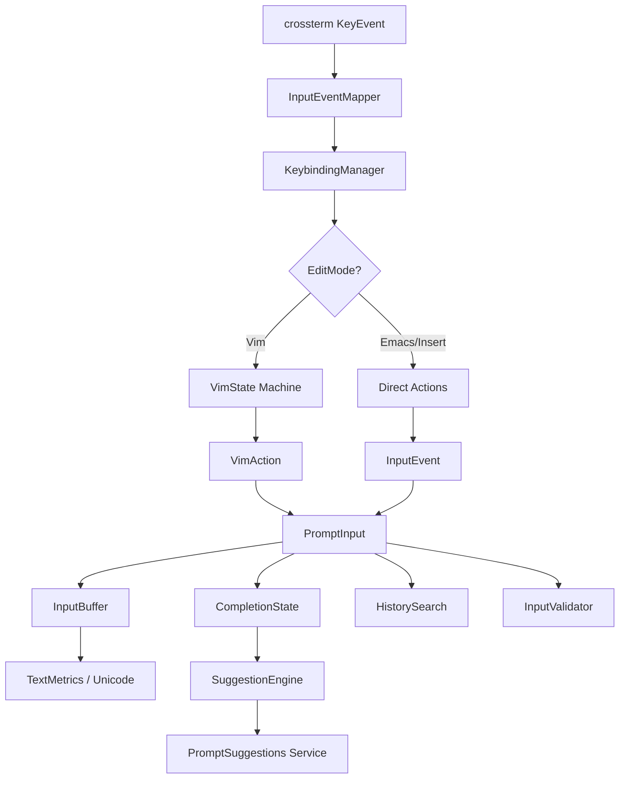

# Chapter 28: The Input System

The REPL screen, examined in Chapter 27, orchestrates an enormous hierarchy of components. But every interaction with the agent begins at the same point: the text input where users type their prompts. This input area looks deceptively simple -- a blinking cursor above which conversation history scrolls. Underneath, it is a multi-layered editing engine that supports vim and emacs keybindings, reverse history search, multi-trigger autocomplete, intelligent paste detection, undo/redo with grouped operations, Unicode-aware cursor movement, bracket matching, and syntax highlighting of special tokens -- all rendered inside a terminal.

This chapter dissects the input system from the ground up. We will examine the `PromptInput` widget that houses the editing state, the `InputBuffer` that provides the low-level text manipulation primitives, the full vim state machine with motions and operators, the keybinding system that maps physical keys to logical actions, history search, the autocomplete and suggestion engines, and paste handling. Along the way, we will see how these pieces compose into a cohesive editing experience that rivals a dedicated text editor -- all running in a TUI built on ratatui.

---

## The PromptInput Widget: Editing State Hub

The top-level entry point for all input handling lives in `ui/prompt_input.rs`. The `PromptInput` struct is the central state container: it holds the text buffer, cursor position, editing mode, command history, undo/redo stacks, yank buffer, completion state, history search state, input validation, and paste detection state.

```rust
pub struct PromptInput {
    pub lines: Vec<String>,
    pub cursor: CursorPosition,
    pub mode: EditMode,
    pub history: Vec<String>,
    pub history_pos: Option<usize>,
    pub saved_input: Vec<String>,
    pub undo_stack: Vec<UndoEntry>,
    pub redo_stack: Vec<UndoEntry>,
    pub max_undo: usize,
    pub yank_buffer: YankBuffer,
    pub completion: CompletionState,
    pub search: HistorySearch,
    pub validator: InputValidator,
    pub last_keypress: Option<Instant>,
    pub rapid_count: usize,
    pub is_pasting: bool,
    pub focused: bool,
    pub placeholder: String,
}
```

Sixteen fields, each representing a distinct concern. The `lines: Vec<String>` stores the buffer as a vector of strings -- one per line of the multi-line input. This is a pragmatic choice over a single `String` because line-based operations (delete line, move up/down, yank line) operate on vector indices rather than scanning for newline characters. The cursor is a simple `(row, col)` pair:

```rust
pub struct CursorPosition {
    pub row: usize,
    pub col: usize,
}
```

### Edit Modes

The system supports five editing modes, reflecting the vim/emacs duality that power users expect from terminal tools:

```rust
pub enum EditMode {
    Insert,   // Standard typing mode (default)
    Normal,   // Vim normal mode
    Visual,   // Vim visual / selection mode
    Emacs,    // Emacs keybinding mode
    Command,  // Vim :commands
}
```

When the user switches to normal mode, the cursor retracts one position to the left -- the standard vim behavior where the cursor sits *on* a character rather than between characters:

```rust
pub fn enter_normal_mode(&mut self) {
    self.mode = EditMode::Normal;
    if self.cursor.col > 0 {
        self.cursor.col -= 1;
    }
}
```

This single-line adjustment is one of those details that feels trivial until you get it wrong. Users who have internalized vim's cursor semantics will immediately notice if the cursor stays at the insert-mode position after pressing Escape.

### Undo/Redo Architecture

Every mutation to the text buffer saves an `UndoEntry` before applying the change:

```rust
pub struct UndoEntry {
    pub lines: Vec<String>,
    pub cursor: CursorPosition,
    pub description: String,
}
```

The undo stack clones the entire `Vec<String>` at each save point. This is a full-snapshot approach rather than a delta-based approach. For a prompt input that rarely exceeds a few hundred characters, the memory overhead is negligible, and the implementation simplicity is substantial -- undo is just "replace current state with the top of the stack":

```rust
pub fn undo(&mut self) {
    if let Some(entry) = self.undo_stack.pop() {
        let redo = UndoEntry::new(self.lines.clone(), self.cursor, "redo");
        self.redo_stack.push(redo);
        self.lines = entry.lines;
        self.cursor = entry.cursor;
        self.clamp_cursor();
    }
}
```

The `max_undo` cap (defaulting to 100) prevents unbounded memory growth in pathological cases. One subtlety: `save_undo` clears the redo stack. This is standard undo/redo semantics -- once you make a new change after undoing, the redo history is invalidated.

### Yank Buffer

The yank buffer supports both linewise and charwise operations, mirroring vim's register system in miniature:

```rust
pub struct YankBuffer {
    pub content: Vec<String>,
    pub linewise: bool,
}
```

The `linewise` flag changes paste behavior. When `linewise` is true, the paste operation inserts whole lines below the cursor rather than inlining text at the cursor position. This distinction is critical for vim users who expect `yy` followed by `p` to duplicate an entire line below:

```rust
pub fn paste(&mut self) {
    if self.yank_buffer.is_empty() { return; }
    self.save_undo("paste");
    if self.yank_buffer.linewise {
        let row = self.cursor.row;
        for (i, line) in self.yank_buffer.content.clone().iter().enumerate() {
            self.lines.insert(row + 1 + i, line.clone());
        }
        self.cursor.row += 1;
        self.cursor.col = 0;
    } else {
        let text = self.yank_buffer.as_string();
        self.insert_str(&text);
    }
}
```

---

## The InputBuffer: Low-Level Text Engine

While `PromptInput` handles the high-level editing state, the heavier lifting happens in `tui/input.rs` where `InputBuffer` provides the fully-featured multi-line editing buffer. This is where the engineering gets serious.

### Vec<char> vs String

The buffer stores lines as `Vec<Vec<char>>` rather than `Vec<String>`:

```rust
pub struct InputBuffer {
    lines: Vec<Vec<char>>,
    cursor: Position,
    anchor: Option<Position>,
    undo_stack: Vec<EditOperation>,
    redo_stack: Vec<EditOperation>,
    // ... 14 more fields
}
```

This is a deliberate design choice. `Vec<char>` gives O(1) random access by character index. With `String` (which stores UTF-8 bytes), moving to column N requires scanning from the start of the line to find the Nth character boundary. For a text editor that performs constant cursor movement, insertion at arbitrary positions, and selection range extraction, character-indexed access is worth the 4x memory overhead per ASCII character.

### Operation-Based Undo

Unlike `PromptInput`'s snapshot-based undo, `InputBuffer` uses an operation-based approach:

```rust
pub enum EditKind {
    Insert,
    Delete,
    Replace,
    Group(Vec<EditOperation>),
}

pub struct EditOperation {
    pub kind: EditKind,
    pub position: Position,
    pub content: String,
    pub cursor_before: Position,
    pub cursor_after: Position,
}
```

Each edit records what changed, where it changed, and where the cursor was before and after. Undo means applying the inverse of the operation, redo means reapplying it:

```rust
fn apply_inverse(&mut self, op: &EditOperation) {
    match &op.kind {
        EditKind::Insert => self.remove_text_at(op.position, &op.content),
        EditKind::Delete => self.insert_text_at(op.position, &op.content),
        EditKind::Group(ops) => {
            for sub_op in ops.iter().rev() {
                self.apply_inverse(sub_op);
            }
        }
        _ => {}
    }
}
```

The `Group` variant is particularly important. When the user types a multi-character paste or an `insert_string` call, the individual character insertions are grouped into a single undo step:

```rust
pub fn begin_undo_group(&mut self) {
    self.undo_group_depth += 1;
    if self.undo_group_depth == 1 {
        self.undo_group_ops.clear();
    }
}

pub fn end_undo_group(&mut self) {
    if self.undo_group_depth == 0 { return; }
    self.undo_group_depth -= 1;
    if self.undo_group_depth == 0 && !self.undo_group_ops.is_empty() {
        let ops = std::mem::take(&mut self.undo_group_ops);
        let before = ops.first().map(|o| o.cursor_before).unwrap_or_default();
        let after = ops.last().map(|o| o.cursor_after).unwrap_or_default();
        let grouped = EditOperation::group(ops, before, after);
        self.redo_stack.clear();
        self.undo_stack.push(grouped);
    }
}
```

Without grouping, pasting "hello" would create five separate undo entries. The user would have to press `u` five times to undo a paste. With grouping, one undo reverts the entire operation.

### Selection Model

The selection is defined by an anchor and the cursor. When `anchor` is `Some`, the selection spans from anchor to cursor. The `get_selection` method normalizes the range so start is always before end:

```rust
pub fn get_selection(&self) -> Option<(Position, Position)> {
    self.anchor.map(|a| {
        let start = Position::min(a, self.cursor);
        let end = Position::max(a, self.cursor);
        (start, end)
    })
}
```

Shift+Arrow extends the selection by setting the anchor on first press and moving the cursor on subsequent presses:

```rust
pub fn extend_selection(&mut self, direction: Direction) {
    if self.anchor.is_none() {
        self.anchor = Some(self.cursor);
    }
    self.move_cursor(direction);
}
```

### Smart Home and Sticky Columns

Two details elevate this from a basic text buffer to a proper editor. First, smart home: pressing Home once moves to the first non-whitespace character, pressing it again moves to column zero:

```rust
pub fn move_to_line_start(&mut self) {
    let line = &self.lines[self.cursor.line];
    let first_non_ws = line.iter()
        .position(|c| !c.is_whitespace())
        .unwrap_or(0);
    if self.cursor.col == first_non_ws {
        self.cursor.col = 0;
    } else {
        self.cursor.col = first_non_ws;
    }
}
```

Second, sticky columns: when moving vertically through lines of different lengths, the cursor remembers the column it was on before being clamped to a shorter line. The `desired_col` field tracks this:

```rust
pub fn move_up(&mut self) {
    if self.cursor.line == 0 { return; }
    let target_col = self.desired_col.unwrap_or(self.cursor.col);
    self.cursor.line -= 1;
    self.cursor.col = target_col.min(self.lines[self.cursor.line].len());
    self.desired_col = Some(target_col);
}
```

If you are on column 40 and move up through a line that is only 10 characters long, the cursor clamps to column 10. But `desired_col` remembers 40. When you move up again to a line that is 50 characters long, the cursor jumps back to column 40.

### Auto-Indent and Bracket Matching

The buffer implements heuristic-based auto-indentation. When the user presses Enter, the new line inherits the indent level of the previous line, plus one extra level if the previous line ends with an opening bracket or colon:

```rust
pub fn should_increase_indent(&self, line: &[char]) -> bool {
    let trimmed: String = line.iter().collect::<String>();
    let trimmed = trimmed.trim_end();
    if trimmed.is_empty() { return false; }
    let last = trimmed.chars().last().unwrap();
    matches!(last, '{' | '(' | '[' | ':')
}
```

Bracket matching scans forward or backward with a depth counter. The implementation handles multi-line brackets correctly by scanning across line boundaries:

```rust
fn find_closing_bracket(&self, start: Position, open: char, close: char)
    -> Option<Position>
{
    let mut depth: i32 = 0;
    let mut line_idx = start.line;
    let mut col = start.col;
    while line_idx < self.lines.len() {
        let line = &self.lines[line_idx];
        while col < line.len() {
            let ch = line[col];
            if ch == open { depth += 1; }
            else if ch == close {
                depth -= 1;
                if depth == 0 { return Some(Position::new(line_idx, col)); }
            }
            col += 1;
        }
        line_idx += 1;
        col = 0;
    }
    None
}
```

Auto-close brackets insert the matching pair and position the cursor between them. But only when appropriate -- the auto-close fires only if the next character is whitespace, a closing bracket, or end-of-line:

```rust
let should_close = col >= line.len()
    || line[col].is_whitespace()
    || self.is_closing_bracket_char(line[col]);
```

This prevents auto-closing in the middle of an identifier, which would be maddening.

---

## Unicode-Aware Text Metrics

Terminal rendering and cursor positioning require visual column tracking, not character counting. The `TextMetrics` utility handles this:

```rust
pub fn char_width(ch: char) -> usize {
    if ch == '\t' { 4 }
    else { UnicodeWidthChar::width(ch).unwrap_or(0) }
}
```

CJK characters occupy two columns, combining marks occupy zero, tabs expand to a configurable width. Two conversion functions bridge between character indices and visual columns:

```rust
pub fn col_to_char_index(line: &[char], visual_col: usize) -> usize {
    let mut current_col: usize = 0;
    for (idx, &ch) in line.iter().enumerate() {
        if current_col >= visual_col { return idx; }
        current_col += Self::char_width(ch);
    }
    line.len()
}
```

Without these conversions, clicking at visual column 10 on a line containing CJK characters would place the cursor at the wrong character. The word-boundary functions also live here, providing `find_word_start` and `find_word_end` for word-motion commands.

---

## The Input Event Mapper

Raw terminal events from crossterm arrive as `KeyEvent` structs with a `KeyCode` and `KeyModifiers`. The `InputEventMapper` translates these into the application's own `InputEvent` enum:

```rust
pub fn map_key_event(key: KeyEvent) -> InputEvent {
    let ctrl = key.modifiers.contains(KeyModifiers::CONTROL);
    let alt = key.modifiers.contains(KeyModifiers::ALT);
    let shift = key.modifiers.contains(KeyModifiers::SHIFT);
    match key.code {
        KeyCode::Char('z') | KeyCode::Char('Z') if ctrl && shift => InputEvent::CtrlShiftZ,
        KeyCode::Char('a') if ctrl => InputEvent::CtrlA,
        // ... 35+ more arms
        KeyCode::Char(ch) => InputEvent::Char(ch),
        _ => InputEvent::Unknown,
    }
}
```

This abstraction layer is critical. It decouples the editing logic from the terminal library. If the project ever migrates from crossterm to another backend, only this mapper needs to change. The mapper also provides a `is_printable` check that filters out control and alt combinations:

```rust
pub fn is_printable(key: &KeyEvent) -> bool {
    matches!(key.code, KeyCode::Char(_)) && !ctrl && !alt
}
```

---

## Vim Mode: A Full State Machine

The vim implementation in `tui/vim.rs` is the most complex subsystem in the input layer. It implements a multi-mode state machine with motions, operators, text objects, registers, marks, macros, and search. As discussed in Chapter 27, the REPL screen coordinates with this system to deliver a vim experience that feels native rather than bolted-on.

### VimMode and VimState

The state machine tracks nine distinct modes:

```rust
pub enum VimMode {
    Normal, Insert, Visual, VisualLine, VisualBlock,
    Command, Search, Replace, Operator,
}
```

The `Operator` mode is the key to vim's composability. When the user presses `d`, the system enters Operator mode with `pending_operator = Some(Operator::Delete)`. The next keypress is interpreted as a motion, and the operator is applied over the range defined by that motion. This is the `d{motion}` grammar that makes vim powerful.

The `VimState` struct captures everything:

```rust
pub struct VimState {
    pub mode: VimMode,
    pub prev_mode: VimMode,
    pub cursor: CursorPosition,
    pub selection_start: Option<CursorPosition>,
    pub pending_operator: Option<Operator>,
    pub count: Option<usize>,
    pub count2: Option<usize>,
    pub registers: HashMap<char, Register>,
    pub macros: MacroState,
    pub command_buffer: CommandBuffer,
    pub search: SearchState,
    pub last_find: Option<(char, bool, bool)>,
    pub last_change: Vec<KeyInput>,
    pub dot_register: Vec<KeyInput>,
    pub key_buffer: Vec<KeyInput>,
    pub marks: HashMap<char, CursorPosition>,
    pub jump_list: Vec<CursorPosition>,
    pub change_list: Vec<CursorPosition>,
    pub settings: VimSettings,
}
```

### Count Multiplication

Vim supports counts before both operators and motions: `3d2w` deletes 6 words (3 times 2). The state machine accumulates counts across phases:

```rust
pub fn effective_count(&self) -> usize {
    let c1 = self.count.unwrap_or(1);
    let c2 = self.count2.unwrap_or(1);
    c1 * c2
}
```

Digits are accumulated in the normal mode handler:

```rust
KeyInput::Char(c) if c.is_ascii_digit() && (c != '0' || self.count.is_some()) => {
    self.accumulate_count(c.to_digit(10).unwrap());
    VimAction::Incomplete
}
```

The special case for `0` is critical: `0` without a preceding count is the "go to column zero" motion, not part of a count. Only when a count is already being accumulated does `0` act as a digit.

### The Motion Catalog

The system implements over 40 motions:

```rust
pub enum Motion {
    Left, Right, Up, Down,
    WordForward, WordBackward, BigWordForward, BigWordBackward,
    EndOfWord, EndOfBigWord,
    StartOfLine, EndOfLine, FirstNonBlank,
    TopOfScreen, MiddleOfScreen, BottomOfScreen,
    PageUp, PageDown, HalfPageUp, HalfPageDown,
    GotoLine(usize), GotoFirstLine, GotoLastLine,
    FindChar(char), FindCharBackward(char),
    TillChar(char), TillCharBackward(char),
    RepeatFind, RepeatFindReverse,
    MatchBracket,
    NextParagraph, PrevParagraph, NextSentence, PrevSentence,
    SearchNext, SearchPrev,
    NextSearchResult, PrevSearchResult,
    ColumnZero,
}
```

The `FindChar` and `TillChar` motions implement vim's `f`, `F`, `t`, and `T` commands. `f` finds the next occurrence of a character on the current line and moves to it; `t` moves to just before it. The `;` and `,` keys repeat and reverse the last find, which is stored in `last_find`.

### Operators and the Operator-Motion Grammar

Six operators combine with any motion:

```rust
pub enum Operator {
    Delete, Change, Yank, Indent, Dedent,
    AutoIndent, ToUpperCase, ToLowerCase, SwapCase, Format, Fold, Comment,
}
```

The normal mode handler sets the pending operator and transitions to Operator mode:

```rust
KeyInput::Char('d') => {
    self.pending_operator = Some(Operator::Delete);
    self.set_mode(VimMode::Operator);
    VimAction::Incomplete
}
```

In Operator mode, the next keypress is interpreted as a motion, producing an `OperatorMotion` action that the rendering layer executes. When an operator key is doubled (like `dd`), it produces an `OperatorLine` action that operates on the current line:

```rust
pub enum VimAction {
    Motion(Motion),
    OperatorMotion(Operator, Motion),
    OperatorLine(Operator, usize),
    // ... 40+ more variants
}
```

### Text Objects

Vim's text objects provide structured selections that understand language constructs:

```rust
pub enum TextObject {
    Word, BigWord, Sentence, Paragraph,
    Block(char), QuotedString(char), Tag,
    InnerWord, InnerBigWord, InnerSentence, InnerParagraph,
    InnerBlock(char), InnerQuotedString(char), InnerTag,
    AroundWord, AroundBigWord, AroundSentence, AroundParagraph,
    AroundBlock(char), AroundQuotedString(char), AroundTag,
}
```

Text objects come in "inner" and "around" variants. `diw` (delete inner word) deletes just the word characters. `daw` (delete around word) deletes the word plus surrounding whitespace. `di(` deletes everything inside parentheses; `da(` deletes the parentheses too. These compose with all operators, giving users a combinatorial explosion of editing power from a small vocabulary.

### Registers and the Numbered Stack

Vim's register system goes beyond a simple clipboard. The implementation maintains a numbered register stack:

```rust
pub fn delete_to_register(&mut self, reg: char, text: String, linewise: bool) {
    if reg == '_' { return; }  // black hole register
    // Rotate numbered registers 1-9
    for i in (1..9).rev() {
        let src = char::from_digit(i, 10).unwrap();
        let dst = char::from_digit(i + 1, 10).unwrap();
        if let Some(r) = self.registers.get(&src).cloned() {
            self.registers.insert(dst, r);
        }
    }
    self.registers.insert('1', Register { content: text.clone(), linewise });
    self.registers.insert(reg, Register { content: text, linewise });
}
```

Every delete pushes previous deletes down the numbered registers. Register `"1` always contains the most recent delete, `"2` the one before that, and so on. This means users can access a delete history by cycling through `"1p`, `"2p`, `"3p`. The black hole register `"_` discards the text entirely.

### The Dot Command

The `.` command repeats the last change. The implementation records every keypress during insert mode into `last_change`:

```rust
VimMode::Insert => {
    self.insert_start = Some(self.cursor);
    self.recording_change = true;
    self.last_change.clear();
}
```

When the user presses Escape to return to normal mode, the recorded keys are stored in `dot_register`:

```rust
VimMode::Normal => {
    if self.recording_change {
        self.recording_change = false;
        self.dot_register = self.last_change.clone();
    }
}
```

Pressing `.` replays the `dot_register` through `process_key`, recreating the exact sequence of edits.

### Macro Recording

Macros extend the dot command to arbitrary key sequences. The `q{register}` command starts recording into a named register; `q` again stops recording:

```rust
KeyInput::Char('q') => {
    if self.macros.recording.is_some() {
        self.macros.recording = None;
        VimAction::Macro(MacroAction::StopRecording)
    } else {
        self.key_buffer.push(key);
        VimAction::Incomplete  // next key selects register
    }
}
```

During recording, every keypress is captured into the macro register. Playback via `@{register}` feeds the recorded keys back through `process_key`.

### Command Buffer and Search State

The `:` command opens a mini command line with its own editing primitives, implemented in `CommandBuffer`:

```rust
pub struct CommandBuffer {
    pub content: String,
    pub cursor: usize,
    pub history: Vec<String>,
    pub history_index: Option<usize>,
}
```

It supports insertion, deletion, word-deletion (`Ctrl+W`), cursor movement, and history navigation. The `SearchState` adds incremental search with result tracking:

```rust
pub struct SearchState {
    pub pattern: String,
    pub direction: bool,
    pub results: Vec<CursorPosition>,
    pub current_result: Option<usize>,
    pub incremental: bool,
    pub case_sensitive: Option<bool>,
    pub regex_mode: bool,
    pub wrap_scan: bool,
}
```

Smart case detection is automatic: if the search pattern contains any uppercase characters, the search is case-sensitive; otherwise it is case-insensitive:

```rust
pub fn is_case_sensitive(&self) -> bool {
    match self.case_sensitive {
        Some(v) => v,
        None => self.pattern.chars().any(|c| c.is_uppercase()),
    }
}
```

---

## The Keybinding System

The keybinding system in `keybindings/mod.rs` provides a structured framework for mapping physical key combinations to logical actions, with support for multiple input modes, user overrides, reserved shortcuts, and conflict detection.

### Key Sequence Parsing

Physical key presses are represented as `KeySequence`:

```rust
pub struct KeySequence {
    pub modifiers: Modifiers,
    pub key: String,
}
```

The parser accepts human-readable strings like `"ctrl+shift+p"`, `"alt+x"`, `"f1"`, or `"escape"`. Modifier aliases are normalized: `"option"` becomes `alt`, `"cmd"` becomes `meta`, `"control"` becomes `ctrl`. Key names are also canonicalized: `"esc"` and `"escape"` both resolve to `"escape"`, `"cr"` and `"return"` and `"enter"` all resolve to `"enter"`.

```rust
pub fn parse(input: &str) -> Result<Self> {
    let parts: Vec<&str> = input.split('+').collect();
    let mut modifiers = Modifiers::default();
    let mut base_key: Option<String> = None;
    for part in parts.iter() {
        match *part {
            "ctrl" | "control" => modifiers.ctrl = true,
            "alt" | "option" => modifiers.alt = true,
            "shift" => modifiers.shift = true,
            "meta" | "super" | "cmd" | "command" | "win" => modifiers.meta = true,
            _ => {
                if base_key.is_some() {
                    bail!("multiple base keys in `{input}`");
                }
                base_key = Some(normalize_key_name(part));
            }
        }
    }
    Ok(Self { modifiers, key: base_key.context("no base key")? })
}
```

### Mode-Based Resolution

The `KeybindingManager` stores bindings indexed by `(InputMode, KeySequence)` for O(1) lookup. Resolution follows a two-tier strategy: check the current mode first, fall back to Global:

```rust
pub fn resolve(&self, mode: InputMode, key: &KeySequence) -> Option<&KeyBinding> {
    if mode != InputMode::Global {
        if let Some(b) = self.bindings.get(&(mode, key.clone())) {
            return Some(b);
        }
    }
    self.bindings.get(&(InputMode::Global, key.clone()))
}
```

This means `Escape` can do different things in Insert mode (return to Normal) and Visual mode (clear selection), while `Ctrl+C` behaves the same everywhere (cancel/interrupt) because it is bound in Global mode.

### Reserved Shortcuts

Four key sequences cannot be rebound because they carry OS-level or safety-critical semantics:

```rust
fn reserved_shortcuts() -> Vec<KeySequence> {
    vec![
        KeySequence::new(Modifiers::ctrl(), "c"),   // SIGINT
        KeySequence::new(Modifiers::ctrl(), "z"),   // SIGTSTP
        KeySequence::new(Modifiers::ctrl(), "\\"),  // SIGQUIT
        KeySequence::new(Modifiers::ctrl(), "d"),   // EOF
    ]
}
```

If a user config file attempts to rebind `Ctrl+C`, the validation step catches it:

```rust
pub fn validate_reserved(&self) -> Result<()> {
    for b in &self.all_bindings {
        if b.is_user_defined && is_reserved(&b.key) {
            bail!("cannot rebind reserved shortcut `{}`", b.key);
        }
    }
    Ok(())
}
```

### User Config Merging

User overrides load from `~/.rcode/keybindings.json`:

```json
[
  {"key": "ctrl+p", "action": "quick_open", "mode": "global"},
  {"key": "ctrl+b", "action": "toggle_sidebar"}
]
```

The merge strategy is insert-with-replacement: user bindings overwrite defaults at the same `(mode, key)` pair. When a user binding is removed, the default is automatically restored:

```rust
pub fn remove_user_binding(&mut self, mode: InputMode, key: &KeySequence) {
    // Remove the user binding
    // Restore default if present
    for def in default_bindings() {
        if binding_key(&def) == k {
            self.insert(def);
            break;
        }
    }
}
```

### Conflict Detection

The system detects when two bindings in the same mode map the same key to different actions. Since bindings are stored in a HashMap keyed by `(mode, key)`, true conflicts are impossible -- later bindings overwrite earlier ones. But the conflict detector checks whether user overrides shadow defaults, producing warnings:

```rust
pub fn detect_conflicts(&self) -> Vec<String> {
    let mut seen: HashMap<(InputMode, KeySequence), &str> = HashMap::new();
    for b in &self.all_bindings {
        let k = binding_key(b);
        if let Some(prev_action) = seen.get(&k) {
            if *prev_action != b.action.as_str() {
                conflicts.push(format!("conflict in {} mode: `{}` maps to both", ...));
            }
        }
        seen.insert(k, &b.action);
    }
    conflicts
}
```

---

## History Search

Reverse history search, activated by `Ctrl+R`, is a feature borrowed from bash/readline that many developers depend on. The `HistorySearch` struct manages it:

```rust
pub struct HistorySearch {
    pub query: String,
    pub active: bool,
    pub match_index: usize,
    pub matches: Vec<usize>,
}
```

When the user types characters, the search filters history entries using case-insensitive substring matching:

```rust
pub fn update_matches(&mut self, history: &[String]) {
    let lower = self.query.to_lowercase();
    self.matches = history.iter()
        .enumerate()
        .rev()                     // Most recent first
        .filter(|(_, h)| h.to_lowercase().contains(&lower))
        .map(|(i, _)| i)
        .collect();
    if self.match_index >= self.matches.len() {
        self.match_index = 0;
    }
}
```

The `.rev()` is important: it searches backwards through history so the most recent match appears first. `Ctrl+R` again cycles to the next match. The search prompt renders inline:

```rust
pub fn render_search(&self) -> Option<Line<'_>> {
    if !self.search.active { return None; }
    Some(Line::from(vec![
        Span::styled("(reverse-i-search)`", Style::default().fg(Color::Yellow)),
        Span::raw(self.search.query.as_str()),
        Span::styled("`: ", Style::default().fg(Color::Yellow)),
        Span::raw(self.search.current_match(&self.history).unwrap_or("")),
    ]))
}
```

This mimics bash's familiar `(reverse-i-search)` prompt, making the feature instantly recognizable to experienced terminal users.

---

## Paste Handling

Paste detection is a surprisingly subtle problem in terminal applications. When a user pastes text, the terminal sends characters as rapidly as if they were typed individually -- there is no "paste" event in most terminal protocols. The system detects paste by measuring inter-keypress timing:

```rust
fn detect_paste(&mut self) {
    let now = Instant::now();
    if let Some(last) = self.last_keypress {
        let delta = now.duration_since(last);
        if delta.as_millis() < 5 {
            self.rapid_count += 1;
            if self.rapid_count > 5 {
                self.is_pasting = true;
            }
        } else {
            self.rapid_count = 0;
            self.is_pasting = false;
        }
    }
    self.last_keypress = Some(now);
}
```

If more than 5 characters arrive within 5 milliseconds of each other, the system assumes a paste is in progress. This heuristic matters because:

1. **Undo grouping**: During a paste, all characters should be grouped into a single undo entry rather than one per character.
2. **Vim mode**: In normal mode, pasted characters should not be interpreted as commands. A paste of `ddGp` should insert the literal text, not delete two lines, go to end, and paste.
3. **Auto-close suppression**: Bracket auto-closing should be suppressed during paste to prevent doubled brackets.

Some modern terminals support bracketed paste mode (sending `\e[200~` before and `\e[201~` after pasted content), which provides a reliable signal. The timing-based detection serves as a fallback for terminals that do not support bracketed paste.

---

## Autocomplete and Suggestions

The completion system operates at two levels. The `CompletionState` in `PromptInput` manages the UI state of the completion menu:

```rust
pub struct CompletionState {
    pub items: Vec<CompletionItem>,
    pub selected: usize,
    pub visible: bool,
    pub trigger_prefix: String,
    pub trigger_col: usize,
}
```

Each completion item carries a text to insert, a display label, a kind tag, and an optional description:

```rust
pub enum CompletionKind {
    SlashCommand,   // /help, /clear, /commit
    FilePath,       // @src/main.rs
    ToolName,       // tool references
    ModelName,      // claude-sonnet, etc.
    Keyword,        // general keywords
}
```

The suggestion engine in `utils/suggestions.rs` generates candidates using a multi-source pipeline:

1. **Slash-command completions**: When the prefix starts with `/`, match against registered commands and their aliases.
2. **File/directory completions**: When the prefix contains `/`, `.`, or `~`, scan the filesystem for matching entries.
3. **History-based suggestions**: Match the prefix against command history, scoring by recency and frequency.
4. **Snippet suggestions**: Match language-specific code snippets.
5. **Flag completions**: When inside a recognized command context, suggest its flags.

Each source produces candidates with a base score determined by kind. The ranking engine then applies context-aware boosts:

```rust
fn rank_and_filter(&self, suggestions: &mut Vec<Suggestion>, ctx: &SuggestionContext) {
    // Boost suggestions matching recent commands
    for s in suggestions.iter_mut() {
        if ctx.recent_commands.iter().any(|rc| s.text.contains(rc)) {
            s.score = (s.score + 0.10).min(1.0);
            s.boosted = true;
        }
    }
    // Deduplicate, filter below threshold, sort descending
    suggestions.sort_by(|a, b| b.score.partial_cmp(&a.score).unwrap());
    suggestions.truncate(self.config.max_results);
}
```

The fuzzy matching algorithm accepts any pattern where every character appears in the text in order:

```rust
fn fuzzy_match(text: &str, pattern: &str) -> bool {
    let mut chars = pat_lower.chars();
    let mut current = match chars.next() {
        Some(c) => c,
        None => return true,
    };
    for tc in text_lower.chars() {
        if tc == current {
            current = match chars.next() {
                Some(c) => c,
                None => return true,
            };
        }
    }
    false
}
```

This means typing `mnr` matches `main.rs`, and `ctml` matches `Cargo.toml`.

### The Prompt Suggestions Service

Beyond basic autocomplete, the `services/prompt_suggestions.rs` module provides a higher-level suggestion engine that predicts next actions and detects workflow patterns. It runs a five-stage pipeline:

1. **Context collection**: Gather the current file, recent commands, active errors, and project tags.
2. **Pattern detection**: Match recent command sequences against known workflow templates (e.g., "edit" followed by "save" triggers a "run tests" suggestion).
3. **Candidate generation**: Produce raw suggestions from action prediction, command completion, file suggestion, pattern hints, error recovery, and quick actions.
4. **Ranking and filtering**: Score candidates using a weighted combination of recency and frequency, then filter below a threshold.
5. **Caching**: Store results keyed by a context fingerprint with a configurable TTL.

The workflow patterns are particularly interesting:

```rust
PatternDefinition {
    id: "test_after_edit".into(),
    trigger_sequence: vec!["edit".into(), "save".into()],
    hint_message: "You just saved a file -- consider running tests.".into(),
    suggested_action: Some("cargo test".into()),
},
```

When the recent command history ends with "edit" followed by "save", the engine suggests running tests. This is a simple bigram pattern matcher, but it provides genuinely useful nudges that reduce context-switching.

---

## Input Validation

The `InputValidator` provides guardrails against pathologically long inputs:

```rust
pub struct InputValidator {
    pub max_length: usize,      // 100,000 chars
    pub warn_threshold: usize,  // 10,000 chars
    pub forbidden_substrings: Vec<String>,
}
```

Validation runs at two levels: hard errors (input too long or contains forbidden text) and soft warnings (input exceeds the warning threshold or has more than 50 lines). The warn threshold is crucial for the agent use case -- a user who pastes a 15,000-character error log should see a warning that the input is unusually large, not have it silently truncated or crash the token estimator.

The validation pipeline fires on every keystroke, which demands careful performance consideration. The `max_length` check is O(1) since the buffer tracks total character count. The `forbidden_substrings` check is more expensive -- it performs a linear scan of the buffer text against each forbidden pattern. For a typical prompt buffer under a few hundred characters this is negligible, but the system short-circuits by only running the forbidden-substring scan on submission (Enter key), not on every character insertion. This two-phase approach keeps typing latency imperceptible while still catching forbidden content before it reaches the API.

The 100,000-character hard limit deserves explanation. The Anthropic API imposes token limits on user messages, but tokens and characters are not a 1:1 mapping. A 100K character English text might be roughly 25K tokens, which is already a substantial portion of most model context windows. The validator prevents a user from accidentally submitting an input that would consume the entire context budget in a single turn, leaving no room for the system prompt, conversation history, or tool results that the agent needs to function. As discussed in Chapter 7's token estimation system, accurate budget management is essential for maintaining conversation coherence across long sessions.

---

## Syntax Highlighting in the Input

The prompt input performs lightweight syntax detection for special tokens:

```rust
pub fn highlight_tokens(&self) -> Vec<Vec<(usize, usize, HighlightKind)>> {
    // Detect:
    //   /command tokens (cyan)
    //   @mention tokens (green)
    //   file paths (yellow)
}
```

When the user types `/help @src/main.rs review this`, the `/help` portion renders in cyan (command), and `@src/main.rs` renders in green (mention). This visual feedback helps users verify they have typed trigger prefixes correctly before submitting.

---

## How It All Fits Together

The input system is a vertical stack with clean boundaries between layers:



At the bottom, `InputBuffer` provides raw text manipulation with Unicode awareness, selection, and undo grouping. `PromptInput` wraps it with editing mode state, history, yank buffers, and completion. The `VimState` machine interprets key sequences into motions, operators, and actions. The `KeybindingManager` maps physical keys to logical actions with mode awareness and user customization. The `InputEventMapper` translates terminal library events into the application's event vocabulary. And the suggestion engines provide intelligent completion candidates.

Each layer knows only about the layer below it. The vim state machine does not know about ratatui rendering. The keybinding manager does not know about text buffers. The input event mapper does not know about vim modes. This separation of concerns is what allows the system to support vim, emacs, and standard editing modes without combinatorial explosion.

The architecture mirrors patterns seen elsewhere in the codebase. Just as the permission system (Chapter 15) separates rule evaluation from rule storage, the input system separates key interpretation from text mutation. Just as the tool execution engine (Chapter 9) decouples tool dispatch from tool implementation, the keybinding manager decouples physical keys from logical actions. These recurring patterns of layered abstraction are not accidental -- they emerge from the practical need to modify one aspect of behavior without cascading changes through the entire system.

One final observation: the input system is where the agent meets the human. Every other subsystem in the codebase -- the query engine, the tool executor, the context manager, the permission system -- operates on behalf of the user without direct interaction. The input system is the one place where human keystrokes are interpreted in real time, where latency is measured in milliseconds rather than seconds, and where muscle memory expectations from decades of terminal usage must be honored precisely. Getting this layer right is not optional. A slow or unfamiliar input experience will drive users back to their existing tools before the agent ever gets a chance to demonstrate its capabilities.

The next chapter examines the output side of this equation: how the agent's responses are formatted, rendered, and presented in the terminal through the print system and markdown rendering pipeline.
