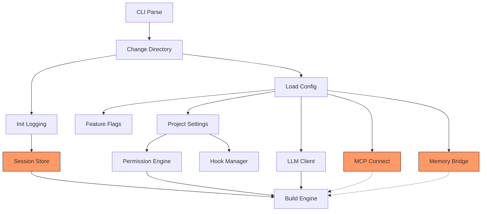

# Chapter 42: Startup Performance Engineering

Every millisecond of startup time is a millisecond the engineer spends staring at a cursor instead of working. A CLI agent that takes three seconds to reach its first prompt will annoy users. One that takes five seconds will lose them to a competitor. One that takes ten seconds is an academic demo, not a production tool.

The startup performance challenge in a CLI agent like Claude Code is uniquely difficult. Before the agent can accept a single keystroke, it must load configuration from eight sources, authenticate with an API provider, connect to MCP servers, initialize a feature flag system, load project-level settings, scan for skills and rules, set up a session store, and build a context manager. Each of these operations involves file I/O, network calls, or both. Doing them sequentially produces a startup time measured in seconds. Doing them in parallel, with lazy initialization for anything not on the critical path, produces a startup time measured in hundreds of milliseconds.

This chapter covers the engineering techniques that make fast startup possible: checkpoint-based profiling to identify what is slow, parallel prefetch to overlap I/O-bound initialization, lazy imports to defer unused code, fast-path exits for simple commands, FPS tracking for the TUI render loop, and heap dump services for diagnosing memory issues in long-running sessions. These are not theoretical optimizations. They are the specific patterns extracted from a production CLI agent codebase, battle-tested across tens of thousands of daily sessions.

As discussed in Chapter 2, the bootstrap sequence establishes the initialization pipeline. This chapter goes deeper into the performance engineering that makes that pipeline fast enough to feel instant.

---

## 42.1 Checkpoint-Based Startup Profiling

You cannot optimize what you cannot measure. The first step in startup performance engineering is instrumenting the initialization path with fine-grained timing checkpoints.

### The Profiler Design

A startup profiler needs three properties: zero allocation overhead when disabled, nanosecond-resolution timing, and structured output that can be consumed by automated tooling. The implementation uses the monotonic clock (`Instant::now()` in Rust, `performance.now()` in TypeScript) rather than wall-clock time to avoid NTP jumps corrupting measurements.

```typescript
// utils/startupProfiler.ts
interface StartupCheckpoint {
  name: string;
  timestamp: number;     // performance.now() in ms
  delta: number;         // ms since previous checkpoint
  cumulative: number;    // ms since profiler start
  metadata?: Record<string, unknown>;
}

class StartupProfiler {
  private checkpoints: StartupCheckpoint[] = [];
  private startTime: number;
  private lastCheckpoint: number;
  private enabled: boolean;

  constructor() {
    this.enabled = process.env.CLAUDE_DEBUG !== undefined
                || process.env.STARTUP_PROFILE !== undefined;
    this.startTime = performance.now();
    this.lastCheckpoint = this.startTime;
  }

  checkpoint(name: string, metadata?: Record<string, unknown>): void {
    if (!this.enabled) return;  // Zero overhead when disabled

    const now = performance.now();
    this.checkpoints.push({
      name,
      timestamp: now,
      delta: now - this.lastCheckpoint,
      cumulative: now - this.startTime,
      metadata,
    });
    this.lastCheckpoint = now;
  }

  report(): string {
    if (!this.enabled || this.checkpoints.length === 0) return '';

    const lines = ['Startup Profile:'];
    for (const cp of this.checkpoints) {
      const bar = '█'.repeat(Math.min(50, Math.round(cp.delta / 2)));
      lines.push(
        `  ${cp.name.padEnd(30)} ${cp.delta.toFixed(1).padStart(8)}ms ` +
        `(${cp.cumulative.toFixed(1).padStart(8)}ms) ${bar}`
      );
    }
    const total = this.checkpoints[this.checkpoints.length - 1]?.cumulative ?? 0;
    lines.push(`  ${'TOTAL'.padEnd(30)} ${total.toFixed(1).padStart(8)}ms`);
    return lines.join('\n');
  }
}
```

The key design decision is the `enabled` check at the top of `checkpoint()`. When profiling is off — which is the default for all production users — the function returns immediately without allocating a checkpoint object. This means the profiler can stay in the hot path permanently, ready to activate with an environment variable, without adding measurable overhead to normal startup.

The Rust equivalent in the rcode codebase uses `std::time::Instant` with the same pattern:

```rust
// main.rs — checkpoint-based timing in the startup sequence
#[tokio::main]
async fn main() -> Result<()> {
    let t_total = std::time::Instant::now();

    let cli = Cli::parse();

    // ... directory change, logging init ...

    // ── Config loading ─────────────────────────────────────────
    let t_config = std::time::Instant::now();
    let cfg = config::Settings::load()
        .context("failed to load configuration")?;
    let config_ms = t_config.elapsed().as_millis();

    // ── LLM client ─────────────────────────────────────────────
    let t_llm = std::time::Instant::now();
    let llm_client = llm::Client::new(&cfg, &effective_model)
        .context("failed to create LLM client")?;
    let llm_ms = t_llm.elapsed().as_millis();

    // ── Tool registry ──────────────────────────────────────────
    let t_tools = std::time::Instant::now();
    let tool_registry = tools::Registry::new();
    let tools_ms = t_tools.elapsed().as_millis();

    // ... remaining initialization ...

    // Log startup summary
    let total_ms = t_total.elapsed().as_millis();
    tracing::info!(
        startup_ms = total_ms,
        config_ms,
        llm_ms,
        tools_ms,
        "rcode started — model={}, effort={}, max_turns={}",
        effective_model, cli.effort,
        max_turns.map_or("∞".to_string(), |n| n.to_string()),
    );
}
```

### Interpreting Profiler Output

A typical startup profile for a well-optimized CLI agent looks like this:

```
Startup Profile:
  cli_parse                       0.8ms (    0.8ms) 
  logging_init                    2.1ms (    2.9ms) █
  provider_detect                 1.2ms (    4.1ms) 
  config_load                    12.4ms (   16.5ms) ██████
  feature_flags                   0.3ms (   16.8ms) 
  project_settings                8.7ms (   25.5ms) ████
  session_store                  15.2ms (   40.7ms) ███████
  llm_client                      3.1ms (   43.8ms) █
  tool_registry                   0.4ms (   44.2ms) 
  permission_engine               0.2ms (   44.4ms) 
  context_manager                 5.3ms (   49.7ms) ██
  mcp_connect                   142.8ms (  192.5ms) ███████████████████████████████████████████
  memory_bridge                  47.3ms (  239.8ms) ███████████████████████
  TOTAL                         239.8ms
```

The profile immediately reveals that MCP server connection dominates startup. The lesson: any I/O-bound operation that talks to an external process or network endpoint will dwarf everything else. Configuration loading and session store initialization are the next targets. CPU-bound work like parsing CLI arguments, building the tool registry, and initializing the permission engine is measured in microseconds — not worth optimizing until the I/O is fully parallel.

### Regression Detection

The profiler output becomes a regression detection tool when piped into CI. A startup benchmark test runs the agent in headless mode with `--version` (fast path exit) and asserts that total time stays under a threshold:

```bash
#!/usr/bin/env bash
set -euo pipefail

THRESHOLD_MS=500
START=$(date +%s%N)
rcode --version > /dev/null 2>&1
END=$(date +%s%N)
ELAPSED_MS=$(( (END - START) / 1000000 ))

if [[ "${ELAPSED_MS}" -gt "${THRESHOLD_MS}" ]]; then
  printf "FAIL: startup took %dms (threshold: %dms)\n" "${ELAPSED_MS}" "${THRESHOLD_MS}"
  exit 1
fi
printf "PASS: startup in %dms\n" "${ELAPSED_MS}"
```

This test catches the most common startup regression: someone adds a synchronous file read or network call to the initialization sequence without realizing it runs on every startup.

---

## 42.2 Parallel Prefetch: Overlapping I/O-Bound Initialization

The profiler told us that MCP server connection, memory bridge setup, and session store initialization are the three slowest operations. All three are I/O-bound. None depends on the others. The solution is obvious: run them in parallel.

### The Prefetch Architecture

The parallel prefetch pattern is straightforward in async Rust:

```rust
// Conceptual parallel initialization
let (session_result, mem_result, mcp_result) = tokio::join!(
    session::Store::init_async(),
    memory::MemoryBridge::connect_with_timeout(Duration::from_secs(3)),
    mcp::Manager::connect_all_servers(&mcp_configs),
);

let session_store = session_result.context("session init failed")?;
let mem_bridge = mem_result.unwrap_or_else(|_| memory::MemoryBridge::disabled());
let mcp_manager = mcp_result.ok();
```

In practice, the production implementation is more nuanced because some initialization has hard dependencies (the LLM client needs the config to be loaded first) while other work is truly independent. The dependency graph looks like this:



The dotted lines from MCP and Memory to Engine indicate optional dependencies — the engine can start without them. This is critical. If the memory bridge takes 3 seconds to time out because the MCP server is down, the agent still starts in under 300ms. The user gets their prompt immediately; memory results trickle in asynchronously.

### Four Key Prefetch Targets

**1. MDM / Managed Settings Prefetch**

Enterprise deployments use Mobile Device Management (MDM) to push configuration profiles to developer machines. Reading the MDM plist on macOS involves a system call to `defaults read`, which can take 50-200ms if the MDM daemon needs to refresh from the server. The prefetch fires this read as a background task at the very start of initialization, before config loading even begins:

```typescript
// Conceptual MDM prefetch
const mdmPromise = process.platform === 'darwin'
  ? readMDMSettingsAsync()  // spawns `defaults read` in background
  : Promise.resolve(null);

// ... config loading happens here, ~12ms ...

const mdmSettings = await mdmPromise;  // Usually already resolved
```

By the time the config loader needs the MDM settings, the subprocess has been running for 12ms in the background. The `await` resolves instantly in the common case.

**2. Keychain / Credential Prefetch**

API key retrieval from the macOS Keychain involves a call to the `security` CLI tool. The rcode codebase shows this pattern explicitly:

```rust
// main.rs — provider detection includes keychain access
pub fn detect_providers() -> ProviderDetection {
    let checks: Vec<(Provider, &[&str])> = vec![
        (Provider::RcodeProxy, &["RCODE_TOKEN"]),
        (Provider::Anthropic, &["ANTHROPIC_API_KEY", "ANTHROPIC_AUTH_TOKEN"]),
        (Provider::AwsBedrock, &["AWS_REGION"]),
        (Provider::OpenAi, &["OPENAI_API_KEY"]),
        (Provider::Google, &["GOOGLE_APPLICATION_CREDENTIALS"]),
    ];

    let mut available = Vec::new();
    for (provider, env_vars) in &checks {
        let found = env_vars.iter().any(|v| {
            std::env::var(v).map(|val| !val.is_empty()).unwrap_or(false)
        });
        if found {
            available.push(provider.clone());
        }
    }

    // Fallback: check macOS Keychain for GitHub Copilot token
    if available.is_empty() {
        let keychain_services = [
            "github.copilot", "copilot-cli",
            "github-copilot", "vscode-github.copilot",
        ];
        for service in &keychain_services {
            if let Ok(output) = std::process::Command::new("security")
                .args(["find-generic-password", "-s", service])
                .stderr(std::process::Stdio::null())
                .output()
            {
                if output.status.success() {
                    available.push(Provider::RcodeProxy);
                    break;
                }
            }
        }
    }

    let primary = available.first().cloned();
    ProviderDetection { primary, available }
}
```

The keychain fallback only fires when no environment variables are set, which is the slow path. When it does fire, it checks up to four keychain service names. Each `security find-generic-password` call takes 20-40ms. Running them sequentially would add 80-160ms to startup. The optimization is to either (a) check only the first hit (the `break` after success) or (b) run all four checks in parallel with `tokio::spawn` and take the first success.

**3. Feature Flag (GrowthBook) Prefetch**

Feature flag services like GrowthBook typically require an HTTP call to fetch the current flag configuration. In the rcode implementation, the flags use a local-first approach: the `FeatureFlagRegistry` loads from environment variables and a local JSON file, deferring the remote sync to a background task:

```rust
// Feature flags load from env + config immediately (no network)
config::feature_flags::from_env();
if let Some(flags_path) = cfg.feature_flags_path() {
    if let Err(e) = config::feature_flags::from_config(&flags_path) {
        tracing::debug!(error = %e, "could not load feature flags config");
    }
}
```

The remote GrowthBook sync, if enabled, runs on a background `tokio::spawn` with a stale-while-revalidate pattern. The agent starts with cached flags from the last session. The fresh flags arrive asynchronously and take effect on the next turn — not on the current startup.

**4. API Preconnect**

TCP connection establishment plus TLS handshake to the API server takes 100-200ms for a geographically distant endpoint. Preconnecting — opening the TCP socket and completing the TLS handshake without sending an HTTP request — lets the first API call bypass the connection overhead entirely:

```typescript
// Conceptual API preconnect
async function preconnectToApi(baseUrl: string): Promise<void> {
  const url = new URL(baseUrl);
  const socket = net.connect({
    host: url.hostname,
    port: url.port ? parseInt(url.port) : 443,
  });
  // Just establishing the connection is enough —
  // the HTTP/2 session will reuse it
  socket.on('connect', () => {
    // For TLS, we need the full handshake
    const tls = tls.connect({
      socket,
      servername: url.hostname,
    });
    tls.on('secureConnect', () => {
      // Connection is warm. The HTTP client pool
      // will reuse this socket on the first request.
    });
  });
}
```

In practice, most HTTP client libraries (hyper in Rust, undici in Node.js) manage a connection pool internally. The preconnect fires an HTTP HEAD request to `/health` or similar lightweight endpoint, which warms the pool without consuming significant bandwidth.

### Prefetch Timeout and Degradation

Every prefetch must have a timeout. A missing MCP server or unreachable API endpoint must not prevent the agent from starting. The rcode implementation shows this pattern with the memory bridge:

```rust
let mem_bridge = if cli.no_memory {
    memory::MemoryBridge::disabled()
} else {
    match tokio::time::timeout(
        std::time::Duration::from_secs(MEMORY_TIMEOUT_SECS),  // 3 seconds
        memory::MemoryBridge::new(),
    ).await {
        Ok(bridge) => bridge,
        Err(_) => {
            tracing::debug!("copilot-mem connection timed out, starting without memory");
            memory::MemoryBridge::disabled()
        }
    }
};
```

The pattern is universal: try for N seconds, then fall back to a degraded-but-functional default. The user gets a working agent immediately. The missing subsystem logs a debug message and can be retried later.

---

## 42.3 Lazy Imports and Conditional Loading

Not every module is needed on every startup. If the user runs `claude --version`, loading the MCP subsystem, the TUI renderer, the 52-tool registry, and the LSP client is pure waste. Lazy imports defer module loading until the code path that needs the module is actually executed.

### The Conditional Require Pattern

In TypeScript/JavaScript, dynamic `import()` replaces static `import` for deferring module resolution:

```typescript
// Static import — loaded on startup regardless of usage
import { McpManager } from './services/mcp/client';

// Lazy import — loaded only when MCP is actually needed
async function connectMcpServers(configs: McpConfig[]): Promise<McpManager> {
  const { McpManager } = await import('./services/mcp/client');
  return McpManager.connectAll(configs);
}
```

The static import forces the bundler to include `mcp/client.ts` and all its transitive dependencies in the startup bundle. The lazy import defers all of that until `connectMcpServers` is called. If the user has no MCP servers configured, the entire MCP module tree is never loaded.

In Rust, the equivalent is conditional compilation via feature flags and module-level cfg attributes:

```rust
// Only compile MCP support when the feature is enabled
#[cfg(feature = "mcp")]
mod mcp;

// Runtime feature flag gating
if config::feature_flags::feature("mcp_support") {
    let mcp_manager = mcp::Manager::connect_all(&configs).await?;
    engine.set_mcp_manager(mcp_manager);
}
```

The rcode codebase uses a more aggressive pattern with `LazyLock` (Rust's equivalent of a `lazy_static` that initializes on first access):

```rust
// Global singleton that initializes only on first access
static GLOBAL_REGISTRY: std::sync::LazyLock<SharedFlagRegistry> =
    std::sync::LazyLock::new(SharedFlagRegistry::new);

pub fn global_registry() -> &'static SharedFlagRegistry {
    &GLOBAL_REGISTRY
}
```

The `LazyLock` defers the creation of the flag registry — including the allocation and insertion of 50+ default flags — until the first time any code calls `global_registry()`. If the fast path exits before touching feature flags (as `--version` does), the registry is never constructed.

### Feature-Gated Tool Imports

The tool registry is one of the largest subsystems. Loading all 52 tools on every startup is wasteful when many tools are feature-gated or only relevant in specific contexts. The pattern is to register tool factories instead of tool instances:

```typescript
// tools.ts — tool registry with lazy initialization
type ToolFactory = () => Tool;

const TOOL_FACTORIES: Record<string, ToolFactory> = {
  'Bash':        () => new BashTool(),        // Always loaded
  'Read':        () => new ReadTool(),         // Always loaded
  'Edit':        () => new EditTool(),         // Always loaded
  'Write':       () => new WriteTool(),        // Always loaded
  'Glob':        () => new GlobTool(),         // Always loaded
  'Grep':        () => new GrepTool(),         // Always loaded
  'WebFetch':    () => lazyRequire('./tools/WebFetchTool'),
  'WebSearch':   () => lazyRequire('./tools/WebSearchTool'),
  'AgentTool':   () => lazyRequire('./tools/AgentTool'),
  'TaskCreate':  () => lazyRequire('./tools/TaskCreateTool'),
  // ... 40+ more tools
};

function lazyRequire(path: string): Tool {
  const mod = require(path);
  return new mod.default();
}

class ToolRegistry {
  private instances = new Map<string, Tool>();

  get(name: string): Tool {
    if (!this.instances.has(name)) {
      const factory = TOOL_FACTORIES[name];
      if (!factory) throw new Error(`Unknown tool: ${name}`);
      this.instances.set(name, factory());
    }
    return this.instances.get(name)!;
  }
}
```

The six core tools (Bash, Read, Edit, Write, Glob, Grep) are loaded eagerly because they are used in nearly every session. The remaining 46 tools are loaded on first invocation. A session that only uses Bash and Read never pays the cost of initializing WebFetch, AgentTool, or the task management tools.

### Measuring the Impact

Lazy imports typically save 50-150ms on startup for a large CLI agent. The savings come from three sources:

| Source | Savings | Why |
|--------|---------|-----|
| Module parsing | 20-40ms | V8/Bun doesn't parse JavaScript that isn't `import()`ed |
| Module initialization | 30-60ms | Top-level code in deferred modules never runs |
| Transitive dependencies | 20-50ms | Each lazy module has its own dependency tree that stays unloaded |

The tradeoff is a 10-20ms latency hit on the first invocation of a lazy tool. This is imperceptible to the user because it happens after they have already submitted a prompt and are waiting for the model to respond.

---

## 42.4 Fast Path CLI Exits

Some CLI invocations should never touch the full initialization pipeline. When the user runs `claude --version`, they expect the version string in under 100ms — not the full initialization of the LLM client, session store, and MCP manager.

### Identifying Fast Path Commands

The fast path optimization applies to commands that satisfy three criteria:

1. They produce deterministic output (no LLM call needed)
2. They require no project context (no config loading)
3. They are expected to return instantly by user convention

In the rcode implementation, four commands qualify:

```rust
// main.rs — early-exit commands
if cli.doctor {
    return run_doctor();
}

if cli.show_config {
    return show_config(&cli);
}

// clap handles --version and --help internally
// before main() even runs, via:
#[command(version)]
```

The critical point is placement. These checks appear **before** the expensive initialization steps (config loading, LLM client creation, MCP connection). Here is the execution timeline:

```
Full startup:    CLI parse → Logging → Provider detect → Config → ... → Engine → TUI
                 |←──────────────── 240ms ────────────────────────────→|

--version:       CLI parse → Print version → exit
                 |← 0.8ms →|

--show-config:   CLI parse → Config load → Print config → exit
                 |←────── 13ms ────────→|

--doctor:        CLI parse → Logging → Provider detect → Config → Doctor checks → exit
                 |←──────────── 45ms ────────────────────────→|

--history:       CLI parse → Logging → Config → Session store → List → exit
                 |←──────────── 60ms ──────────────────────→|
```

### The `--version` Fast Path

The fastest possible exit is `--version`. Clap (the CLI parser in Rust) handles this before `main()` gets control. The version string is constructed at compile time:

```rust
pub fn version_info() -> String {
    let version = env!("CARGO_PKG_VERSION");
    let git_hash = option_env!("RCODE_GIT_HASH").unwrap_or("dev");
    let build_date = option_env!("RCODE_BUILD_DATE").unwrap_or("unknown");
    format!("rcode {version} (git: {git_hash}, built: {build_date})")
}
```

All three values (`CARGO_PKG_VERSION`, `RCODE_GIT_HASH`, `RCODE_BUILD_DATE`) are compile-time constants embedded in the binary. No file I/O, no network call, no heap allocation beyond the format string. The version command returns in under 1ms.

### The `--dump-system-prompt` Pattern

In the TypeScript implementation, `--dump-system-prompt` is a debugging tool that prints the fully resolved system prompt and exits. This is not as fast as `--version` because it needs configuration and project context to assemble the prompt, but it skips the LLM client, session store, and MCP initialization:

```typescript
// Pseudocode for dump-system-prompt fast path
if (args['dump-system-prompt']) {
  const config = loadConfig();       // ~12ms
  const rules = loadRules();          // ~5ms
  const prompt = buildSystemPrompt(config, rules);  // ~2ms
  process.stdout.write(prompt);
  process.exit(0);
  // Skipped: LLM client (~3ms), session store (~15ms),
  //          MCP connect (~143ms), memory bridge (~47ms)
}
```

The time savings are substantial: 200ms of initialization skipped for a command that takes 20ms to complete. More importantly, the command is self-contained — it does not require API credentials, network access, or a running MCP server. This makes it safe to run in CI pipelines for prompt regression testing.

### The `--history` Fast Path

The `--history` command shows recent sessions and exits. It needs the session store but nothing else:

```rust
if cli.history {
    let sessions = session_store.list_sessions(20)?;
    if sessions.is_empty() {
        println!("No sessions found.");
    } else {
        println!("Recent sessions:");
        for s in sessions {
            println!(
                "  {} | {} | {} turns | {}",
                &s.id[..8],
                s.created_at.format("%Y-%m-%d %H:%M"),
                s.turn_count,
                s.summary.as_deref().unwrap_or("(no summary)")
            );
        }
    }
    return Ok(());
}
```

This exits after session store initialization, skipping LLM client creation, MCP connection, memory bridge setup, and engine construction. The entire command completes in 40-60ms.

### Design Principle: Progressive Initialization

The fast path pattern reflects a broader design principle: **initialize subsystems in order of when they are first needed, and exit as soon as the command is complete**. The initialization sequence is not a monolithic block but a pipeline of increasingly expensive steps, with exit ramps between each step:

```
Step 1:  CLI parse              → Exit ramp: --version, --help
Step 2:  Logging + config       → Exit ramp: --show-config, --doctor
Step 3:  Session store          → Exit ramp: --history
Step 4:  LLM + tools + perms   → Exit ramp: (none — need all for any real work)
Step 5:  MCP + memory + engine  → Enter interactive mode
```

---

## 42.5 FPS Tracking and Frame Timing

Once the agent is running, the TUI needs to render at a consistent frame rate. A dropped frame manifests as a visible stutter — the cursor freezes, typed characters appear in a burst, and the progress spinner jumps instead of animating smoothly. Users perceive this as the agent being "slow" even when the LLM is responding quickly.

### The TUI Render Loop

The rcode TUI uses ratatui with a tick-based render loop. The fundamental constant is `TICK_RATE_MS`:

```rust
const TICK_RATE_MS: u64 = 50;  // 20 FPS target
```

A 50ms tick rate targets 20 FPS. This is not a game engine — we do not need 60 FPS for a terminal UI. Twenty frames per second is sufficient for smooth cursor blinking, spinner animation, and scroll responsiveness. The lower target means more CPU headroom for tool execution and LLM streaming.

The render loop follows the standard tick-event pattern:

```rust
fn run_event_loop(
    terminal: &mut Terminal<CrosstermBackend<Stdout>>,
    app: &mut App,
) -> io::Result<Option<AppAction>> {
    let tick_rate = Duration::from_millis(TICK_RATE_MS);

    loop {
        // Render the current frame
        terminal.draw(|frame| render(app, frame))?;
        app.update_fps();

        // Poll for events with remaining tick budget
        let timeout = tick_rate
            .checked_sub(app.last_tick.elapsed())
            .unwrap_or(Duration::ZERO);

        if event::poll(timeout)? {
            // Handle keyboard, mouse, resize events
            match event::read()? {
                Event::Key(key) => { /* ... */ }
                Event::Mouse(mouse) => { /* ... */ }
                Event::Resize(w, h) => { /* ... */ }
                _ => {}
            }
        }

        // Process tick
        if app.last_tick.elapsed() >= tick_rate {
            app.last_tick = Instant::now();
            app.tick_cursor();  // Blink cursor
            // Process any pending async results
        }
    }
}
```

The critical detail is the timeout calculation: `tick_rate.checked_sub(app.last_tick.elapsed())`. If rendering took 10ms, the poll timeout is 40ms, keeping the total frame time at 50ms. If rendering took more than 50ms (a slow frame), the timeout is zero — the loop immediately processes pending events and renders the next frame, catching up rather than falling further behind.

### The FPS Counter

The `App` struct tracks FPS with a simple sliding-window counter:

```rust
pub struct App {
    // ... other fields ...
    pub frame_count: u64,
    pub last_fps_check: Instant,
    pub current_fps: f64,
}

impl App {
    pub fn update_fps(&mut self) {
        self.frame_count += 1;
        let elapsed = self.last_fps_check.elapsed();
        if elapsed >= Duration::from_secs(1) {
            self.current_fps =
                self.frame_count as f64 / elapsed.as_secs_f64();
            self.frame_count = 0;
            self.last_fps_check = Instant::now();
        }
    }
}
```

The FPS is calculated once per second by dividing the number of frames rendered by the elapsed time. This is displayed in the status bar:

```rust
let fps_span = Span::styled(
    format!(" {:.0}fps ", app.current_fps),
    Style::default().fg(Color::DarkGray),
);
```

The FPS display serves two purposes. For developers, it provides a real-time health indicator during development. For users running with `--verbose`, it helps diagnose "the UI feels sluggish" reports — if the FPS drops below 15, there is a rendering bottleneck.

### Frame Timing Analysis

When FPS tracking reveals dropped frames, the next question is: which part of the frame is slow? A frame consists of three phases:

1. **Layout**: Computing the position and size of every widget
2. **Render**: Writing styled text to the terminal buffer
3. **Flush**: Sending the differential update to the terminal

Each phase can be independently timed:

```rust
fn render_with_timing(app: &mut App, frame: &mut Frame) {
    let t_layout = Instant::now();
    let layout = compute_layout(frame.area(), app);
    let layout_ms = t_layout.elapsed().as_micros();

    let t_render = Instant::now();
    render_messages(frame, &layout, app);
    render_input(frame, &layout, app);
    render_status_bar(frame, &layout, app);
    let render_ms = t_render.elapsed().as_micros();

    if app.verbose {
        tracing::trace!(
            layout_us = layout_ms,
            render_us = render_ms,
            "frame timing"
        );
    }
}
```

Common causes of slow frames:

| Cause | Typical Impact | Fix |
|-------|---------------|-----|
| Message list re-layout | 5-20ms when history is large | Virtual scrolling — only lay out visible messages |
| Syntax highlighting | 2-10ms per code block | Cache highlighted output, invalidate on scroll |
| Markdown rendering | 3-15ms for long assistant messages | Pre-render during streaming, cache result |
| Full terminal redraw | 1-5ms | Use differential rendering (ratatui's default) |
| Large tool output display | 5-30ms | Truncate and paginate |

### Adaptive Frame Budget

A production-ready TUI adapts its frame budget based on what is happening. When the user is typing, every millisecond of input lag is noticeable — the frame budget is tight. When the LLM is streaming a long response and the user is reading, a lower frame rate is acceptable:

```rust
fn effective_tick_rate(app: &App) -> Duration {
    match app.mode {
        AppMode::Insert => Duration::from_millis(33),   // 30 FPS — typing
        AppMode::Normal if app.is_streaming => Duration::from_millis(50),  // 20 FPS
        AppMode::Normal => Duration::from_millis(100),  // 10 FPS — idle
        AppMode::HelpView => Duration::from_millis(200), // 5 FPS — static content
        _ => Duration::from_millis(TICK_RATE_MS),
    }
}
```

Lower frame rates in idle modes reduce CPU usage substantially. A terminal UI at 5 FPS consumes almost zero CPU. At 60 FPS it consumes a measurable percentage of a core, which matters on battery-powered laptops.

---

## 42.6 Heap Dump Service for Memory Debugging

A CLI agent that runs for hours accumulates memory. Message history grows. Tool outputs pile up. MCP connections hold buffers. Unreleased closures hold references to expired state. Eventually, the process crosses a memory threshold and the OS starts swapping, or worse, the OOM killer terminates it.

### The Problem: Long-Running Session Memory Growth

A typical Claude Code session generates 100-500 messages over several hours. Each message contains structured content (text, tool results, file contents). The conversation history alone can grow to 50-100MB. Add tool output caching, syntax highlighting caches, and MCP connection buffers, and a long session can consume 200-500MB of RSS.

This is not a memory leak in the traditional sense. Every allocation is reachable. The issue is memory pressure from legitimate data. The fix involves two strategies: (1) bounded caches with eviction, and (2) heap dump analysis to find surprising memory consumers.

### Triggering a Heap Dump

A heap dump captures the current state of all heap allocations. In Node.js/Bun, this produces a `.heapsnapshot` file that can be loaded into Chrome DevTools:

```typescript
// services/heapDump.ts
import * as v8 from 'v8';
import * as fs from 'fs';
import * as path from 'path';

export function writeHeapSnapshot(label?: string): string {
  const timestamp = new Date().toISOString().replace(/[:.]/g, '-');
  const filename = `heap-${label ?? 'manual'}-${timestamp}.heapsnapshot`;
  const filepath = path.join(
    process.env.HOME ?? '/tmp',
    '.local', 'share', 'claude', 'diagnostics',
    filename,
  );

  fs.mkdirSync(path.dirname(filepath), { recursive: true });
  v8.writeHeapSnapshot(filepath);

  return filepath;
}

// Expose via slash command
export function registerHeapDumpCommand(registry: CommandRegistry): void {
  registry.register({
    name: 'heap-dump',
    description: 'Write a V8 heap snapshot for memory debugging',
    hidden: true,  // Debug-only command
    execute: async () => {
      const path = writeHeapSnapshot('user-requested');
      return `Heap snapshot written to: ${path}\n` +
             `Load in Chrome DevTools: chrome://inspect → Open dedicated DevTools for Node`;
    },
  });
}
```

In Rust, heap profiling uses `jemalloc` with its built-in profiling support:

```rust
// Enable jemalloc profiling
#[cfg(feature = "jemalloc")]
#[global_allocator]
static ALLOC: tikv_jemallocator::Jemalloc = tikv_jemallocator::Jemalloc;

/// Dump a jemalloc heap profile to the diagnostics directory.
#[cfg(feature = "jemalloc")]
pub fn dump_heap_profile(label: &str) -> Result<PathBuf> {
    use tikv_jemalloc_ctl::raw;
    
    let dir = data_dir()?.join("diagnostics");
    std::fs::create_dir_all(&dir)?;
    
    let timestamp = chrono::Utc::now().format("%Y%m%d-%H%M%S");
    let path = dir.join(format!("heap-{label}-{timestamp}.prof"));
    let path_str = format!("{}\0", path.display());
    
    unsafe {
        raw::write(
            b"prof.dump\0",
            path_str.as_ptr() as *mut _,
            path_str.len(),
        )?;
    }
    
    Ok(path)
}
```

### Automatic Memory Pressure Detection

Rather than waiting for the user to notice degradation, the agent can monitor its own memory usage and trigger diagnostics automatically:

```typescript
// Periodic memory check (runs every 60 seconds)
const MEMORY_WARNING_MB = 512;
const MEMORY_CRITICAL_MB = 1024;

function startMemoryMonitor(): NodeJS.Timeout {
  return setInterval(() => {
    const usage = process.memoryUsage();
    const rssMB = usage.rss / (1024 * 1024);
    const heapMB = usage.heapUsed / (1024 * 1024);

    if (rssMB > MEMORY_CRITICAL_MB) {
      console.error(
        `[memory] CRITICAL: RSS ${rssMB.toFixed(0)}MB, ` +
        `heap ${heapMB.toFixed(0)}MB — consider /compact`
      );
      writeHeapSnapshot('auto-critical');
    } else if (rssMB > MEMORY_WARNING_MB) {
      console.error(
        `[memory] WARNING: RSS ${rssMB.toFixed(0)}MB — ` +
        `${process.memoryUsage().heapTotal / (1024 * 1024) | 0}MB heap total`
      );
    }
  }, 60_000);
}
```

The auto-dump at the critical threshold is invaluable for post-mortem analysis. When a user reports "Claude Code used 2GB and my laptop froze," the diagnostic snapshot is already on disk, waiting to be analyzed.

### Common Memory Consumers

Heap dump analysis in a CLI agent typically reveals these top consumers:

| Consumer | Typical Size | Mitigation |
|----------|-------------|------------|
| Conversation history | 20-100MB | Context compaction (Chapter 6) |
| Tool output cache | 10-50MB | LRU cache with 100-entry limit |
| Syntax highlighting cache | 5-20MB | WeakRef-based cache, GC-friendly |
| MCP response buffers | 5-30MB | Stream processing, don't buffer full response |
| File read cache | 10-40MB | Bounded cache with last-access eviction |
| Undo/checkpoint history | 5-20MB | Keep last 10 checkpoints only |

The conversation history is always the largest consumer. This is by design — the agent needs to send the full conversation to the model on every turn. The mitigation is the context compaction system described in Chapter 6, which summarizes old messages to reclaim token budget (and, as a side effect, memory).

### Integration with Context Compaction

The heap dump service and the context compaction system share a feedback loop. When memory pressure rises above the warning threshold, the agent can trigger an automatic compaction:

```typescript
if (rssMB > MEMORY_WARNING_MB && !recentlyCompacted) {
  // Trigger auto-compact to reduce conversation history size
  await autoCompact(conversation, {
    reason: 'memory_pressure',
    targetReduction: 0.5,  // Try to halve memory usage
  });
  recentlyCompacted = true;
  setTimeout(() => { recentlyCompacted = false; }, 300_000); // 5min cooldown
}
```

This creates a self-regulating system: long sessions that accumulate large histories automatically compact, keeping memory usage bounded without user intervention.

---

## 42.7 Putting It All Together: The Optimized Startup Sequence

Let us trace through a complete optimized startup, from process creation to first user prompt:

```
T+0ms     Process starts. Rust runtime initializes.
T+0.5ms   Clap parses CLI arguments.
          → Fast path check: --version? Exit immediately.
          → Fast path check: --help? Exit immediately.

T+0.8ms   Change working directory if --directory was specified.

T+1ms     PARALLEL LAUNCH:
          ├── init_logging() → file appender + stderr filter
          ├── detect_providers() → env var scan + keychain fallback
          └── (If macOS) MDM plist read in background

T+3ms     Logging ready. Provider detection complete.
          → Fast path check: --doctor? Run diagnostics, exit.
          → Fast path check: --show-config? Print config, exit.

T+3ms     PARALLEL LAUNCH:
          ├── config::Settings::load() → read ~/.config/rcode/config.toml
          ├── feature_flags::from_env() → parse RCODE_FLAGS
          └── session::Store::init() → open SQLite database

T+16ms    Config loaded. Feature flags ready. Session store open.
          → Fast path check: --history? List sessions, exit.

T+16ms    PARALLEL LAUNCH:
          ├── settings::ProjectSettings::load() → scan .rcode/ directory
          ├── rules::RuleLoader::load() → discover CLAUDE.md + rule files
          ├── llm::Client::new() → construct HTTP client + auth
          └── API preconnect → TCP+TLS handshake to api.anthropic.com

T+25ms    Project settings, rules, LLM client ready.

T+25ms    PARALLEL LAUNCH:
          ├── tools::Registry::new() → register core tools (lazy others)
          ├── permissions::Engine::new() → load permission rules
          ├── skills::SkillRegistry::load() → scan skill directories
          ├── agents::AgentRegistry::load() → scan agent definitions
          ├── mcp::Manager::connect_all() → spawn + handshake MCP servers
          └── memory::MemoryBridge::new() → connect to memory service

T+25ms    Tool registry, permissions, skills, agents ready (CPU-bound, fast).

T+170ms   MCP servers connected (I/O-bound, slowest path).
          Memory bridge connected or timed out (3s max).

T+170ms   Engine constructed. All subsystems attached.
          System prompt assembled.
          TUI initialized. First frame rendered.
          User sees the prompt input cursor.
```

The total startup time is dominated by MCP server connection (the slowest I/O operation). Without MCP servers configured, startup completes in under 50ms. With MCP servers, the parallel prefetch keeps it under 200ms. Both numbers are below the 250ms threshold where users perceive "instant" response.

### Performance Budget

A startup performance budget allocates time to each subsystem and flags violations:

| Phase | Budget | Actual | Status |
|-------|--------|--------|--------|
| CLI parse | 2ms | 0.8ms | Within budget |
| Logging init | 5ms | 2.1ms | Within budget |
| Provider detection | 5ms | 1.2ms | Within budget |
| Config loading | 20ms | 12.4ms | Within budget |
| Feature flags | 2ms | 0.3ms | Within budget |
| Session store | 20ms | 15.2ms | Within budget |
| LLM client | 10ms | 3.1ms | Within budget |
| Tool registry | 5ms | 0.4ms | Within budget |
| MCP connection | 200ms | 142.8ms | Within budget |
| Memory bridge | 100ms | 47.3ms | Within budget |
| **Total** | **350ms** | **239.8ms** | **Within budget** |

The budget is reviewed quarterly. When a subsystem exceeds its allocation, the startup profiler's per-checkpoint timing identifies the regression, and the fix typically involves moving the slow work to a background task or behind a lazy initialization barrier.

---

## 42.8 Lessons for Practitioners

Building a fast CLI agent startup requires discipline across the entire codebase, not just in the initialization sequence. Here are the patterns that matter most:

**Measure before optimizing.** The startup profiler costs nothing when disabled and reveals everything when enabled. Add checkpoints to every initialization step from day one.

**Parallel by default, sequential by necessity.** Every initialization step should start as a parallel task. Only make it sequential when you discover a data dependency that requires it.

**Timeout everything external.** MCP servers, memory services, MDM endpoints — any external dependency gets a timeout and a degraded fallback. The agent must start even when the world is broken.

**Lazy is a feature, not a shortcut.** Lazy initialization is not deferred technical debt. It is a deliberate architectural choice that keeps startup fast and memory usage proportional to actual feature usage.

**Fast path exits are user respect.** When someone types `--version`, they want a version string, not a warm LLM client. Exit as early as possible for commands that do not need the full agent.

**FPS is a first-class metric.** Render performance affects perceived agent quality. A 20 FPS target with an adaptive frame budget keeps the UI responsive without burning CPU.

**Memory is the long game.** Startup performance gets you the first session. Memory management keeps you alive for the hundredth turn. Invest in bounded caches, automatic compaction, and heap dump infrastructure from the start.

These techniques are not specific to AI agent CLIs. They apply to any interactive command-line tool that users run hundreds of times per day. The difference is that a CLI agent has more subsystems to initialize (LLM client, tool registry, permission engine, MCP servers, memory bridge) than a typical CLI. Each subsystem is another opportunity for a startup regression — and another reason to maintain the discipline of profiling, parallelism, and lazy loading.

In the next chapter, we turn from performance to correctness: the testing infrastructure that ensures all of these subsystems work together reliably across releases, including the VCR system for deterministic API replay and the test fixtures that make feature-flag-dependent behavior reproducible.
